# 传染病建模:使你的模型适合冠状病毒数据

> 原文：<https://towardsdatascience.com/infectious-disease-modelling-fit-your-model-to-coronavirus-data-2568e672dbc7?source=collection_archive---------4----------------------->

[在本文](/infectious-disease-modelling-part-i-understanding-sir-28d60e29fdfc)中，我解释了一些背景，并介绍了传染病建模和 SIR 模型的主题。[我的上一篇文章](/infectious-disease-modelling-beyond-the-basic-sir-model-216369c584c4)对此进行了阐述，并扩展了基本的 SIR 模型。那里导出和实现的模型为这里使用的模型*奠定了基础*，所以你可能想先读两篇文章(或者如果你已经很好地理解了基本的 SIR 模型，就读最后一篇)。

这篇文章的重点是将一个扩展的 SIR 模型与真实的冠状病毒数据拟合，该模型具有依赖于时间的 R₀-values 和依赖于资源的死亡率，以便尽可能接近真实的数字，并对未来可能的发展做出明智的预测。但是在我们开始将数据拟合到我们的模型之前，让我们做一些经常被忽略的事情——让我们简单看看我们的模型*不能*做什么。

[**你可以在这里找到整篇文章的 python 笔记本。**](https://github.com/henrifroese/infectious_disease_modelling/blob/master/part_three.ipynb)

# 警告、陷阱、限制

> “从本质上讲，所有的模型都是错误的，但有些是有用的”——乔治·博克斯，英国数学家

模型总是现实世界的简化。如果你想看一个与真实世界完全相似的模型，去外面吧！然而，这并不意味着它们不有趣，不能产生深刻的见解。记住以下几点很重要:

*   我们的微分方程系统对初始参数极其敏感；微小的变化会导致完全不同的结果。
*   我们正在根据不完整的初步数据进行推断。一些国家可能只统计直接由冠状病毒导致的死亡，其他国家可能统计个人被感染的所有死亡。有些人可能(有意或无意)报告不准确或不可靠的数据等。
*   我们假设所有人都是同质的，也就是说，我们没有考虑到一些地方是最初的热点地区，而另一些地方实施限制的时间更早、力度更大(我们需要更多的努力(从计算和数学上)来考虑这些事情)。

此外，针对我们的模型，我们做了以下假设(这些只是一些显而易见的假设，当然还有更多隐藏在等式中的假设):

*   死亡不会在有意义的程度上改变人口结构(我们先验地计算死亡率*(使用爆发前的人口结构)并假设死亡不会高到显著改变人口结构(我认为这是一个相当弱的合理假设))。*
*   *只有危重病例才能填满医院，并且由于缺乏可用的护理，会导致更高的死亡率。*
*   *所有没有得到治疗的*危重*患者都会死亡。*
*   *个体在康复后是免疫的(目前这似乎是可能的，至少对绝大多数患者是如此。然而，[一些报道](https://www.nytimes.com/reuters/2020/04/10/world/asia/10reuters-health-coronavirus-southkorea.html)可能会指出这是假的)。*
*   *R₀只减少或保持不变。它不会增加。(因此，这个模型不允许我们对再次放松的措施建模；为此，我们需要一个不同的 R₀函数)*

*现在记住这一点，让我们开始建模:我们将首先非常快速地进行曲线拟合，然后推导出我们使用的模型，最后将我们的模型拟合到冠状病毒数据。*

# *(非常简短的介绍)曲线拟合*

*稍后，我们将获得一些数据点(每天的累计死亡人数)和一个函数(我们的模型)，该函数根据一些参数(死亡率、ICU 床位等)给出我们预测的每天的累计死亡人数。然后，我们想要*拟合曲线*，这意味着我们想要为我们的模型找到参数，以生成最接近真实数据的预测。我不会在这里深入任何数学背景，我只会用 Python 给出一个例子(这里省略了导入，它们在笔记本里)。*

*首先，生成一些数据(在本例中，是带有一些噪声的正态分布)来拟合:*

*看起来是这样的:*

*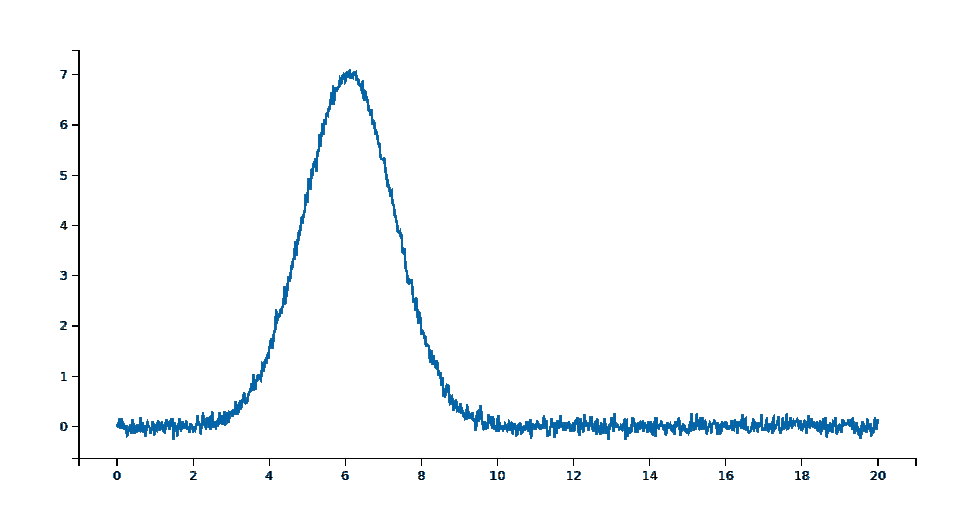*

*接下来，我们需要一个函数，它将 x 值作为第一个参数，将我们想要拟合的三个参数(我们称它们为 *a，b，c* )作为下一个参数。这是我们将用来拟合数据的函数；我们的曲线拟合库(不要担心，我们自己不必做任何繁重的工作)将改变参数，直到它找到一个好的拟合(并有希望找到我们用来生成数据的那些，即 a=21，b=6.1，c=1.2)。通过这个函数，我们生成一个曲线拟合模型(使用[*lm fit*](https://lmfit.github.io/lmfit-py/)*库)并传递一些参数的初始猜测。然后我们拟合数据。需要注意的是，一般的曲线拟合方法*并不能保证找到全局最小值*，我们对参数的初步猜测是至关重要的。**

**这是输出—我们找到了我们的参数！**

**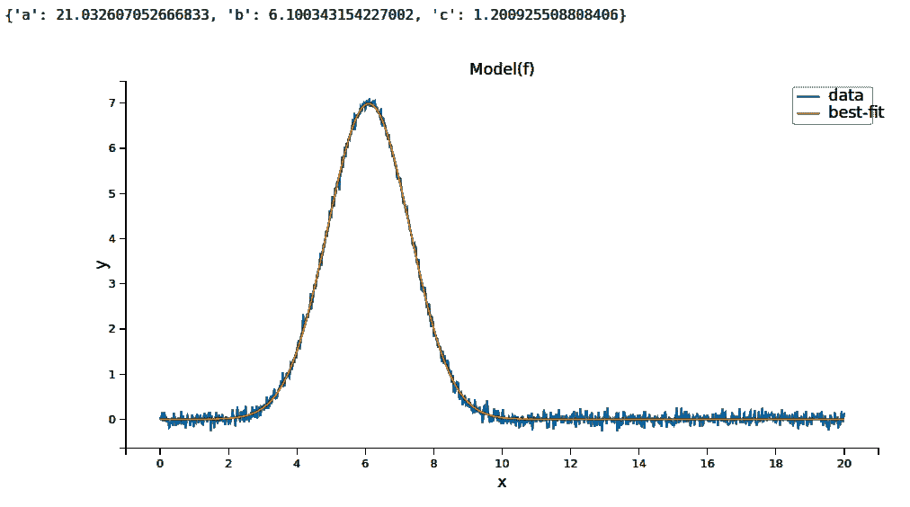**

**这就是我们需要的所有曲线拟合背景。现在，我们将使用模型来拟合数据:**

# **拟合的扩展 SIR 模型**

**我们建立在上一篇文章中导出的模型基础上:个人是第一个**S**SS 易受感染的——他们可以感染冠状病毒(概率为 S/N)并成为 **e** 暴露者。他们还不能传播病毒。几天后(确切地说是 1/δ)，他们被感染并传播了病毒。在感染的过程中，它们可以(超过 1/ρ天，概率为α)存活并最终恢复(1/γ天后):**

****

**为了提醒你，这里还有一些变量:**

*   **N: 总人口**
*   ****S(t):** 第 t 天易感人数**
*   ****E(t):** 第 t 天暴露的人数**
*   ****I(t):** 第 t 天感染人数**
*   ****R(t):** 第 t 天康复人数**
*   **第 t 天死亡人数**
*   ****β:** 感染者每天感染的预期人数**
*   ****D:** 受感染者已经并可能传播疾病的天数**
*   ****γ:** 感染者每日痊愈的比例(γ = 1/D)**
*   ****R₀:** 一个感染者感染的总人数(R₀ = β / γ)**
*   ****δ:** 潜伏期的长度**
*   ****α:** 病死率**
*   ****ρ:** 人的死亡率(= 1/从感染到死亡的天数)**

**我只想添加一个新的隔间:***C****critical，*用于需要重症监护的个人。这将使我们能够模拟人满为患的医院。当然，只有被感染的个体才能进入危急状态。从临界状态开始，它们要么死亡，要么康复。**

**我们实现了这些转变:**

**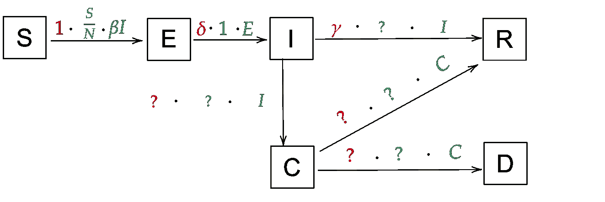**

**好吧，这里有很多问号，让我们做一些思考！我们需要一个被感染的个体变得危急的可能性。这里不打算介绍越来越多的希腊字母，我们就叫它 p(I→C)吧。从逻辑上讲，从感染到康复的概率是 1-p(I→C)。**

**我们需要另一个概率，临界时死亡的概率:p(C→D)。同理，从感染到痊愈的概率是 1-p(C→D)。**

**现在我们只缺了感染后的重症率，重症时的死亡率，重症时的痊愈率。通过阅读目前的估计，我得到了以下数字(我从多个来源汇总了这些数字，可以随意使用不同的数字；随着时间的推移，应该会有更准确的数字):**

*   **从感染到危急的天数:12 天(→比率:1/12)**
*   **从危急到死亡的天数:7.5 天(→比率:1/7.5)**
*   **从危急到恢复的天数:6.5 天(→比率:1/6.5)**

**把这些都填进去:**

**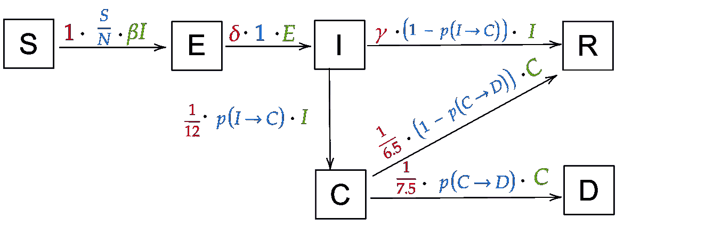**

## **分流和有限的资源**

**在意大利和其他受影响严重的地方，有很多关于分流的报道，这意味着医生必须在有限的可用资源中选择接受治疗的人。这可以被合并到如下模型中:**

**想象一下，一个国家拥有适合治疗严重冠状病毒病例的 *B* ICU 床位。如果有超过 *B* 的危重病人(数量是 *C* ，我们的危重车厢)，所有在 *B* 以上的人都无法救治而死亡。例如，如果 B=500，C=700，那么有 200 名患者因为没有资源治疗而死亡。**

**这意味着 *C-B* 人因短缺而死亡。当然，如果我们的床位比重症病人多(例如 B=500，C=100)，那么我们就不会有 C-B=-400 人死亡，这就说不通了。而是我们有 *max(0，C-B)* 人因为短缺而死(想想看:如果 C < B(床位比病人多)，那么 C-B < 0，所以 max(0，C-B)=0，0 人因为短缺而死；如果 C > B(床位不够)，那么 C-B > 0，所以 max(0，C-B)=C-B，C-B 的人因为短缺而死)。**

**因此，我们需要扩展我们的转换:从 C 开始，有两个我们必须关注的群体:max(0，C-B)人因为短缺而死亡，其余的人像我们上面推导的那样得到治疗。其余的是什么？嗯，如果 C < B(足够的床位)，那么 C 人得到治疗。如果 C > B(床位不够)，那么 B 人得到治疗。那就意味着“剩下的”——得到治疗的人数——是 *min(B，C)* (同样，如果 C < B，那么 min(B，C)=C 人得到治疗；若 C > B，则 min(B，C)=B 人得到治疗；数学检查)。**

**我们最终得到了这个修正的模型(所有超过可用床位数的人都会立即死亡；你可以把它改成花几天时间，以 75%的概率死去，等等。):**

**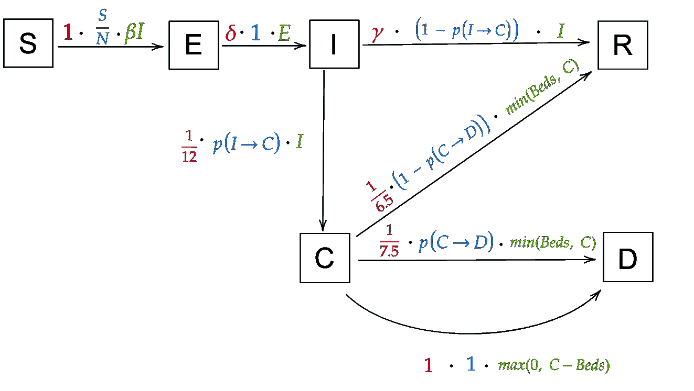**

**这些是它的方程式(注意*床*是时间的函数，我们一会儿就会讲到)**

**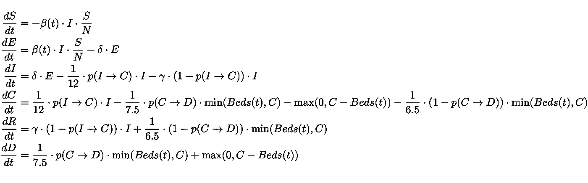**

**再一次，花些时间来看看这些方程是如何与上面的状态转换直接相关的。它们看起来很难，但它们只是描述图表的另一种方式。**

## **时间相关变量**

**对于这个模型，我们只有两个与时间相关的变量:R₀(t(以及β(t)，因为 R₀ = β / γ)和床位(t)。**

**对于 R₀(t)，我们将再次使用以下逻辑函数:**

****

**对于床位(t ),这个想法是，随着病毒的传播，各国做出反应，开始建造医院，腾出床位，等等。因此，随着时间的推移，可用床位的数量会增加。一个(非常)简单的方法是将床位数量建模为**

****

**其中，Beds₀是可用的 ICU 病床总数，s 是某个比例因子。在此公式中，床位数增加了 s 倍，即每天的初始床位数(例如，如果 s=0.01，则在第 t 天=100，床位数(t) = 2 ⋅ Beds₀)**

# **拟合模型**

**首先，让我们想想我们*知道*什么，我们*想知道什么。*这有助于我们找到哪些参数是我们可以修正的，哪些是我们想要拟合的。**

**这里是我们的模型需要的所有参数(这只是方程中的所有变量加上 R₀(t 函数中的变量)和 beds(t)；):**

*   ****总人口****
*   ****β(t):** 感染者每天感染的预期人数**
*   ****γ:** 感染者每日痊愈的比例(γ = 1/D)**
*   ****r₀_start**(r₀(t 参数)**
*   ****r₀_end**(r₀(t 参数)**
*   ****x₀**(r₀(t 参数)**
*   ****k**(r₀(t 参数)**
*   ****s** (床中参数(t))**
*   ****beds₀**(r₀(t 参数)**
*   ****δ:** 潜伏期的长度**
*   ****p(I→C):** 从感染到危急的概率**
*   **p(C→D): 危急时死亡的概率**

**让我们来看一下这些:我们当然不需要去适应，我们可以只看我们想要建立疾病模型的地区的人口。Beds₀的情况也是如此，我们可以很容易地查找一个地区的 ICU 床位数(我已经用 Python 准备了所有的数据集来做这件事，我们将在下一节看到它们)。 **δ** 和 **γ** 固定为δ=1/9 和γ=1/3，这些是我通过论文阅读找到的最好的估算。关于 **β(t)** ，我们通过 R₀(t 和γ计算β，所以不需要为β寻找任何单独的参数。可以拟合床缩放因子**s**；不可否认，它在结果中并没有起很大的作用，因为到目前为止，由于短缺而没有接受治疗的人数与死亡总数相比是很少的。**

**我收集了概率 **p(I→C)** 和 **p(C→D)** 的两个估计值，按年龄分组(同样，我们将在下一节中讨论这些)。这将允许我们计算概率，就像我们在上一篇文章中推导的那样:按每个年龄组的人口比例加权。在这里，我们实际上将尝试拟合这些参数——直到现在，尝试拟合这些参数总是会产生非常接近收集的估计值的结果。**

**总而言之，我们只剩下这些参数来拟合:**

*   ****p(I→C)****
*   ****p(C→D)****
*   ****r₀_start**(r₀(t 的参数)**
*   ****r₀_end**(r₀(t 的参数)**
*   ****x₀**(r₀(t 参数)**
*   ****k**(r₀(t 的参数)**
*   ****s** (床中参数(t))**

## **补充和冠状病毒数据**

**我已经从[联合国数据](https://data.un.org/)中收集并整理了年龄组、概率和 ICU 床位的数据。我们将从[这里](https://data.humdata.org/dataset/novel-coronavirus-2019-ncov-cases)获取最新的案例号。让我们来看看:**

**首先，加载数据:**

**以下是从所有表格中摘录的内容，以便了解我们正在处理的问题:**

*   ***床位*表中有许多国家每 10 万居民的 ICU 床位数量*。***
*   ***年龄组*表显示了所有国家每个年龄组的人口数量。**
*   ***概率*表具有为每个年龄组的转变 I→C 和 C→D 收集的概率 I(两个独立的概率；仅使用 _1 或 _2)(我们不会使用它们，因为我们将尝试拟合转移概率)**
*   ***covid_data* 是一个巨大的表格，显示了从 2020 年 1 月 22 日起每个地区每天的死亡人数。**

**例如，以下是全世界的总死亡人数:**

**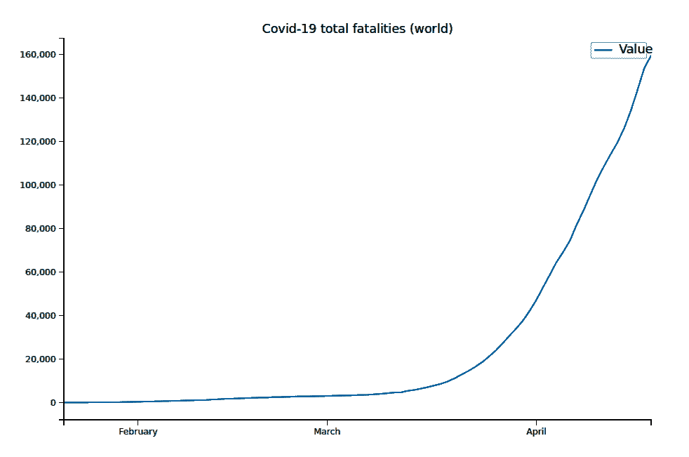**

**并非所有国家和地区都包括在表中。然而，如果你想模拟一个没有包括在内的地区的爆发，你应该能够通过快速的谷歌搜索找到你需要的数据。**

**你可能已经注意到，我们只使用死亡人数的数据，而不是报告的病例数。原因很简单:确诊病例的报告非常嘈杂，而且很大程度上依赖于检测的数量(尽管有足够的检测，但并不是每个被感染的人都会接受检测)。例如，案例数量可能会从一天的 10000 增加到第二天的 15000，但这可能只是因为测试数量增加了 5000。总的来说，报道的死亡人数要准确得多——死亡人数很难被遗漏，所以报道的数字可能与真实数字非常接近。**

## **编码模型**

**设置好所有数据后，我们现在可以开始编码我们的模型了。同样，这是方程式:**

****

**让我们把它们翻译成代码，就像在上一篇文章中一样(一个警告:我们在这里计算β有点简化，因为严格计算它会复杂得多，并且对结果的影响可以忽略不计；如果你好奇的话，你可以在这里看到扩展实现):**

**这实际上只是输入 Python 的方程式，没有什么令人兴奋的事情发生！现在，关于 R0 函数和整个模型，该模型采用参数拟合(有些我们已经知道)来计算 S、E、I、C、R 和 D 的曲线:**

**以下是我们在没有足够 ICU 床位的人群中模拟疾病时得到的结果(绘图功能在笔记本中):**

**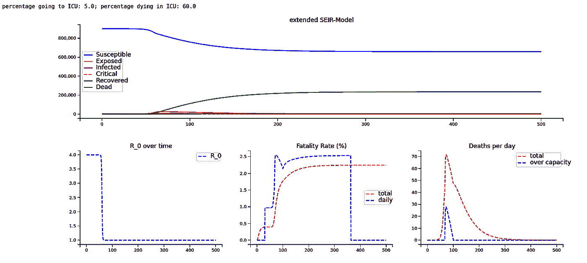**

**在右下角的图表中，您可以看到由于资源短缺(没有足够的床位)导致的死亡人数激增。**

**对，我们现在有了模型和数据。让我们好好利用我们的曲线拟合技巧吧！**

## **曲线拟合**

**首先，我们得到要拟合的数据和我们已经*知道的参数*，并且我们为那些我们不知道的定义初始猜测和上下限(以帮助曲线拟合并得到好的结果)——随意改变初始猜测和上下限。**

**一个非常重要但我们还没有谈到的参数是*爆发 _ 转移*:病例数据从 1 月 21 日开始，所以我们的模型会认为病毒在那一天开始传播。对于许多国家来说，这实际上可能是几天或几周之后或更早，这对试衣有很大影响。当然，我们仍然不知道每个国家第一个被感染的人是什么时候——用你最好的判断。例如，如果您认为您正在尝试适应的国家在 1 月 30 日出现了首例病例，您应该将 *outbreak_shift* 设置为-9。**

**(可悲的是，使用 outbreak_shift 作为附加参数并不容易，因为只允许整数(整天)，整数编程相当困难(实际上是 NP 困难)；我们将不得不求助于非常昂贵的计算。)**

**我们现在用零填充我们想要拟合的数据(每天的死亡人数),以说明疫情的变化。我们还定义了拟合的 x 值；这只是一个列表[0，1，2，…，总天数]。**

**为了进行拟合，我们需要一个函数，该函数将 x 值作为第一个参数(日期)和我们想要拟合的所有参数，并返回模型针对该 x 值和参数预测的死亡人数，以便曲线拟合器可以将模型预测与真实数据进行比较。这是:**

**没什么可做的了！只需初始化一个曲线拟合模型，根据我们定义的 inits、mins 和 maxs 设置参数，设置一个拟合方法(您可以在这里尝试不同的方法，例如， *differential_evolution* 可能效果不错)，然后拟合:**

**最后，这是我们为意大利准备的服装:**

**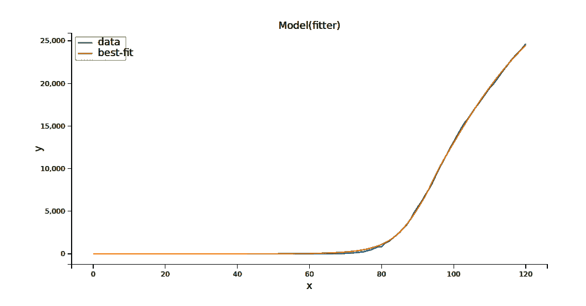**

**不算太差！让我们看看装配工预测的参数:**

**太好了，它们看起来相当真实，并且与现实生活中报告的许多数据点一致！x0 是 84，所以数据从 1 月 21 日开始，爆发时间设置为 30 天，我们模型的第 84 天是 3 月 15 日。x0 是 R0 最急剧下降的日期，因此我们的模型认为主要的“锁定”发生在 3 月 15 日左右的意大利，非常接近真实日期。**

**让我们使用最佳拟合参数来看看我们的模型预测的未来(如果您查看笔记本中的代码，可以放大):**

**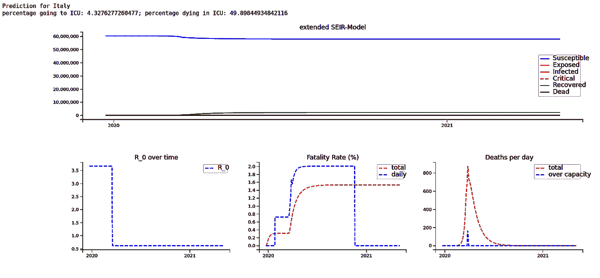**

**请注意，2020 年 3 月底左右，由于医院人满为患，死亡人数激增，增加了死亡率，最终约为 1.4%。**

**这是从 3 月到 5 月的放大预测——如果模型是正确的，意大利已经度过了最糟糕的时期，死亡人数在接下来的几个月应该会大幅下降。当然我们的模型认为 R0 会保持在 0.6 左右；如果它再次上升，锁定恢复，数字将再次开始增加！**

**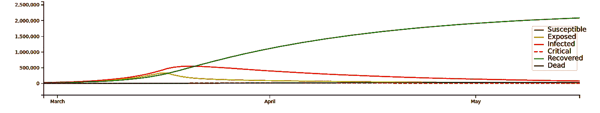**

# **概述**

**仅此而已！您现在应该能够(尝试)将您的模型与真实世界的案例数据相匹配，并有望做出准确的预测！在另一篇文章中，我们将为这样的模型构建一个仪表板，以实时查看不同参数的效果！**

*****编者按:*** [*走向数据科学*](http://towardsdatascience.com) *是一份以数据科学和机器学习研究为主的中型刊物。我们不是健康专家或流行病学家，本文的观点不应被解释为专业建议。想了解更多关于疫情冠状病毒的信息，可以点击* [*这里*](https://www.who.int/emergencies/diseases/novel-coronavirus-2019/situation-reports) *。***