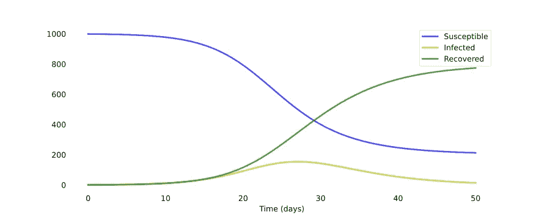

# 传染病建模:理解用于冠状病毒建模的模型

> 原文：<https://towardsdatascience.com/infectious-disease-modelling-part-i-understanding-sir-28d60e29fdfc?source=collection_archive---------4----------------------->

## 解释背景并从头推导 SIR 模型的公式。用 Python 对模型进行编码和可视化。

在过去的几周里，许多数据科学家、业余爱好者和爱好者开始阅读传染病建模。他们中的许多人直接进入建模，并盲目地将他们的模型与冠状病毒病例数相适应——而不了解模型背后的背景和理论。尽管由看起来令人生畏的数学组成，最广泛使用的模型——如果解释得好——并不太难理解。

这篇文章解释了背景，并介绍了传染病建模的主题。SIR 模型方程是从零开始用简单的例子推导和解释的。最后，用 Python 编写了一个简单的 SIR 模型。[我的下一篇文章](https://medium.com/@hf2000510/infectious-disease-modelling-beyond-the-basic-sir-model-216369c584c4)将关注基本 SIR 模型的更复杂的变体，并将使读者能够实现和可视化他们自己的变体和想法。[另一篇文章](https://medium.com/@hf2000510/infectious-disease-modelling-fit-your-model-to-coronavirus-data-2568e672dbc7)将关注模型与现实世界数据的拟合，并将新冠肺炎作为案例研究。

[你可以在这里找到这篇文章的全部代码。](https://github.com/henrifroese/infectious_disease_modelling/blob/master/part_one.ipynb)

# 背景

本系列并不意味着快速向你展示一些带有大量彩色曲线的图表，这些图表应该让你相信**我的**模型可以完美地预测世界各地的冠状病毒病例；相反，我将解释理解这些模型、形成自己对这些模型的看法以及实现自己的想法所需的所有背景。你只需要高中水平的微积分就能跟上解释；要理解编程部分，您需要对 python 有扎实的理解。

因此，记住这一点:

我们想建立传染病模型。这些疾病可以从一个群体传播到另一个群体；我们试图深入了解它们传播的速度，它们感染的人口比例，死亡的比例等等。模拟它们的最简单的方法之一(也是我们在这里关注的方法)是使用*房室模型*。分室模型将群体分成几个分室，例如:

*   **S**us 可接受(仍可被感染，“健康”)
*   我感染了
*   恢复(已经被感染，不能再被感染)

也就是说，我们可能有 N=1000 的人口(例如 1000 人)，并且我们知道在时间 t(例如疾病爆发后 t=7 天)有 400 人被感染。这由 S(7) = 400 表示。SIR 模型使我们只需输入一些初始参数，就可以获得所有 t 天的所有值 S(t)，I(t)，R(t)。现在我将通过一个简单的示例来介绍必要的变量:

我们有一种新的疾病，x 病，对于这种疾病，感染者传染健康人的概率是 20%。一个人平均每天接触的人数是 5 人。因此，每天，一个被感染的人会遇到 5 个人，并以 20%的概率感染每一个人。因此，我们预计这个人每天会感染 1 人(20% ⋅ 5 = 1)。这是**β(“beta”)，一个感染者每天感染的预期人数**。

现在人们可以看到，一个感染者拥有并能传播疾病的**天数**极其重要。我们称这个数字为 **D** 。如果 D=7，一个感染者四处走七天传播疾病，每天感染 1 人(因为β=1)。因此，我们预计一名感染者会感染 1⋅7(每天 1 人乘以 7 天)= 7 人。这是 R₀的基本繁殖数，一个感染者感染的总人数。我们只是用了一个直观的公式:R₀ = β ⋅ D

我们其实不需要别的，只需要一个小记号:γ(“gamma”)会是 1/D，所以如果你把 D 想成一个感染者患病的天数，**你就可以把γ想成痊愈率，或者说感染者每天痊愈的比例**。例如，如果目前有 30 人被感染，D=3(所以他们被感染了三天)，那么每天，他们中的 1/3(所以 10)人会康复，所以γ=1/3。γ = 1/D，所以 D = 1/γ，R₀ = β ⋅ D，则 R₀ = β / γ。

在这里，您可以再次看到最重要的变量及其定义:

*   N: 总人口
*   **S(t):** 第 t 天易感人数
*   **I(t):** 第 t 天感染人数
*   **R(t):** 第 t 天康复人数
*   **β:** 感染者每天感染的预期人数
*   **D:** 一个感染者已经并可能传播疾病的天数
*   **γ:** 感染者每日痊愈的比例(γ = 1/D)
*   **R₀:** 一个感染者感染的总人数(R₀ = β / γ)

# 推导公式

我们现在想得到一整天的感染人数、易感人数、痊愈人数，仅仅从β、γ、n 就可以得到，现在很难得到一个直接的公式来表示 S(t)、I(t)、R(t)。然而，描述 S、I 和 R 的每日变化*是相当简单的，即易感/感染/恢复的数量如何根据当前的数量而变化。同样，我们将通过示例推导公式:*

我们现在处于疾病 x 爆发后的第 t 天。然而，一个感染者每天感染的预期人数是 1(所以β=1)，一个感染者拥有和能够传播疾病的天数是 7(所以γ=1/7，D=7)。

假设 t 日，60 人被感染(所以 I(t)=60)，总人口为 100(所以 N=100)，仍有 30 人易感(所以 S(t)=30，R(t)= 100–60–30 = 10)。现在，S(t)和 I(t)和 R(t)如何变化到第二天？

我们有 60 名感染者。他们每人每天感染 1 人(那就是β)。但是，他们遇到的人，只有 30/100 =30%的人仍然易感，可以被感染(那就是 S(t) / N)。所以，他们感染了 60 个⋅人 1 个⋅人 30/100 = 18 人(再想想，直到它真正有意义:60 个感染者平均每天感染 1 人，但 100 人中只有 30 人仍会被感染，所以他们没有感染 60 ⋅ 1 人，而只有 60 ⋅ 1 ⋅ 30/100 人= 18 人)。所以，18 个易感者被感染，所以 S(t)变化负 18。代入变量，我们就导出了第一个公式:

第二天 S(t)的变化= - β ⋅ I(t) ⋅ S(t) / N

如果你熟悉微积分，你会知道我们有一个术语来描述函数的*变化:导数 S'(t)或 dS/dt。*(在我们推导并理解了所有的导数 S'(t)，I'(t)，R'(t)之后，就可以计算出每一天的 S(t)，I(t)，R(t)的值了。)

所以:S'(t) =- β ⋅ I(t) ⋅ S(t) / N

那么，感染的数量是如何变化的呢？这很简单:有一些新的人被感染，我们刚刚看到了这一点。“离开”S(t)“到达”I(t)的确切人数。因此，我们有 18 个新感染者，我们已经知道公式将类似于此:I'(t) = + β ⋅ I(t) ⋅ S(t) / N(当然，我们可以省略加号，这只是为了向您显示我们获得的量正好是 S(t)损失的量，因此我们只需改变符号)。只差一点:有些人会康复。记住，我们有γ，它是*每天被感染恢复的比例*，这正是我们需要的！

我们有 60 人被感染，γ=1/3，所以这 60 人中有三分之一康复了。那是 1/3 ⋅ 60 = 20。最后，我们得到公式:

I'(t) = β ⋅ I(t) ⋅ S(t) / N -γ ⋅ I(t)

再次，思考一下这个问题；第一部分是新感染的易感者。第二部分是追偿。

最后，我们来看最后一个公式，回收率的变化。这很简单:新恢复的正好是我们刚刚计算的 20 个；没有人离开“恢复”车厢。一旦痊愈，它们会保持免疫:

R'(t) = γ ⋅ I(t)

太好了，我们现在已经推导出(并且理解)了我们需要的所有公式！在这里，他们再次用一个更常见的符号表示导数，并像通常所做的那样省略了“(t)”。

这样的方程被称为*常微分方程(ODEs)* (你不需要任何关于它们的知识来理解这个系列)。

我们现在可以描述易感、感染和康复人数的 T2 变化。幸运的是，从这些公式中，我们可以计算出我们真正感兴趣的数字:S(t)，I(t)和 R(t)，即每天 t 中易感、感染和康复的人数。更幸运的是，我们自己一点也不需要做，python 提供了许多求解 ODEs 的工具！

# 编码模型

[(你可以在这里找到全部代码](https://github.com/henrifroese/infectious_disease_modelling/blob/master/part_one.ipynb))

我们现在将编码并可视化一个示例模型。您可以随意复制代码和使用参数！我们首先定义一些参数:

我们现在实现我们上面推导的公式:

神奇的事情发生了:我们从函数 *odeint* 中得到我们的值 S(t)、I(t)和 R(t ),该函数采用我们上面定义的公式、初始条件以及我们的变量 N、β和γ，并计算 50 天的 S、I 和 R。

现在我们只需绘制结果并得出以下结论:

正如你所看到的，几乎 1000 人全部被感染只需要 30 天左右。当然，这里模拟的疾病具有非常高的 R₀值 4.0(回想一下，R₀ = β ⋅ D = 1.0 ⋅ 4.0)。仅仅将一个感染者每天感染的人数β改为 0.5，就会产生完全不同的情况:

如你所见，这些微分方程系统对初始参数非常敏感。这也是为什么很难正确模拟一种新疾病的爆发:我们不知道参数是什么，即使是微小的变化也会导致非常不同的结果。

# 结果

你现在应该对传染病建模的一些最重要的公式和思想有了坚实的掌握。对 R₀，β，γ等的理解。mean 使您不仅可以盲目地调整参数，还可以设计、改进和扩展您自己的模型。您现在应该能够理解接下来的部分了，在接下来的部分中，我们将更多地关注扩展现有的模型，并(在第 3 部分中)尝试对一个新出现的疫情进行建模。