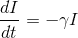
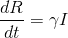
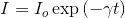
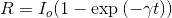
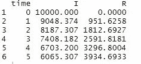
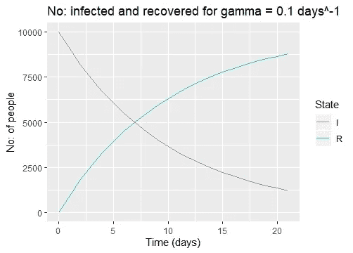
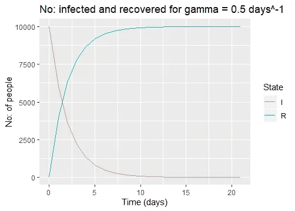

# 传染病模型——基本原理

> 原文：<https://towardsdatascience.com/infectious-disease-modelling-the-nuts-and-bolts-46a9b2d42388?source=collection_archive---------46----------------------->

## **使用 R 中的简单二室模型的介绍**


由[埃琳娜·莫日维洛](https://unsplash.com/@miracleday?utm_source=medium&utm_medium=referral)在 [Unsplash](https://unsplash.com?utm_source=medium&utm_medium=referral) 上拍摄的照片

自古以来，传染病就一直困扰着人类。通常，传播是由宿主驱动的，然后宿主将感染传给其他个体。传染病模型的目标是捕捉这些**传播动态。它们是对传染病传播的数学描述。**

使用该模型，可以:

*   研究干预对疾病负担的影响
*   来预测不同干预的结果

## 一个简单的二室模型

考虑只有两个隔间的最简单的模型——感染(I)和恢复(R)。这个模型有助于我们回答以下问题:

**人从 I 到 R 需要多久？(或从 I 到 R 的转换率)**


**假设**:在任何时间点，I 区室中的每个个体都同样可能经历康复。

变速器动力学由以下微分方程控制:



上述方程的解是:



这里，γ代表回收率。γ值越高，恢复越快。

在隔室 I 中度过的时间以参数γ和平均值 1/ γ(平均传染期)为指数分布

**在 R 中建立一个双室模型**

R 中的 **deSolve** 包包含了求解一阶常微分方程组(‘ODE’)的初值问题的函数。

**步骤 1** :定义感染和康复队列中的人数、康复率γ(γ=0.1)和随访持续时间(21 天)

```
initial_values<-c(I=10000,R=0) #10000 in infected cohort
parameters<-c(gamma=0.1)
time=seq(from=0,t=21,by=1)
```

**第二步**:指定模型功能

在模型函数中，指定微分方程。该函数有三个输入参数:

*   时间:我们希望求解模型的时间点
*   状态:存储每个时间点每个车厢的人数
*   参数:模型参数的名称和值

```
model_cohort<-function(time,state,parameters){
  with(as.list(c(state,parameters)),{
    dI=-gamma*I
    dR=gamma*I
    return(list(c(dI,dR)))
  })  
}
```

**第三步**:使用 deSolve 包中的 ode()求解模型

```
output<-as.data.frame(ode(y=initial_values,func =   model_cohort,parms=parameters,times = time))
head(output)
```



我们看到输出是带有时间点的数据帧，即在每个时间点感染和恢复隔离室中的人数。

步骤 4:使用 **ggplot2** 绘制输出

```
out_long=melt(output,id="time") #To convert the dataframe to long   formatggplot(data = out_long,          
       aes(x = time, y = value, colour = variable, group = variable)) +  
  geom_line() +                                                          
  xlab("Time (days)")+                          
  ylab("No: of people") +                    
  labs(title = paste("No: infected and recovered for gamma = 0.1 days^-1"))+scale_color_discrete(name="State")
```



从图中，可以回答关于在每个时间点感染和恢复的人数的问题。平均传染期将是恢复率的倒数，即 1/0.1=10 天

**改变伽马值**

如果γ增加到比如说 0.5，我们观察到一半的感染群体在大约 2 天内恢复，而对于γ=0.1，需要大约 7 天。因此，γ值越大，恢复时间越短。



这个模型是基于相似原理的更复杂的房室模型的最简单的例子，比如 SIR 模型。在即将到来的帖子中会有更多关于它的内容:)

**参考文献**

*   Soetaert，K. E .，Petzoldt，t .，& Setzer，R. W. (2010 年)。解 R 中的微分方程:包 deSolve。*统计软件杂志*， *33* 。
*   [https://www . coursera . org/specializations/infectious-disease-modeling](https://www.coursera.org/specializations/infectious-disease-modelling)