# 通过观察专家来推断你的奖励

> 原文：<https://towardsdatascience.com/infer-your-reward-by-observing-an-expert-140b685fd5b5?source=collection_archive---------20----------------------->

## 实现反向强化学习算法

照片由 Jehyun Sung 在 [Unsplash](https://unsplash.com/photos/6U5AEmQIajg) 上拍摄

在强化学习(RL)中设计奖励函数可能很麻烦。很简单，我们的目标是采取行动增加未来的累积回报，并避免那些损害它的行为。然而，选择如何奖励现实任务中的行为，并以一种既可学又能表达代理人期望的目标的方式，并不简单。例如，如何将“可接受的”社会行为指定为一种功能？

逆向强化学习(iRL)是一种缓解这种设计问题的方法。我们没有试图自己设计一个奖励函数 *r(s，a)* ，而是让 RL 代理观察专家演示我们希望它学习的内容，并从他们的行为中推断专家的意图。通过这样做，代理使奖励函数符合专家的意图。

让我们深入研究一下。

> 我们的 iRL 实现将连接到生成敌对网络(GANs)。对于这一点，你会发现对【GANs 如何工作有一个基本的了解是非常有用的，尽管我在下面会做简要介绍。

# **RL 为 GAN**

**GANs 的快速细节**

一个 GAN 由鉴别器 ***D*** 和发生器 ***G*** 组成。生成器旨在生成看起来尽可能接近训练中使用的真实图像的*假*图像。另一方面，鉴别器将给定的图像分类为真品或赝品。因此， ***D*** 和 ***G*** 都玩一个游戏，其中 ***D*** 试图最大化它正确地将输入 *x* 分类为真或假*，*和 ***G*** 最小化 ***D*** 将其输出标记为*的可能性*

实现这一点的损失函数是 D 和 g 输出的*对数*。

[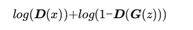](https://medium.com/@mugoh/140b685fd5b5)

GAN 损失函数

其中:

*   **D** (x) —鉴别器预测 *x* 为真/假
*   **G** (x) —发电机输出
*   **D** ( **G** (x)) —鉴别器对发电机输出的预测

我们可以将这一培训过程描述如下:

[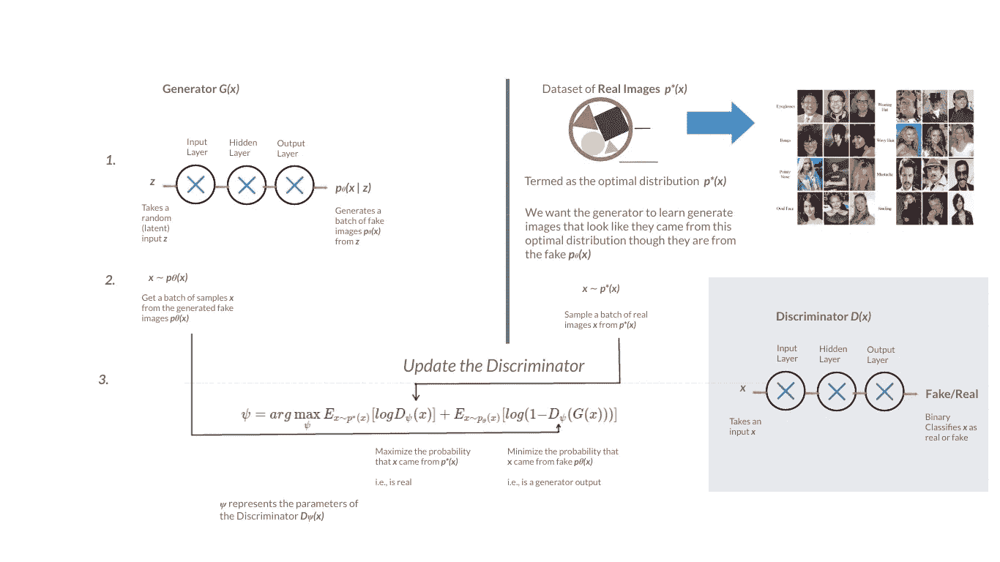](https://mugoh.github.io/mug-log/2020/10/20/adversarial-inverse-rl.html)

*甘的作品(作者插画)*

## gan 与反向 RL 的关系

反向 RL [使用 GANs 的鉴别器](https://stats.stackexchange.com/a/487726/296297)的概念。iRL 中的鉴别器是政策和奖励函数的比率。我们一会儿就能看到它的全貌。

与 GAN 中的假图像和真图像相似，iRL 有两组数据——专家演示和策略与环境交互生成的过渡数据。两个转换集都包括状态-动作对，直到一个有限的时间步长 *T* (s₀，a₀，s₁，a₁,…，sT，aT)。将 iRL 与 GANs 联系起来，专家论证可以说是真实数据，而政策收集的样本是虚假数据。这意味着该策略现在充当生成器。

[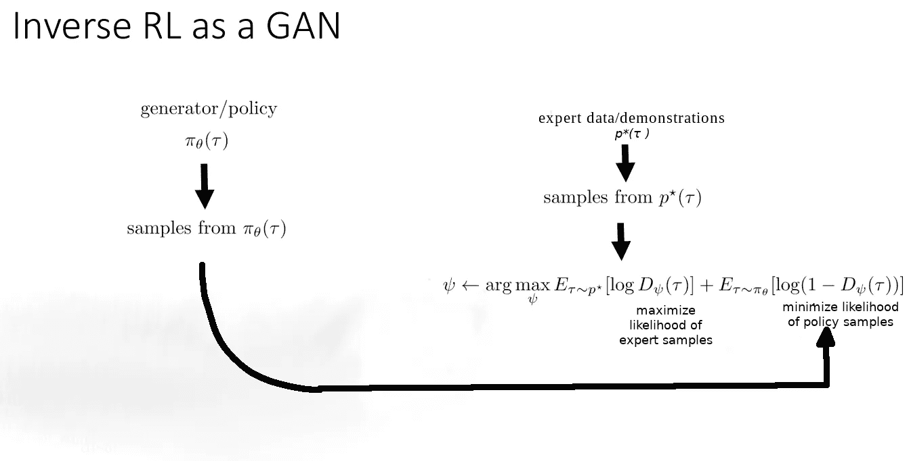](https://mugoh.github.io/mug-log/2020/10/20/adversarial-inverse-rl.html)

*iRL 为 GAN(修改自* [*来源*](http://rail.eecs.berkeley.edu/deeprlcourse/) *)*

鉴频器的目标以与 GAN 中相同的方式表示。

[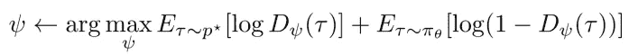](https://medium.com/@mugoh/140b685fd5b5)

*iRL 中鉴别器的最小最大物镜*

该目标函数的第一部分试图增加所看到的样本是专家演示的可能性。第二部分降低了样本被正在运行的策略收集的可能性。

## ***实现对鉴别器的培训***

正如所看到的，训练鉴别器的目的是最大化输入正确分类为真或假的概率。为此，我们最大化损失函数:

iRL 鉴别器损耗函数

在实施中，这可以通过两个简单的步骤实现:

1.样本批专家轨迹*τE*T20*，*正向通过**D计算损耗*log*(*D*(*τE*))。**

2.对收集到的一批策略轨迹 *τF，*顺传**D进行采样，计算损失*log*(*D*(*τF*))。这里，我们避免做(最小化)*log*(1—*D*(*τF*))因为这无法在学习过程中提供足够的梯度。所以我们最大化*log*(*D*(*τF*))来代替。**

## **代表 iRL 中的鉴别器**

鉴别器 ***D*** 是奖励函数 ***r*** *:*

*iRL 中的鉴别器:指数奖励函数与学习策略的比率*

*ψ*代表奖励函数的可学习参数。作为学习奖励的函数，鉴别器也使用参数*ψ。*

更新鉴别器 *D* 更新学习的奖励函数 *r(τ)* 。当鉴别器是最优的，我们得到一个最优的回报函数。然而， *r(τ)* 以上的奖励函数在奖励的估计中使用整个轨迹 *τ* 。与使用单个状态、动作对 *r* (s，a)相比，这给出了较高的方差估计，导致较差的学习。

使用单个状态-动作对将解决高方差估计问题，但是也有一个缺点——它使得最优奖励函数*与最优策略提出的监督动作*严重纠缠。换句话说，习得的奖励会鼓励模仿专家的政策，当环境发生变化时，不能产生明智的行为。

这就是我们对鉴频器的最后改进。

## **创建一个解开的奖励函数**

为了提取从环境中分离出来的奖励，[对抗性逆 RL](https://arxiv.org/pdf/1710.11248) (AIRL)提出用这种形式修改鉴别器:

[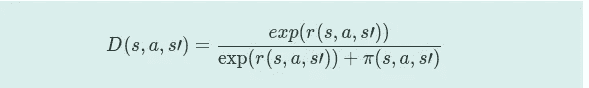](https://medium.com/@mugoh/140b685fd5b5)

*使用单个【状态-行动对】作为输入的鉴别器*

我们可以进一步简化奖励函数 *r(s，a，s’)*为:

[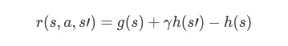](https://medium.com/@mugoh/140b685fd5b5)

*对抗性反 RL *奖励功能恢复优势**

*它现在由以下部分组成:*

1.  *g(s，a):估计状态-动作对的回报的函数逼近器。它被表达为只有状态 g(s)的函数，以将奖励从环境动态中分离出来*
2.  *h(s):控制 g(s)上不需要的整形的整形术语*

*下面是代码中的鉴别器和奖励函数。*

*g(s)收回最优报酬；h(s)类似于一个价值函数。*

*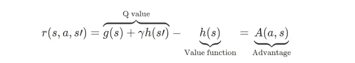*

**从学习的奖励函数中恢复优势 A(s，A)**

*这意味着 r(s，a，s’)恢复了优势。这就是有趣的地方。*

## ***执行策略更新***

*策略更新包括找到策略的对数的梯度乘以优势。*

*[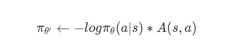](https://medium.com/@mugoh/140b685fd5b5)

政策梯度更新* 

*在 iRL 中，由于我们没有观察到评估优势时使用的环境奖励，更新期间的更改将使用奖励函数来估算这些优势。更简单地说，由奖励功能恢复的优势在策略更新中找到用途。*

*[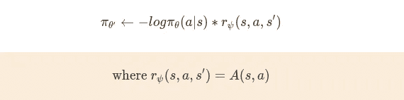](https://medium.com/@mugoh/140b685fd5b5)

*在 iRL 中使用优势评估进行政策更新** 

*为了对 iRL 有一个直观的概述，这里有一个普通政策梯度(VPG)和应用于 VPG 的反向 RL 之间的整个伪代码的并排比较。*

*[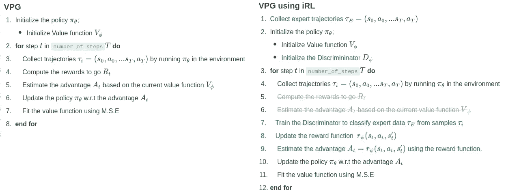](https://medium.com/@mugoh/140b685fd5b5)

*普通政策梯度(VPG)比较了 VPG 和反向 RL** 

*策略 ***π*** 被训练来最大化这个估计的回报 r(s，a，s’)，并且当被更新时，学习收集与专家演示更难区分的轨迹。*

***运行反向 RL***

*反向 RL 培训的第一步是运行基于策略的 RL 算法来收集专家演示。我从两个方面着手:*

1.  *收集最后 n 个策略更新的轨迹。例如，如果训练 250 个纪元，收集 230–250 个(最后 20 个)。这是 AIRL 论文中的方法。*
2.  *收集平均剧集奖励高于某个奖励阈值的轨迹*

*上述两种收集专家数据的方法在反向 RL 平均回报方面似乎没有显著差异(至少在 250 个时期内)。我对此的解释是,( b)中的奖励阈值收集了(a)中看到的大部分发生在最后训练阶段的轨迹。*

*这里是在 HalfCheetah-v2 上的 iRL 在 100 个步骤上的平滑性能，使用了来自五个最终时期的专家数据。*

*[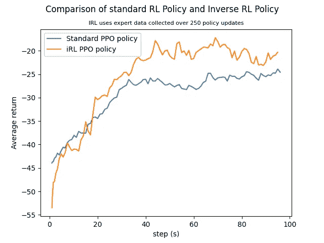](https://medium.com/@mugoh/140b685fd5b5)

*iRL 策略和使用观察奖励的相同策略的半猎豹奖励比较。** 

*完整的 iRL 实现和复制细节在[https://github.com/mugoh/rl-base/tree/master/rlbase/aiRL](https://github.com/mugoh/rl-base/tree/master/rlbase/aiRL)上。*

*下面是用于收集这些演示的策略的单次运行示例。*

*[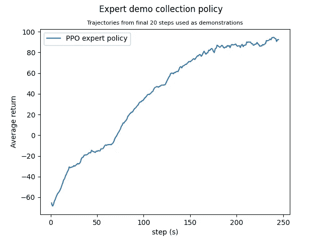](https://medium.com/@mugoh/140b685fd5b5)

*收集专家论证** 

## *结论*

*反向强化学习允许我们向代理演示期望的行为，并试图使代理从演示中推断出我们的目标。将这个目标与演示结合起来可以恢复奖励功能。然后，收回的奖励鼓励代理人采取与专家试图实现的意图相似的行动。*

*恢复意图的好处是代理学习达到目标的最佳方式——它不会盲目模仿专家的次优行为或错误。因此，与专家策略相比，iRL 承诺了更理想的性能。*

## *资源*

*反向 RL 知识库:[Github 上的 air](https://github.com/mugoh/rl-base/tree/master/rlbase/aiRL)*

*关于反向 RL 的更多方法，请看这些作品:*

*[1] C. Finn、P. Christiano、P. Abbeel 和 S. Levine。[生成对抗网络、逆向强化学习和基于能量的模型之间的联系](https://arxiv.org/pdf/1611.03852)，NIPS，2016。*

*[2] J. Fu，K. Luo，S. Levine，[用对抗性逆强化学习学习鲁棒报酬](https://arxiv.org/pdf/1710.11248)，2018。*

*[3] X .彭，a .金泽，s .托耶，p .阿贝耳，s .莱文，[变分鉴别器瓶颈:通过约束信息流改进模仿学习，逆 RL，和 GANs](https://arxiv.org/pdf/1810.00821)，，2019。*