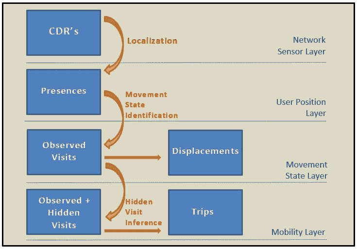
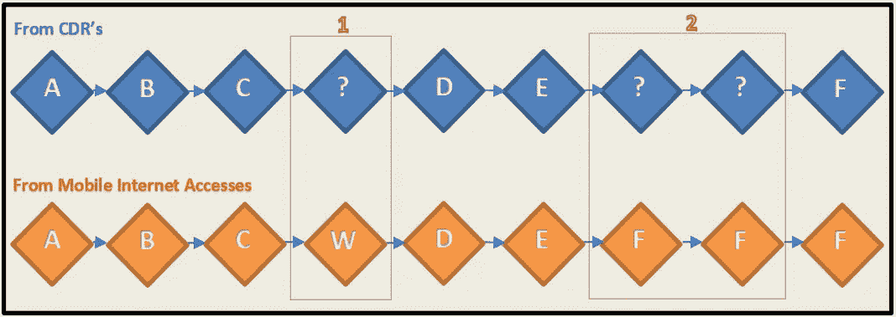
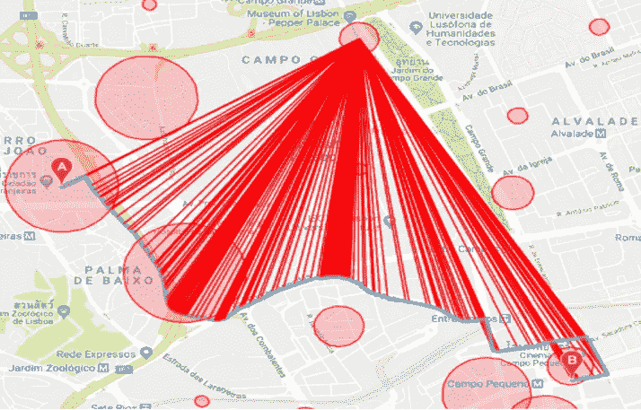
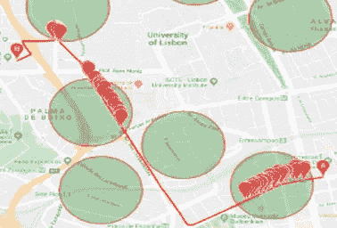

# 起点-终点流量和活动位置的推断

> 原文：<https://towardsdatascience.com/inference-of-origin-destination-flows-and-activity-locations-81f56fbe7c45?source=collection_archive---------18----------------------->

## 利用呼叫详细记录来推断移动性模式的一些主要技术的文献综述

移动建模的一个关键部分是推断用户的行程。当我们谈论旅行时，我们谈论的是在起点和终点之间的旅行，最终以一项活动结束。Calabrese 等人[1]探索了观察数据的使用，以计算这些 OD(起点-终点)流量。Wang 等人[2]做了同样的工作，但是使用了交通方式选择的概率、车辆占用率和呼叫详细记录。Yang 等人[3]表明，通过生成算法，如贝叶斯网和马尔可夫随机场分类，可以以合理的精度检测活动位置，如家、工作、购物、休闲和其他地方。

融合 cdr 和来自交通传感器的数据，Charisma 等人[4]能够开发 OD 矩阵。不同位置的交通流量计数用于验证起点-终点预测。为了确定真实的始发地-目的地，有必要对瞬时 OD 矩阵进行缩放，以匹配实际交通流。本研究的中心假设/限制在于:它忽略了“不同地点通话速率的异质性(例如，与使用固定电话线路的办公室相比，来往于火车站的通话可能更多，等等)。)".Augusto 等人[5]使用非监督学习算法，尝试从用户的 cdr 推断用户的出行，然后从出行行为中描述人口的移动性(例如，通勤者的百分比是多少，或者他们中有多少人在离家很远的地方工作)。

赵等人[6]的研究引人入胜，因为它提出了一种监督学习技术来获得用户出行的更详细特征。这暗示了一个被那些试图描述用户旅行的起点和终点的人严重忽视的问题。我们正在讨论检测除了那些通过查看 cdr 可以看到的地方之外，是否还有未知的访问过的地方。其解决方案依赖于 CDRs、SMSs 和移动互联网接入之间的数据融合技术，以形成标记数据，这些数据将成为训练和测试分类器的基础。所使用的数据集包含了 2013 年 11 月中国某城市 300 万用户的记录。然而，只有 100，000 名用户被随机选中。随着他们进行数据融合，这个数字下降得更多。这是因为只对使用移动互联网接入并在一个月内至少拨打/接收一次电话/短信的用户感兴趣。

整篇论文评估了三种不同方法的性能:人工网络、支持向量机和逻辑回归。本文不仅有助于更深刻地理解如何从移动计费数据中更准确地提取出行，而且有助于解决使用 CDR 数据获取用户路线的一个众所周知的问题——时间稀疏性。在大多数情况下，用户不会在他访问的每个位置拨打或接听电话，因此从 cdr 中提取不现实和不完整行程的概率很高。因此，提出了一个框架，其方案如图 1 所示。

图 1 —赵等人[6]使用的框架的总体方案。这个人物是他们改编的。

在这种情况下，我们有四层，正如我们在上面的图像右侧看到的那样(*网络传感器、用户位置、移动状态*和*移动性*)。第一层本质上是我们可以从 *CDRs* 获得的信息:被观察用户收到或发出呼叫的位置和时间。在一些*本地化*过程封装了子采样方法和位置不确定性和误差的处理之后，我们提出了用户*存在*，它是*用户位置层*的一部分。之后，是时候识别活动停止点了——也被作者命名为*观察到的访问*。每次两个连续的*观察到的访问*发生在不同的位置，我们就有一个*位移*。这两个元素的识别是通过一个*运动状态识别*来完成的，它把我们弹射到*运动状态层*。最后，本文更大的贡献——考察是否在每一次置换中我们都有一次隐藏的访问。这是通过前面提到的机器学习算法进行的，并构成了*隐藏访问推理*过程。一旦我们得到了未知站点和观测站点，我们就形成了 OD 出行，组成了我们的*移动层*。

将*隐藏访问推理*视为二元分类。对于位置 A 和 B 之间的每个位移:A)有一个隐藏的访问过的地方，或者 B)没有隐藏的访问过的地方。并非所有观察到的访问都进行了分析，而只是位移，这构成了本研究的局限性。这是一个限制，因为作者假设用户在两个(和相同的)观察到的访问站点之间的时间内不能访问任何不同的地方。因此，基本思想是使用 cdr 和 SMS 记录来提取特征，而来自移动互联网接入的数据被用作标签，作为地面真实数据。图 2 描绘了同一用户在一段时间内所做的位移序列，但是通过同一时间不同类型的数据(来自 cdr 和移动互联网访问)来观察。正如我们所看到的，有两种类型的用户转移需要更深入的分析。在情况 1 中，当通过 CDR 数据看到用户从 C 移动到 D 时，我们注意到移动互联网访问数据(MIAD)封装了隐藏的访问位置(W)。然而，在情况 2 中，尽管 MIAD 现有两个额外的记录，这些记录给出了流离失所目的地的同一地点(F)。因此，在这种情况下，不会显示额外的访问位置。

图 2 —两个不同数据源在相同时间窗内访问过的地点。该图改编自赵等人的工作[6]。

在此，从 cdr 中提取和选择几个特征:位移的空间特征、时间特征和用户的个人特征(例如，语音呼叫的数量或活动呼叫小时的数量)。测试了四种方法:一个简单的规则，假设没有隐藏的访问过的地方；逻辑回归；SVM(支持向量机)和人工神经网络(人工神经网络)。所有三个分类器都可以将 OD 旅行的正确分类提高 10%左右，无论是否隐藏了访问过的地点(与原始规则相比)。通过使用人工神经网络，有可能将该值增加到最大值 11.1%。

Bayir 等人[7]的研究是试图检测 OD 旅行中隐藏访问的极少数研究中的另一个。然而，他们试图施加时间约束或阈值。例如，如果两个不同的观察位置之间经过的时间高于某个阈值(例如 10 分钟或 1 小时)，则假设在这两个不同的观察位置之间存在未知的访问位置。事实上，这是一个非常幼稚的解决问题的方法，因为我们最终会得到过多的与现实不符的旅游景点。原因是我们假设用户每隔 x 分钟(其中 x 是我们的阈值)强制性地访问至少一些新站点。因此，理论上，统计学习方法可以超越我们在这种情况下可以使用的任何启发式方法的效率。

在这个问题上，另一个值得注意的研究工作来自 Demissie 等人[8]。这项研究假装也使用 cdr 来估计用户从塞内加尔出发的旅行的起点和目的地。通勤和其他不规则的行程是推断出来的。将塞内加尔作为案例研究的国家很有吸引力，因为它提供了一个机会来展示交通基础设施薄弱的国家如何利用移动运营商的数据来推断移动行为，从而改善交通基础设施。为了辨别像工作场所和家庭这样的重要场所，他们分别检查了在以前定义的工作时间(从早上 8 点到晚上 7 点)和非工作时间(从晚上 7 点到早上 8 点)(总是在工作日)有呼叫活动的位置。

尽管前景看好，这项研究还是有一些局限性。为了逃避处理隐藏的访问地点，推断的地点是在地区一级。因此，没有提供对应于家庭或工作场所的蜂窝塔的精确位置。除了这种不方便，这只是推断跨地区的通勤位移；没有获得详细的通勤路线。此外，数据可以具有更大的时间窗口。虽然 cdr 涉及适当数量的用户(900 万)和记录(4300 万)，但只分析了 2013 年 1 月的 cdr。

Jundee 等人[9]的论文也是值得注意的。一旦它提出两种不同的技术来推断通勤旅行中的确切路线(家到工作场所和工作场所到家)，它就是创新的。为了正确检测这些通勤位置，进行了二次采样，因此“每个用户在早上通勤时间(上午 7 点-11 点)必须至少有 100 个连接，在晚上通勤时间(下午 3 点-7 点)必须有 100 个连接。”作者使用谷歌地图 API 来推断可能的通勤路线。利用之前估计的工作场所和家庭位置，他们让谷歌地图平台生成它认为每个用户最有可能的通勤方向。从这里开始，只需要应用一个方法，使我们能够在 API 建议的选项中选择正确的路线。现在正是需要前面提到的两种技术的时候。第一种是*最小距离*法。因此，假设我们正在计算从家到工作场所的确切路线，然后我们继续寻找在早晨激活的呼叫和各自的基站。其次，我们必须计算每条路线的 google API 给出的每个航路点与激活的每个基站之间的欧几里德距离。之后，我们对每个航点和每个基站获得的所有欧几里德距离求和，并除以航点的数量。之后，我们应该对 Google Maps API 建议的所有路线重复这个过程。最后，我们选择具有先前计算的和的较小值的路径。

在这一过程中，必须解决一个重要问题。API 给出的路点沿路线的距离并不相等，并且路径的路点数量可能不同。实际上，这意味着，例如，我们将拥有不同的点密度，这将导致计算不同数量的距离，从而扭曲结果。图 3 说明了这个问题。这表明我们试图计算航路点和基站之间的距离，因此，在路线的弯曲部分有更密集的红色区域。首先，添加一个网格并将其用作插值和外推航路点的参考。这个网格允许它们之间的空间标准化。对于每个路点，我们创建一个新的数据点，它将是单元网格的质心。图 4 举例说明了这个过程。

图 3——*最小距离*方法的直观表示。红线代表每个航路点和基站之间的欧几里德距离。每个红色圆圈代表检测到呼叫活动的基站。该图最初来自 Jundee 等人[9]。

图 4 —航路点插值和相应网格的可视化。该图最初来自 Jundee 等人[9]。

作者提出的第二种替代方法是*最大重叠*的方法。调用 Google Maps API 和插入给定点的步骤仍然存在。然而，我们不需要计算欧几里得距离，而是需要查看在路线中有多少个点落入基站覆盖区域。从图 5 中可以看出，具有更多点的路线是被选择的路线。

图 5-最大重叠方法。在绿色部分，我们有一个基站，可以检测到呼叫活动。该图最初来自 Jundee 等人[9]。

尽管这两种技术很有前途并且令人耳目一新，但是它们没有考虑每个基站位置的用户的呼叫频率。令人感兴趣的是，对活动较少的位置给予较低的重要性，而对那些呼叫活动被更定期地登记的位置给予较高的权重。

# 参考

[1] F. Calabrese 和 G. Di Lorenzo，“使用移动电话定位数据估计起点-终点流量”，第 36–44 页，2011 年。

[2] U. Areas，“了解城市地区的道路使用模式”，2012 年。

[3] Y. Yang，P. Widhalm 和 M. C. Gonz，“使用稀疏手机数据提取和标记移动性序列”，第一期，第 4276-4277 页。

[4] F. Charisma 和 M. C. Development，“利用移动电话通话数据开发起点-终点矩阵”麻省理工学院的教员公开发表了这篇文章。请分享引用访问 Citable 链接详细条款基于模拟的方法，“2018。

[5] G .奥古斯托*等*，“工作之旅:使用 CDR 估计海地主要大都市地区通勤模式的起点和终点”， *Dev .英语。*，第 3 卷，2017 年 10 月号，2018 年第 133–166 页。

[6] Z. Zhao，J. Zhao，H. Koutsopoulos，“基于监督统计学习的使用详细记录数据的个人级出行检测”，2016 年。

[7] M. Bayir、M. Demirbas 和 N. Eagle，“移动性分析器:发现移动用户配置文件的框架”，2014 年 3 月号。

[8] M. G. Demissie、F. Antunes 和 C. Bento，“利用移动电话数据推断始发-目的地流量:塞内加尔案例研究”，2016 年 7 月号。

[9] T. Jundee，“使用 CDR 数据推断通勤流量:葡萄牙里斯本的案例研究”，2018 年。