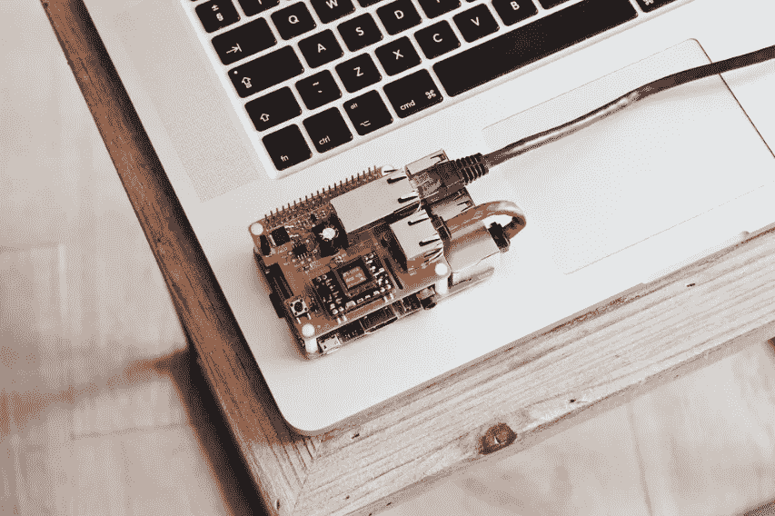
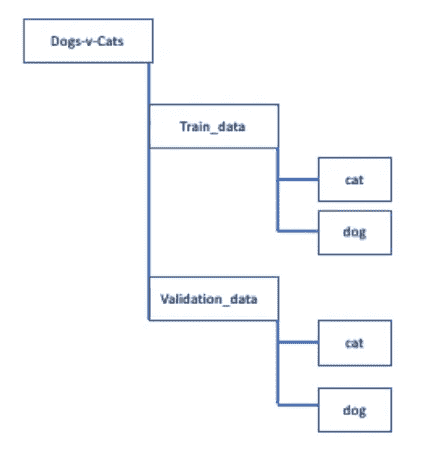
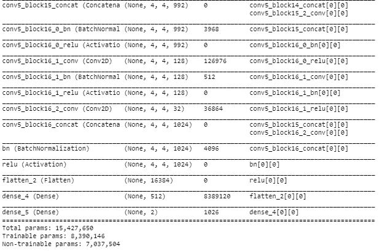
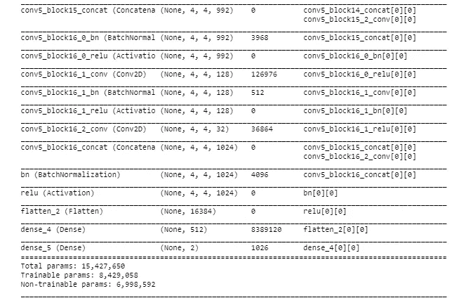
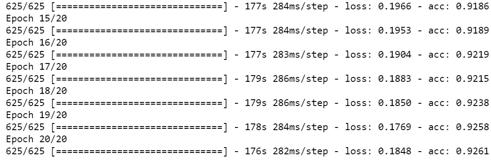
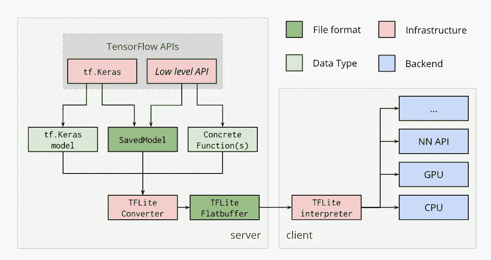
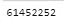
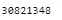
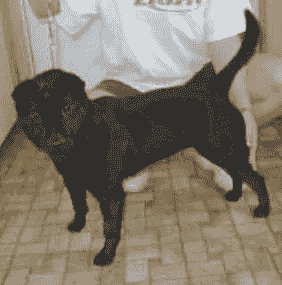
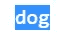

# 来自 TF Lite 模型的推论——基于预训练模型的迁移学习

> 原文：<https://towardsdatascience.com/inferences-from-a-tf-lite-model-transfer-learning-on-a-pre-trained-model-e16e7c5f0ee6?source=collection_archive---------28----------------------->

## 在预先训练的 Tensorflow 模型上使用迁移学习创建一个 Tf Lite 模型，优化它，并运行推理。

*在本文中，您将学习使用预先训练的模型，应用迁移学习，将模型转换为 TFLite，应用优化，并从 TF Lite 模型中进行推理。*



由[路易·里德](https://unsplash.com/@_louisreed?utm_source=unsplash&utm_medium=referral&utm_content=creditCopyText)在 [Unsplash](/s/photos/raspberry-pi?utm_source=unsplash&utm_medium=referral&utm_content=creditCopyText) 上拍摄

**先决条件:**

[tensor flow Lite 的基本介绍](https://medium.com/@arshren/a-basic-introduction-to-tensorflow-lite-59e480c57292)

[猫狗数据集](https://www.kaggle.com/c/dogs-vs-cats/data)

张量流 2.0

## 创建数据集

我已经下载了数据集，并按照下面的结构解压文件。

用于提取数据并按照以下结构创建数据的 Python 代码在此处[可用](https://github.com/arshren/TFLite/blob/master/Transfer%20Learning%20with%20TFLite-Copy1.ipynb)。



**导入所需的库**

```
**from tensorflow.keras.models import Sequential
from tensorflow.keras.layers import Dense, Conv2D, Flatten, Dropout, MaxPooling2D
from tensorflow.keras.preprocessing.image import ImageDataGenerator, img_to_array, load_img
from tensorflow.python.keras.applications import imagenet_utils
from tensorflow.python.keras.layers import Dense,GlobalAveragePooling2D
from tensorflow.keras.applications import   DenseNet121
from tensorflow.python.keras.applications.densenet import preprocess_input
from tensorflow.keras.models import Model**
```

**设置培训的关键参数**

```
**BASE_PATH = 'Data\\dogs-vs-cats\\train\\'
TRAIN_PATH='Data\\dogs-vs-cats\\train_data\\'
VAL_PATH='Data\\dogs-vs-cats\\validation_data\\'****batch_size = 32 
epochs = 60
IMG_HEIGHT = 150
IMG_WIDTH = 150**
```

**重新缩放并对训练图像应用不同的增强**

```
**train_image_generator = ImageDataGenerator(                                                rescale=1./255,                                              rotation_range=45,                                                width_shift_range=.15,                                                height_shift_range=.15,                                                horizontal_flip=True,                                                zoom_range=0.3)**
```

**重标验证数据**

```
**validation_image_generator = ImageDataGenerator(rescale=1./255)**
```

**为训练和验证数据集生成批量归一化数据**

```
**train_data_gen = train_image_generator.flow_from_directory(batch_size = batch_size,                                                     directory=TRAIN_PATH,                                                     shuffle=True,                                                     target_size=(IMG_HEIGHT, IMG_WIDTH),                                                     class_mode='categorical')****val_data_gen = validation_image_generator.flow_from_directory(batch_size = batch_size,                                                              directory=VAL_PATH,                                                              target_size=(IMG_HEIGHT, IMG_WIDTH),                                                              class_mode='categorical')**
```

## 在预先训练的模型上应用迁移学习

您可以使用任何一种[预训练型号](https://keras.io/api/applications/)。我用过 DenseNet121，有 427 层。

```
# Create the base model from the pre-trained model MobileNet V2
**base_model = tf.keras.applications.DenseNet121(
input_shape=(IMG_WIDTH, IMG_HEIGHT,3),                                               include_top=False,                                               weights='imagenet')**
```

冻结基础预训练模型的所有权重，并在预训练模型的顶部添加几个层

```
**base_model.trainable = False
x=base_model.output
x=Flatten()(x)
x=Dense(512,activation='relu')(x) 
output=Dense(2,activation='softmax')(x) 
model=Model(inputs=base_model.input,outputs=output)
model.summary()**
```



您可以看到预训练模型的权重是不可训练的，只有添加的层权重是可训练的。

您可以使预训练模型权重的几个层成为可训练的，以帮助学习自定义数据集，从而获得更高的准确性。

```
**TRAINABLE_LAYERS= len(model.layers)-len(base_model.layers)+5
print(TRAINABLE_LAYERS)
for layer in model.layers[:-TRAINABLE_LAYERS]:
    layer.trainable=False
for layer in model.layers[-TRAINABLE_LAYERS:]:
    layer.trainable=True**
```



您可以看到可训练参数的数量增加了，这也将增加训练时间。

**在自定义数据集上编译和训练模型**

```
**model.compile(loss='categorical_crossentropy', optimizer=tf.keras.optimizers.RMSprop(lr=2e-5), metrics=['acc'])****epochs=20
step_size_train=train_data_gen.n//train_data_gen.batch_size
history =model.fit_generator(generator=train_data_gen,
                   steps_per_epoch=step_size_train,
                   epochs=epochs)**
```



在模型被编译和训练之后，我们现在可以开始将模型转换为 TF Lite，如下所示。

**将预训练的转移学习模型转换为 TF Lite**



来源:https://www.tensorflow.org/lite/convert/index

训练完模型后，您现在需要保存模型。

**保存的模型将模型的架构、权重和偏差以及训练配置序列化到一个文件中。保存的模型可以很容易地用于共享或部署模型。**

```
#save your model in the SavedModel format
**export_dir = 'saved_model'
tf.saved_model.save(model, export_dir)**
```

SavedModel 包含一个完整的 TensorFlow 程序，包括权重和计算。

**saved_model** 是保存在 ***export_dir，*** 上的元图，使用 **lite 转换为 TFLite 模型。TFLiteConverter** 。

```
# Converting a SavedModel to a TensorFlow Lite model.
**converter = tf.lite.TFLiteConverter.from_saved_model(export_dir)
tflite_model = converter.convert()**
```

将平面缓冲区 TFLIte 模型写入二进制文件，当前大小为 61 MB。

```
open("model_tl.tflite", "wb").write(tflite_model)
```



## 优化模型

边缘模型需要是轻量级的，并且具有低延迟来运行推理。轻量级和低延迟模型是通过减少预测所需的计算量来实现的，这是通过对 TF Lite 模型应用量化优化来实现的。

*量化降低了用于表示张量流模型不同参数的数字的精度，以使模型轻量化。*

**量化应用于权重和激活。**

```
**optimize="Speed"
if optimize=='Speed':
    converter.optimizations = [tf.lite.Optimize.OPTIMIZE_FOR_LATENCY]
elif optimize=='Storage':
     converter.optimizations = [tf.lite.Optimize.OPTIMIZE_FOR_SIZE]
else:    
    converter.optimizations = [tf.lite.Optimize.DEFAULT]**#reduce the size of a floating point model by quantizing the weights to float16
**converter.target_spec.supported_types = [tf.float16]
tflite_quant_model = converter.convert()**#save the quanitized model toa binary file
**open("model_quant_tl.tflite", "wb").write(tflite_quant_model)**
```



量化 TF Lite 模型的大小

这里，我们针对速度优化了模型，然后将 **32 位浮点转换为 16 位浮点**，以减小模型的大小。

> 在应用优化后，TF Lite 型号的 61 MB 现在减少到 30MB。

优化后的模型可以部署到任何我们需要的边缘设备***TF lite _ runtime . interpreter***

## 在边缘运行推论

**用优化的加载解释器。包含模型的执行图和分配张量的 tflite 模型**

```
**import tflite_runtime.interpreter as tflite**
# Load TFLite model and allocate tensors.
**interpreter = tf.lite.Interpreter(model_content=tflite_quant_model)**#allocate the tensors **interpreter.allocate_tensors()**
```

得到输入和输出张量。

```
#get input and output tensors
**input_details = interpreter.get_input_details()
output_details = interpreter.get_output_details()**
```

**对输入数据进行预处理**

我们想要进行推断的输入图像需要与模型的输入数据相匹配。

读取图像，解码为张量并将图像预处理为所需的大小，转换为 float16 并添加批量维度

```
**import cv2**# Read the image and decode to a tensor
**image_path='Data\\dogs-vs-cats\\test1\\151.jpg' 
img = cv2.imread(image_path)
img = cv2.resize(img,(IMG_WIDTH,IMG_HEIGHT))**#Preprocess the image to required size and cast
**input_shape = input_details[0]['shape']
input_tensor= np.array(np.expand_dims(img,0), dtype=np.float16)**
```

下面是我们试图预测的图像



**狗对猫\\test1\\151.jpg**

**运行推论**

通过设置张量将输入数据指向第 0 个数组以输入张量。通过调用解释器来运行推理

```
*#set the tensor to point to the input data to be inferred*
**input_index = interpreter.get_input_details()[0]["index"]
interpreter.set_tensor(input_index, input_tensor)***#Run the inference*
**interpreter.invoke()
output_details = interpreter.get_output_details()**
```

**为我们的图像分类解释输出张量**

```
**output_data = interpreter.get_tensor(output_details[0]['index'])
results = np.squeeze(output_data)
top_k = results.argsort()****for label, idx in train_data_gen.class_indices.items():  
    if top_k[idx]==1:
        print("Prediction: " label)**
```



输出是狗。

[TF Lite 推论的 Github 代码](https://github.com/arshren/TFLite/blob/master/Transfer%20Learning%20with%20TFLite-Copy1.ipynb)

**结论:**

对预训练模型使用自定义或预训练或应用迁移学习，保存模型，将模型转换为 TFLite 平面缓冲文件，针对延迟或存储进行优化，然后使用 TF Lite 解释器进行推理。