# 推断统计学:数据分析

> 原文：<https://towardsdatascience.com/inferential-statistics-data-analysis-e59adc75c6eb?source=collection_archive---------7----------------------->

## 统计学是数据科学中的基本主题之一，它提供了更深入了解数据的工具和方法。

图片由[皮克斯拜](https://pixabay.com/?utm_source=link-attribution&utm_medium=referral&utm_campaign=image&utm_content=4664726)的 Gerd Altmann 提供

数据科学家必须对统计学有更深入的理解，才能对给定的数据进行定量分析。尤其是构建**机器学习算法**，统计学发挥了重大作用。统计数据主要有两种类型。

*   描述统计学
*   推理统计学。

在之前的文章 [**探索性数据分析**](/exploratory-data-analysis-eda-python-87178e35b14) 中，“我们所做的所有分析，都是**描述性统计**。使用描述性统计，我们只是描述数据中存在或显示的内容。我们已经了解了如何使用各种方法和可视化技术来发现给定数据中的模式。

通过**推理统计**，我们试图得出超越数据的结论。有时，我们必须处理大量数据进行分析，这可能会花费太多的时间和资源。在这些情况下，我们使用推断统计。

## 推理统计:

推断统计学通过考虑原始数据中的样本数据，对大量数据进行推断和预测。它使用概率来得出结论。

从样本数据中“**推断出**见解的过程称为“**推断统计学**”

> “**推理统计学**”的最佳现实例子是，通过天气预报预测下个月的降雨量。

为了理解推断统计，我们必须对**概率中的以下基本主题有基本的了解。**

*   概率的基本定义
*   概率的乘法法则
*   概率的加法法则
*   nCr(组合)

我们可以在这里练习基本动作，

1.  数学很有趣
2.  Mathopolis

## **随机变量:**

让我们举一个赌场吃角子老虎机的真实例子。赌场如何确保他们的老虎机长期不赔钱？

这很简单。他们使用**概率**。

为了理解这一点，我们来玩个游戏，

1.  拿一个装有 **3 个红色球**和 **2 个蓝色球的袋子。**
2.  游戏是这样的，我们必须从袋子里挑选一个球，记下它的颜色，然后把球放在袋子里，再从袋子里挑选一个球，记下它的颜色，然后把它放进去。重复此过程共 **4 次。**这整个过程是一套。
3.  进行该实验 75 次，即 **75 组**。
4.  条件是，如果我们连续抽取**红球四次**，即集合包含所有红球，那么我们将获得＄**150**。否则，我们将不得不向经销商支付 10 美元。

看看我们玩这个游戏，庄家长期是赢还是亏。为了理解这一切，我们将分三步来解决这个问题。

*   找出所有可能的结果。
*   求每个结果的概率。
*   使用概率，估计利润/损失。

**1。可能的结果**

让我们看看，如果我们从袋子里抽出一个球四次，我们能得到的所有可能的结果是。

*   RRRR
*   RBRR，RRBR，RRRB
*   BBRR、BRBR、巴西、RBBR、巴西、RRBB
*   BBBR，BBRB，BRBB，RBBB
*   双侧束支传导阻滞

总共有 16 种可能的结果。

**2。每种结果的概率**

明智的做法是**量化**结果，计算概率。通过使用**“随机变量”，**我们将量化结果。

**随机变量:**

*   **“X”**表示随机变量。
*   “X”的定义取决于我们的问题陈述。这里，我们感兴趣的是从袋子中抽出的红球的数量。

**X =抽取的红球数量。**

用 X 表示的可能结果是，

*   RRRR——X = 4
*   RBRR，RRBR，RRRB--X = 3
*   BBRR、BRBR、巴西、RBBR、巴西、RRBB--X = 2
*   BBBR，BBRB，BRBB，RBBB--X = 1
*   BBBB——X = 0

因此，基于 X 值，我们可以说，如果 X=4，玩家赢得游戏，而对于剩余的所有 X 值，玩家输掉游戏。

在进行了 75 次实验后，将值存储在 excel 中，让我们将结果绘制成柱状图，我们会得到类似这样的图表，

这些值看起来像这样，

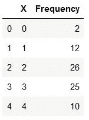

现在，表格的直方图看起来像这样，

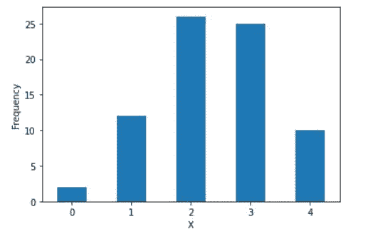

概率的定义是

**概率(P) =(有利结果)/(结果总数)**

现在，让我们根据上图找出不同 X 值的概率。

P(X = 0)= 2/75 = 0.027
P(X = 1)= 12/75 = 0.160
P(X = 2)= 26/75 = 0.347
P(X = 3)= 25/75 = 0.333
P(X = 4)= 10/75 = 0.133

如果我们用表格来表示它们，它看起来像这样

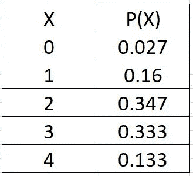

概率分布

这张表被称为**概率分布。**

**3。使用概率，估计利润/损失**

既然我们现在知道了 X=0 到 4 的概率，让我们来计算一个玩家在一场游戏中抽取的红球总数。

0 红球玩家数= P(X = 0)* 75 = 2.025
1 红球玩家数= P(X = 1)* 75 = 12
2 红球玩家数= P(X = 2)* 75 = 26.025
3 红球玩家数= P(X = 3)* 75 = 24.975
4 红球玩家数= P(X=4)*75 = 9

于是，我们大概看到了游戏中 75 位玩家抽出的 **178.875 个红球**。

红球平均数= 178.875/75 = 2.385。

换句话说，我们可以期待一个玩家每局抽 **2.385 个红球**。该平均值称为**预期值**。

从数学上讲，对于一个随机变量 X，它可以取值 x1，x2，x3，……..，xn，期望值(EV)由下式给出:

**EV(X)= x1∫P(X = x1)+x2∫P(X = x2)+x3∫P(X = x3)+………..+xn∫P(X = xn)**

对于我们的游戏，n=4，

EV = 1 * 0.16+2 * 0.347+3 * 0.333+4 * 0.133 = 2.385。

如果我们还记得的话，在我们的游戏中，如果 X=4 ，玩家将获得**150 美元，而对于**剩余的所有 X** 值，玩家需要支付**10 美元**。**

现在，玩家得到 150 美元的概率等于玩家抽到四个红球的概率。

这意味着，对于剩余的所有情况，玩家必须支付 10 美元。

所以，X 可以取+150 和-10 的值

P(X=+150) = P(4 个红球)= 0.133
P(X=-10) = P(0、1、2 或 3 个红球)= 0.027+0.160+0.347+0.333 = 0.867

现在，X 的**期望值**(其中 X 是玩一次游戏后赢得的钱)

EV(X)= 150 * 0.133+(-10)* 0.867 =+11.28

这意味着，从长远来看，玩家平均可以从这场游戏中赢得+11.28，这对玩家来说非常好，但这种模式对游戏组织者来说是行不通的，因为他们正在赔钱。

如果赌场想要赚钱，他们需要确保**玩家的期望值**为负**。**为此，组织者不得不改变奖金，比如获胜的玩家可以获得**100 美元**的奖金，如果玩家输了，可以获得**25 美元**的奖金。

现在，EV(X)= 100 * 0.133+(-25)* 0.867 =-8.375

从长远来看，这种模式对赌场是有利可图的。

到目前为止，我们已经看到了如何通过实验来计算概率。在下一节中，我们将看到如何在没有实验的情况下计算概率。

## 从理论上计算概率

如果我们回忆一下问题陈述，袋子里有 **3 个红球**和 **2 个蓝球。**

得到 1 个红球的概率=(红球总数)/(球总数)= 3/5 = 0.6

同样的，

得到 1 个蓝球的概率= 2/5 = 0.4

计算一局抽中红球的概率，即，

对于 X=0，P(4 蓝)= 0.4*0.4*0.4*0.4 = 0.0256

对于 X=1，P(1 红 3 蓝)= 0.6*0.4*0.4*0.4，但是对于 1 红 3 蓝有 4 种组合，
最后，对于 X=1，P(X) = 4(0.6*0.4*0.4*0.4) = 0.1536

对于 X=2，P(X)= 6(0.6 * 0.6 * 0.4 * 0.4)= 0.3456
对于 X=3，P(X)= 4(0.6 * 0.6 * 0.6 * 0.4)= 0.3456
对于 X=4，P(X) = 0.6*0.6*0.6*0.6 = 0.1296

让我们看看实验和理论概率分布的直方图是什么样的，

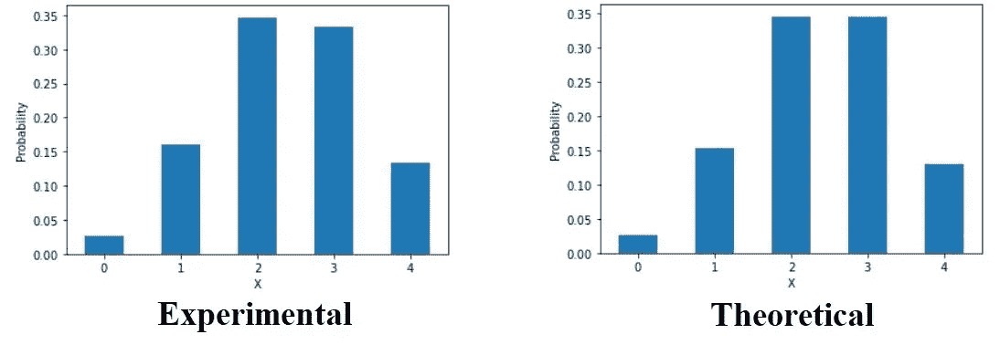

作者图片

正如我们所看到的，概率的理论(计算)值与实验值相对接近。存在微小的差异是因为进行的实验数量很少。

## 二项式概率分布:P(X=r)

现在，让我们试着把上面的问题再推广一些。假设从袋子里抽出一个红色球的概率= P。现在，从袋子里抽出一个蓝色球的概率= 1-P。

现在，概率分布将会是，

对于 X=0，P(4 蓝)= (1-P)⁴
对于 X=1，P(1 红 3 蓝)= 4*P*(1-P)
对于 X=2，P(2 红 2 蓝)= 6*P *(1-P)
对于 X=3，P(3 红 1 蓝)= 4*P *(1-P)
对于 X=4，P(4 红)= P⁴

如果我们仔细观察上述概率值，我们可以观察到某种类型的公式，

公式看起来像这样，

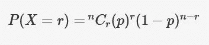

二项式概率公式

这里，

n =总试验次数
p =成功概率
r = n 次试验后的命中次数

但是，我们应该使用二项分布，只有当它遵循这三个条件。

1.  这个问题应该有固定的试验次数。
2.  每次试验应该只有两种结果——要么成功，要么失败。
3.  在所有的试验中，成功的概率应该是相同的。

这种二项式概率分布是离散随机变量中非常常见的一种概率分布。

## 累积概率:F(x)

X 的累积概率用 **F(x)表示。**定义为**一个变量小于或等于 x 的概率**。

F(x) = P(X≤x)

所以，对于我们游戏的理论概率分布，如果我们计算 F(3)，它将是，

*F(3)= P(X≤3)= P(X = 0)+P(X = 1)+P(X = 2)+P(X = 3)= 0.8704*

累积概率在连续概率分布中更有帮助。

## 连续概率分布

到目前为止，我们已经看到了概率在离散随机变量中的作用。现在，让我们看看连续随机变量中的概率函数。

如果一个随机变量可以从一个数据中取无限个值，则称为**连续随机变量**。

例如，一个衡量雇员通勤时间的随机变量是连续的，因为有无限多的可能性可以发生。

由于时间是一个连续变量，随机变量取一个精确值的概率为 0。所以，为了计算概率，我们不取特定的值，而是取区间值。

假设我们必须计算员工每天通勤到办公室所花时间的概率，我们已经进行了一项调查，并有如下所示的概率值。

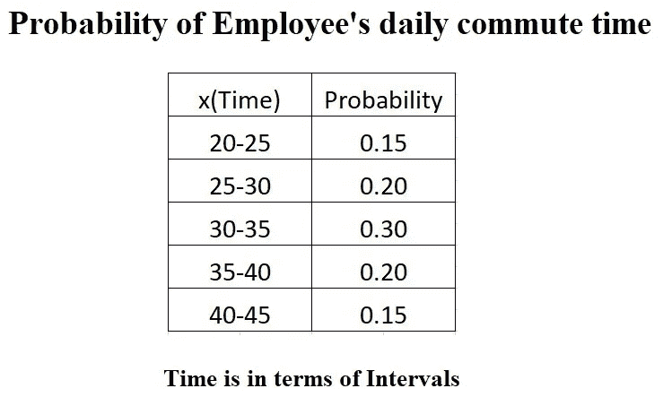

有了上面的概率值，我们现在可以找到如下的累积概率值:

x = 30 的累积概率为，
F(30)= P(X≤30)= P(0<X<20)+P(20<X<25)+P(25<X<30)
F(30)= 0+0.15+0.20 = 0.35

所以，给定概率值的累积概率看起来像，

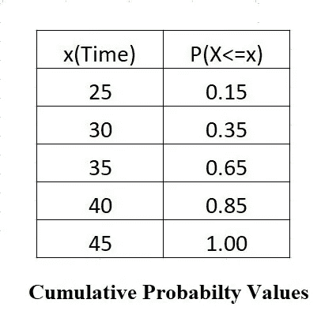

如果我们在一个图表中绘制这个累积值，它被称为**累积分布函数(CDF)** 图表使用下面的 python 代码，

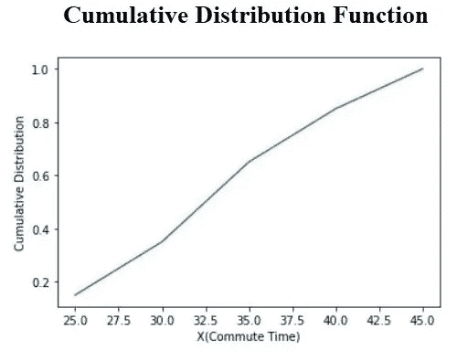

在 CDF 图表中有两点需要记住。

1.  这些是单调非减函数。
2.  Y 轴上的最大值应该总是 1。

我们也可以用区间来绘制概率图。

这是概率密度图的样子，

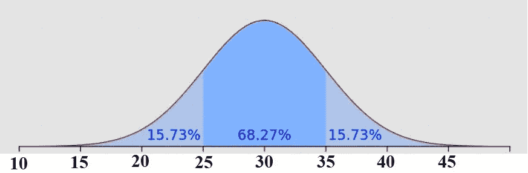

来源— [维基百科](https://en.wikipedia.org/wiki/Probability_density_function)

我们可以从上图中观察到，概率区间下的面积等于**该区间的累积概率**。

如果在一个连续的随机变量中，所有概率密度的值对于所有可能的值都相等，则称为**均匀分布。**

此外，在现实生活中，pdf 是最常用的，因为它比 CDF 更容易看到 pdf 的模式。

## 正态分布

最常用的一种 PDF 是正态分布/钟形曲线/高斯分布。

**正态分布**图是这样的，

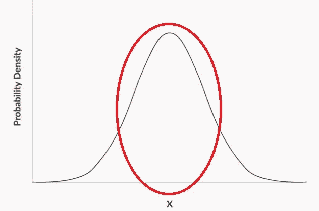

作者图片

正如形状所示，大多数值通常位于该分布的中心附近。分布也将围绕中间对称。正态分布通常出现在自然发生的现象中。

正态分布也有助于理解数据分析的一些高级概念，如**中心极限定理(CLT)** 。我们将在下一篇文章中了解 CLT。

让我们详细研究一下正态分布。

1.  分布在中间对称，称为均值(μ)。
2.  在正态分布中，平均值、中值和众数是相等的。这意味着分布在中位数和众数上也是对称的。

正态分布有一个**1–2–3 规则，遵循以下三个条件:**

1.  值在“ **μ-σ** ”和“ **μ+σ** ”之间的概率在 68%左右。
2.  值在“ **μ-2σ** ”和“ **μ+2σ** ”之间的概率在 95%左右。
3.  值在“ **μ-3σ** ”和“ **μ+3σ** ”之间的概率约为 99.7%。

这里**【μ】**是**的平均值，****【σ】**是**的标准差。**

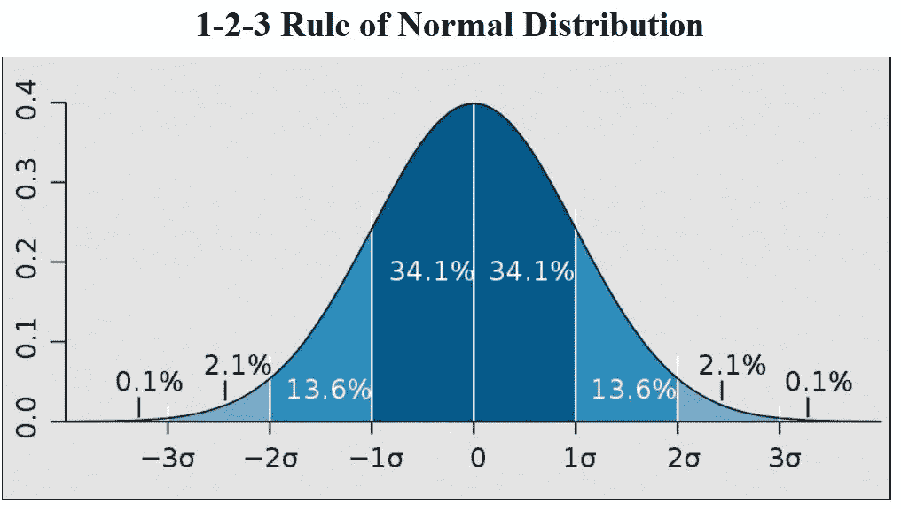

来源— [维基百科](https://en.wikipedia.org/wiki/Normal_distribution)

这意味着分布的尾部非常小。在正态分布曲线中，大多数值位于“ **μ-3σ** 和“ **μ+3σ** 之间。

举个例子，如果 **μ = 30，**和 **σ = 5，**取值在 25 和 45 之间的概率将是，

P(25

Now, the probability for the same values between 25 and 50 will be,

P(25

We know that from 1–2–3 Rule, the values are evenly distributed at Mean(μ), i.e., **50%的值≤ μ** 和 **50%的值为> μ。**

这意味着，如果 P(μ-3σ < X < μ+3σ) = 99.7%, then P(X

Finally,

P(25

This is how we calculate, the probability values if the distribution follows Normal Curve.

## Standard Normal Distribution

As we have seen, it does not matter what the values of **μ** 和 **σ** 为，我们感兴趣的是 **X** 距离均值(μ)的标准差(σ)有多远。

比方说， **μ = 30，**和 **σ = 5，**和 **X=43.25。**

我们可以说 X 距离μ8.25 个单位，即，

用标准差来说，我们可以说 **X** 距离均值**1.65σ**(**μ**)。

这个 **1.65** 的值叫做我们的随机变量的**Z——得分**。Z 得分可通过以下方式计算:

Z = (X-μ)/σ

这个变量 **Z** 称为**标准化正态变量**

所以，现在关于 Z 的 1–2–3 规则是，

1.  P(-1
2.  P(-2
3.  P(-3

The Standard Normal Distribution(Z) graph looks like this,

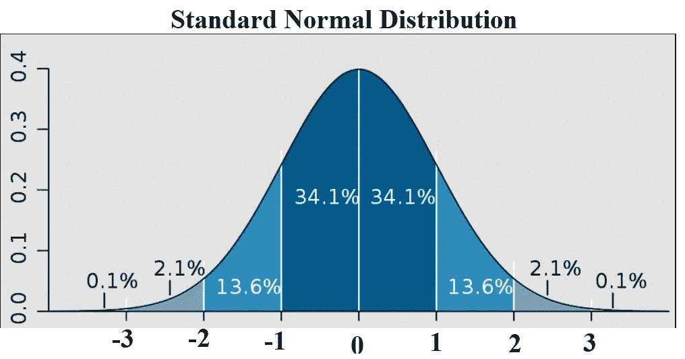

Source —[维基百科](https://en.wikipedia.org/wiki/Normal_distribution)

正如我们所见，标准化正态变量( **Z** )是一个比正态分布变量(X)更能提供信息的变量。

我们可以从这个表中找到 Z 的所有概率值[这里](http://www.z-table.com/)。

Z 评分表的样本是这样的，

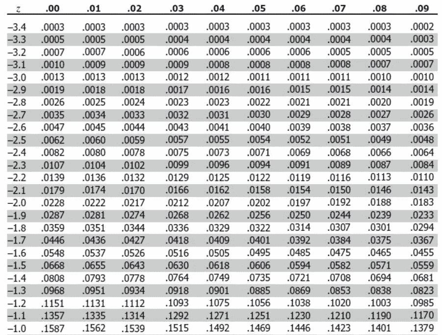

来源— [Z 工作台](http://www.z-table.com/)

我们来举个例子；我们想求正态分布中随机变量在 1.65 个标准差以内的概率？

也就是说，我们要求 P 的值(μ-1.65σ < X < μ+1.65σ).

In terms of Z, we need to find the value,

P(-1.65

If we look into the table, w can find the values of,

P(Z=1.65) = 0.9505
P(Z=-1.65) = 0.0495

现在，概率= 0.901 = 90%

因此，大约 90%的值位于 1.65 个标准偏差之间。

这就是我们如何从表中计算 Z 值，并找出概率。

# 结论

这些是推断统计学中的主题，每个数据科学家都应该具备基本的知识。使用这个正态分布和标准正态分布概念，我们将了解更多关于数据科学中广泛使用的**中心极限定理**和**假设检验**。

**感谢您阅读**和**快乐编码！！！**

# 在这里查看我以前关于 Python 的文章

*   [**探索性数据分析(EDA): Python**](/exploratory-data-analysis-eda-python-87178e35b14)
*   [**使用 Python 对熊猫数据帧进行索引**](/indexing-in-pandas-dataframe-using-python-63dcc6242323)
*   [**Seaborn:Python**](/seaborn-python-8563c3d0ad41)
*   [**熊猫:蟒蛇**](https://levelup.gitconnected.com/pandas-python-e69f4829fee1)
*   [**Matplotlib:Python**](https://levelup.gitconnected.com/matplotlib-python-ecc7ba303848)
*   [**NumPy: Python**](https://medium.com/coderbyte/numpy-python-f8c8f2bbd13e)
*   [**数据可视化及其重要性:Python**](https://levelup.gitconnected.com/data-visualization-and-its-importance-python-7599c1092a09)
*   [**Python 中的时间复杂度及其重要性**](https://medium.com/swlh/time-complexity-and-its-importance-in-python-2b2ba03c786b)

# 参考

*   **推断统计—概述:**[https://www . mygreatlearning . com/blog/Inferential-Statistics-An-Overview/](https://www.mygreatlearning.com/blog/inferential-statistics-an-overview/)
*   **统计学在数据科学中的作用:**[https://www . top coder . com/Role-Of-Statistics-in-Data-Science/](https://www.topcoder.com/role-of-statistics-in-data-science/)
*   **推断统计:**[http://onlinestatbook.com/2/introduction/inferential.html](http://onlinestatbook.com/2/introduction/inferential.html)
*   **什么是推断统计？:**[https://www.statisticshowto.com/inferential-statistics/](https://www.statisticshowto.com/inferential-statistics/)
*   **描述性统计:**[https://conjointly.com/kb/descriptive-statistics/](https://conjointly.com/kb/descriptive-statistics/)
*   **Z 评分表:【http://www.z-table.com/】T22**