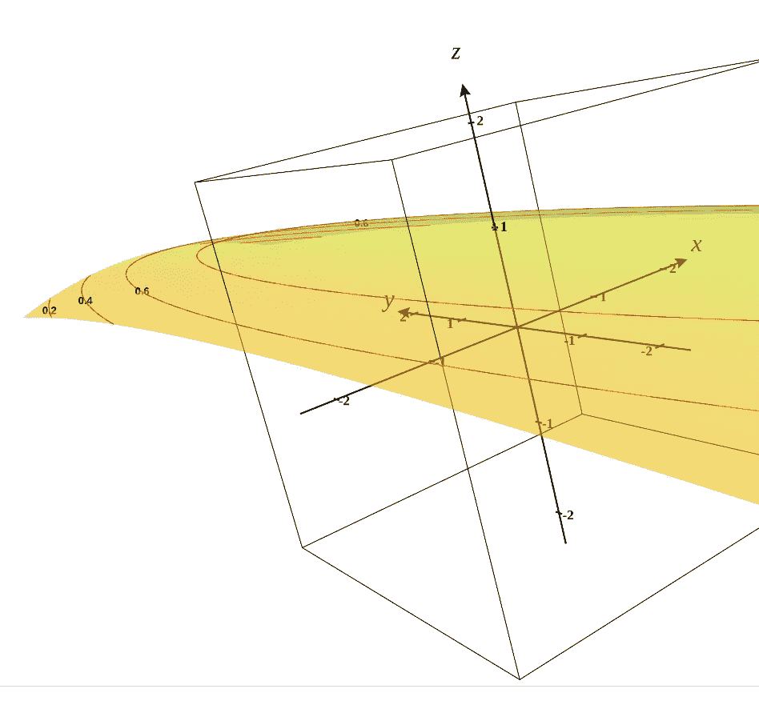

# 奖励可变的无限步旋转木马问题

> 原文：<https://towardsdatascience.com/infinite-steps-cartpole-problem-with-variable-reward-7ad9a0dcf6d0?source=collection_archive---------44----------------------->

## 利用继承修改撑杆跳开放式健身环境的步骤方法

在[上一篇博文](/cartpole-problem-using-tf-agents-build-your-first-reinforcement-learning-application-3e6006adeba7)中，我们写了我们的第一个强化学习应用——cart pole 问题。我们使用深度 Q 网络来训练算法。正如我们在博客中看到的，固定奖励 *+1* 用于所有稳定状态，当翻筋斗失去平衡时，奖励 *0* 。我们最后看到:当侧翻接近 *200* 步时，往往会失去平衡。我们在博客结尾建议了一句话:最大步数(我们定义为 200)和固定奖励可能导致了这样的行为。今天，我们不限制步数和修改奖励，看看侧翻如何表现。

# 电线杆问题定义

当在 *100 次*连续试验中平均奖励大于或等于 *195.0* 时，认为横竿问题解决。这是考虑到 *1.0* 的固定奖励。由于它的定义，对每个平衡状态保持固定的奖励 *1.0* 并限制最大步数为 *200* 是有意义的。很高兴知道这个问题在之前的[博客](/cartpole-problem-using-tf-agents-build-your-first-reinforcement-learning-application-3e6006adeba7)中已经解决。

横竿问题有以下终止发作的条件:

1.  磁极角度超过 *12* 度。
2.  推车位置超过 *2.4* —推车中心到达显示屏边缘。

# 可变奖励

我们的目标是取消步数限制，给每个州一个可变的奖励。

如果 *x* 和 *θ* 分别代表小车位置和杆角度，我们将奖励定义为:

```
*reward = (1 - (x ** 2) / 11.52 - (θ ** 2) / 288)*
```

这里，小车位置和极角分量都被归一化到[0，1]区间，以给予它们相等的权重。让我们来看看 *3D* 图的 *2D* 视图的截图。



我们在图中看到，当横竿完全平衡时(即 *x = 0* 和 *θ = 0* )，奖励最大(即 *1* )。随着 *x* 和 *θ* 绝对值的增加，奖励减少，当 *|x| = 2.4* 和 *|θ| = 12* 时，奖励达到 *0* 。

让我们将 CartPole 环境 gym 类( *CartPoleEnv)* 继承到我们的自定义类， *CustomCartPoleEnv，*并覆盖*步骤*方法。在阶梯法中，我们写的是可变报酬，而不是固定报酬。

通过使用上面的代码块，制造了 TF-agent 的组件，并训练了深度 Q-网络。我们看到横翻在许多步后更加平衡和稳定。

# 示范

让我们看看使用可变奖励后我们的横竿表现的视频。

一集平均持续 *35.4* 秒。令人印象深刻，不是吗？

# 可能的改进

这里，只有当两个表达式(杆角度和推车位置)都达到极值时，奖励才变为零。我们可以采用不同的回报函数，当达到一个极端条件时，回报为零。我期望这样的奖励函数做得更好。因此，鼓励读者尝试这样一个奖励功能，并评论一下横竿的表现。快乐的春天！