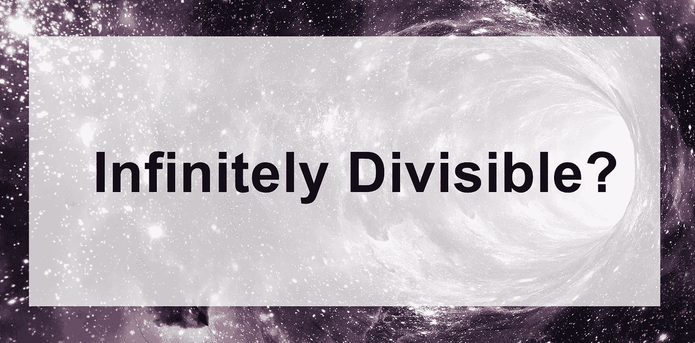
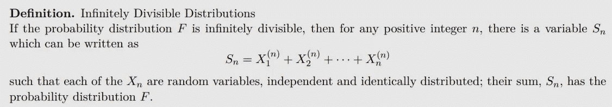
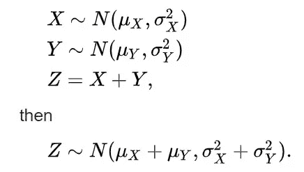
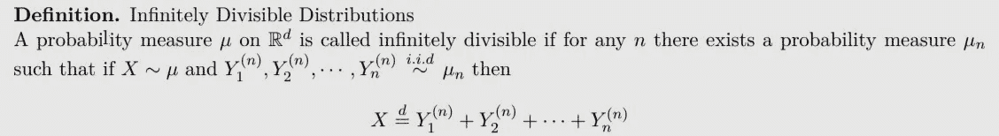
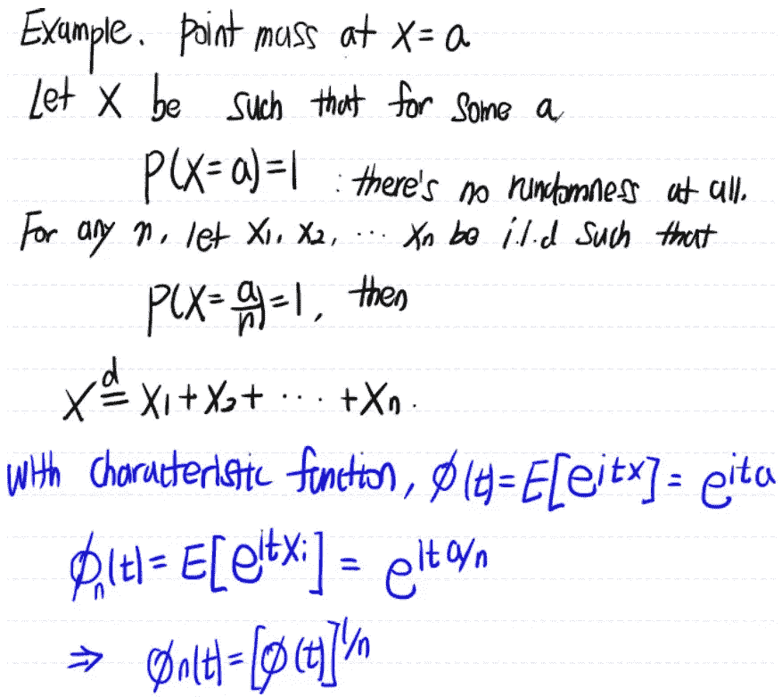
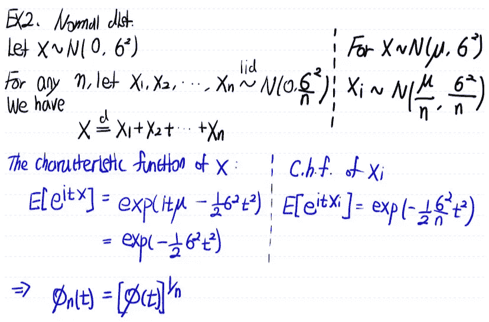
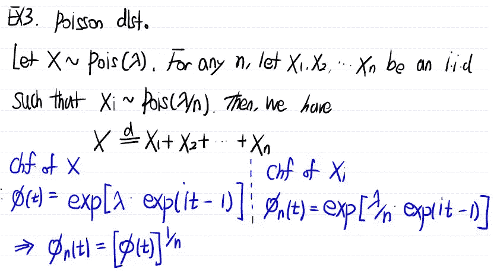
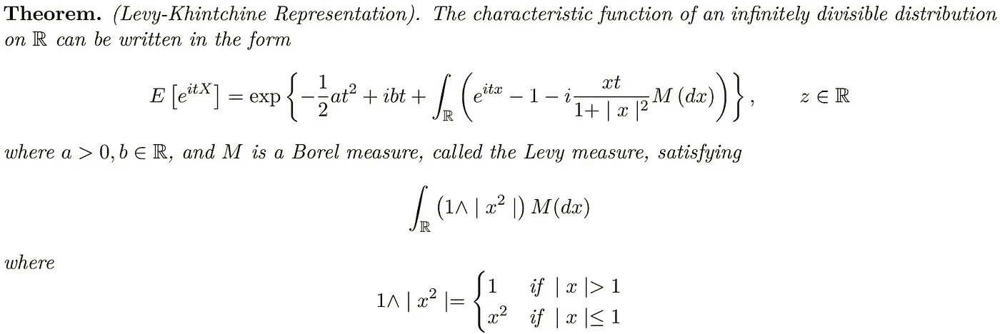
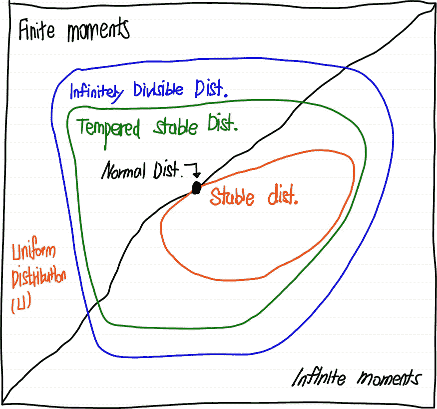

# 无限可分分布

> 原文：<https://towardsdatascience.com/infinitely-divisible-distribution-586b18c63670?source=collection_archive---------65----------------------->

## 迈向稳定的分销之旅#2

## 什么是无限可分分布？

嗨，我是卢武铉( *ρ* )！欢迎来到“稳定分销之旅”系列

*   第 0 部分:为什么缓和稳定分布？【[点击](https://medium.com/@corr.roh/why-tempered-stable-distribution-no-math-equations-5c91bb64e4e9)
*   第一部分:什么是厚尾分布？【[点击](/journey-to-tempered-stable-distribution-part-1-fat-tailed-distribution-958d28bc20c)
*   **Part2:无限可分分布？**

这是“稳定分布之旅”系列的第 2 部分。如果你错过了#1 " [厚尾分布](/journey-to-tempered-stable-distribution-part-1-fat-tailed-distribution-958d28bc20c)"，请查看这里的！

> 警告:不要被这个术语吓坏了
> 
> “无限可分分布”

*资料来源:Pixabay*

# 无限可分？

> 人们可以谈论物质、空间、时间、金钱或抽象数学对象(如连续统)的无限可分性或缺乏无限可分性。(维基)
> 
> 1.【物质】直到[量子力学](https://en.wikipedia.org/wiki/Quantum_mechanics)的发现，物质是否无限可分的问题和物质是否可以*无限切割*成更小的部分(量子)的问题才得以区分。
> 
> 2.金钱是无限可分的，因为它是以实数系统为基础的。每笔交易都有一个没用的精确点，因为这么小的金额对人类来说微不足道。它也适用于时间。虽然时间可能是无限可分的，但金融价格数据是在离散时间报告的。
> 
> 3.【概率分布】我们这里要讲的！

# 定义

是时候看看“无限可分分布”的实际定义了。我将向您展示两种不同的定义，从最简单的开始。

来源:统计 Howto

想想我们熟悉的两个发行版

## 常态

我们知道对于正态分布，正态分布的和也是正态的。试着猜测如何构建满足上述定义的“n”独立同分布正态分布。答案如下图 2 所示。

两个正态分布的和

## 制服

与我们的直觉不同，均匀分布不是无限可分的。想看证明的，查[这个](http://www.stats.ox.ac.uk/~winkel/ms3b10_s1.pdf)。作为旁注，我们常犯的错误是两个均匀分布(如 U[-1，0]和 U[0，1])之和是一个均匀分布(如 U[-1，1])

资料来源:M.Grabchak 讲座

以上定义都是等价的。

> **无限可分分布的这种定义是有意义的，因为对于任何‘n’个我们可以分成‘n’个独立同分布的随机变量。**

# 使用特征函数

判断一个函数是否能被无限整除的最简单的方法之一是看它的特征函数。这是因为如果分布的特征函数是每个独立同分布变量的特征函数，那么

所以我们可以从我们的原始概率函数，通过看它的逆，来推导出我们的被加数随机变量的特征函数

# 让我们用下面的 3 个例子来验证一下吧！！

## “x=a”处的点质量(狄拉克δ分布)

我们从最简单明显的例子开始。这是点质量分布，没有任何随机性。显然这将是无限可分的。

图一。点式群体

虽然这可能不是一个有趣的问题，但很容易看出它是如何工作的。

## 正态分布

图二。正态分布

## 泊松分布

图 3。泊松分布

这三个是无限可分分布的例子。

对于更一般的无限可分分布，注意两个无限可分分布之和是无限可分的，即在卷积下闭合。[更多细节请查看这个惊人的 [youtube 视频](https://www.youtube.com/watch?v=Sj70IEBIy1U)从 20:00 开始]

# 等等…

**问:为什么我们需要知道无限稳定分布？
答:这只是因为调和稳定分布是无限稳定分布的一种。**

还有一件事要谈，如果对你来说太沉重的话，可以跳过最后一件。

对于每一个单一的无限可分分布，它都有相应的特征函数。我将介绍一种表示，我们可以用它来指定每个无限可分分布的特征函数。

## 利维-钦钦代表权

## 请参见下面的蓝色大圆圈。

我们可以看到无限可分分布的类非常大。根据 Levy-Khintchine 表示，我们可以再次指定每个无限可分分布的特征函数。**这个挺厉害的**！想象一下，我们可以指定这样一大类分布的特征函数。

图 4。图表//改编自 Mantegna 和 Stanley (2000 年)

从上图中你注意到了什么？

虽然我们还没有讨论“稳定分布”(马上就要讲到)，但是从上图可以看出

*   每个稳定分布都是无限可分的
*   不是每个无限可分的分布都是稳定分布

第二点的一个例子是“泊松分布”。从上面的图 3 中，我们看到泊松分布是无限可分的。然而，[它并不稳定](https://math.stackexchange.com/questions/1718196/what-is-the-difference-between-infinitely-divisible-and-stable-law)我会在后面谈到稳定分布时解释原因。

# 摘要

我们从高级理解到低级理解复习了“无限可分”这个概念。为了理解“缓和稳定(TS)分布”，有必要对无限可分性有一个基本的了解，因为 TS 属于它。希望这份文件有助于提高你的理解。如果你有任何问题，请在下面评论。我希望你对接下来会发生什么感到好奇。下一次，我将带着“稳定分布之旅[部分。3:幂律分布]”

## 参考:

1.  【http://shannon.cm.nctu.edu.tw/prob/c28s08.pdf 号
2.  [**斯蒂芬妮格伦**](https://www.statisticshowto.com/contact/) 。[**【StatisticsHowTo.com】**](https://www.statisticshowto.com/)【概率中的无限整除:定义】对我们其他人来说是基础统计！[https://www.statisticshowto.com/infinite-divisibility/](https://www.statisticshowto.com/infinite-divisibility/)
3.  [https://en.wikipedia.org/wiki/Infinite_divisibility](https://en.wikipedia.org/wiki/Infinite_divisibility)
4.  [https://www.youtube.com/watch?time_continue=10&v = SJ 70 ie biy 1u&feature = emb _ logo](https://www.youtube.com/watch?time_continue=10&v=Sj70IEBIy1U&feature=emb_logo)
5.  [https://www.youtube.com/watch?v=Sj70IEBIy1U](https://www.youtube.com/watch?v=Sj70IEBIy1U)
6.  金融中的调和稳定分布和过程:数值分析，2008 年
7.  [http://www.stats.ox.ac.uk/~winkel/ms3b10_s1.pdf](http://www.stats.ox.ac.uk/~winkel/ms3b10_s1.pdf)

我还为上面所有的参考资料添加了超链接。请查阅参考资料了解详情。如果我错过了什么，我会在以后更新参考资料。

感谢您阅读本文档。如果您认为这份文件有用，请不要忘记与您的朋友分享。

*   第 0 部分:为什么是回火稳定分布？[ [点击](https://medium.com/@corr.roh/why-tempered-stable-distribution-no-math-equations-5c91bb64e4e9) ]
*   第一部分:什么是胖尾分布？[ [点击](/journey-to-tempered-stable-distribution-part-1-fat-tailed-distribution-958d28bc20c) ]
*   **第二部分:无限可分分布？**