# 无限不会变得相等

> 原文：<https://towardsdatascience.com/infinities-are-not-made-equal-7f707e055efa?source=collection_archive---------14----------------------->

[姚文东](https://unsplash.com/@atlasyao?utm_source=medium&utm_medium=referral)在 [Unsplash](https://unsplash.com?utm_source=medium&utm_medium=referral) 上拍照

## 它们有不同的尺寸

学数学的时候，迟早会碰到无限大小的集合。没什么可怕的。我们熟悉的是ℕ的一组自然数，我们对它的理解已经足够了。

一旦我们理解了ℕ，感觉我们已经很好地掌握了无限这个概念，不是吗？

事实证明，无穷大比这更奇怪:它有不同的大小。

# 无限的大小

从绝对意义上来说，无限集合的大小是无限的。相对而言，看看集合 A 和 B，我们可以比较它们在大小上是相同还是不同。但是如果在两种情况下都是无穷大，你怎么做呢？

好吧，我们不会去数他们的元素，所以这不是一个选项。我们还能做什么？

现在，让我们假设 A 和 B 是有限的。如果不能对元素进行计数，我们如何检查它们的大小是否相同？一种选择是尝试在元素之间建立 1:1 的关系——也称为[双射](https://en.wikipedia.org/wiki/Bijection)。

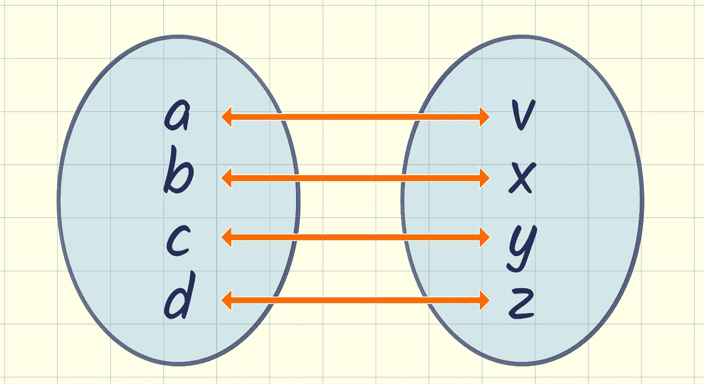

两个集合之间的 1:1 关系

如果可以证明存在 1:1 的关系，我们就有效地证明了 A 和 B 有相同数量的元素。它们大小一样。

假设同样的想法也适用于无限集合。如果我们可以在两个无限集合之间建立 1:1 的关系，我们就知道它们的大小相同。一组不可能比另一组更大或更小。

让我们用一些实验来验证我们的想法。

# 向无限集合中添加一些项

如果我们取ℕ，并在其中加入一个额外的项目，会发生什么？让我们将新项目标记为-1。

我们可以通过映射 n ↔ n+1 与ℕ建立 1:1 的关系。

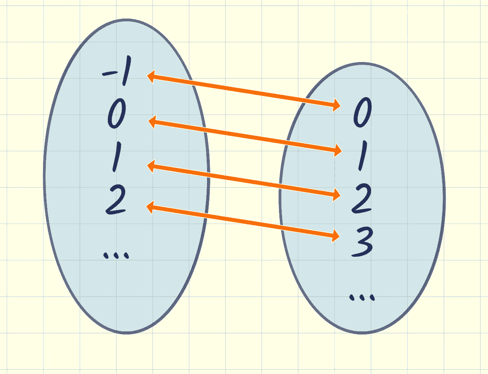

将项目添加到无限集中

我们将所有的输入映射到不同的输出，在输出端我们覆盖了整个ℕ。这意味着我们有 1:1 的关系，所以总的来说，集合的大小是相同的。

事实证明，向无限集合中添加一个项目并不会使它变大。

如果我们添加了 10 个项目，我们可以将它们标记为-10…-1，我们可以使用 n ↔ n+10 作为我们的映射。

事实证明，向无限集合中添加任何有限数量的项目也不会使其变大。

希尔伯特酒店思维实验的总体思路是:在一个拥有无限房间的订满的酒店里，你总是可以转移现有的客人来容纳新的客人。

在无限酒店，你可以随时把客人转移到下一个房间，以便腾出 1 号房间——图片由 [Unsplash](https://unsplash.com?utm_source=medium&utm_medium=referral) 上的 [Alfons Morales](https://unsplash.com/@alfonsmc10?utm_source=medium&utm_medium=referral) 拍摄

# 将无限集合的大小加倍

让我们给ℕ加上无穷多项，即所有的负整数。我们基本上是在比较ℤ，所有正整数和负整数的集合，和ℕ.从直觉上看，它的面积是ℕ的两倍，但是它会对我们建立一对一关系的能力产生影响吗？

一点也不。我们可以按顺序交替分配正数和负数，在它们之间来回跳跃，覆盖整个ℤ

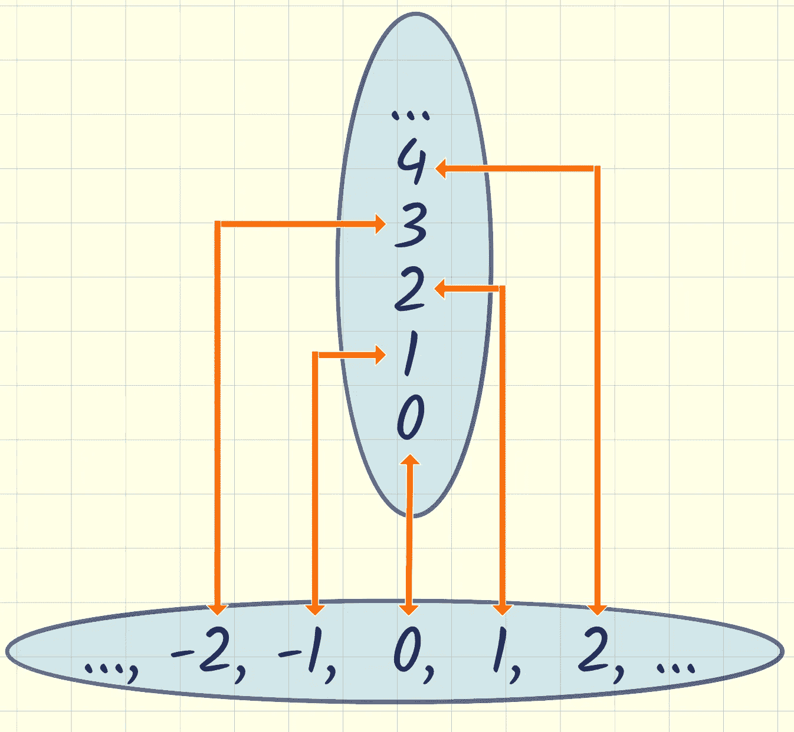

一对一的关系ℕ ↔ ℤ

> 请注意，建立一个集合与自然数的 1:1 关系等同于对其元素进行枚举。枚举位置 *n* 和该位置的项目 *x* 成 1:1 的关系。
> 
> 对于上面的映射，枚举是:
> 
> 0↔0
> 1↔-1
> 2↔1
> 3↔-2
> 4↔2
> 5↔-3
> …

事实证明，将一个无限集合的大小加倍并不会使它变得更大。

# 添加另一个维度

我们不看自然数，而是看自然数的*对*。就像平面上的坐标。让我们比较一下ℕ和ℕ。添加一个完整的独立维度很有可能在某种意义上比原始集合“更大”。

我们有效地增加了我们的集合，每个数字有无限多的项:我们为 0 增加了无限多的项，即(0，1)，(0，2)，(0，…)，为 1 增加了无限多的项，即(1，1)，(1，2)，(1，…)，等等。

毫无疑问，要完全列举出我们在ℕ的所有要素是困难的。

事实证明，如果我们遵循这个方案，我们仍然可以做到这一点:

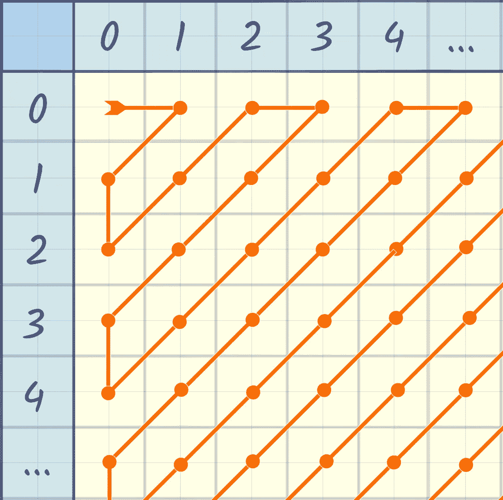

ℕ的一个例子

我们绘制了下面的序列，填满了ℕ的整个目标空间

> 0 ↔ (0，0)
> 1 ↔ (1，0)
> 2 ↔ (0，1)
> 3 ↔ (0，2)
> 4 ↔ (1，1)
> 5 ↔ (2，0)
> 6 ↔ (3，0)
> …

因为我们可以给出所有项目的无所不包的枚举，我们知道我们仍然在处理一个和ℕ.一样大的无限

事实证明，对无限集合中的项目数求平方并不会使其变大。

# 分解:分数

好吧，那ℚ呢，有理数集？

先搞清楚正有理数。

任何正有理数都可以用一对整数来表示，比如 1/2 或 5/9。所以实际上，ℚ的正面部分可以通过类似于我们用来绘制ℕ ↔ ℕ地图的对角化方案来绘制。

我们将不得不改变方案，以避免分母中的 0，并且我们将不得不跳过一些有理数，以说明并非所有的整数对都形成不同的有理数。这是因为我们必须处理 1/2 = 2/4 = 3/6 等可约分数。

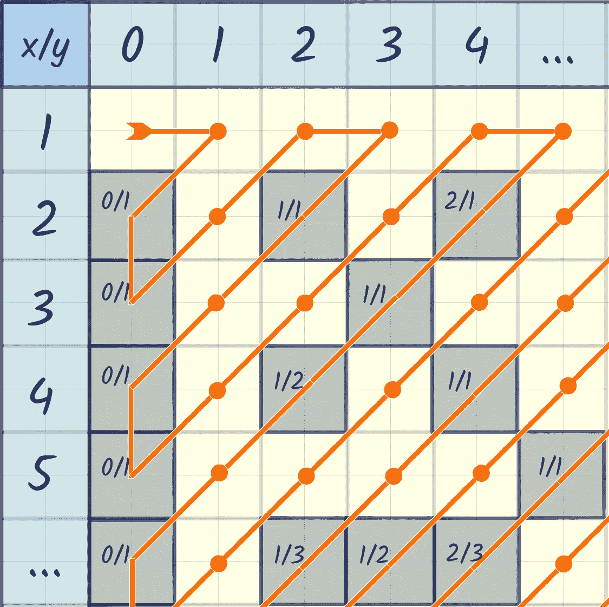

所有正有理数的枚举，可约分数被跳过

有点繁琐，但还是。我们可以列举ℚ.所有的正数让我们称我们的映射函数为 *m:* ℕ → ℚ.

> 我们看到ℚ的阳性部分肯定不比ℕ大。如果有什么不同的话，由可约分数引起的重复使它潜在地“变小”。

ℚ消极的一面呢？为了涵盖ℚ积极和消极的两个方面，我们可以先将ℕ与ℤ对应起来。我们知道它们一样大。然后我们使用 *m(z)* 将任何正的 *z* 映射到ℚ，并将任何负的 z 映射到 *-m(-z)以覆盖* ℚ *的负部分。*

使用这种方法，我们可以链接 1:1 的关系，保证ℕ与ℚ:的大小相同

> ℕ ↔ ℤ ↔ ℚ

# 那么一个无穷大的大小是如何增长的呢？

我知道你在想什么。你在等待一个无限大的集合，它显然比ℕ.大到目前为止，我们一直一无所获。

好吧，好吧。

让我们试着将ℕ提升到一个新的高度——图片来自[pix abay](https://pixabay.com/users/realworkhard-23566/?utm_source=link-attribution&utm_medium=referral&utm_campaign=image&utm_content=199054)的 Ralf Kunze

让我们看看我们已经尝试了什么:

1.  我们尝试将固定数量的 k 项添加到ℕ中，试图形成一组不会移动的|ℕ|+k.大小，这也许并不奇怪。
2.  我们看着ℤ，尝试一个两倍于ℕ.大小的布景我们基本上形成了一组大小为 k 的|ℕ|⋅，其中 k 为 2。如果我们用更大的 k 值去尝试，我们仍然不会有任何进展。我们来回跳跃的映射思想可以重复，因此我们可以容纳 2、4、8、16、32……倍于ℕ大小的集合，最终超过我们可能选择的任何 k。我们仍然和ℕ.保持着 1:1 的关系
3.  我们看了看ℕ，基本上是想和|ℕ|⋅|ℕ|.的一套尺码进行比较我们再次得出了 1:1 的关系。一旦我们知道了ℕ和ℕ的面积一样大，我们就可以把我们的制图方法联系起来，确定ℕ和ℕ、ℕ⁴、ℕ⁵等的面积一样大。一次增加一个维度，我们最终可以证明ℕ和ℕ的大小是一样的。所以扩展到一个有限的维度集不会让一个集合变大。

我们唯一没有尝试的是大小的幂运算。让我们试着组成一套大小 2^|ℕ|.

# 动力装置

让我们回到有限集合上来。给定任意一个大小为 n 的集合 *A* ，构造一个大小为 2^n 的集合的经典方法是形成幂集 *P(A)* 。那是包含 *A* 的所有子集的集合。

所以例如集合 *A={x，y，z}* 有幂集合 *P(A) = {{}，{x}，{y}，{z}，{x，y}，{x，z}，{y，z}，{x，y，z}，{ 。*

你会注意到 *A* 的大小是 3，而 *P(A)* 的大小是 8=2。你可能想知道是否总是如此，事实也的确如此。这是最容易从结构上看出来的。

假设我们选择一些 *A* 并构造 *P(A)* 。如果我们给 *A* 增加一个额外的元素 *e* 形成*A’*，*P(A’)***比 *P(A)* 大一倍。这是因为*P(A’)*整齐地分割成两个大小相等的部分。第一部分包含 *P(A)* 的所有元素——这些正是*A’*中不包含新元素 *e.* 的子集。第二部分包含第一部分中每一项的孪生元素，形成*A’*中*包含*e 的所有子集。**

让我们从空集 A⁰开始，不断添加元素，从而形成 a，a 等。每一个连续的幂集都包含了前一个幂集的元素，以及这些幂集的副本，每个幂集都添加了新元素。

A⁰ = {}，P(A⁰) = {{}}，|P(A⁰)| = 2⁰
A ={ **x** }，P(A )={{}， **{x}** }，|P(A )| = 2
a = {x， **y** }，p(a)= { { { }，{x}， **{y}，{ x，y}** }，| p(a)| = 2

回到ℕ.让我们形成 P(ℕ)看看它是否仍然和ℕ.一样大我们需要尝试找到一种方法来列举 P(ℕ).的所有元素我们走吧。

# 枚举ℕ的子集

我不知道你怎么想，但我发现很难找到一种简单、系统的方法来列举自然数的所有可能序列。我们必须想出一些索引方案。

让我们画一个表，其中列代表自然数，每行代表一个子集。我们在每一列中放置一个 0 或 1，表示我们是否希望在该行的子集中包含相应的数字。行的顺序给出了我们的枚举顺序。

假设我们想通过编码空集开始我们的序列，然后是整个ℕ，然后形成各种模式，它可能看起来像这样。

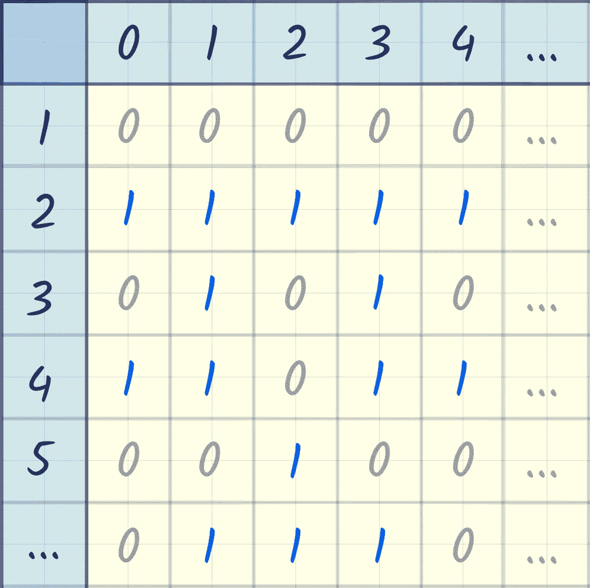

枚举ℕ的子集

完美！看起来有一种方法来表示我们的枚举。我们现在可以考虑某种枚举所有子集的方案。

现在，假设我们已经找到了一个好的规则，并且确信我们的枚举编码了某一行中所有可能的子集。

幽默一下，看看我们桌子对角线上的数字组成的序列，然后翻转其中的每个元素。每个 1 都变成 0，每个 0 都变成 1。得到的序列显然编码了ℕ的某个子集，所以它应该是我们枚举中的某个行。

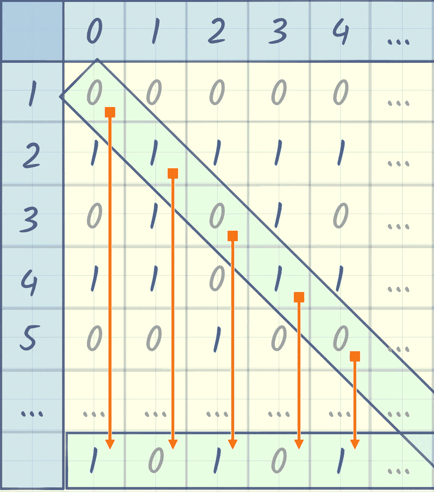

枚举ℕ子集的对话框

但与此同时，该序列保证不会出现在我们的枚举中。如果我们想声明“不，不，那个序列被 g 号覆盖了”，我们知道这不是真的。g 行不同于我们翻转的对角线序列，至少在位置 g，那是我们取原始值翻转的位置，所以不可能是相同的。由翻转对角线编码的ℕ子集不在我们的枚举中。这不可能。

最后，我们遇到了一个明显大于ℕ的集合，即ℕ.所有子集的集合它是如此的庞大，甚至没有办法去列举它的成员。

# ℝ比ℕ大

好，我们已经找到了至少两种无穷集合。可枚举的集合，也称为可数无穷。甚至更大的集合，大到成员无法被枚举，像ℕ.幂集这些被称为不可数不定式。

事实证明，ℝis 的那组实数也比ℕ.大

想象一下，你试着枚举 0 到 1 之间的实数。您最终会做一些与我们的子集索引练习非常相似的事情，只是使用数字 0-9，而不是只有 0 和 1。

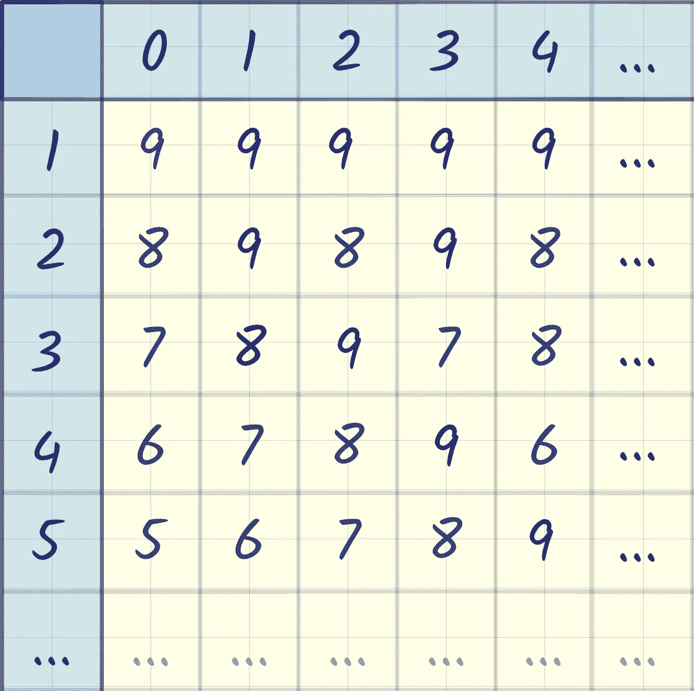

尝试枚举所有 0.xyz…

但是我们知道，即使你限制自己去列举那些只有 0 和 1 的数字，你已经有了一个不可数的集合。从 0 到 1 之间的实数已经比整个ℕ.还多

事实上，ℝ和 P(ℕ).一样大我们来讨论一下为什么会这样。

# ℝ的大小

让我们假设 P(ℕ和ℝ.的面积一样大我们知道|P(ℕ)|相当于所有 0 和 1 序列的数目。

让我们看看ℝ的开放区间(0，1 ),让我们像以前一样用一个表格，用我们常用的数字 0-9 来列举其中的数字。我们用了比 0 和 1 更多的数字。显然，这使得这个集合至少和 P(ℕ).一样大但是大小可能一样吗？

可以在数字序列 0-1 和 0-9 之间建立 1:1 的关系。这是一个创建等效编码的问题。

做那件事有几种方法。想象一下计算机用来表示数字的二进制编码，或者连续的 1 和 0 的数量编码连续的数字。例如，考虑下面的想法，其中连续的 1 序列编码一个序列数字。

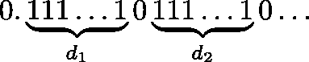

0–1 序列和 0–9 序列之间 1:1 关系的基本思想

> 从最初的想法进展到实际的绘图是一个乏味的过程。构造 1:1 可逆编码的细节可能是棘手的，因为严格的定义需要考虑各种边缘情况，例如 0.09999…等于 0.1 等。因此，在每个方向上找到一个[内射](https://en.wikipedia.org/wiki/Injective_function)映射，并使用[施罗德-伯恩斯坦](https://en.wikipedia.org/wiki/Schr%C3%B6der%E2%80%93Bernstein_theorem)定理得出双射映射存在的结论通常更容易。

不用花时间在这种编码的细节上，让我们相信这种编码是存在的。因为它确实存在，我们已经确定 P(ℕ和区间(0，1) ∈ ℝ大小相同。

接下来，我们通过映射建立大小相同的区间(0，1)和(-1，1)

> *x* ↔ *2x-1*

我们通过将 0 映射到-1、0.5 映射到 0 和 1 映射到 1 来扩展和移动我们的区间，其中所有值都是线性插值的。

这是非常可逆的。回过头来我们可以计算 *(x+1)/2* ，所以是 1:1 的关系。我们扩展了区间，并证明了两个区间的无穷大相同。

接下来，我们通过映射将区间(-1，1)缩放到(-π/2，π/2)

> 十.↔ (x⋅π/2)

通过除以π/2，这是可逆的，因此我们有 1:1 的关系，因此区间(-1，1)和(-π/2，π/2)的大小相同。

链接我们的映射，我们已经建立了区间(0，1)和(-π/2，π/2)的大小相同。当然，两个区间都包含无穷多个点，但是我们知道它们之间有 1:1 的对应关系。所以就无限的大小而言，它们是相等的。

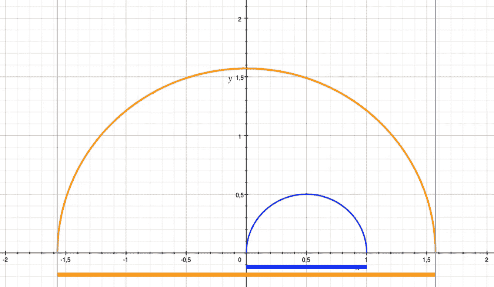

(0，1)和(-π/2，π/2)通过 1:1 关系包含相同数量的点

注意，我们不能像以前一样，通过乘以一个常数来延伸到无穷大。

但是我们可以使用 [*切线*功能](https://www.khanacademy.org/math/algebra2/x2ec2f6f830c9fb89:trig/x2ec2f6f830c9fb89:trig-graphs/v/tangent-graph)来实现。

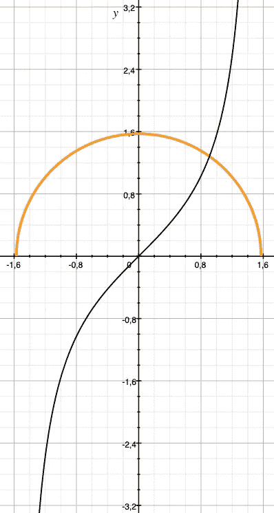

正切函数绘制了整个ℝ的时间间隔

我们可以通过映射将区间(-π/2，π/2)延伸到整个ℝ

> x ↔ *谭(x)*

在我们的区间上，使用[*【arctan(x)*](https://www.khanacademy.org/math/precalculus/x9e81a4f98389efdf:trig/x9e81a4f98389efdf:inverse-trig/v/inverse-trig-functions-arctan),*tan*函数是完全可逆的，因此我们有 1:1 的关系，确定(-π/2，π/2)与整个ℝ.的大小相同

arctan 函数通过 tan 将我们的映射反转回我们的原始区间，因此我们的区间和ℝ之间有 1:1 的关系

通过一系列一对一的关系，我们已经建立了:

> P(ℕ) ↔ (0，1) ↔ (-1，1) ↔ (-π/2，π/2) ↔ ℝ

因此 P(ℕ)和ℝ.一样大

# 我有问题！

是啊，我知道。现在我们发现了一个比ℕ大的无穷大，我们想知道是否有更大的，或者更小的，以及介于两者之间的大小呢？

无限确实有不同的大小——图片来自 [Pixabay](https://pixabay.com/?utm_source=link-attribution&utm_medium=referral&utm_campaign=image&utm_content=1935026) 的马里奥·霍弗

## 有比ℝ大的无限集合吗？

是的，任何集合的幂集都比原来的大。

例如，P(ℝ的面积比ℝ.的面积大

原因在[康托定理](https://en.wikipedia.org/wiki/Cantor%27s_theorem)中被优雅地概括为，你不能在任何集合 A 和它的幂集 P(A)之间形成 1:1 的关系。任何映射都不可能覆盖 P(A)中的所有值。

用专业术语来说:没有满射函数 f: A →P(A)，所以也不可能有任何双射函数。电源组总是太大而无法覆盖。

## 有比ℕ更小的无限集合吗？

不，可数无穷集的任何子集不是有限就是可数无穷集。

这个想法是，如果你有一个可能比ℕ“小”的无限集合 a，你就能把它映射到ℕ.的某个子集然后，您可以根据该映射对 a 进行排序，从而枚举 a 的内容。成功枚举 a 的项目表明与ℕ存在 1:1 的关系，因此证明 a 与ℕ.的大小相同

请参阅 Kevin 的精彩文章，了解更多详细信息:

 [## 最小的无穷大

### 我身上有一个纹身。自然对我来说很有意义。它每天都让我想起这个世界的奇妙…

medium.com](https://medium.com/@kev.ullmann/the-smallest-infinity-7b27b1ecd639) 

## 有没有大小在ℕ和ℝ之间的无限集合？

非常好的问题。还有一个开放式的。连续统假说认为不存在。但到目前为止没人知道。

我们所知道的是，这个问题的答案与集合论本身无关。换句话说，在我们目前的知识框架内，它可以以任何一种方式被假设，而不会导致与我们目前的知识体系不一致。

可怕吧。