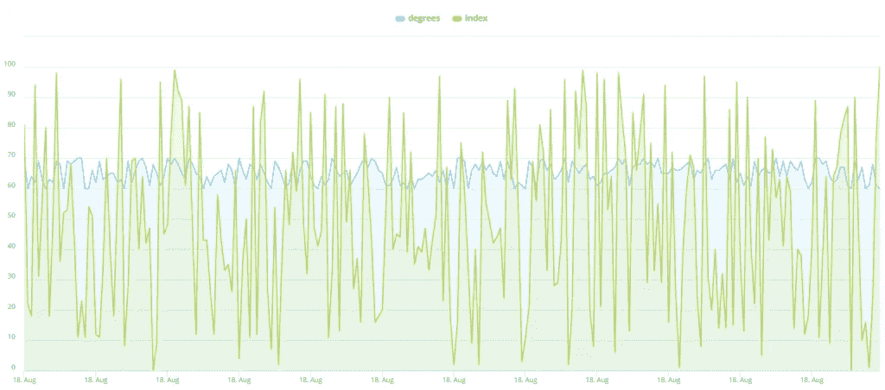

# InfluxDB 分析教程

> 原文：<https://towardsdatascience.com/influxdb-analytics-tutorial-7bf938317cd5?source=collection_archive---------50----------------------->

## 使用 Knowi 连接到 InfluxDB 数据源，查询它，可视化您的数据，并通过基于搜索的分析提出更多问题。


戴维·舒尔茨在 [Unsplash](https://unsplash.com?utm_source=medium&utm_medium=referral) 上的照片

# 目录

*   [简介](#9b6d)
*   [连接到 InfluxDB](#e4d6)
*   [查询您的数据源](#a2ec)
*   [分析&可视化您的数据](#cc69)
*   [利用基于搜索的分析进行深入研究](#96f6)
*   [总结](#edad)

# 介绍

维基百科将物联网定义为“一个由相互关联的计算设备、机械和数字机器组成的系统，这些设备具有唯一的标识符，能够在网络上传输数据，而无需人与人或人与计算机的交互。”举个例子，想象一个家庭安全系统和一个智能手表都可以自动向你的手机发送数据。

虽然物联网消除了数据传输过程中对人机交互的需求，但人机交互仍然是分析物联网数据的必要部分。为了与他们的物联网数据进行交互，人类需要一个可以安全存储数据的数据库和一个可以高效分析、可视化并最终从中获得洞察力的可视化平台。

这就是 [InfluxDB](https://www.knowi.com/influxdb) 和 [Knowi](https://www.knowi.com/) 的用武之地。InfluxDB 是一个开源数据库，由 InfluxData 的团队专门构建，用于存储时序物联网数据，Knowi 是一个分析和可视化平台，提供了与 InfluxDB 的广泛原生集成。Knowi 广泛的原生集成使其有别于许多其他分析平台，这些平台难以应对 InfluxDB 数据的非结构化性质，并确保您使用 Knowi 从 InfluxDB 实时查询物联网数据不会有任何问题。在本教程中，您将学习如何使用 Knowi 来分析和可视化来自 InfluxDB 的数据。

# 连接到 InfluxDB

一旦您登录到您的 [Knowi 帐户](https://www.knowi.com/free-trial)，第一步是连接到 InfluxDB 数据源。为此，请按照下列步骤操作:

1)移动到屏幕左侧的面板，选择“数据源”

2)从“NoSQL 数据源”中找到并选择“InfluxDB”

3)这里会自动填写您的数据源、主机和数据库名称；您需要做的就是保存您的数据源。

祝贺您连接到 InfluxDB！

# 查询您的数据

当您保存您的数据源时，您应该会收到一个提示“Datasource added”。配置查询。为了设置您的第一个查询，请按照下列步骤操作:

1)点击“查询”

2)在执行任何其他操作之前，请在“报告名称*”中将您的报告命名为“InfluxDB Query ”,然后直接查看您的报告名称上方。您应该会在屏幕顶部看到一个新的警告，内容是“检索到的表”。使用查询生成器部分来发现和构建报告/查询。这意味着 Knowi 自动为存储在您连接的 InfluxDB 数据库中的每个表建立索引，现在您可以从这个索引中选择表。

3)向下滚动到“表格”，单击向下箭头，并选择“h2o _ 温度”这将使 Knowi 自动创建一个 InfluxDB 查询，调用 InfluxDB 数据库中水温表的前 1，000 行中的所有列。这个 1，000 的限制只是一个默认的限制，但是我可以毫无问题地处理更大的负载，所以继续删除 InfluxDB 中写着“限制 1000”的部分该水温表包含每六分钟在两个不同位置进行的水温测量，并以华氏度记录。

4)移至屏幕左下角，点击“加入”这将设置第二个查询构建器，您将在其中生成第二个查询，并最终将其与第一个查询连接起来。在第二个查询构建器中，我们将重复与第一个查询非常相似的过程。使用“Tables”下的向下箭头，选择“h2o_quality”，并从 Knowi 自动生成的 InfluxDB 查询中删除“limit 1000”。就像水温表一样，这个水质表也包含每六分钟进行一次的测量。

在我们进入第 5 步之前，我认为最好解释一下为什么需要采取这一步。水质是通过一种称为水质指数的度量标准来衡量的，在我们的水质表中简称为“指数”。与水温保持相当一致不同，水质指数非常不稳定，在一个小时的过程中，可以在 0 的最小测量值和 100 的最大测量值之间变化。为了让您了解这种波动性有多大，下面是我们将一天中的水温和水质指数可视化后的情况:



作者图片

我曾认真考虑过不在本教程中包含这张图片，因为它丑陋得足以将观众拒之门外，也愚蠢得足以让观众质疑它怎么可能出现在关于正确数据分析的教程中。不过，我最终还是加入了，因为我觉得有必要在每小时 6 次测量的基础上展示水质指数的波动性，我们希望避免以这种方式将其可视化。

这里的好消息是，与每小时 6 次测量的水质不同，一整天的平均水质指数实际上相当一致，我们完全可以在此基础上通过分析获得有价值的见解。这就是 Cloud9QL 的用武之地。Cloud9QL 是 Knowi 强大的 SQL 风格的语法，允许您在设置查询后对查询进行后处理，在这种情况下，Cloud9QL 将用于将水质指数转换为每日平均值，使您的查询更加简洁。现在，您已经确切地知道了我们为什么需要将测量值转换为日平均水质指数，以及我们将如何进行，您已经准备好进入第 5 步:

5)在刚刚设置的用于查询水质表的 InfluxDB 查询下面，将以下语法输入到 Cloud9QL 查询中:

```
select *, day_of_month(time) as Day;
select avg(index) as Index, time as Date, location
group by Day, location;
```

6)接下来，使用查询构建器左上角的眼睛图标预览这个特定查询的结果。正如你所看到的，你有两个不同地点每天的平均水指数。现在，在我们将水质表与水温表连接起来之前，我们需要将同样的过程应用于水温表。为此，向上滚动到您设置的第一个查询，查询水温表，并在 Cloud9QL 查询中输入以下语法:

```
select *, day_of_month(time) as Day;
select avg(degrees) as Temperature, time as Date, location
group by Day, location;
```

7)现在，在两个查询之间稍微向下移动一点到连接生成器。单击“加入构建器”将联接类型设置为内部联接，并将位置设置为位置，日期设置为日期。然后选择“保存”以保存您的加入。

8)这里的工作差不多完成了，但是您需要再次返回到 Cloud9QL，以我们想要的格式完成我们的查询。这一次，使用屏幕底部的“Cloud9QL Post Query”并输入以下语法:

```
Select Temperature, Index, Date, location as Location
order by Date, location
```

9)现在，点击屏幕左下角的“预览”。你应该看看圣莫尼卡和郊狼溪的每日水温和水质指数。如果您这样做了，这意味着您已经正确地做了所有的事情，这意味着您是时候单击“保存并立即运行”来运行您的查询了。

您的查询现已正式完成。干得好！

# 分析和可视化您的数据

现在您已经完成了查询，是时候利用 Knowi 的可视化功能来享受您的劳动成果了。保存并运行查询后，结果将作为数据集存储在 Knowi 的弹性数据仓库中。此外，您在保存查询之前查看的引用数据网格现在存储为一个小部件。为了可视化您的小部件并创建更多可视化效果，请按照以下步骤操作:

1.  移动到屏幕左侧面板的顶部，选择“仪表板”然后，选择加号图标，将新仪表板命名为“InfluxDB 仪表板”，并单击“确定”
2.  这个控制面板将作为您的小部件和您创建的所有其他小部件的主页。回到屏幕左侧的面板，这次选择“Widgets”。将您创建的新“InfluxDB Query”小部件拖到您的仪表板上。
3.  将鼠标悬停在新部件的右上角，以显示省略号图标。选择它，然后向下滚动并选择“分析”将新屏幕左上角的“位置”栏拖到“过滤器”上在“值”下，键入带下划线的“coyote_creek”，然后单击“确定”
4.  在屏幕顶部，选择“可视化”这将向您显示您的数据网格，它与您正在分析的数据没有太大的不同。要改变这一点，点击屏幕左上角“可视化类型”下的“数据网格”,将您的可视化更改为“区域”可视化。如果你做对了，你应该会看到一个面积图，它传达了平均水温保持非常一致，而水质有一个体面的数量每天的变化。
5.  走到屏幕的右上角，选择“克隆”图标——它看起来像两张叠在一起的纸。将这个新部件命名为“Coyote Creek Daily”并选择“Clone”然后选择“添加到仪表板”

# 利用基于搜索的分析进行深入研究

虽然点击并拖动指标到过滤器区域并手动设置过滤器并不太难，但有时您只想用简单的英语提问并实时收到结果。这就是 Knowi 基于自然语言处理的搜索分析功能的用武之地。假设您希望只显示另一个位置(Santa Monica)的数据，而不是查看仍有波动的日平均值，您希望查看周平均值。下面是如何做到这一点:

1.  回到第一个小部件的右上角，选择省略号图标，然后选择“分析”键入“显示圣莫尼卡每周的温度、指数和日期”并输入。这将自动计算水温和水质指数的周平均值。
2.  前往屏幕顶部的“可视化”，将“可视化类型”更改为“区域”
3.  选择“克隆”图标，并将这个新部件命名为“圣莫尼卡周刊”，然后选择“克隆”然后选择“添加到仪表板”

# 摘要

回顾一下，您通过连接到 InfluxDB 数据库开始了本教程。然后，您设置了一个查询，从两个单独的表中提取水温和水质指数的日平均值，并使用 Knowi 的连接构建器将它们连接起来；该查询的结果作为数据集存储在 Knowi 的弹性数据仓库中。接下来，您构建了一个仪表板，以可视化作为查询结果获得的原始数据，并创建了一个区域可视化，以一种更容易看到的方式传达一些结果。最后，您使用基于搜索的分析，以不同的方式分析数据的不同部分。