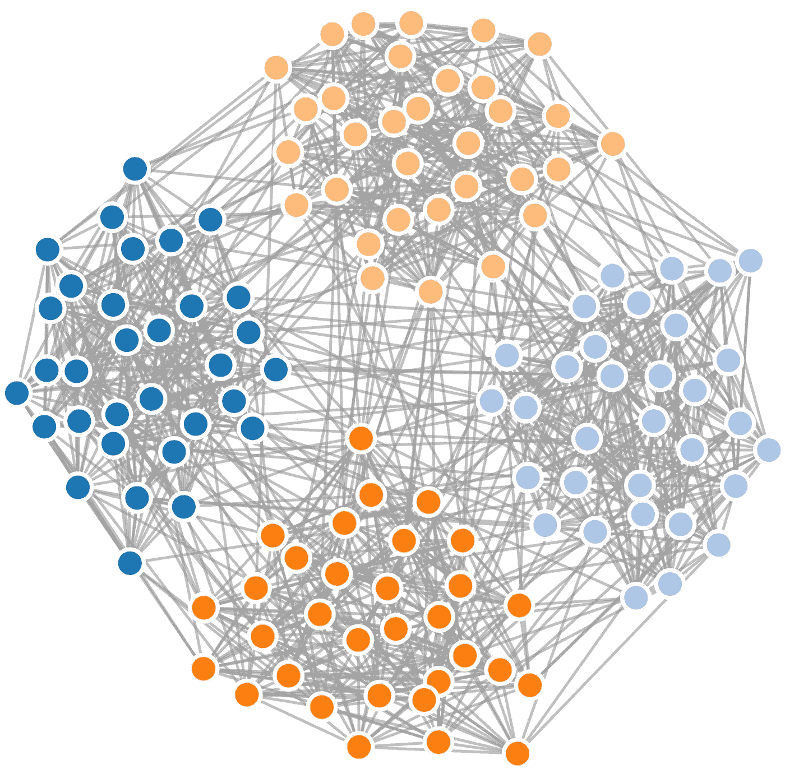
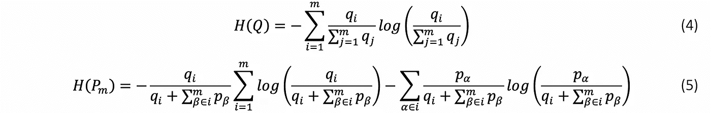
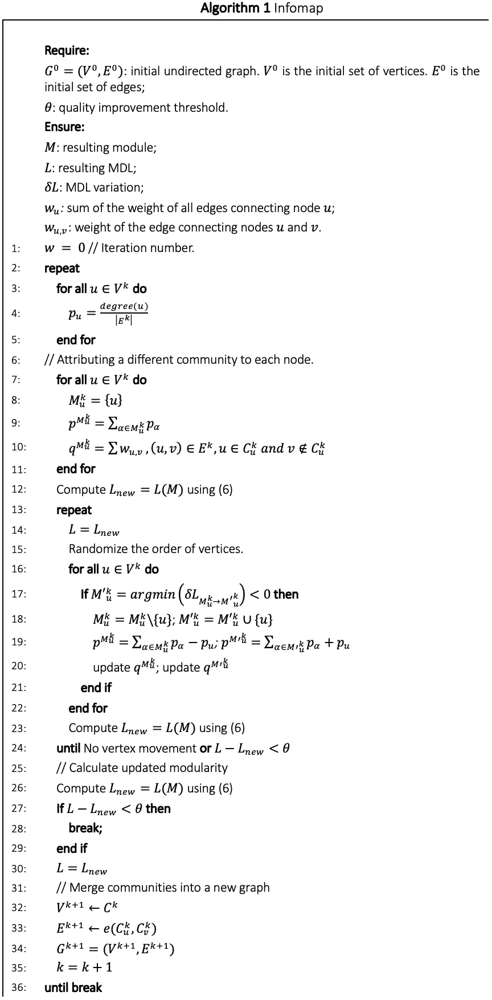

# 信息图算法

> 原文：<https://towardsdatascience.com/infomap-algorithm-9b68b7e8b86?source=collection_archive---------15----------------------->

## 一种社区发现算法

在格文-纽曼(混合参数= 0.2，平均节点度= 16)合成网络(mscthesis.herokuapp.com)中运行 Infomap 算法后检测到的社区。

# 描述

信息图算法试图最小化成本函数。划分是基于给定网络中连接模式引起的流量[1]。

考虑到发送者假装将网络内的随机路径传递给接收者，假设如下:该消息的大小旨在被最小化。一个直接的策略是给每个节点分配一个不同的名称(代码)并将相应的序列发送给接收者。后者将能够基于适当的码本对消息进行解码。考虑到路径是由相同大小的𝑁码以二进制语言描述的，每个码字的最小长度𝐿为:

用更简洁的方式描述同一条路径的另一种方法是使用霍夫曼编码。该方法在于根据随机路径的遍历节点访问频率(无限长随机行走的平均节点访问频率)，将不同长度的代码与每个节点相关联。哈夫曼编码本身已经是一种有效的方式来传输零星或不连续的独立节点，这些节点构成了我们假装要编码的随机路径。实际上，香农的信源编码定理指出，当我们使用𝑛码字来描述随机变量𝑋的𝑛态时，最小描述长度(MDL)由随机变量本身的熵给出:

如果目标是传输完整路径或所属节点的重要序列，则可以使描述更有效。为了实现这一点，网络被划分成模块，并且为每个模块定义不同的代码簿。这允许不同的节点被给予相同的标识。这不仅意味着为每个模块定义了模块码本(包括退出码)，而且还定义了索引码本，以在随机漫步机进入不同模块时进行标记。在这些分层描述的情况下，MDL 由每个模块和索引码本使用频率的加权平均值给出:

被 *𝑞 = ∑(m)(j=1) 𝑞j* 每个小区的退出概率之和，𝐻(𝑄)小区间移动的平均码长， *𝑝(i)(⊙) = 𝑞i + ∑(m)(β∈i) 𝑝β* 在一个小区内随机行走的停留概率𝑐和𝐻(𝑃)模码本的平均码长。

在(3)中插入(4)和(5):

考虑一个未加权且无向的网络，𝑞𝑚是模块𝑚的退出概率，𝑝𝛼是相对权重𝑤𝛼，其计算方法是将连接到𝛼的边的总权重除以图中所有链接的总权重的两倍。

这样，通过压缩网络的描述长度，它被划分成反映网络动态的模块。当节点之间的连接表示给定数量的流而不仅仅是这些节点之间的相似性时，这特别有用。算法 1 中 Infomap 算法的伪代码。

Infomap 方法表明，社区发现算法也可以用来解决压缩问题。

# 参考

[1] M. Rosvall，D. Axelsson 和 C. T .博格斯特伦，“地图方程”，*《欧洲物理杂志专题》，*第 178 卷，第 1 期，第 13–23 页，2009 年。