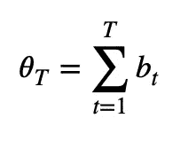

# 信息驱动的金融标杆

> 原文：<https://towardsdatascience.com/information-driven-bars-for-finance-c2b1992da04d?source=collection_archive---------17----------------------->

照片由来自 [Pexels](https://www.pexels.com/photo/black-and-white-business-chart-computer-241544/?utm_content=attributionCopyText&utm_medium=referral&utm_source=pexels) 的 [Lorenzo](https://www.pexels.com/@lorenzocafaro?utm_content=attributionCopyText&utm_medium=referral&utm_source=pexels) 拍摄

## 对分笔成交点不平衡棒线的非正式审查

# 介绍

您可能知道，原始财务数据由分笔成交点组成，代表市场交易。每一笔市场交易的特征是日期、时间、价格和交易的合约或股票数量。

取自证券数据库的原始分笔成交点数据示例

为了表示金融时间序列，通常使用棒线，棒线是分笔成交点的集合。但是有几种方法可以聚集信息；由于这个原因，许多种类的酒吧存在(时间酒吧是最常见的)。

观察市场 5 分钟，记下第一个观察到的价格(开盘价)，最低价(最低价)，最高价(最高价)和属于所选时间间隔的最后一个价格点(收盘价)，你就建立了一个 5 分钟棒线！

然而，与人类不同，市场并不遵循时间表。它们不以固定的时间间隔处理信息。他们宁愿一件一件地做，一笔一笔地做。那么，如果我们放弃时钟，开始用不同的逻辑对市场价格进行采样，会怎么样呢？例如，我们可以使用**音量时钟**来构建音量条；或者，我们可以在每次观察到一定数量的新交易时，构建分笔成交点和样本价格。成交量和分笔成交点是已知的抽样方法，我不认为它们值得一整篇文章，因为你可以在网上找到大量的信息。

但是，如果我们使用一个**信息时钟会发生什么呢？如果我们在每次市场上出现*意想不到的*数量的信息时对价格进行采样，会怎么样？这正是信息驱动酒吧背后的理念。很有趣，不是吗？我们将介绍最简单的信息驱动棒线:分笔成交点不平衡棒线。马科斯·洛佩兹·德·普拉多在他的书《金融机器学习的进步》中提出了这些观点(AFML)。**

# 什么是分笔成交点不平衡棒线？

简而言之，为了建立这种棒线，我们假设分笔成交点不平衡代表知情交易(分笔成交点不平衡将很快被定义)。因此，每当我们观察到一个意想不到的不平衡量时，我们就对市场价格进行采样，并创建一个新的棒线。用德·普拉多的话说:

> 信息驱动棒线的目的是当新信息到达市场时更频繁地取样。在这种情况下,“信息”一词在市场微观结构的意义上使用。[……]通过使取样与消息灵通的交易者的到来同步，我们也许能够在价格达到新的均衡水平之前作出决定。

## AFML 给出的定义

考虑 t=1，…，T 的一系列分笔成交点{(p_t，v_t)}，其中 p_t 和 v_t 表示时间 T 的价格和成交量。分笔成交点规则为 t=1，…，T 定义了一系列分笔成交点符号{b_t}，其中 b_t 可以是 1 也可以是-1。

AFML 给出的刻度线的定义

接下来，分笔成交点不平衡可以定义为 T 个分笔成交点上分笔成交点符号的部分总和。

AFML 对蜱不平衡的定义

现在，只要分笔成交点的不平衡超过我们的预期，我们就应该对棒线取样。这意味着我们必须计算每个棒线的*运行* *不平衡*，并将其与我们的预期进行比较。当当前不平衡的绝对值大于绝对预期不平衡时，我们将关闭该棒线。

书中将**每根棒线开始时的期望不平衡**定义为每根棒线的期望分笔数(T)与分笔符号的无条件期望(b_t)的乘积。此外，该书指出，我们可以使用指数加权移动平均(EWMAs)来估计这些时刻。

AFML 给出的每个条形开始时预期不平衡的定义

特别是:

*   我们可以使用先前棒线的实际分笔成交点数量 T 的 EWMA 来估计每根棒线的预期分笔成交点数量
*   我们可以使用前一个滴答的滴答符号的 EWMA 来估计滴答符号的无条件期望值

# **回顾**

**马科斯·洛佩斯·德·普拉多指出，我们应该利用信息时钟来对市场价格进行采样。分笔成交点不平衡棒线只是这个概念最简单的应用，我们应该在此基础上发现有趣的见解。我们应该对信息和预期信息提出新的定义。毕竟，马科斯·洛佩斯·德·普拉多刚刚为我们指明了方向，或许我们不应该把他的实施细节看得太重。为什么？**

**首先，**建议的棒线生成机制受到您如何初始化其参数**的严重影响—要生成不平衡棒线，您必须初始化每个棒线的预期分笔成交点数量(下面的 init_T)、分笔成交点符号的无条件预期(E[b_t])以及定义用于更新我们预期的两个指数平均值的 alphas。**

**下图显示了通过一千多次模拟获得的结果。它表明，随着定义 EWMA(T)的α的增加，相同时间间隔产生的棒线数量减少。此外，当我们增加用于初始化该机制的 T 值时，杆的数量减少。**

****

**每个模拟中生成的条形数与初始化参数的散点图。x 轴表示用于更新预期刻度数的 alpha。init_T 是我们用来初始化 EWMA(T)的值。EWMA(b_t)的α一直保持在 0.005 不变。刻度线的无条件期望值总是用 0.5 初始化。例如:如果你用 EWMA(T)的 alpha 值稍大于 0.2，init_T 接近 2000 来初始化这个机制，你得到的一个月的数据少于 10 根棒线。**

**很自然地，结果条的数量越多，我们在每个条中包含的信息量就越少。**

****

**每个模拟中棒线关闭时的中值不平衡散点图。例如:如果您的不平衡中值为 2000，则在给定模拟中创建的 50%的棒线已经关闭，不平衡≤ 2000，50%的棒线已经关闭，不平衡≥ 2000。在 x 轴上，您可以找到已创建的条的数量。条形的数量越多，每个条形的中值信息含量越低。**

**这意味着当我们选择如何初始化棒线生成机制时，我们粗略地选择了我们将用来关闭棒线的不平衡阈值。**

**上面的图只显示了该机制产生至少 3 个条的情况。重要的是要认识到，如果初始化的预期不平衡太高，该机制将只产生几个条，或者甚至很难产生单个条；如果太低，我们反而会产生太多的条纹。当你选择的初始参数完全错误时，我们的机制不会自动调整。**

****

**在本例中，第一个预期不平衡阈值设置得太高，并且没有为整个月的数据生成柱线。**

**其次，虽然我喜欢我们的期望是动态的这个想法，但是我并不真正理解所建议的实现。如果我们跟随 AFML 对市场进行采样，我们会得到不同的棒线:每个棒线都有不同的信息内容。这可能很棒，但**关键是我们在每个条形中包含的信息量及其动态几乎不受我们的控制。****

**再看一下上面预期失衡的定义。b_t 的无条件期望值的绝对值可以假定为[0，1]中的值，因此真正定义期望不平衡的是期望的分笔成交点数量。这意味着，如果最后一根棒线需要更多(更少)的分笔成交点，则下一根棒线的预期不平衡可能会更高(更低)。但是你怎么能证明这个想法呢？如果在关闭最后一根棒线之前，只花了很多分笔成交点就达到了你预期的不平衡水平，为什么你的不平衡预期会增加呢？**

**关闭酒吧的门槛应该由其他因素决定。理想情况下，当当前的不平衡达到一个重要的阈值时，我会关闭一个棒线，这个阈值告诉我价格将在接下来的 X 个成交量棒线中受到影响。这一显著阈值是否应该保持不变是一个研究问题。**

# **结论**

**鉴于上面提到的几点，我决定(目前)坚持使用一个以持续的不平衡期望为特征的实现。这意味着，每次我想要构建 TiB 时，我都必须指定将用于关闭每个棒线的不平衡阈值。**

**正如 Gerald Martinez 在他的[有趣的文章](/information-driven-bars-for-financial-machine-learning-imbalance-bars-dda9233058f0)中写的关于不平衡棒线的文章**“不平衡棒线的目标是在达到新的平衡之前及早发现市场方向性的转变”**。带着这个目标，我将继续学习，以了解如何提高我对这个概念的理解。特别是，我想了解是否存在重要的阈值，以及是否可以动态地指定它们。**

**写这篇文章，分享我的想法，展开讨论。因此，如果您有任何问题或疑问，欢迎您的评论。**

# **奖金部分**

**达到不平衡水平的概率取决于分笔成交点水平(计算不平衡的分笔成交点数量)。下图显示了不同分笔成交点的滚动失衡的经验分布。**

****

**不同分笔成交点范围内的滚动绝对不平衡分布。在 5000 个分笔成交点的范围内，可能会观察到 50–100 的绝对不平衡。在 100 个分笔成交点上不可能观察到同样的不平衡。**

**下面您会看到一个用恒定预期不平衡范例创建的 TiB 图。蓝点是用音量时钟采样的价格。**

****

**使用恒定预期范例创建的分笔成交点不平衡条(图中的烛台状)示例。DAX 期货合约。蓝点是音量条的结束点。**

# **附录和代码**

**每个图都基于 2019 年 12 月到期的 DAX 期货合约的分笔成交点数据。从 2019 年 1 月 11 日到 2019 年 11 月 30 日，我使用了一个月的 ticks。不同的数据可能会得到不同的结果。**

**下面你可以找到一些意大利面条代码来复制我的分析，甚至用你的分笔成交点数据创建不平衡棒线。如果稍微修改一下 spaghetti 脚本，您将能够使用一个恒定的期望不平衡范例来创建 bar ids。**

**意大利面条代码创建不平衡 _ 酒吧 _ 身份证，再现和改善我所做的**