# 使用机器学习的信息图信息组织——综述

> 原文：<https://towardsdatascience.com/information-organization-with-infographics-using-machine-learning-a-survey-54b2169c1f21?source=collection_archive---------36----------------------->

由 [Unsplash](https://unsplash.com/s/photos/posters?utm_source=unsplash&utm_medium=referral&utm_content=creditCopyText) 上的 [Gris Olmedo](https://unsplash.com/@gris_olmedo?utm_source=unsplash&utm_medium=referral&utm_content=creditCopyText) 拍摄的照片

## 利用机器学习自动化信息图生成过程。讨论信息可视化领域的最新研究。

信息图对于以更易理解的方式向观众展示信息至关重要。随着它们的使用扩展到许多(如果不是全部的话)专业领域，如新闻、科学、研究、广告、商业，关于自动生成漂亮的和以用户为中心的信息图的过程的研究已经成为数据可视化社区的最新特征。

在这一系列的文章中，我们将讨论 5 篇开创性的研究论文，它们集中在为不同类型的数据自动生成漂亮的信息图的过程上。

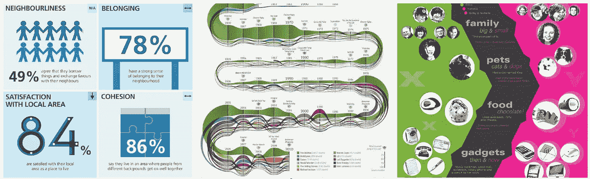

信息图表示例。[1]

目前，有许多非常强大的设计软件和代码库支持从数据生成信息图。下面的列表提到了一些您可能想看看的工具和库。然而，当设计信息图时，过程并不简单。要创作一件非常吸引人的艺术品，需要昂贵的劳动力，而且通常非常耗时。每一条小信息，从选择要突出的主题，到选择颜色组合，创建信息图所需的技能也是多种多样的。

> 支持信息图生成的软件

*   Microsoft Powerpoint(设计理念)
*   Microsoft PowerBI —用于开发数据可视化仪表板
*   Adobe Illustrator
*   （舞台上由人扮的）静态画面

> 帮助创建信息图表的 Javascript 包

*   D3.js
*   Highcharts.js

# 自动化信息图表设计

最近在信息可视化方面的研究显示，人们对自动化/半自动化复杂的信息图生成过程越来越感兴趣。然而，这项研究的主要目的并不是完全摆脱人类的控制，而是专注于开发技术，以支持设计师的决策过程。为了研究这项研究，我们将论文大致分为 5 类:

*   时间线信息图设计自动化
*   图标设计自动化
*   基于信息流的自动化
*   基于文本的自动化
*   图像图表融合自动化

## 时间线信息图生成[1，2]

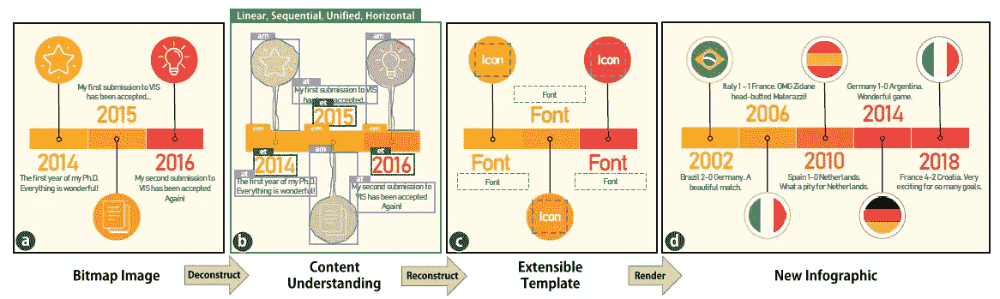

从时间序列信息图中提取模板组件并拟合新数据。[1]

顾名思义，这些方法试图为基于时间的数据自动设计信息图。其中一种方法直接在已经存在的时间线信息图的位图图像上工作，以提取全局和局部信息。全局信息可以是以下类型:方向、布局(统一、分面、分段等。)和表示类型(径向、线性等。).类似地，本地信息是关于包含信息图中一条信息的边界框，例如，文本框、图标等。这些方法使用现有的卷积神经网络来绘制边界框或分割局部信息的信息图，并通过分类来预测全局信息的值。提取模板信息后，我们可以用新的信息替换旧的信息，自动得到新的信息图。

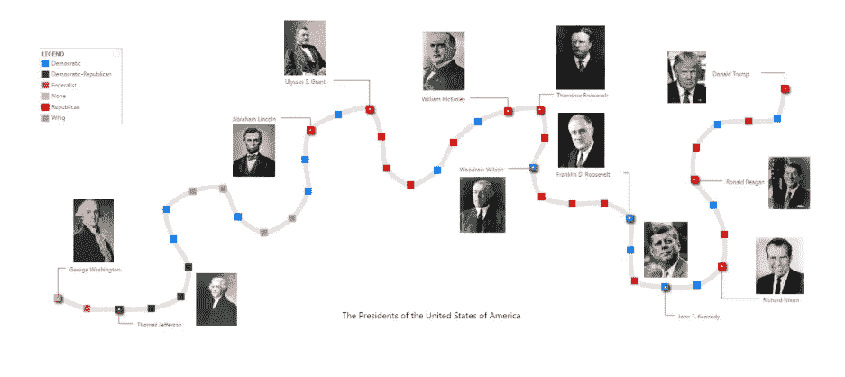

时间线说书人。[2]

另一方面，有一个名为 Timeline Storyteller [2]的可视化仪表板，它直接获取时间线数据的原始 CSV/Excel 表，并生成信息图，用户可以根据自己的设计选择定制这些信息图。用户可以用非常大的时间序列数据集设计信息图和动画，并将他们选择的图片导入这些信息图，如示例所示。试试时间线说书人[这里](https://timelinestoryteller.com/app/)。

## 图标设计自动化[3]

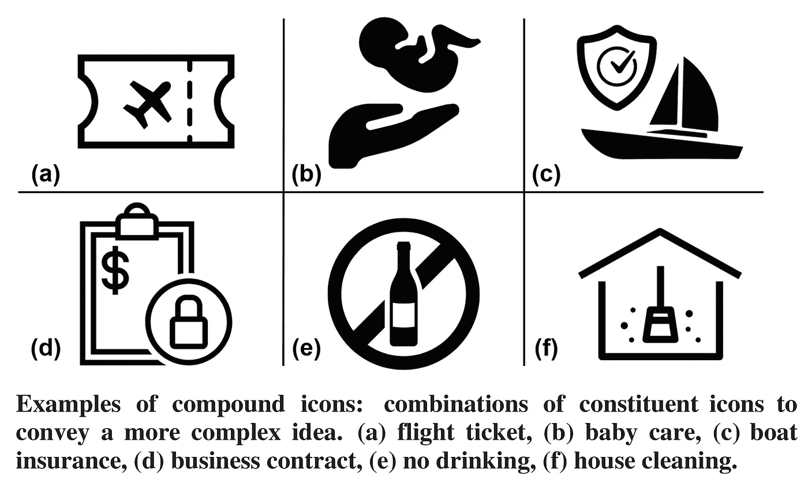

复合图标生成。[3]

我们列表中的下一个类别是关于设计复杂图标的技术。因此，给定一个输入文本，例如，*房屋清洁*，任务就是给出一个语义上有意义的图标。现在，通过查询中的每个单词搜索图标的问题可能看起来很简单，例如，一个图标代表“房子”,另一个图标代表“清洁”。现在把这两个图标结合起来，我们就有了一个复合图标。尽管这对于简单的查询来说是正确的，但是语义标记图标的数据却很少。因此，我们需要想办法将现有的标记图标的语义知识扩展到其他没有被很好探索的领域。为此，使用来自自然语言处理的经过充分研究的单词嵌入可能是有用的。

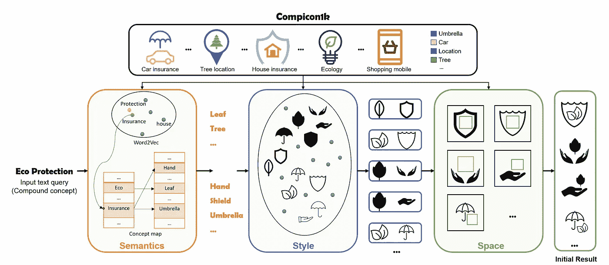

从文本查询开发复合图标管道。[3]

给定一个查询文本，我们为每个被注释并与现有数据集中的图标相关联的单字计算最近的单词。然后，基于样式兼容性对从查询词提取的图标进行排序。为了测量样式兼容性，为每个描述其样式的图标生成一个嵌入向量。所以两个图标的风格向量越接近，它们的风格就越相似。为此，我们可以训练 CNN 来生成这些风格嵌入。该模型是在现有的 1000 个人管理的复合图标数据集上训练的，其中复合图标内的各个图标被认为在风格上更相似，而不是在另一个输入复合图标中出现的该图标的不同风格。

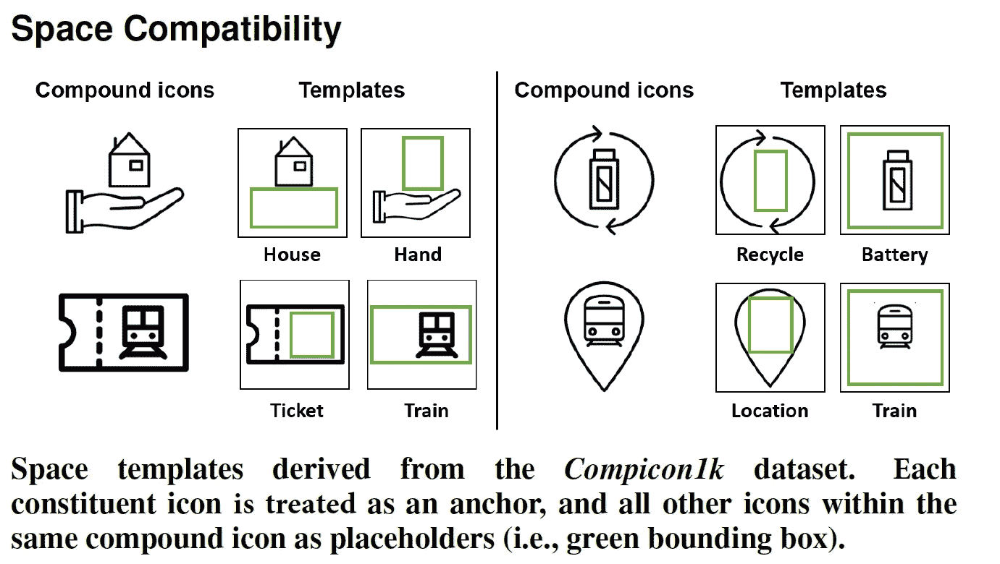

对于拼图的最后一部分，当基于语义和样式兼容性过滤图标时，它们基于空间兼容性放置。为了计算空间兼容性，研究了来自 1k 人工管理的复合图标的图标，以基于每个图标生成模板(如上图所示)。这样做是为了产生另一个图标相对于当前图标可以放置在哪里的想法。使用该信息，图标被放置在模板中以生成复合图标。

## 基于信息流的自动化[4]

转到文本类别，这项工作的重点是提取信息图中的信息流。

给定一个信息图图像，信息流基本上是一种显示图像中视觉组位置方向的方式。视觉组是包含信息图表中的片段的信息，这些片段被重复以呈现完整的画面。这些视觉群体的流动被称为*叙事流*。

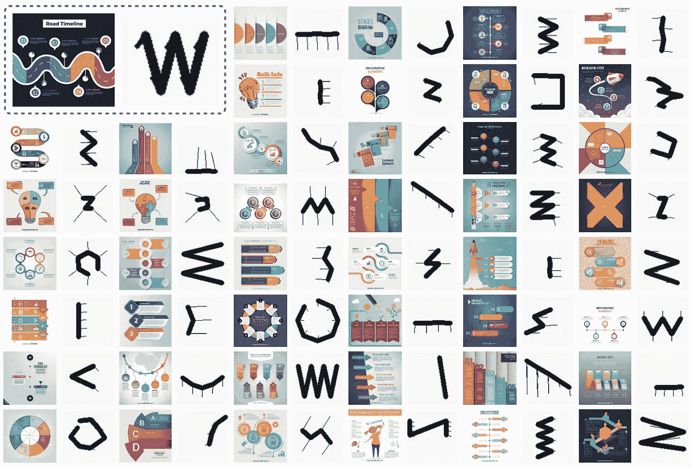

信息图表中的信息流方向。[4]

本文根据所研究的视觉群体及其在 [13k 信息图表图像数据集](http://47.103.22.185:8089/)中的位置，将这些叙事流模式分为 12 类。对象检测 CNN 最初用于检测信息图中包含图标和文本的视觉组，然后研究位置以生成信息流图。

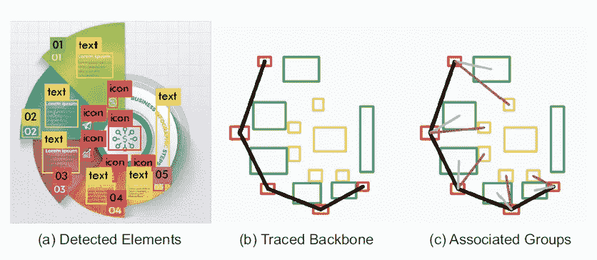

从由 YOLO 网络检测的包围盒中生成信息流路径。[4]

本文讨论了一种*流提取算法*，将 CNN([【YOLO】](https://medium.com/@jonathan_hui/real-time-object-detection-with-yolo-yolov2-28b1b93e2088))检测到的包围盒根据接近度和大小分组为视觉组，然后检测这些视觉组的流，预测最终的视觉信息流。除此之外，该系统还能够执行反向选择和分类，其中用户绘制信息流的方向，并且系统获取具有相似流向的相关信息图。此外，如上所述，下图显示了信息流的 12 个分类类别。

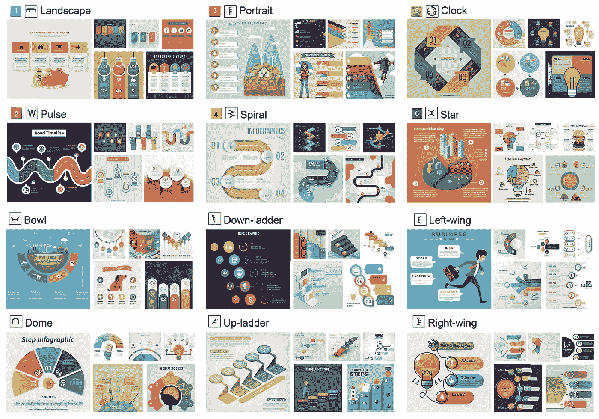

信息图表中的 12 类信息流。[4]

本文还研究了基于这 12 个类别的信息图中不同元素的空间分布，如下所示。

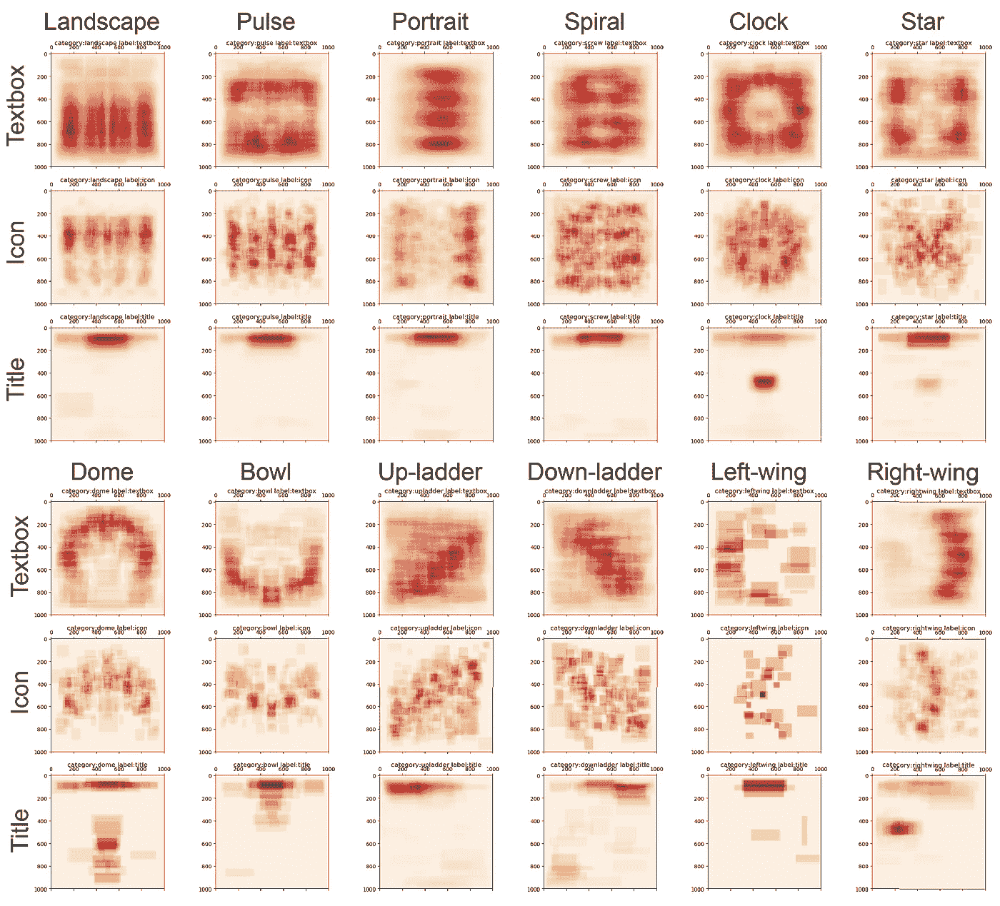

每个叙事流类别中元素的空间分布。[4]

## 基于文本的自动化[5]

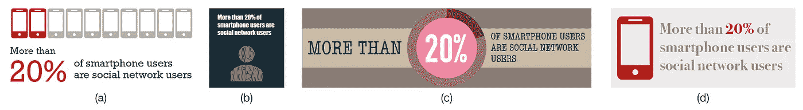

为报表自动生成的信息图: ***超过 20%的智能手机用户是社交网络用户*** *。[5]*

这个系列中的另一个系统被称为*文本到即时消息系统。*给定一个统计报表，这个系统试图直接提出完整的信息图设计。与其他信息图管理工具不同，在其他工具中，用户需要/可以编辑信息图的最终设计，Text-to-Viz 生成这些定义良好、美观的信息图，不需要编辑。如果用户不需要创建设计丰富的信息图，但需要简单快捷的东西以更好的方式呈现一条统计信息，那么这个系统的最佳用例就是这种情况。根据这篇文章，最常见的信息图表有 4 种类型:

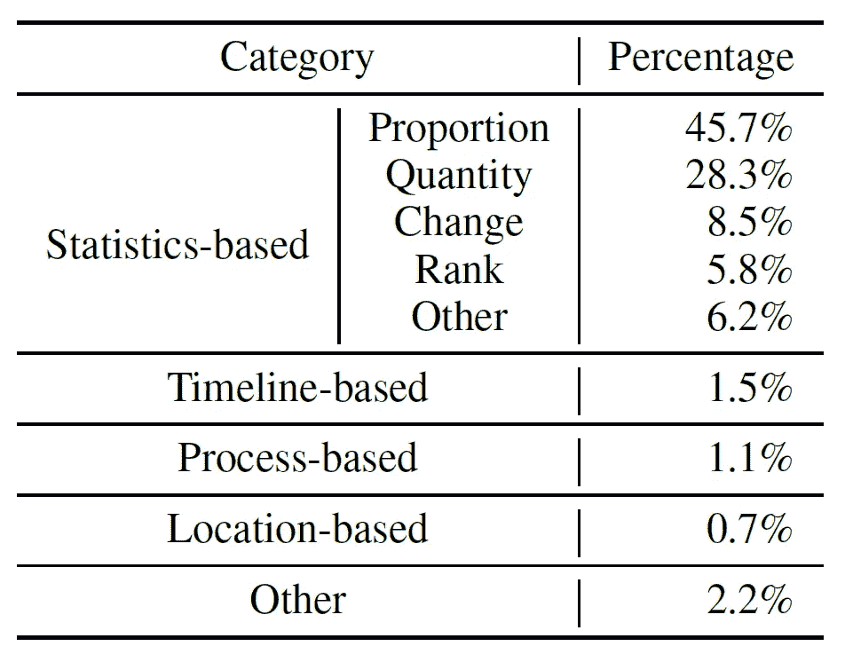

每个类别的信息图及其出现百分比。[5]

*   基于统计的:包含图表、象形图等的信息图。用于呈现统计信息。
*   基于时间轴:显示时间轴信息。
*   基于过程的:一步一步的行动演示。
*   基于位置:在地图上显示信息。

根据这项研究，由于大约 50%的信息图是基于统计的，其中大约 45%是基于比例的，所以他们只尝试为这组信息图创建一个自动信息图生成系统。之后，下一步是研究基于比例的信息文本的不同部分。下面显示了一个例子，他们试图分类和提取要单独设计的信息。

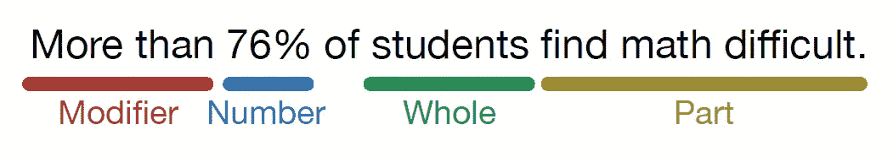

对基于比例的信息的不同部分进行分类。[5]

接下来，设计空间需要根据不同元素的放置位置进行划分。研究人员提出了 20 种模板设计，可以根据论文中提到的规则放置不同的元素。

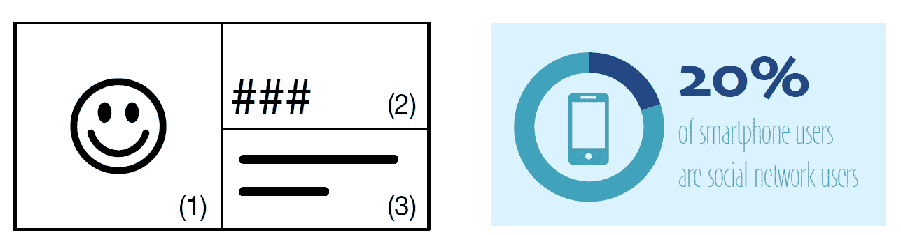

根据模板设计信息图。[5]

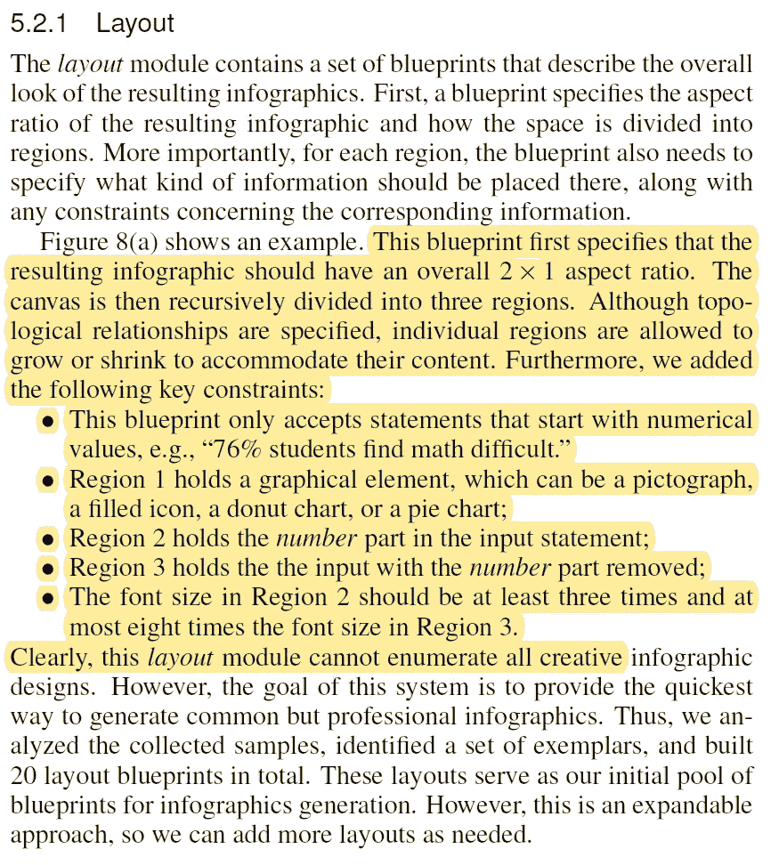

设计模板时考虑的规则。[5]

## 图像图表融合自动化[6]

嵌入图表的图像。[6]

自动信息图表生成列表中的最后一项技术是设计包含聊天内容的图像的技术，如上图所示。一项关于摄影信息图表的调查显示了常用于呈现嵌入图像中的数据的图表类型[6]。分别是**条形图【41.2% 】,饼图【21.4% 】,折线图【9.4% 】,散点图【2.2%】。**除了图表之外，嵌入该信息的其他方式是**单个分割对象:**其中图形沿着水平/垂直轴被分割成更小的部分，并且这些分割的面积可以基于我们试图比较的不同量的比率。接下来是**多个调整大小的对象**，其中图像内的对象根据它们试图描绘的数据来调整大小。使用关于如何和在哪里表示信息的信息，研究人员通常遵循下面显示的管道来生成最终的信息图。

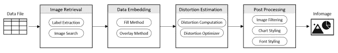

将图表嵌入图像的工作流程。[6]

因此，从给定的数据集中，选择相关的变量，并收集对应于这些变量的图像。当用户选择这些图像中的一个时，就会为所选择的变量生成图表。这些将被嵌入在选定的图像。在这一阶段，用户可以拖动图像上的一个区域来嵌入图表，或者他们可以从该图像中选择特征(例如霍夫线)来用作在这些图像上覆盖图表的锚点。

利用掩蔽技术嵌入图表。[6]

基于图像特征(本例中为霍夫线)的图表嵌入。[6]

总的来说，用休线和“饼图/条形图等”来表示“趋势/时间线数据(折线图)”是合理的用掩蔽技术。为了微调这些嵌入，可以为每种类型的图表计算不同类型的失真。例如，比较高线和折线图的斜率可以给出折线图嵌入图像的程度的估计失真。这些值用于优化图表在图像上的拟合，以生成美学信息图像。最后，所有这些都在一个界面中实现，用户可以使用他们的领域知识或设计技能来微调这些自动生成的结果。

# 结论

我们讨论了在不同类型的数据集上生成信息图的方法:时间线、图标、文本和图表。所有这些方法都侧重于信息图的某个方面，侧重于它们试图表示的数据类型。这些线索通常是对已经存在的信息图表进行调查的结果，然后使用该信息来自动化该过程。这仍然是一个很有前途的新的研究领域。未来的研究方向可以是探索更多种类的信息图，然后将现有技术与新技术相结合，创建一种更全面、更通用的技术，以自动化/半自动化这一繁琐的信息图生成过程。

# 参考

[1]走向自动化信息图设计:基于深度学习的可扩展时间线自动提取，Zhutian Chen 等。阿尔，2019

[2]时间线说书人，马修·布雷默等。阿尔，2019

[3] ICONATE:复合图标的自动生成与构思，赵南轩等.阿尔，2020

[4]探索信息图表中的视觉信息流，最小。鲁。et。阿尔，2020

[5] Text-to-Viz:从与比例相关的自然语言语句中自动生成信息图。崔薇薇等人。艾尔。, 2019

[6]信息图像:将数据嵌入专题图像，Darius Coelho 等人。艾尔。, 2020