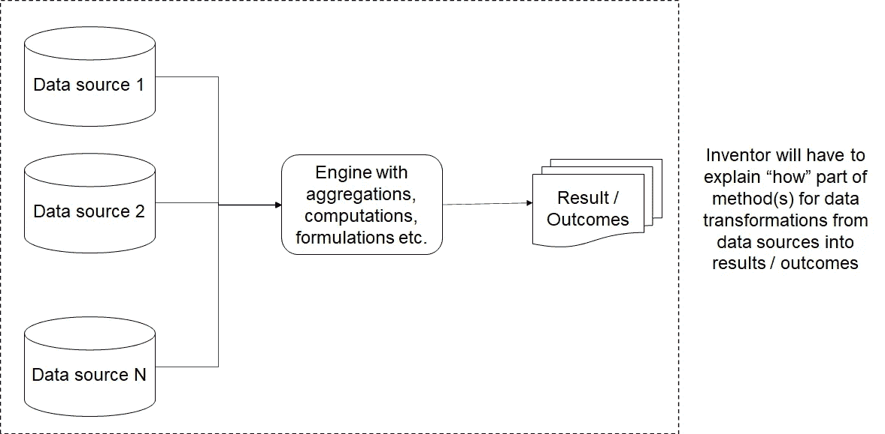
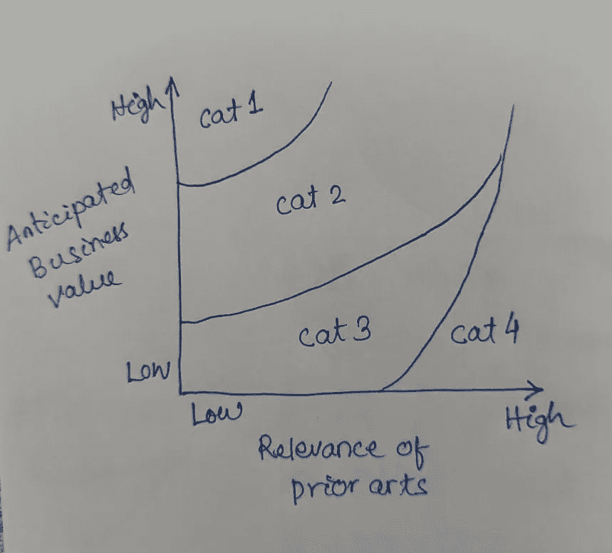

# 数据和人工智能领域的创新和专利思维

> 原文：<https://towardsdatascience.com/innovation-and-patent-mindset-in-data-ai-62a4be5cd85a?source=collection_archive---------60----------------------->

## **我们如何专注于推动数据和人工智能创新，以及在专利建设过程中需要考虑哪些因素才能产生更大影响**

当我写下这些想法时，我希望所有人在这个前所未有的时代都平安无事。当我们被逼到绝境或受到挑战时，我们通常会尽力做到最好。如果你参考下面埃德蒙·姆比安卡的话，这反映了一些事情。

*“当你不害怕无情地推动自己推倒所有限制之墙时，伟大就会发生”——埃德蒙·姆比亚卡*

创新和数据科学之间存在明显的界限。成功的端到端数据科学项目的框架需要结构化的思维、迭代方法和多种方法或实验来产生成功的影响。创新思维是非常重要的，也是相互关联的。

照片由[朱尼尔·费雷拉](https://unsplash.com/@juniorferreir_?utm_source=medium&utm_medium=referral)在 [Unsplash](https://unsplash.com?utm_source=medium&utm_medium=referral) 拍摄

当我们寻求创新、撰写披露或专利时，我们需要注意以下关键方面。这在数据科学的背景下非常重要。

*   这个想法是新的吗？即什么是“新颖性”
*   它不明显吗？
*   有用吗？
*   是否启用，能否以适当的细节实现？
*   它有重大的商业价值和影响吗？

在处理数据科学设置时，以上几点完全相同。我们思考业务问题，了解目标，进行设计思考以推测问题和解决方法，更重要的是了解每个角色的想法和期望，将业务问题与数据问题相关联，进行探索性的数据分析，进行数据管理、数据争论、针对“需求”的数据转换，定义或制定功能，使用功能选择算法，试验各种不同的算法组合，评估结果，再次迭代并继续，直到我们获得最佳结果，呈现结果以衡量影响和价值创造，结束反馈循环等等。这些方法中的大多数都是迭代的，在过程的大部分时间里需要“跳出框框”的思维，不同的方法可以是新颖的，在分析的基础上选择“最佳方法”。

创新文化，它的审查过程，思考多种方法来定义一个新的方法是非常关键的核心创新。当我们处理数据科学过程来解决任何业务问题时，这反映了很多。同时，我们需要很好地理解这个过程。我们需要在数据科学的披露创造过程中引导自己。

以下是关于可视为检查表项目的关键维度的想法:

**清单 1:检查想法是否“新颖”/“新颖”**

由[杰斯·贝利](https://unsplash.com/@jessbailey?utm_source=medium&utm_medium=referral)在 [Unsplash](https://unsplash.com?utm_source=medium&utm_medium=referral) 上拍摄

a)它与我开发或使用的任何产品、方法相似吗？据我所知，还有类似的吗？

b)它与我所学的任何技术相似吗？与我的相关学习技巧有关联吗？

c)在一些网站上进行搜索，例如谷歌专利、谷歌学术、ResearchGate、CiteSeer、IEEE 电子图书馆、ACM 数字图书馆等，看看是否有更接近这个想法的网站已经存在。

d)您可能以前没有使用过这些产品，但是它们可能以某种形式适用。我们能检查那个方面吗？

e)让我们参考专利数据库，在那里我们将得到一些描述的类似方法。他们离这个发明近吗？

f)在任何一家公司，都会有当地的知识产权律师或相关机构在这个过程中提供帮助。最好带着这些发现和信息去找他们，解决他们可能有的任何疑问。

*现有技术搜索:*

在进行披露工作时，先有技术搜索极其重要。我们需要确保搜索与我们的方法相关和接近的现有技术，以及我们的方法或想法如何区别于其他现有技术。现有技术可以是许多不同的形式，如出版物或现有产品，或服务，或一些带有公式方法的博客文章等。出版物(可能是最容易获得的现有技术类型)的例子可以是专利本身、用户手册、网页、产品手册、教科书、公开的专利申请、杂志、期刊、会议论文、博士论文和类似的人工制品。对于我们来说，将出版物视为现有技术，其参考日期必须早于我们申请的申请日。

**清单 2:检查想法是否“不明显”**

Sharon McCutcheon 在 [Unsplash](https://unsplash.com?utm_source=medium&utm_medium=referral) 上拍摄的照片

非显而易见往往会绊倒新的评估者，因为显而易见的法律概念比显而易见的直觉概念更精确。充分理解和内化法律概念需要一些实践。

对于普通技术人员来说，一些有用的操作模型可以使用不同的点，例如大专文凭持有者、受过相关产品培训的工程或计算机科学课程的特定级别、了解 SQL、存储过程及其用法的从业者等等。

清单 3:检查想法是否“有用”？

由 [Kaung Myat Min](https://unsplash.com/@kaung_myat_min?utm_source=medium&utm_medium=referral) 在 [Unsplash](https://unsplash.com?utm_source=medium&utm_medium=referral) 上拍摄的照片

我们可以着眼于在我们的创新中看到“有用性”方面，并尝试基于以下一些问题进行探索。

*   它解决什么问题？(从数据科学的角度来看，这看起来很合适，因为我们从项目开始就已经着手于基于业务需求的问题解决方法)
*   它是否支持任何功能来执行某项功能？
*   如果实现的话，发明会像描述的那样工作吗？在评估过程中，描述不需要完整，只要合理就行。(从数据科学的角度来看，我们需要确保我们有一个可重现的方法，并有清晰的重现步骤。这一点非常重要，因为再现性是数据科学解决方案的关键方面，以证明基于特定输入的结果，从而建立管道中使用的通用方法)

**清单 4:检查想法是否处于“启用实施”模式？**

易于实施:

*   这个想法是否足够详细，可以帮助 XYZ 轻松实现和使用它？(从数据科学的角度来看，概述整个方法的详细步骤是必须的)
*   XYZ 解释过数据如何转化为结果吗？(如下图所示)

缺乏对清单要点的支持:

检查想法中的以下短语:

*   “本发明可以随时间分析系统”
*   “建议使用可以解决业务问题的预测分析算法”
*   “系统能够解释参数来解决问题”
*   “系统中的智能代理可用于做出决策”
*   “数据被传送到智能系统”

**清单 5:检查创意是否有“商业价值”？**

詹姆斯·图斯在 [Unsplash](https://unsplash.com?utm_source=medium&utm_medium=referral) 上的照片

*   它能被检测到吗？(例如，如果是:发明是否在用户界面上，或在文档或其他描述中表现出来，等等？这有助于熟悉特定领域的任何人创建可实施的解决方案或产品)
*   它有战略价值吗？(例如，如果是:现有产品确实使用它，或者战略产品将来可能会使用它；基于这一点，这一想法可能有助于某一特定公司阻止竞争对手在同一领域创造价值)
*   有许可价值吗？(例如，它可能很棒:即可能被广泛实践或被主要竞争对手实践；也很难解决)

如果我们在预期商业价值和审查过程中有争议的发明现有技术的相关性之间绘制图表，我们可以将四个更广泛的领域分类如下:

第 1 类或第 1 类—哪个具有最高的商业价值

第 2 类或第 2 类——大多数发明可能属于这一类，具有商业价值，但低于第 1 类

第 3 类或第 3 类—商业价值稍低

第 4 类或第 4 类—完全没有商业价值，可以放弃

因此，总而言之，创新和数据科学是相互关联的。迭代方法有助于定义多种方法，并鼓励基于实验的结果，在结果中进行细化，以获得更好的成功，并对数据和人工智能产生影响。整个框架有助于建立创新思维，同时推动端到端数据科学计划取得成功。需要考虑诸如新颖性、有用性、非显而易见性、可实施性、可检测性、商业价值等关键方面。我们还必须考虑如何以这样一种方式创造创新，这种方式可能属于上述示意图中的类别 1 和类别 2，这意味着商业价值较高，而现有技术的相关性相对较低。

***免责声明*** *:这里的帖子是来自我的经验、想法和各种来源的阅读的个人观点，不一定代表任何公司的立场、策略或观点。*