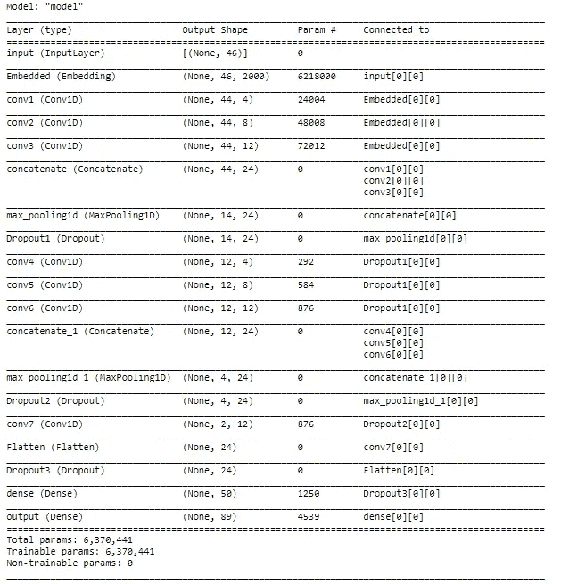
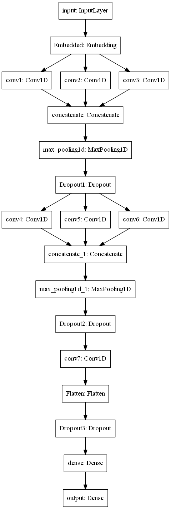
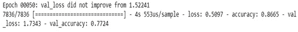
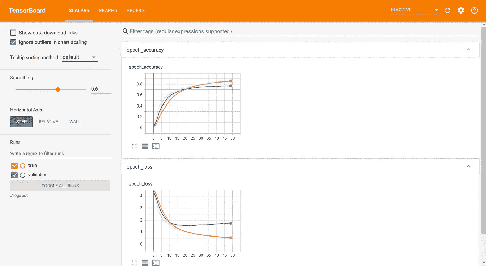

# 使用一维卷积层的创新聊天机器人

> 原文：<https://towardsdatascience.com/innovative-chatbot-using-1-dimensional-convolutional-layers-2cab4090b0fc?source=collection_archive---------27----------------------->

## [虚拟助理项目](https://towardsdatascience.com/tagged/virtual-assistant-project)

## 从头开始使用深度学习和 Conv-1D 层构建聊天机器人

【freepik.com】来源:免费图片来自

自过去十年以来，聊天机器人的受欢迎程度一直在上升。聊天机器人通常用于快速回答特定网站上最常见的问题。聊天机器人节省了时间，也减少了人力和开支。聊天机器人有很多种，每一种都专门针对一个或几个领域。了解你想构建哪种聊天机器人的最佳方法如下

> 如果你想建立聊天机器人，最好的方法是寻找你的目标受众、公司或企业。制作特定的聊天机器人是理想的，因为你可以大大提高不同任务的性能。

在本文中，我们将介绍如何使用一维卷积层构建一个很酷的聊天机器人。这个聊天机器人的目的是作为虚拟助理项目的智能聊天机器人。我将使用 witty.txt 数据集。预处理数据集的链接将在文章末尾与代码一起提供。您可以选择其他数据集，如专业数据集或护理数据集。我更喜欢机智的数据集，因为我更喜欢从我的聊天机器人那里收到讽刺的有趣评论，而不是严肃的东西。另一组数据的链接可以从[这里](https://github.com/microsoft/BotBuilder-PersonalityChat/tree/master/CSharp/Datasets/qnaFormat/english)查阅。这是微软官方的 bot builder 个性聊天。都是问答的形式。英语中的其他个性聊天数据集是关心、热情、友好和专业的。你可以根据自己的方便随意选择其中的任何一个。

> ***注:*** *这是虚拟助手系列的 part-3。同一主题将有更多即将到来的部分，我们将介绍如何使用深度学习技术和 python 构建自己的虚拟助手。*

[来源:](https://www.freepik.com/free-vector/cute-bot-say-users-hello-chatbot-greets-online-consultation_4015765.htm#page=1&query=chatbot&position=0)来自 freepik.com 的免费图片

# 简介:

我们将使用一维卷积层构建一个创新的聊天机器人。这种方法允许我们最大化或最小化一组特定值的强度。这最适合文本数据，因为我们将对一组选择性文本数据进行优先级排序。我们将使用基于“文本分类”的方法来构建我们的聊天机器人。为了更好地了解 1-D 卷积层，我们可以将它们称为创建卷积核的层，卷积核在单个空间(或时间)维度上与层输入进行卷积，以产生输出张量。如果 *use_bias* 为真，则创建一个偏置向量并添加到输出中。最后，如果*激活*不是“*无”*，它也应用于输出。要了解更多关于一维卷积层的信息，请参考[这里的](https://keras.io/api/layers/convolution_layers/convolution1d/)。现在有很多独特的聊天机器人正在开发，对它们的需求比以往任何时候都高。聊天机器人将在我们的虚拟助理项目中发挥重要作用，因为我们将使用它与我们交流。当我们不在的时候，聊天机器人也可以代替我们与其他用户交流。

# 方法:

我们将为我们的聊天机器人使用基于“文本分类”的方法。我们的第一步是将 witty.txt 数据集加载到一个变量中。我将在文章的最后在 GitHub 库中提供预处理过的数据集。这意味着我们不需要太担心清洁部分。然而，重要的是将我们的问题和回答分开，并将它们存储在单独的变量中。然后，我们将继续将数据分为训练数据集和验证数据集。

我们的下一步是将数据标记化，并将文本转换成序列。然后，在将我们的测试和训练响应转换为分类数据后，我们将对数据应用填充。最后，我们将确保扩展训练和测试问题的维度，以便以合适的格式通过一维卷积层。如果需要，我们也可以使用手套向量，因为它包含预先训练的单词向量。

然后，我们将继续构建我们的模型架构，该架构将使用大量一维卷积层完全定制。然后，我们将查看模型图并训练我们的模型，即拟合模型。最后，我们将使用图表可视化模型在训练和验证数据上的性能。我们还将研究如何使用我们保存的权重建立一个预测网络。

[来源:](https://unsplash.com/photos/SNf-hZz6zOY)照片由 Cookie 在 unsplash 上的 Pom

# 数据预处理:

如前所述，我将使用 witty.txt 数据集。我们将对数据集执行的第一步是将它们分成两个独立的列表。这些列表将是问题列表和响应列表。问题列表将存储所有问题，响应列表将存储所有相应的答案。一堆问题有很多重复的答案。总共有 89 个独特的答案，但重复是有意义的。这是因为许多问题可能有几乎相同的答案。

隔离前的数据集如下所示:

> ['你能问我一些关于我的事情吗？'，“不用了，我很好。"]

将数据集分开后，数据集的第一个问题和答案如下所示:

> 问题 1:你能问我一些关于我的事情吗？回答 1:不，我很好。

完成分离步骤后，我们将当前的问题和响应数据集以 80:20 的比例分成训练和验证数据集。

在下一步中，我们将使用 Keras Tokenizer 函数对数据进行标记。

**标记化:** **标记化**是指将较大的文本数据、短文或语料库拆分成较小的片段。这些较小的片段可以是较小的文档或文本数据行的形式。它们也可以是一本单词词典。

Keras **Tokenizer** 允许我们向量化文本语料库，方法是将每个文本转换为整数序列(每个整数是字典中某个标记的索引)或向量，其中每个标记的系数可以是二进制的，基于单词计数，基于 tf-idf。要了解更多关于使用 Keras 的 Tokenizer 类和文本数据预处理的信息，请访问[这里](https://keras.io/api/preprocessing/text/)。

在训练和测试问题的标记化之后，我们将把数据集的标记化器转储到 pickle 文件中。这可以在以后通过模型执行预测时加载 pickle 文件来访问。我们还将把训练和测试响应转换成分类格式，即把单词转换成二进制整数的向量类。

然后，我们将填充相应的问题训练和测试序列。这是为了确保我们的培训和验证输入具有固定的形状。最后一步是将测试和训练输出扩展成一个三维数组。这是将输入传递到 1-D 卷积层所需的形状。预处理的代码片段如下所示。完整的代码将在文章的最后提供，并带有一个到 GitHub 库的链接。

来源:克里斯托弗·高尔在 unsplash 上拍摄的照片

# 构建模型:

我们将以函数式 API 的方式构建模型。我们将有一个输入层，它将接受(max_len，)形状的输入。这是因为我们所有的文本数据都是按照最大长度的顺序填充的。因此，最大尺寸将被限制为最大长度。然后，我们将把这个输入传递到一个嵌入层。这样做的主要原因是为更高维度的输入数据创建嵌入，即将正整数转化为固定大小的密集向量。

然后我们将这个嵌入层传递到 3 个独立的一维卷积层。每个 conv-1D 层都有一个大小递增 4 的过滤器。我们从第一个 conv-1D 层的 4 个初始滤波器开始，然后我们有 8 个用于下一个卷积层，12 个用于最后的 conv-1D 层。它们都具有 relu 的激活功能。这通常是大多数任务的首选激活功能。我们将内核大小设为 3，并将初始化器设为 he_normal。我们将连接为 3 个卷积层接收的整个输出，并通过最大池层传递它们。maxpool 层用于对从 concatenate 层接收的输出进行下采样。然后，我们将通过一个辍学层。这是为了避免在文本数据的验证过程中过度拟合。

我们的下一步是将整个数据从漏失层传递到另外 3 个 conv-1D 层。这 3 个卷积层的表现和我们之前的完全一样。我们不需要修改任何东西。计算完这三个卷积层后，我们将再次连接它们，并通过 maxpool 1-D 层进行下采样。然后，我们将通过下一个丢弃层来丢弃一些额外的数据，以防止过度拟合。

下一个代码块将由最终的 1-D 卷积层、展平层和最终的下降层组成。我们的下一步是将数据从之前的 dropout 层传递到最终的 conv1D 层。我们将使接收到的输出变平，这样我们就可以让它通过密集层。在通过密集层之前，我们将再次使用最终下降来防止验证过程中的过拟合。

我们代码的最后一块将包含完全连接的层。我们将有一个带有 relu 激活功能的隐藏层，有 50 个隐藏节点。然后，我们将得到具有 softmax 激活函数的最终输出层，节点的数量将等于可能的唯一输出的数量。softmax 层将为我们提供每个预测的概率列表。最后，我们将使用输入层和输出层来定义我们的模型。读者可以随意添加或删除某些层。探索和试验各种激活函数、初始化器和单元数量是很好的。

让我们看看构建模型的全部代码。然后，我们将继续查看模型概要和模型图。

## 模型摘要:

## 模型图:

# 回访:

我们将使用的回调类似于我们在虚拟助手项目系列中以前的回调。让我们先看看它们——

我们将导入培训我们的模型所需的 3 个回调。3 个重要的回调是 ModelCheckpoint、ReduceLROnPlateau 和 Tensorboard。让我们看看每个回调函数执行什么任务。

1.  **ModelCheckpoint** —这个回调用于存储我们的模型在训练后的权重。通过指定 save_best_only=True，我们只保存模型的最佳权重。我们将使用 val_loss 指标来监控我们的培训。
2.  **ReduceLROnPlateau** —该回调用于在指定数量的时期后降低优化器的学习率。这里，我们将耐心指定为 3。如果损失在 3 个时期后没有改善，那么我们的学习率相应地降低 0.2 倍。这里用于监控的度量是损失函数。
3.  **tensor board**—tensor board 回调用于绘制图形的可视化，即精度和损耗的图形绘制。这里，我们将只查看训练和验证数据的图。

我们将把基于度量损失的最佳模型保存到文件 chatbot.h5 中。在访问预测功能和尝试预测每个问题的回答时，该文件将是至关重要的。我们将等待 3 个时期来改善损失。如果没有改善，那么我们将降低学习率。最后，如果需要，我们将使用 tensorboard 函数来可视化图形和直方图。

# 编译并拟合模型:

下面是编译和拟合模型的代码块。

我们正在最后一步编译和装配我们的模型。在这里，我们正在训练模型并将最佳权重保存到 chatbot.h5，这样我们就不必重复地重新训练模型，并且可以在需要时使用我们保存的模型。在这里，我对训练和验证数据都进行了训练。但是，如果您愿意，可以选择仅使用训练数据进行训练。我们使用的损失是 categorical _ crossentropy，它计算标签和预测之间的交叉熵损失。我们将使用的优化器是 Adam，学习率为 0.001，我们也将使用度量准确性来编译我们的模型。经过 50 个时期的训练，我们的结果如下所示:

## 图表:

# 预测:

我们将对用户输入的文本进行预测。为此，加载我们存储在 pickle 文件中的记号赋予器是很重要的。然后，我们将加载我们保存的模型的权重。我们将对输入的文本序列进行标记和填充。在标记化和填充之后，我们将预测用户对输入问题的响应。预测将通过保存的模型权重来完成。我们加载的模型将做出每一个预测。我们将在预测阶段使用 try 和 except 语句块。如果在预测过程中出现错误，我们不希望程序被终止。只有当用户明确传递“停止脚本”命令时，程序才会结束。让我们看一些使用这个脚本的预测—

> 进入你的台词:怎么了
> 有时候我喜欢从令人敬畏的状态中休息一下。
> 输入你的台词:你还好吗？
> 不，我很好。
> 
> 进入你的行列:你觉得什么有吸引力？我不是公认的美容专家。
> 输入你的台词:停止脚本
> 结束节目…..

该模型能够对大多数问题做出合理的预测。由于我们的模型在大约 70%的验证准确率后开始过度拟合，因此还有改进的空间。更多的事情，如正规化和寻找最佳辍学率是一些可以改善。可以通过更好的预处理步骤对该模型稍加改进。也可以使用其他方法，如注意顺序到顺序的实现。这篇文章的完整代码将在文章的下一部分提供。

> **注意:**有时当你输入一个文本时，它可能不会返回任何输出。这可能是因为它做出了越界预测。然而，重新输入相同的文本，它会给你一个输出。

来源:卡洛斯·穆扎在 unsplash 上的照片

# 观察:

> 我们能够实现总体高准确度和验证准确度以及总体低损耗和验证损耗。该模型能够对用户输入的文本数据做出合理的预测。如前所述，还有改进的余地。总而言之，这是一个基于“文本分类”的聊天机器人的好模型。

就这样，我们到了文章的结尾。我们能够使用一维卷积层开发一个创新的聊天机器人。该项目的完整代码可以在这里找到。请随意探索和创新供参考的笔记本电脑。 [GitHub](https://github.com/Bharath-K3/Innovative-Chatbot-using-1-Dimensional-Convolutional-Layers) 库包含了这个项目所需的所有文件和笔记本。我希望你们都像我写这篇文章一样喜欢阅读这篇文章。大呼[应用 AI](https://www.appliedaicourse.com/) 牛逼。如果你们发现任何改进，请随时告诉我。非常感谢你的时间，我希望你们都有一个美好的一天！