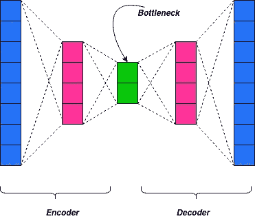
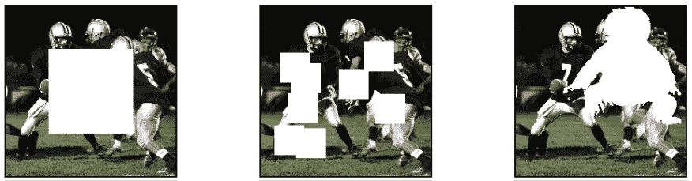
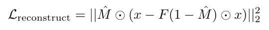
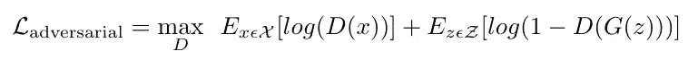
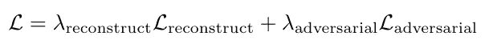
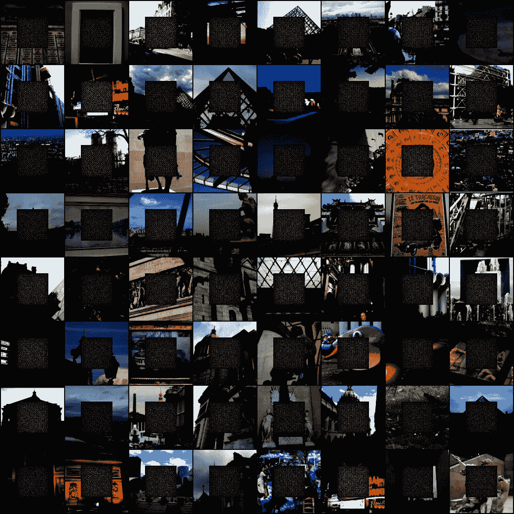
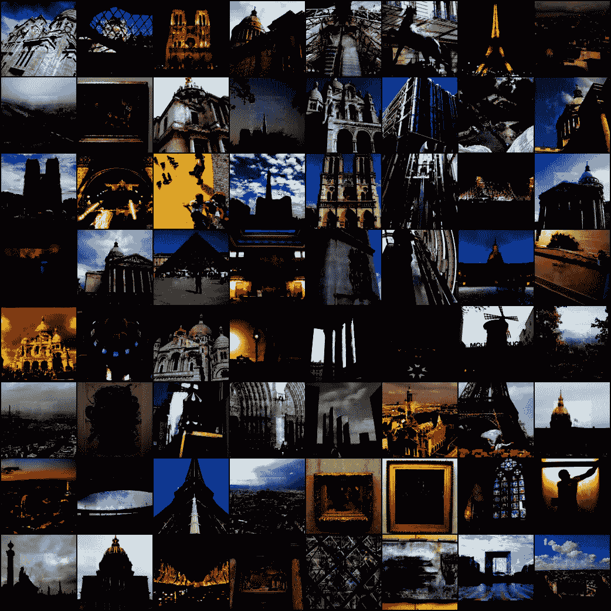
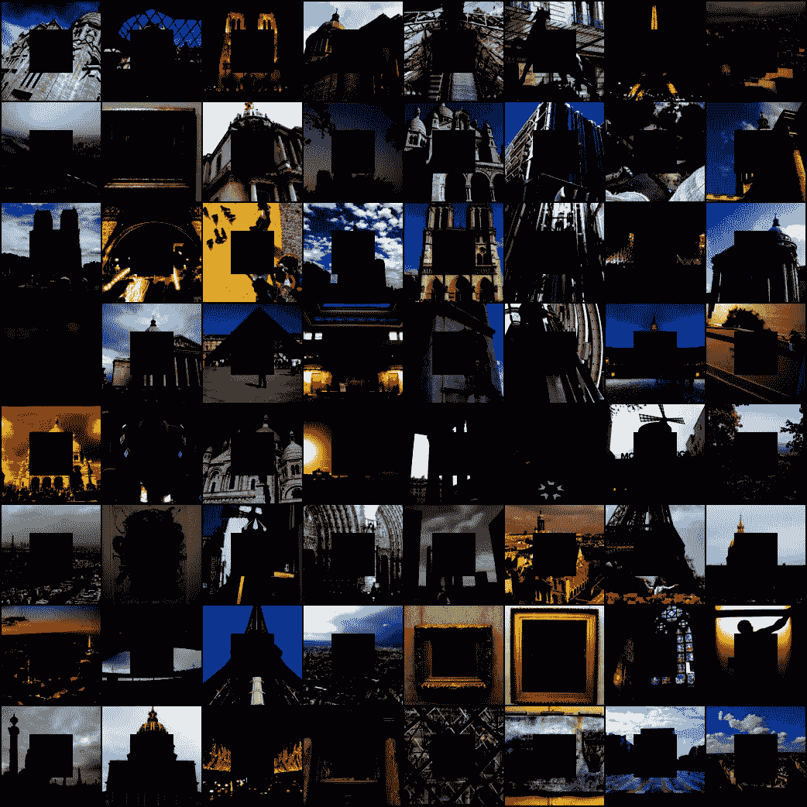

# 用人工智能修复——找回你的图像！[PyTorch]

> 原文：<https://towardsdatascience.com/inpainting-with-ai-get-back-your-images-pytorch-a68f689128e5?source=collection_archive---------10----------------------->

## Python-PyTorch

## 用 PyTorch 和 Python 解决图像修复问题

照片由[詹姆斯·庞德](https://unsplash.com/@jamesponddotco?utm_source=medium&utm_medium=referral)在 [Unsplash](https://unsplash.com?utm_source=medium&utm_medium=referral) 拍摄

你知道你那本布满灰尘的相册里的童年旧照片可以修复吗？是啊，那种每个人都牵着手享受生活的感觉！不相信我？看看这个—

> **修复**是一个[保护](https://en.wikipedia.org/wiki/Art_conservation)过程，在这个过程中，艺术品受损、退化或缺失的部分被填充，以呈现完整的图像。[【1】](https://en.wikipedia.org/wiki/Inpainting#cite_note-1)此工艺可应用于实物和数字艺术[媒介](https://en.wikipedia.org/wiki/List_of_art_media)，如[油画](https://en.wikipedia.org/wiki/Oil_painting)或[丙烯](https://en.wikipedia.org/wiki/Acrylic_paint)画、[化学摄影版画](https://en.wikipedia.org/wiki/Photographic_printing)、[三维雕塑](https://en.wikipedia.org/wiki/Sculpture)，或数字[图像](https://en.wikipedia.org/wiki/Digital_imaging)和[视频](https://en.wikipedia.org/wiki/Digital_video)。——[https://en.wikipedia.org/wiki/Inpainting](https://en.wikipedia.org/wiki/Inpainting)

图像修复是人工智能研究的一个活跃领域，人工智能已经能够提出比大多数艺术家更好的修复结果。在本文中，我们将讨论使用神经网络的图像修复，特别是上下文编码器。本文解释并实现了在 2016 年 CVPR 上展示的关于上下文编码器的研究工作。

## 上下文编码器

要开始使用上下文编码器，我们必须了解什么是*自动编码器*。自动编码器在结构上由编码器、解码器和瓶颈组成。通用自动编码器旨在通过忽略图像中的噪声来减小图像尺寸。然而，自动编码器并不专用于图像，也可以扩展到其他数据。自动编码器有特定的变体来完成特定的任务。

自动编码器架构

现在我们知道了自动编码器，我们可以将上下文编码器描述为自动编码器的一个类比。*上下文编码器是一个卷积神经网络，它被训练成根据图像区域的周围环境生成任意图像区域的内容*——即上下文编码器接收图像区域的周围数据，并试图生成适合图像区域的内容。就像我们小时候玩拼图游戏一样——只是我们不需要生成拼图块；)

我们这里的上下文编码器由一个将图像的上下文捕获为紧凑的潜在特征表示的编码器和一个使用该表示产生缺失图像内容的解码器组成。缺少图像内容？—因为我们需要一个庞大的数据集来训练神经网络，所以我们不能只处理修复问题图像。因此，我们从正常的图像数据集中分割出部分图像，以产生修补问题，并将图像馈送到神经网络，从而在我们分割的区域产生缺失的图像内容。

[重要的是要注意，输入到神经网络的图像有太多的缺失部分，经典的修复方法根本无法工作。]

## 氮化镓的使用

GANs 或生成对抗网络已被证明对图像生成极其有用。生成性对抗网络运行的基本原理是，一个生成器试图“愚弄”一个鉴别器，而一个确定的鉴别器试图得到该生成器。换句话说，两个网络分别试图最小化和最大化一个损失函数。

更多关于甘氏的信息在这里—[https://medium . com/@ hmrishavbandyopadhyay/generative-adversarial-networks-hard-not-EEA 78 C1 d3c 95](https://medium.com/@hmrishavbandyopadhyay/generative-adversarial-networks-hard-not-eea78c1d3c95)

## 区域遮罩

区域遮罩是我们遮挡的图像部分，以便我们可以将生成的修复问题反馈给模型。通过遮挡，我们只是将该图像区域的像素值设置为零。现在，我们有三种方法可以做到这一点—

1.  中心区域:将图像数据分块的最简单方法是将中心正方形小块设置为零。虽然网络学习修复，但是我们面临泛化的问题。网络不能很好地概括，只能学习低级特征。
2.  随机块:为了解决网络像在中心区域掩码中那样“锁定”在被掩码区域边界上的问题，掩码过程被随机化。不是选择单个正方形小块作为遮罩，而是设置多个重叠的正方形遮罩，这些遮罩占据图像的 1/4。
3.  随机区域:然而，随机块屏蔽仍然具有网络锁定的清晰边界。为了解决这个问题，必须从图像中去除任意形状。可以从 PASCAL VOC 2012 数据集获得任意形状，将其变形并作为遮罩放置在随机图像位置。

从左起— a)中心区域遮罩，b)随机块遮罩，c)随机区域遮罩[来源:[https://arxiv.org/abs/1604.07379】](https://arxiv.org/abs/1604.07379)

在这里，我只实现了中心区域的蒙版方法，因为这只是让你开始用人工智能修复的一个指南。请随意尝试其他遮罩方法，并在评论中告诉我结果！

## 结构

现在，您应该对该模型有所了解了。让我们看看你是否正确；)

该模型由编码器和解码器部分组成，构建了该模型的上下文编码器部分。这部分也作为发生器产生数据，并试图欺骗鉴别器。鉴别器由卷积网络和 Sigmoid 函数组成，最终输出一个标量。

## 失败

模型的损失函数分为两部分:

1.  重建损失-重建损失是 L2 损失函数。它有助于捕捉缺失区域的整体结构及其上下文的一致性。数学上，它被表达为—

L2 损失

这里需要注意的是，只使用 L2 损失会给我们一个模糊的图像。因为模糊的图像减少了平均像素误差，从而使 L2 损失最小化——但不是以我们希望的方式。

2.对抗性损失——这试图使预测“看起来”真实(记住生成器必须欺骗鉴别器！)这有助于我们克服失去 L2 会给我们带来的模糊印象。数学上，我们可以表达为—

对抗性损失

这里一个有趣的观察是，对抗性损失促使整个输出看起来真实，而不仅仅是丢失的部分。换句话说，对抗性网络使整个图像看起来更真实。

总损失函数:

模型的总损失

## 让我们建造它！

现在，既然我们已经清楚了网络的要点，让我们开始建立模型。我将首先建立模型结构，然后进入训练和损失函数部分。该模型将在 python 上 PyTorch 库的帮助下构建。

让我们从发电机网络开始:

网络的生成器模型-作为 python 模块实现

现在，鉴别器网络:

鉴频器网络——实现为一个模块

现在开始训练网络吧。我们将把批量大小设置为 64，将时期数设置为 100。学习率设置为 0.0002。

用于训练发生器和鉴别器的训练模块

## 结果

让我们看一看我们的模型已经能够构建什么！

第零时段的图像(噪声)

零历元图像

第 100 个纪元的图像—

第 100 个纪元的图像

让我们看看模型中包含了什么—

中央区域掩蔽图像

*那个*来自*这个*？耶！很酷吧。

实现您的模型版本。观看它重现你童年的照片——如果你足够优秀，你可能会重现人工智能修复的未来。那么，你还在等什么？

如果你的实现有任何问题，请在评论中告诉我。来帮忙了:)

查看我的博客以获得更快的更新，并订阅优质内容:D

 [## 卷积博客

### 克罗伊斯，吕底亚(小亚细亚)的国王，曾经问特尔斐的神谕，他是否应该对波斯开战…

www.theconvolvedblog.vision](https://www.theconvolvedblog.vision) 

*Hmrishav Bandyopadhyay 是印度 Jadavpur 大学电子与电信系的二年级学生。他的兴趣在于深度学习、计算机视觉和图像处理。可以通过以下方式联系到他:hmrishavbandyopadhyay@gmail.com | |*[*https://hmrishavbandy . github . io*](https://hmrishavbandy.github.io)