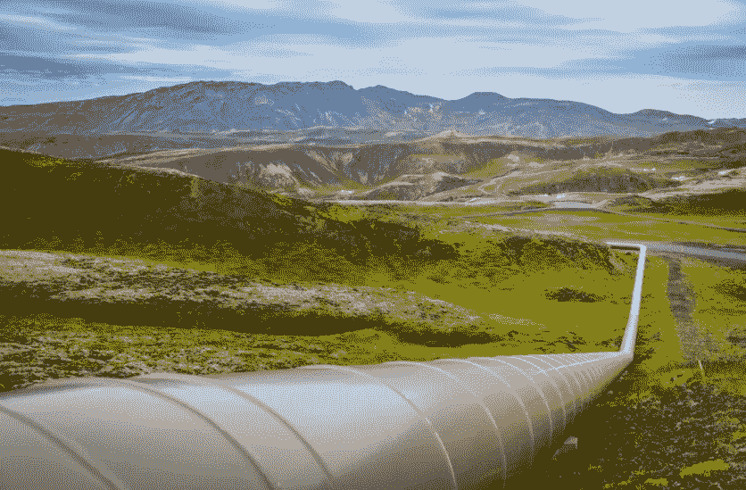
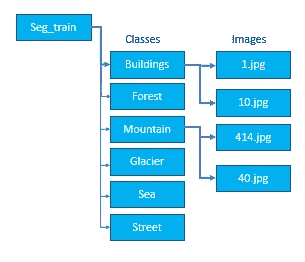
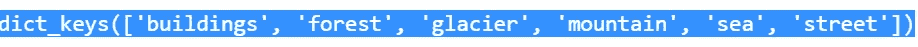
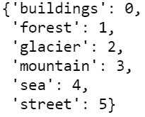

# 使用 Keras 和 TensorFlow 的图像输入管道

> 原文：<https://towardsdatascience.com/input-pipeline-for-images-using-keras-and-tensorflow-c5e107b6d7b9?source=collection_archive---------16----------------------->

## 使用 Keras 和 TensorFlow 为深度学习模型的自定义图像数据集创建输入管道的指南

***其次，在本系列的*** [***中，学习如何使用 Kera 预处理、Tensorflow 和 tf.data 从自定义数据***](/loading-custom-image-dataset-for-deep-learning-models-part-1-d64fa7aaeca6) ***创建输入管道来加载和创建图像序列和测试数据集。***



照片由[迈克·本纳](https://unsplash.com/@mbenna?utm_source=unsplash&utm_medium=referral&utm_content=creditCopyText)在 [Unsplash](https://unsplash.com/s/photos/image-pipeline?utm_source=unsplash&utm_medium=referral&utm_content=creditCopyText) 上拍摄

这里使用的数据集是来自 Kaggle 的 [Intel 图像分类](https://www.kaggle.com/puneet6060/intel-image-classification/version/2)，文章中的所有代码都在 Tensorflow 2.0 中工作。

英特尔图像分类数据集分为训练数据集、测试数据集和验证数据集。我们将仅使用训练数据集来学习如何使用不同的库加载数据集。

# 使用 Keras 预处理创建深度学习的输入管道

***imagedata generator***类为图像数据生成批量张量，并将像素值从 0 到 255 缩小到 0 到 1 之间的值。

我们可以对训练图像数据集应用不同的实时数据增强，如旋转图像、缩放图像、水平翻转或垂直翻转等。*数据扩充不适用于验证或测试数据集*。

```
**import pandas as pd
import numpy as np
import os
from tensorflow.keras.preprocessing.image import ImageDataGenerator, img_to_array, load_img, array_to_img
import tensorflow as tf****IMG_WIDTH=200
IMG_HEIGHT=200
batch_size=4****train_dir = r'\CV\Intel_Images\seg_train\seg_train'
test_dir  = r'\CV\Intel_Images\seg_pred\seg_pred'
val_dir   = r'\CV\Intel_Images\seg_test\seg_test'****image_gen_train = ImageDataGenerator(rescale=1./255, 
                                     zoom_range=0.2, 
                                     rotation_range=65,
                                     shear_range=0.09,
                                     horizontal_flip=True,
                                     vertical_flip=True)****image_gen_val = ImageDataGenerator(rescale=1./255)**
```

一旦***imagedata generator***的实例被创建，使用***flow _ from _ directory()***从目录 ***中读取图像文件。***

***【flow _ from _ directory()***期望图像数据具有如下所示的特定结构，其中每个类具有一个文件夹，并且该类的图像包含在该类文件夹中。



文件夹结构为***flow _ from _ directory()imagedata generator*方法**

```
**train_data_gen = image_gen_train.flow_from_directory(batch_size=batch_size,directory=train_dir,
shuffle=True,                                                     target_size=(IMG_HEIGHT, IMG_WIDTH,3),                                                     class_mode='sparse')****val_data_gen = image_gen_val.flow_from_directory(batch_size=batch_size,
directory=val_dir,                                                 target_size=(IMG_HEIGHT, IMG_WIDTH,3),                                                 class_mode='sparse')**
```

***class _ indexes . keys()***将从字典中的数据集中提取类名

```
**train_data_gen.class_indices.keys()**
```



**创建一个简单的深度学习模型，编译它，并使用 Keras 预处理生成的数据集训练模型**

```
**model=tf.keras.Sequential(
        [
            tf.keras.layers.InputLayer(input_shape=(200, 200, 3)),
            tf.keras.layers.Conv2D(filters=32, kernel_size=3, strides=(2, 2), activation='relu'),
            tf.keras.layers.Conv2D(filters=64, kernel_size=3, strides=(2, 2), activation='relu'),
            tf.keras.layers.Flatten(),
            tf.keras.layers.Dense(6)
         ])**#Compile the model
**model.compile(optimizer='rmsprop', loss='sparse_categorical_crossentropy',
metrics=['accuracy'])**#Fitting the model
**history = model.fit(train_data_gen,steps_per_epoch=len(train_data_gen)//batch_size, validation_data=val_data_gen, epochs=2)**
```

# 使用 TensorFlow 为深度学习创建输入管道

使用 Tensorflow 的输入管道将创建张量作为模型的输入。

1.  **使用**打开图像文件**tensor flow . io . read _ file()**
2.  **解码文件的格式**。这里我们有一个 JPEG 文件，所以我们用三个颜色通道的 ***decode_jpeg()*** 。
3.  **调整图像尺寸**以匹配深度学习模型的输入层的输入尺寸。
4.  **使用 TensorFlow** 将图像转换为 float 数据类型，然后**将 0 到 1 之间的值**归一化为 0 到 255。
5.  ***tf.stack()*** 创建一个堆叠的张量作为行数据

```
**def create_dataset_tf(img_folder):
    class_name=[]
    tf_img_data_array=[]   

    for dir1 in os.listdir(img_folder):
        for file in os.listdir(os.path.join(img_folder, dir1)):
            image= os.path.join(img_folder,dir1, file)
            image = tf.io.read_file(image)
            image = tf.io.decode_jpeg(image, channels=3)
            image = tf.image.resize(image, (200,200))
            image = tf.cast(image / 255., tf.float32)
            tf_img_data_array.append(image)
            class_name.append(dir1)                   
    return tf.stack(tf_img_data_array, axis=0),class_name*****img_folder=r'CV\Intel_Images\seg_train\seg_train'******tf_img_data, class_name=create_dataset_tf(img_folder)***
```

**将文本标签转换成数字代码**

为类的所有唯一值创建一个字典

```
**target_dict={k: v for v, k in enumerate(np.unique(class_name))}
target_dict**
```



根据字典将 class_names 转换成它们各自的数值

```
**target_val=  [target_dict[class_name[i]] for i in range(len(class_name))]**
```

**创建一个简单的深度学习模型，编译它，训练模型。**

它与我们之前在起诉 ***Keras.preprocessing()时创建的模型相同。*** 这里唯一的变化是输入图像数据和类名，这是一个张量值的列表来拟合模型。

```
**model=tf.keras.Sequential(
        [
            tf.keras.layers.InputLayer(input_shape=(200, 200, 3)),
            tf.keras.layers.Conv2D(filters=32, kernel_size=3, strides=(2, 2), activation='relu'),
            tf.keras.layers.Conv2D(filters=64, kernel_size=3, strides=(2, 2), activation='relu'),
            tf.keras.layers.Flatten(),
            tf.keras.layers.Dense(6)
         ])**#Compile the model
**model.compile(optimizer='rmsprop', loss='sparse_categorical_crossentropy',
metrics=['accuracy'])**#Fitting the model**history = model.fit(x=tf_img_data, y=tf.cast(list(map(int,target_val)),tf.int32), epochs=2)**
```

# 使用 tf.data 创建深度学习的输入管道

**tf.data** API 允许我们构建复杂的输入管道，同时读取不同格式的大量数据，然后应用转换。

在 TF . data for image processing pipeline 中，元素是单个训练示例，具有一对张量来表示图像及其对应的标签。

**导入库和设置基本参数**

```
**import numpy as np
import os
import tensorflow as tf****data_dir=r'\CV\Intel_Images\seg_train\seg_train'
batch_size = 32
img_height = 200
img_width = 200**
```

***TF . data . dataset . list _ files()***使用匹配模式从文件的目录列表创建数据集。

```
**list_ds = tf.data.Dataset.list_files(str(data_dir + '\\*\\*'), shuffle=False)**# get the count of image files in the train directory
**image_count=0
for dir1 in os.listdir(data_dir):
    for files in os.listdir(os.path.join(data_dir, dir1)):
        image_count+=1****list_ds = list_ds.shuffle(image_count, reshuffle_each_iteration=False)**
```

**从目录名创建类别标签**

```
**class_names = np.array(sorted([dir1 for dir1 in os.listdir(data_dir)]))**
```

**将数据集拆分为 train 和 Val。**

验证数据集占总数据集的 20%，训练数据集占整个数据集的 80%。

```
**val_size = int(image_count * 0.2)
train_ds = list_ds.skip(val_size)
val_ds = list_ds.take(val_size)**
```

为表示一对张量的单个训练/确认示例创建输入管道组件，以表示图像及其对应的标签。

```
#To process the label **def get_label(file_path):** # convert the path to a list of path components separated by sep **parts = tf.strings.split(file_path, os.path.sep)** # The second to last is the class-directory **one_hot = parts[-2] == class_names**# Integer encode the label **return tf.argmax(tf.cast(one_hot, tf.int32))**# To process the image
**def decode_img(img):** # convert the compressed string to a 3D uint8 tensor **img = tf.image.decode_jpeg(img, channels=3)** # resize the image to the desired size **return tf.image.resize(img, [img_height, img_width])**# To create the single training of validation example with image and its corresponding label **def process_path(file_path):
  label = get_label(file_path)**# load the raw data from the file as a string **img = tf.io.read_file(file_path)
  img = decode_img(img)
  return img, label**
```

设置自动调谐；这将有助于在运行时将并行性级别的决策委托给 ***tf.data*** ，以优化 CPU/GPU 利用率。

```
**AUTOTUNE = tf.data.experimental.AUTOTUNE**
# Set `num_parallel_calls` so multiple images are loaded/processed in parallel.
**train_ds = train_ds.map(process_path, num_parallel_calls=AUTOTUNE)
val_ds = val_ds.map(process_path, num_parallel_calls=AUTOTUNE)**
```

**为性能配置数据源**

为了配置数据源的性能，使用**预取**。

**TF . data 中的预取允许数据的预处理和训练步骤的模型执行重叠**。

当模型正在执行训练步骤 100 时，输入管道正在读取步骤 101 的数据。

```
**def configure_for_performance(ds):
  ds = ds.cache()
  ds = ds.shuffle(buffer_size=1000)
  ds = ds.batch(batch_size)
  ds = ds.prefetch(buffer_size=AUTOTUNE)
  return ds****train_ds = configure_for_performance(train_ds)
val_ds = configure_for_performance(val_ds)**
```

**创建一个简单的深度学习模型**

模型的输入是 ***tf.data.Dataset***

```
**model=tf.keras.Sequential(
        [
            tf.keras.layers.InputLayer(input_shape=(200, 200, 3)),
            tf.keras.layers.Conv2D(filters=32, kernel_size=3, strides=(2, 2), activation='relu'),
            tf.keras.layers.Conv2D(filters=64, kernel_size=3, strides=(2, 2), activation='relu'),
            tf.keras.layers.Flatten(),
            tf.keras.layers.Dense(6)
         ])**#Compile the model
**model.compile(optimizer='rmsprop', loss='sparse_categorical_crossentropy',
metrics=['accuracy'])**#Fitting the model
**history = model.fit(train_ds,validation_data=val_ds,epochs=3)**
```

## 结论:

我得到的最好的训练时间是使用 tf.data，因为有预取，这是使用 AUTOTUNE 在并行级别上委托决策。

## 参考资料:

[](https://keras.io/api/preprocessing/image/) [## Keras 文档:图像数据预处理

### 从目录中的图像文件生成 tf.data.Dataset。如果您的目录结构是:然后调用…

keras.io](https://keras.io/api/preprocessing/image/) 

[https://www . tensor flow . org/tutorials/load _ data/images # using _ TF data _ for _ finer _ control](https://www.tensorflow.org/tutorials/load_data/images#using_tfdata_for_finer_control)