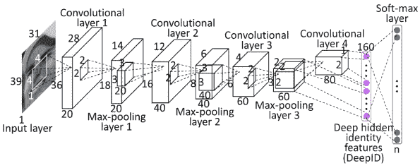
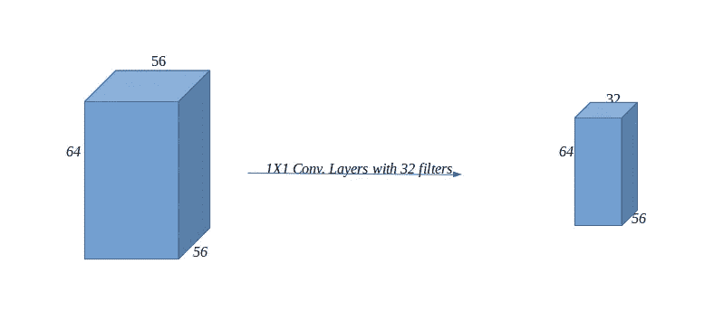

# 卷积神经网络内部

> 原文：<https://towardsdatascience.com/inside-convolutional-neural-network-e1c4c1d44fa2?source=collection_archive---------69----------------------->

作者图片

# **简介**

**卷积神经网络(CNN)** 是用于识别、分类等的深度学习算法之一。最常用于分析视觉图像，这是做、设计或实现它的困难任务之一。在这里，网络的每一层都与下一层的所有神经元相连。从 20 世纪 50 年代的一项生物学实验开始，这个领域已经有了很大的进步和发展。通常，几十年前，计算机很难识别猫和狗，但现在它已经变得像一个“*你好世界*项目”。

在过去的几十年里，**图像识别**或**计算机视觉**已经成为一个在研究、分析和预测方面越来越有兴趣、持续和进步的伟大课题。我们人类识别图像及其类型的方式，电子机器已经训练自己更深入地识别和看待事物。计算机视觉比人类视觉认知系统更擅长从图像中识别模式。

**计算机视觉**或 i **图像识别**由深度学习算法驱动，该算法使用 **CNN** 来获得图像的感觉。它不仅能识别模式，还能记忆应该为每个输入图像提供的理想输出(在*监督学习*的情况下)，或者通过扫描轮廓和颜色等特征对图像的组成部分进行分类。然后在扫描这些图像时使用这些内存。

当第一次进入 CNN 模型时，真的很难更深入地理解它。所以，我试着用基本而简短的回答来弄清楚 CNN 的内幕。

作者图片

人工神经网络中的多隐层前馈神经网络通常被称为**(DNN)**深度神经网络。卷积神经网络也是一种前馈神经网络。到目前为止，可以说 CNN 是一种广泛应用于识别和图像处理的识别算法，它具有结构简单、训练参数少、适应性强等特点。

因为神经网络接收输入(张量)并通过一系列隐藏层对其进行转换。每个隐藏层由一组神经元组成，其中每个神经元都与前一层中的所有神经元完全连接。

在每一层，单元被组织成称为特征地图的二维网格。这些特征图中的每一个都是卷积**的结果，即**相同的卷积层(*权重集*)被应用于该层中的每个位置。因此，在 2-D 网格上特定位置的单元只能从该层上类似位置的单元接收输入。并且对于特征图中的每个单元，附加到输入的权重是相同的。

当卷积层完成后，其他一些计算也完成了。其中之一是交叉特征归一化。这里，单元在特征地图中的特定空间位置的活动除以单元在其他特征地图中的相同位置的活动。另一个常见的操作是合用。池缩小了要素地图的大小。这一整套操作合起来称为**【层】**。网络的架构是由层数和与其相关的各种参数的选择来定义的，例如卷积滤波器的大小。

在卷积层内部，我们需要指定滤波器的数量、滤波器大小、填充、激活函数/非线性。

让我们和其他人讨论其中的一些。

图:CNN 架构 Img Ref:[neur idines](https://neurdiness.wordpress.com/2018/05/17/deep-convolutional-neural-networks-as-models-of-the-visual-system-qa/)

简而言之，CNN 包含以下不同层:

**a .致密层**

**b .卷积层**

**c .最大池层**

**d .辍学**

所以，了解了它的基本架构之后，问题来了**我们如何用代码设计卷积神经网络？**

这个问题看起来很难，但实际上并不难。Python 有很好的库和框架来设计神经网络，不管它是 CNN，RNN T21 还是其他什么。我们唯一需要了解的是层、池和它们内部的其他参数。

让我们用一种简单的方法来设计它，并以抽象的方式选择最佳参数和超参数。

卷积层是卷积网络的核心构建模块，承担大部分繁重的计算工作。选择层数时，最好从最小的**层**开始，然后逐渐增加层的尺寸，或者从大的模型层开始，然后逐渐减小。当使用较大的模型时，选择我们最初构建的模型有多大变得非常困难。

当更深的网络能够开始收敛时，退化问题就暴露出来了:随着网络深度的增加，精度达到饱和(这可能不足为奇)，然后迅速退化。出乎意料的是，这种退化不是由*过拟合*引起的，并且向适当深度的模型添加更多层导致*更高的训练误差。*

训练精度的下降表明，并不是所有的系统都同样容易优化。

虽然给出了相同数量的可训练参数，但可能出现在使用更多层或每层更多单元之间做出决定的情况。从这个意义上来说，通常更深比更宽更好。另一种使深度模型更容易的方法是添加连接非连续层的跳过连接。像我们可以使用 **ResNet** 架构类型的连接。

跳跃连接还为梯度更容易地回流创建了额外的路径。这使得更容易优化早期的层。在神经网络设计中，使用跳过连接是一种常见的模式。

## 汇集层

池层使表示更小、更易管理，并独立地在每个激活图上操作。汇集层接受三维体积，需要三个超参数，它们的空间范围为****F**，**步距为 S** ，并产生三维体积，其中 **W=(W1-F)/S+1** ， **H=(H1-F)/S+1** ， **D2=D1** 。池层引入了零参数，因为它计算输入的固定函数。我们不使用零填充来合并层。**

**使用内核或过滤器模型时，通常最好使用 **3X3** 或 **1X1** 内核，因为大多数时候它工作得最好。我们可以将 **3X3** 内核相互堆叠，以获得更大的感受野。使用 **1X1** 滤镜的一个好处就是可以用于降维。**

# **摘要**

**简而言之，我们可以说**卷积层**是接受体积为**W1 * H1 * D1**(**W**eights、 **H** eights 和 **D** epth)的层，这需要四个超参数，其中**滤波器**的数量被定义为 **K，**它们的**空间范围** **F，** **步距** 用数量为**的零填充** **P.** 利用上述输入，卷积层产生大小为 **W2*H2*D2** 的体积，其中 **W2 =(W1-F+2P)/S+1，H2 =(H1-F+2P)/S+1** (即**宽度**和**高度**通过对称相等地计算)和**D2 = k . **K** 重量和 **K** 偏差。在输出体积中， **d-** th 深度切片(大小为 **W2*H2** )是在输入体积上以 **S、**步距执行 **d-** th 滤波器的有效卷积的结果，然后偏移 **d-** th 偏置。****

****

**图:带过滤器的 CNN**

***感谢阅读。***

***参考文献:***

***1。*[*https://arxiv.org/pdf/1506.01195.pdf*](https://arxiv.org/pdf/1506.01195.pdf)**

***2。*[*https://en.wikipedia.org/wiki/Convolutional_neural_network*](https://en.wikipedia.org/wiki/Convolutional_neural_network)**

***3。*[*https://www . Forbes . com/sites/cognitive world/2019/06/26/the-present-and-future-of-computer-*](https://www.forbes.com/sites/cognitiveworld/2019/06/26/the-present-and-future-of-computer-)[*vision/# 185 e 3778517d*](https://www.forbes.com/sites/cognitiveworld/2019/06/26/the-present-and-future-of-computer-vision/#185e3778517d)**

**4.[https://cs231n.github.io/convolutional-networks/](https://cs231n.github.io/convolutional-networks/)**

**5.[https://neur diness . WordPress . com/2018/05/17/deep-convolutionary-neural-networks-as-models-of-the-visual-system-QA/](https://neurdiness.wordpress.com/2018/05/17/deep-convolutional-neural-networks-as-models-of-the-visual-system-qa/)**

**6.http://cs231n.stanford.edu/**

**7.【https://www.youtube.com/watch?v=fTw3K8D5xDs **

**8.[https://keras.io/api/applications/resnet/](https://keras.io/api/applications/resnet/)**

**9.[https://arxiv.org/pdf/1512.03385.pdf](https://arxiv.org/pdf/1512.03385.pdf)**

**10.[https://cs231n.github.io/](https://cs231n.github.io/)**