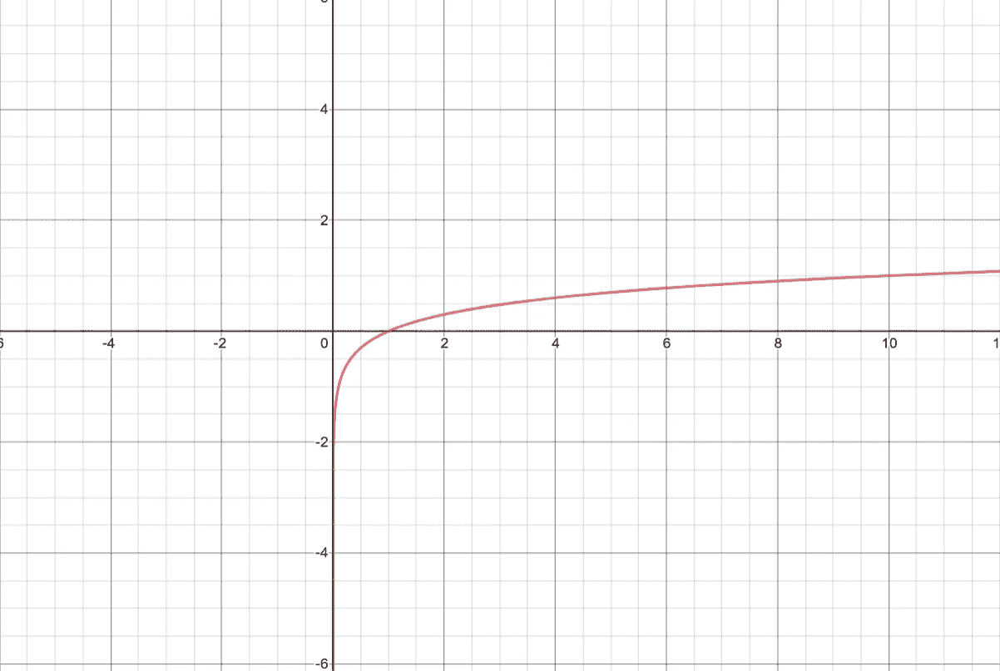
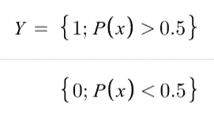
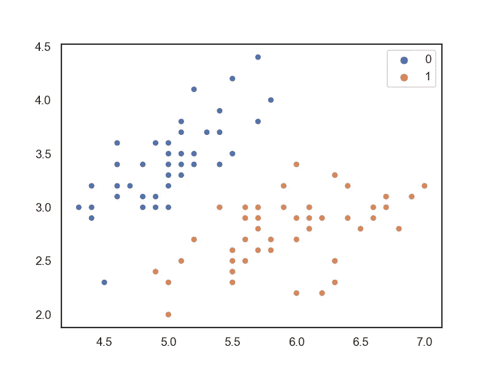
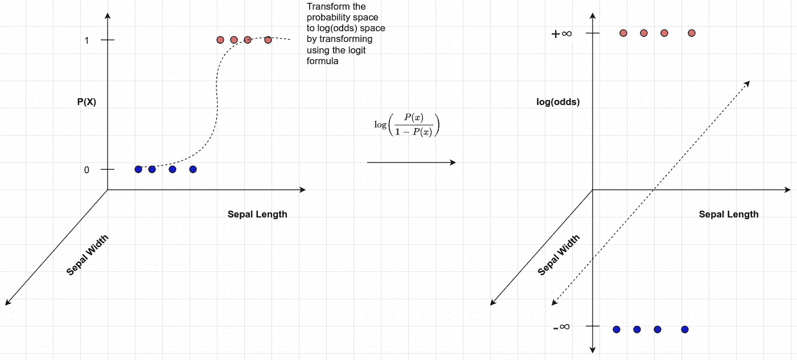
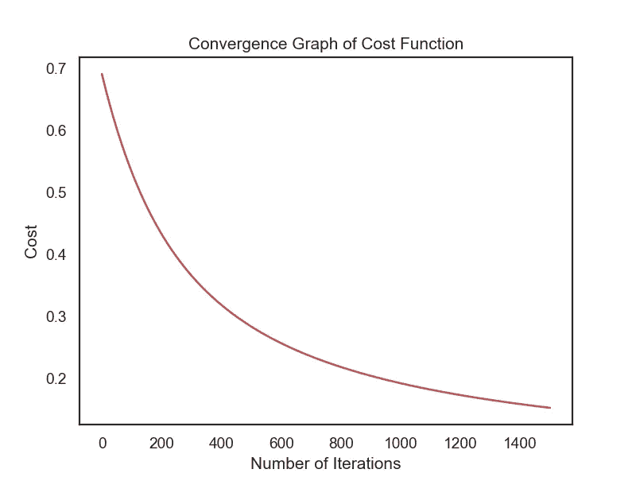
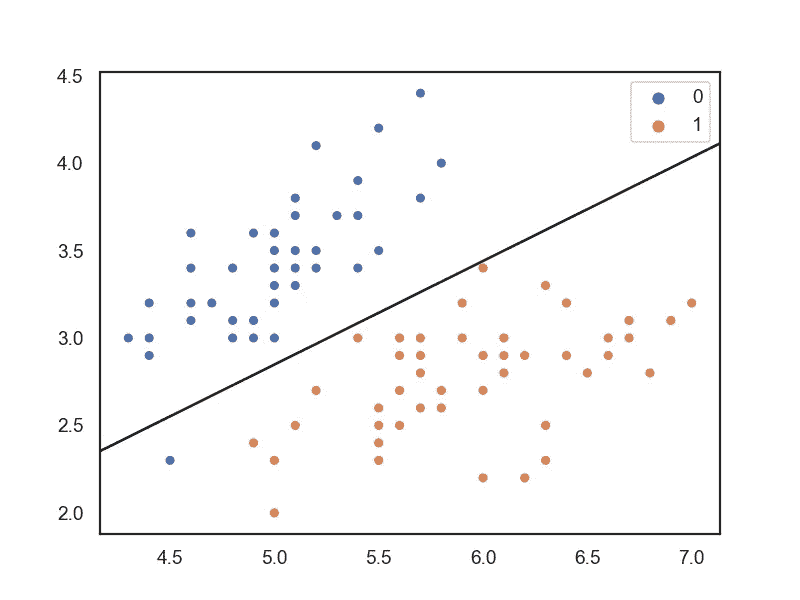

# 逻辑回归

> 原文：<https://towardsdatascience.com/inside-logistic-regression-9312e22d319d?source=collection_archive---------23----------------------->

## 逻辑回归背后的理论和直觉，并使用 Python 代码实现它

这是一系列博客的一部分，在这里我将通过使用数学和代码来展示不同方面和机器学习算法的理论。这包括使用 Python 代码的算法的通常建模结构和对它为什么以及如何工作的直觉。

# 在这篇博客结束时，你会知道:

*   逻辑回归在数学上如何工作以及如何编码。
*   为什么逻辑回归是线性分类器。
*   如何评价你做的模型？

# 介绍

逻辑回归是当有人了解到*分类*时引入的首批算法之一。你可能已经读过回归和预测变量的连续性。分类是对离散变量进行的，这意味着您的预测是有限的，并且是基于类别的，就像二元结果的是/否、真/假。然而，简单地猜测“是”或“不是”是相当粗糙的。考虑到噪音，而不仅仅是给出一个二进制的答案，通常是有用的。

简而言之，我们想要概率，这意味着我们需要拟合一个随机模型。事实上，最好是给定输入变量 P(Y|X ),得到响应 Y 的条件分布。因此，如果我们的模型说有 51%的机会下雨，但没有下雨，这比它说有 99%的机会下雨要好(尽管即使是 99%的机会也不是一件确定的事情)。这就是为什么它被称为逻辑回归而不是分类的原因，因为它预测的概率是连续的(但有限的)。

很漂亮，对吧？但是，你一定在想，即使结果是有限的，线性回归也可能处理它。这里的[有一个全面的答案](https://stats.stackexchange.com/questions/22381/why-not-approach-classification-through-regression)，它非常直观，每当你试图将回归假设曲线拟合到离散数据并引入异常值时，这条线将试图拟合异常值，因此你需要将假设阈值改为较小的值，否则你的预测将会不准确。

现在让我们进入有趣的部分…

# 建模

我们有一个二元输出变量 Y，我们希望将条件概率 P(Y = 1|X = x)建模为 X 的函数。现在，逻辑回归属于学习的*广义线性模型(GLMs)* 家族。所以问题出现了*“我们如何使用线性回归来解决这个问题？”*

1.  这个想法是让 **P(x)** 是 x 的线性函数，x 的每一个变化都会影响概率。这里的概念问题是 P 必须在 0 和 1 之间，线性函数是无界的。此外，在许多情况下，我们可能会看到“收益递减”——当 P 已经很大(或很小)时，改变 P 相同的量需要 x 比 P 接近 1/2 时有更大的变化。线性模型做不到这一点。
2.  下一个最好的想法是让 **log(P(x))** 是 x 的线性函数，这样改变一个输入变量会使概率乘以一个固定的量。

图 1-对数(x)曲线

正如你在上面看到的，对数只在一个方向上有界限。这意味着，与负向变化相比，x 向正向的变化可能不会显著影响结果。

3.最后，对两边值域有界的 log(P(x))的最佳修改是 logistic(或 logit)变换，**log(P(x)/(1p(x))**。这也是代表成功与失败比率的*日志的事件的日志(赔率)。这条弯弯曲曲的线，也称为 s 形曲线，将是我们对这个模型的假设。在 logit 曲线的图形中可以看到有界性质:*

图 2

所以，在线性回归或 OLS 中我们的假设是:

等式:1.1

如果我们将新发现的变换等同于上面的等式，以限制和投射概率而不是连续结果，我们得到:

等式:1.2

求解 P 我们会得到:

等式:1.3

现在，为了识别类别，我们可以假设一个阈值(=0.5)，并相应地指定:

等式:1.4

现在让我们完成一些编码工作，从可视化概率空间和预测空间开始。

**导入模块**

为了演示该算法，我们将使用 Iris 数据集，这是一个流行的初始分类数据集。让我们只导入和利用 2 个类(存在 3 个类)。

为了保持最大 3 维的数据来可视化每一步，我们将只考虑萼片长度和萼片宽度，当然还有标签。

运行上面的脚本后，您会看到类似这样的内容:

图 3

这显示了属于类别 0 和 1 的要素的概率空间。

**决定边界**

Eq:1.3 和 1.4 的意思是当(β0 + x 1 β1+x2.β2) >0 时猜 1，否则猜 0。所以逻辑回归给了我们一个线性分类器。分隔两个预测类的决策边界是以下问题的解决方案—

等式:1.5

一维的点，二维的线(这种情况下)，等等...也可以计算点 X 离判定边界的距离。

等式:1.6

等式 1.6 也表示判定边界的等式。现在让我们看看预测空间。

运行上面的脚本后，您会看到类似这样的内容:

图 4

正如你所看到的，可能会发现存在一个边界，可以将这个空间分成两个部分，分别属于 0 类和 1 类。逻辑回归将利用概率以及预测值空间(如上)来构建 0 类和 1 类之间的线性决策边界。

现在我们已经完成了建模部分。我们要优化的参数是β0，β1，β2。为了做到这一点，我们有一个非常巧妙的技巧。

# **最大似然估计**

这是一种最大化参数正确归属/拟合数据的可能性的策略。这是许多其他统计方法用来优化参数的相同策略。这与线性回归的区别在于，我们不能在这里使用相同的(残差)方法。我们会知道为什么。要做到这一点:

*   在对数(赔率)空间中可视化所有点。这意味着你必须考虑等式 1.2。将β0、β1、β2 初始化为一些随机值，并为 log(odds)空间制作候选拟合线(2d 的平面)。

图 5

*   现在将数据点投影到直线上，并计算所有点的可能性。

> 请注意，这里的概率不是作为曲线下的面积(在概率空间中)来计算的，而是作为轴值来计算的，因此它与可能性相同。

候选线的总可能性将是所有个体可能性的乘积，如下式所示。

> 注意:在计算类 0 的可能性时，可能性将被计算为(1-P(x))

图 6

等式:1.7

现在我们的目标是最大化这个关于参数的似然函数。为了达到这个目的，我们需要对它求导，但问题是对 f(x)求导。g(x)需要变得难以处理的副产品。所以我们将这个等式转换成对数似然，然后求解。
在对数转换和重新排列变量之后，您会看到类似这样的内容:

等式:1.8

现在，通过使用等式 1.2、1.3 替换这些值并重新排列变量，您将看到:

等式:1.9

上面的等式比等式 1.7 更容易微分。现在，我们必须对上述方程 w.r.t β0，β1，β2 进行微分，以获得最佳值。因此，我们将区分并概括这三者:

等式:1.10

注意，上面的方程是一个[超越方程](https://en.wikipedia.org/wiki/Transcendental_equation)，它没有[闭合解](https://en.wikipedia.org/wiki/Closed-form_expression)。所以，我们不能用 python 代码来解决这个问题，所以我们用数字来解决。

你一定在想，如果我们要用数字来解决这个问题，那么花时间去理解这一切有什么意义。我们必须明白，最大似然法是所有优化算法的基础，也是被广泛使用的。这很简单，也很有效，我们仍然会在数值方法中使用对数似然法。

尽管存在许多数值方法来解决这个问题，例如用于数值优化的牛顿方法。对于这个博客，我们将使用我们古老的梯度下降。继续代码:
首先，定义我们的成本函数，它就是我们的对数似然函数。

现在定义梯度下降函数。

在这之后，我们将做一些矩阵操作来准备模型的输入。

然后是训练部分…

在上面代码的输出中，您将看到模型的优化参数。
现在让我们看看模型如何根据数据和其他超参数进行收敛。

运行上面的脚本后，我们可以看到模型的成本随着迭代的进行而非线性降低。

图 7

我们刚刚构建的逻辑模型的决策边界可以使用下面的代码可视化。

> 注意，直线的斜率和截距可以用等式 1.6 计算。

运行上述脚本将绘制以下内容:

图 8

瞧啊。我们刚刚使用逻辑回归对虹膜数据集进行了线性分类。
现在，我们有了这个数据的最佳决策边界和曲线(sigmoid ),但是*你怎么知道它是否有用呢？* *我们如何评价这样的东西？*

# R -决定系数和 p 值

对于广义线性模型:线性回归/OLS，我们通过计算决定的 R 系数及其显著性的 p 值来实现。如果您还记得，线性回归中的 R-决定系数是使用(残差)计算的，但在使用逻辑回归进行分类的情况下，这种方法没有意义，因为在 log(odds)维度中，数据点被推到+∞和-∞，因此残差没有意义。

这个问题的解决方案是麦克法登的伪作。这种方法非常类似于 OLS 的 R，所以非常容易理解。

让我们首先快速回顾一下 OLS-R。它给出了一个比较系数值，表明 Y(目标)的总变化中有多少是由 X(直线)的变化描述的。

> SE=平方误差

等式:1.11

换句话说，就是最差拟合(SE_mean)和最佳拟合(SE_line)的对比结果而已。

现在我们用逻辑回归的方法来讨论 R。就像线性回归一样，我们首先需要找到最佳拟合，并将其与差拟合进行比较。现在，在 log(odds)空间中你的最佳拟合线的对数似然性(见图 6)将代表 **LL(fit)** 来填充等式 1.11 中的 SE(line)。

这里的奥秘在于计算的是坏拟合线。别担心，这也很直观。在线性回归建模中，我们最差的拟合是 y =均值(y)。在这种情况下，我们将做非常类似的事情。

图 9

等式:1.12

*   首先，通过忽略其他特征并简单地取如等式 1.12 中所述的对数(样本比率)来计算最差拟合线，并将其转换到概率空间中。
*   现在，计算最差拟合线的点的所有对数似然的总和。这会给你 **LL(整体概率)。**
*   令人惊讶的是，用上述方法计算的总对数似然类似于计算—> P =(class = 1 的总数据)/总数据。

现在我们有了 ll(总体概率)->差拟合的度量
和 LL(拟合)- >最佳拟合的度量。所以你会是:

等式:1.13

r 将在[0，1]的范围内，0 代表最不适合，1 代表最适合。

**P 值**

现在，我们将使用 p 值计算 R 的显著性。计算 p 值非常简单。

等式:1.14

在这种情况下，自由度将是 3(需要 3 个轴上的信息)-1(只需要对数(奇数)轴的截距)=2。现在，在计算上述方程的 LHS 后，您可以从下表中找到 p 值:

图 10

对评估的每一个部分进行编码可能是一个忙乱的过程，这要感谢 statsmodels 已经处理好了。它不仅会显示 R 和 p 值，还会显示大量有助于更好地评估模型的其他信息。

从导入 statsmodels 模块开始

由于我们讨论的是特征之间的线性分离，因此我们将与标注的关系定义为线性。

运行上面的脚本将获得以下结果:

我们可以观察到我们的 P 值是 1.00，因为我们的数据是线性可分的，还可以观察到我们的对数似然性是低的，符合高 R 值。

# 逻辑回归的几点和假设:

*   我们在这个博客中只讨论了二元分类，但是你也可以在多类问题中应用逻辑回归。假设有 k 个类，而不是有一组参数β0，β，0:(k 1)中的每个类 c 将有自己的偏移β0_c 0 和向量β_c，预测的条件概率将是:

*   逻辑回归假设决策边界是线性的。因此，如果您事先知道您的数据包含非线性决策边界，那么也许不同的算法可能会证明比这个更好。
*   逻辑回归吐出的不是类别而是概率。
*   [多重共线性](https://medium.com/p/9312e22d319d/edit)困扰着每一个算法，因为它扭曲了统计显著性的测试。因此，在运行该算法之前，尝试识别并解决它们。

# 你已经到达终点了！

恭喜你！陪我到最后，理解机器学习最重要的算法之一，也奠定了同样的基础。

*感谢阅读。有想法或反馈？下面评论！*