# 使用 Tensorflow 和 RapidMiner Studio 通过人工智能进行内部威胁检测

> 原文：<https://towardsdatascience.com/insider-threat-detection-with-ai-using-tensorflow-and-rapidminer-studio-a7d341a021ba?source=collection_archive---------16----------------------->

## 在 tensorflow 和 rapidminer studio 中使用 US-CERT 内部威胁数据进行神经网络创建和建模的 A-Z 教程，面向网络安全专业人员。

这篇技术文章将教你如何预处理数据，创建自己的神经网络，以及使用 [US-CERT 的模拟内部威胁数据集](https://resources.sei.cmu.edu/library/asset-view.cfm?assetid=508099)训练和评估模型。这些方法和解决方案是为非领域专家设计的；尤其是网络安全专业人员。我们将从数据集提供的原始数据开始我们的旅程，并提供不同预处理方法的示例，以使其“准备好”供人工智能解决方案摄取。我们最终将创建可重复用于基于安全事件的其他预测的模型。在整篇文章中，我还将根据您企业中现有的信息安全计划指出适用性和投资回报。

注意:要使用和复制我们使用的预处理数据和步骤，请准备花 1-2 个小时阅读本页。陪着我，在数据预处理部分尽量不要睡着。许多教程没有说明的是，如果你是从零开始；做这样的项目时，数据预处理会占用你 90%的时间。

在这篇混合文章和教程结束时，您应该能够:

*   将 US-CERT 提供的数据预处理成人工智能解决方案就绪格式(特别是 Tensorflow)
*   使用 RapidMiner Studio 和 Tensorflow 2.0 + Keras，通过预处理的样本 CSV 数据集创建和训练模型
*   执行数据的基本分析，选择人工智能评估的领域，并使用所描述的方法了解组织的实用性

# 放弃

作者按原样提供这些方法、见解和建议，不做任何担保。在将本教程中创建的模型作为安全程序的一部分之前，如果没有进行充分的调整和分析，请不要在生产环境中使用这些模型。

# 工具设置

如果您希望跟随并自己执行这些活动，请从各自的位置下载并安装以下工具:

*   选择:从头开始动手，试验自己的数据变化:下载[完整数据集](https://resources.sei.cmu.edu/library/asset-view.cfm?assetid=508099):[ftp://ftp.sei.cmu.edu/pub/cert-data](http://ftp//ftp.sei.cmu.edu/pub/cert-data/):**注意:它非常大。请计划有数百个免费空间*
*   选择:如果你只是想跟随并执行我所做的，你可以从我的 [Github](https://github.com/dc401/tensorflow-insiderthreat) (点击仓库并找到 tensor flow-insider threat)【https://github.com/dc401/tensorflow-insiderthreat】T2 下载预处理的数据、Python 和解决方案文件
*   可选:如果你想要一个不错的 Python IDE:[Visual Studio 2019 社区版](https://visualstudio.microsoft.com/vs/)安装适用的 Python 扩展
*   要求: [Rapidminer *Studio* 试用](https://rapidminer.com/get-started/)(或者教育执照，如果适用于你的话)
*   必需:Python 环境，使用 [Python 3.8.3 x64](https://www.python.org/downloads/windows/) 位版本
*   需要:[从命令行通过“pip install < packagename >”安装 python 包](https://docs.python.org/3/installing/index.html) : (numpy，pandas， [tensorflow](https://www.tensorflow.org/install) ，sklearn

# 流程概述

对于任何数据科学学科的新人来说，重要的是要知道，你花费的大部分时间将用于数据预处理和分析你所拥有的数据，其中包括清理数据、标准化、提取任何额外的元见解，然后对数据进行编码，以便为人工智能解决方案摄取数据做好准备。

1.  我们需要以这样一种方式提取和处理数据集，即它由我们可能需要作为“特征”的字段构成，这只是为了包含在我们创建的人工智能模型中。我们需要确保所有的文本字符串都被编码成数字，以便我们使用的引擎可以摄取它。我们还必须标记哪些是内部威胁和非威胁行(真正的肯定和真正的否定)。
2.  接下来，在数据预处理之后，我们需要选择、设置和创建函数，我们将使用这些函数来创建模型和神经网络层本身
3.  生成模型；并检查准确性、适用性，确定数据管道的任何部分所需的额外修改或调整

# 动手检查数据集和手动预处理

检查原始 US-CERT 数据需要您下载必须解压缩的压缩文件。请注意，与我们在数据预处理结束时将使用和减少的量相比，这些集合有多大。

在本文中，我们通过直接访问 answers.tar.bz2 节省了大量时间，该文件包含 insiders.csv 文件，用于匹配哪些数据集和提取的单个记录是有价值的。现在，值得说明的是，在提供的索引中，在扩展数据(如文件)和心理测量相关数据中有相关的记录号。在本教程中，我们没有使用扩展元，因为在我们的例子中，需要额外的时间将所有内容关联和合并到一个 CSV 中。

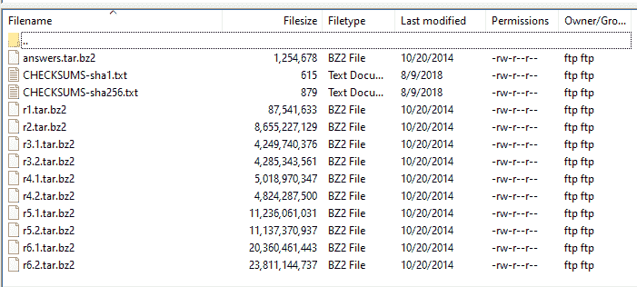

要查看从相同数据中提取的更全面的特征集，请考虑查看这篇名为“[基于图像的内部威胁分类特征表示](https://arxiv.org/pdf/1911.05879.pdf)”的研究论文当我们检查我们的模型准确性时，我们将在文章的后面引用那篇论文。

在对数据进行编码并准备好让函数读取它之前；我们需要提取数据，并将其分类到我们需要预测的列中。让我们使用优秀的旧 Excel 向 CSV 中插入一列。在截图之前，我们从场景 2 的“insiders.csv”中引用的数据集中获取并添加了所有行。

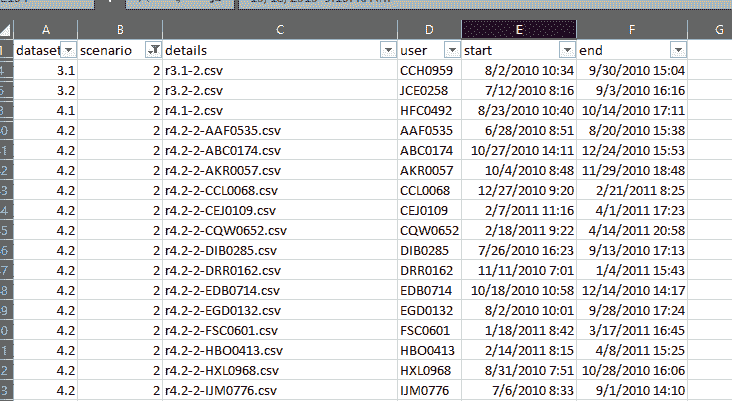

Insiders.csv 真阳性指数

scenarios.txt 中描述了场景(2):“用户开始浏览工作网站，并向竞争对手寻求就业机会。在离开公司之前，他们使用拇指驱动器(比以前的活动频率明显更高)来窃取数据。”

检查我们的预处理数据，包括其中间和最终形式，如下所示:


情景 2 的中间复合真阳性记录

在上面的照片中，这是所有不同记录类型的一个片段，这些记录类型基本上相互附加，并按日期正确排序。请注意，不同的向量(http 对电子邮件对设备)不容易对齐，因为它们在列中有不同的上下文。这无论如何都不是最佳选择，但因为内部威胁场景包括多种事件类型；这就是我们现在要做的。这是数据的常见情况，您将尝试根据时间和与特定属性或用户相关的多个事件进行关联，就像 [SIEM](https://www.splunk.com/en_us/blog/security/event-correlation.html) 所做的那样。

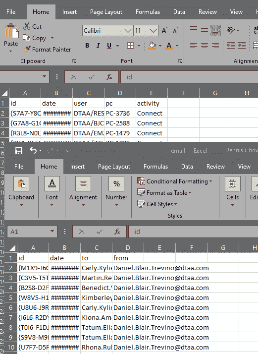

需要整合的不同数据类型的比较

在聚合集中；在将场景 2 的 insiders.csv 中提到的所有项目移动到同一个文件夹后，我们合并了相关的 CSV。制定整个“真阳性”数据集部分；我们使用的 powershell 如下所示:

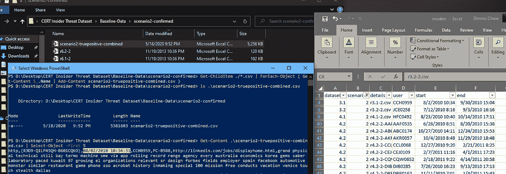

使用 powershell 将 CSV 合并在一起

现在我们有一个完全不平衡的数据集，只有真正的阳性。我们还必须添加真正的负面因素，最好的方法是在 50/50 的无威胁活动场景中使用等量的记录类型。安全数据几乎从来不会出现这种情况，所以我们会尽我们所能，如下所示。我还想指出的是，如果您在 OS shell 中进行手动数据处理——您导入变量的任何内容都在内存中，不会被释放或自行进行垃圾收集，正如您可以从我的 PowerShell 内存消耗中看到的那样。在一系列数据操作和 CSV 争论之后，我的使用量增加到了 5.6 GB。

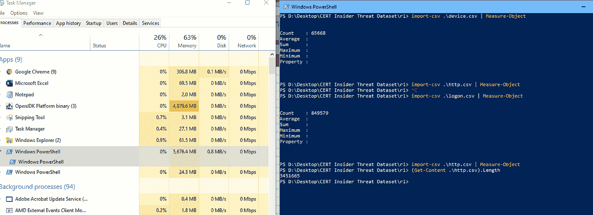

内存不会自动释放。我们还计算每个 CSV 文件中的行数。

让我们看看 R1 数据集文件。我们需要从我们在真阳性数据集提取中使用的文件名中提取我们已知的 3 种类型中每一种类型的确认真阴性(非威胁)(同样，它来自具有良性事件的 R1 数据集)。

我们将合并来自登录、http 和设备文件的所有 3 个 R1 真阴性数据集的许多记录。注意，在 R1 真阴性集合中，我们没有发现增加我们集合数据集不平衡的电子邮件 CSV。

使用 PowerShell，我们计算每个文件中的行的长度。因为我们有大约 14K 的来自真正端的行，所以我任意地从真负端取出来自每个后续文件的前 4500 个适用的行，并将它们附加到训练数据集，这样我们既有真正的，也有真负的。我们必须添加一列来标记哪些是内部威胁，哪些不是。

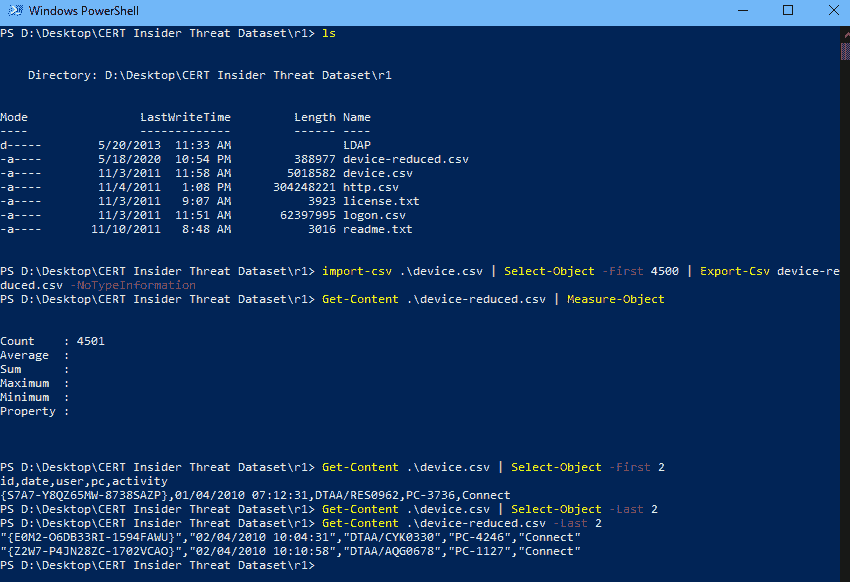

从 3 个互补 CSV 中提取真阴性记录

在预处理我们的数据时，我们已经添加了下面所有感兴趣的记录，并从 R1 数据集中选择了各种其他真阴性无威胁记录。现在，我们已经将威胁和非威胁基线连接在一个 CSV 中。在左侧，我们添加了一个新列来表示查找和替换场景中的真/假 or (1 或 0)。

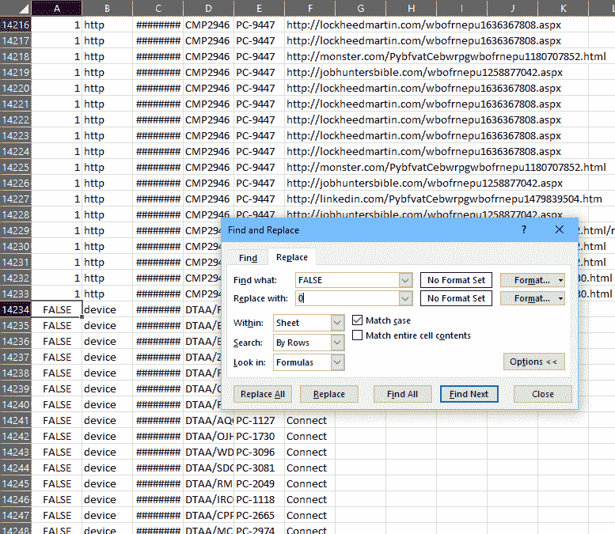

对内部威胁真/假列进行编码的标签

上面，你也可以看到我们开始将真/假字符串转换为数字类别。这是我们通过手动预处理对数据进行编码的开始，这可以省去我们在 RapidMiner Studio 中的后续步骤中看到的麻烦，并为 Tensorflow 使用 Python 中的 Pandas Dataframe 库。我们只是想说明您必须执行的一些步骤和注意事项。接下来，我们将继续处理我们的数据。在走完全自动化的路线之前，让我们强调一下使用 excel 函数可以做些什么。

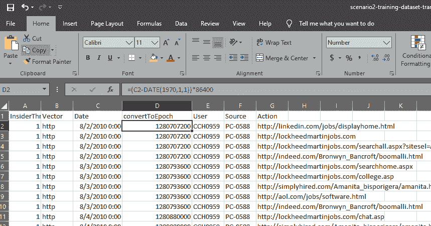

根据提供的日期和时间计算 Unix 纪元时间

出于演示的目的，我们还将手动将日期字段转换为 [Unix 纪元时间](https://www.epochconverter.com/)，正如您所见，它变成了一个带有新列的大整数。要删除 excel 中用于重命名的旧列，请创建一个新表，如“scratch ”,并将旧日期(非纪元时间戳)值剪切到该表中。参照工作表以及您在单元格中看到的公式来达到这种效果。这个公式是:"*=(C2-日期(1970，1，1))*86400* "不带引号。

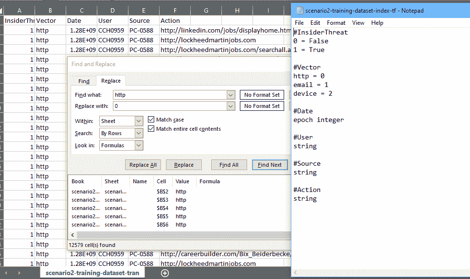

编码向量列和特征集列映射

在我们上一个手动预处理工作示例中，您需要格式化 CSV 以通过标签编码数据进行“分类”。您可以通过脚本中的数据字典将此自动化为一次性编码方法，或者在我们的示例中，我们向您展示了在 excel 中映射它的手动方法，因为我们有一组有限的相关记录向量(http 是 0，email 是 1，device 是 2)。

您会注意到，我们没有处理用户、源或操作列，因为它有大量需要标签编码的唯一值，手工处理是不切实际的。使用 RapidMiner Studio 的“turbo prep”功能，我们能够完成这一点，而不需要上面所有的手动争论，同样，在下面的脚本片段中，通过 Python 的 Panda 也可以完成其余的列。*现在不要担心这个，我们将向 case 展示每个不同的人工智能工具的步骤，并以最简单的方式做同样的事情。*

```
#print(pd.unique(dataframe['user']))
#https://pbpython.com/categorical-encoding.html
dataframe["user"] = dataframe["user"].astype('category')
dataframe["source"] = dataframe["source"].astype('category')
dataframe["action"] = dataframe["action"].astype('category')
dataframe["user_cat"] = dataframe["user"].cat.codes
dataframe["source_cat"] = dataframe["source"].cat.codes
dataframe["action_cat"] = dataframe["action"].cat.codes
#print(dataframe.info())
#print(dataframe.head())
#save dataframe with new columns for future datmapping
dataframe.to_csv('dataframe-export-allcolumns.csv')
#remove old columns
del dataframe["user"]
del dataframe["source"]
del dataframe["action"]
#restore original names of columns
dataframe.rename(columns={"user_cat": "user", "source_cat": "source", "action_cat": "action"}, inplace=True)
```

上面的代码片段是使用 python 的 panda 库的示例，该示例将列操作和标签编码为对原始数据集中的每个字符串值唯一的数值。尽量不要被这件事缠住。我们将在 [Rapidminer Studio](https://my.rapidminer.com/nexus/account/index.html#downloads) 中向您展示所有这些数据科学工作的简单而全面的方法

对于防御者来说，这是重要的一步:鉴于我们使用的是从 US-CERT 格式化的预先模拟数据集，并非每个 SOC 都可以访问相同的统一数据来应对自己的安全事件。很多时候，您的 SOC 只有原始日志可以导出。从投资回报的角度来看，在进行您自己的 DIY 项目之前，请考虑一下工作量，如果您可以自动将日志的元导出为 CSV 格式，Splunk 或其他 SIEM 等企业解决方案或许可以帮您做到这一点。您必须关联您的事件，并添加尽可能多的列来丰富数据格式。您还必须检查如何保持一致性，以及如何以 US-CERT 必须使用类似方法进行预处理或接收的格式自动导出这些数据。尽可能利用 SIEM 的 API 功能将报告导出为 CSV 格式。

# 带着我们的数据集走过 RapidMiner Studio

是时候使用一些基于 GUI 的简化方法了。RapidMiner 的桌面版是 Studio，从 9.6.x 开始的最新版本在工作流程中内置了 turbo prep 和自动建模功能。由于我们不是领域专家，我们肯定会利用这一点。让我们开始吧。

注意:如果您的试用期在阅读本教程并使用 community edition 之前过期，您将被限制在 10，000 行。需要进一步的预处理，以将数据集限制为 5K 的真阳性和 5K 的真阴性(包括标题)。如果可以的话，使用[教育许可证](https://rapidminer.com/educational-program/)，它是无限的，并且可以每年更新，你可以在一个有资格的学校注册，邮箱是. edu。


RapidMiner 工作室

开始时，我们将启动一个新项目，并利用 Turbo Prep 功能。对于 community edition，您可以使用其他方法或通过左下角的 GUI 手动选择操作员。但是，我们将使用企业试用版，因为它对于初次用户来说很容易完成。

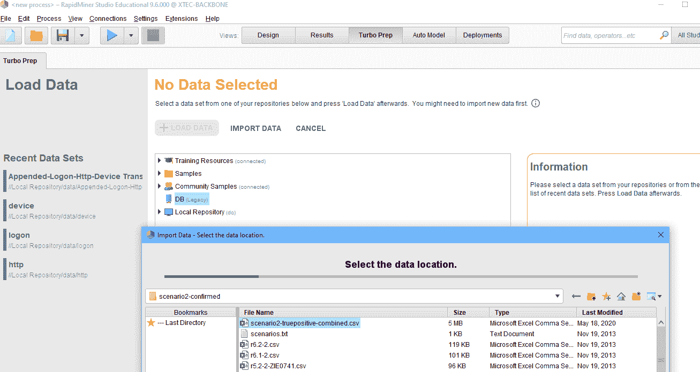

导入未处理的 CSV 聚合文件

我们将只导入未处理的真阳性数据的聚合 CSV 此外，删除第一行标题并使用我们自己的标题，因为原始行与 HTTP 向量相关，并不适用于数据集中的后续 USB 设备连接和电子邮件相关记录，如下所示。

注意:与我们的预处理步骤(包括标签编码和缩减)不同，我们还没有在 RapidMiner Studio 上这样做，以展示我们在“turbo prep”功能中可以轻松完成的全部工作。我们还将启用引号的使用，并将其他缺省值留给适当的字符串转义。

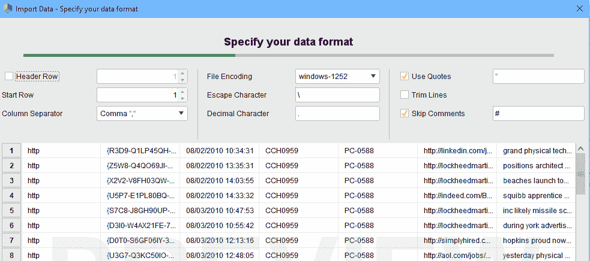

接下来，我们将列标题类型设置为适当的数据类型。

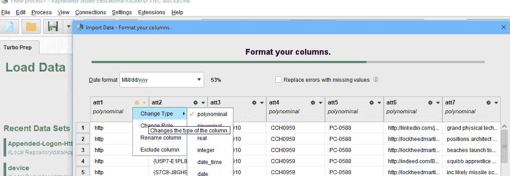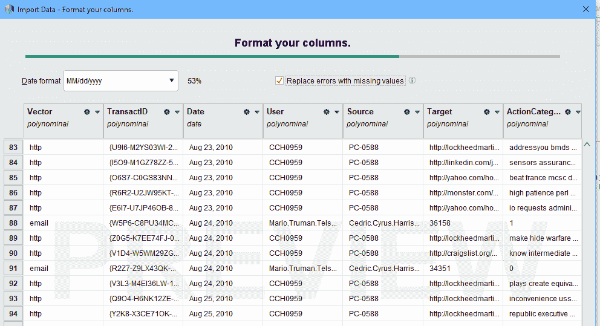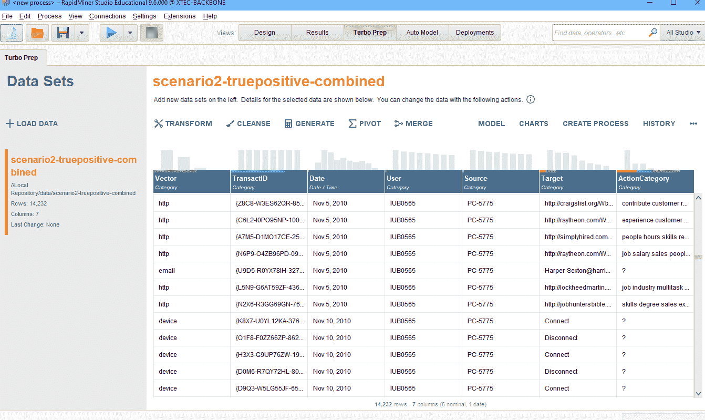

通过该向导，我们进入 turbo prep 选项卡进行查看，它向我们显示了分布情况和任何错误，例如需要调整的缺失值以及哪些列可能有问题。让我们首先确保我们首先将所有这些真正的积极因素识别为内部威胁。单击“generate ”,我们将通过在所有行中插入一个新列来转换该数据集，并使用逻辑“true”语句，如下所示

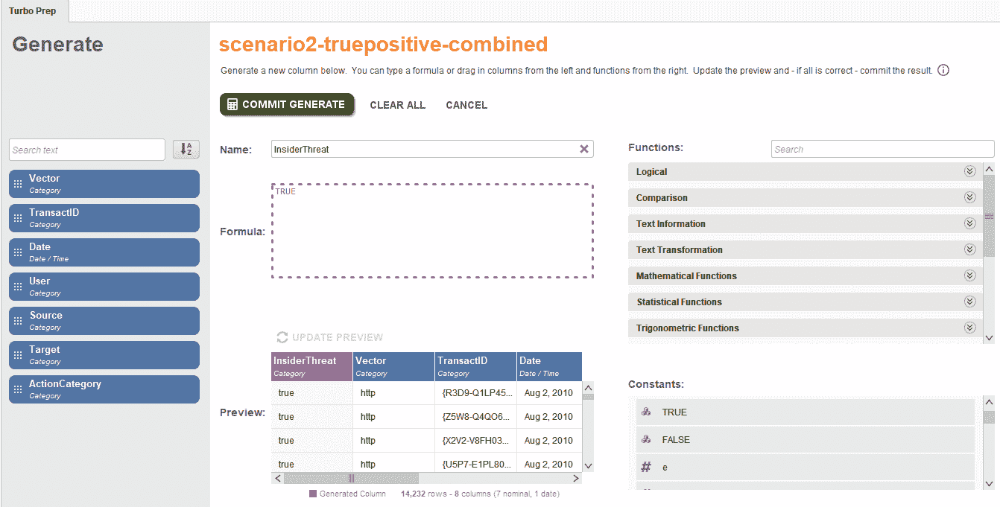

我们将保存列的详细信息，并将其导出以供以后进一步处理，或者我们将使用它作为基础模板集，以便在此之后开始预处理 Tensorflow 方法，从而使事情变得简单一些。

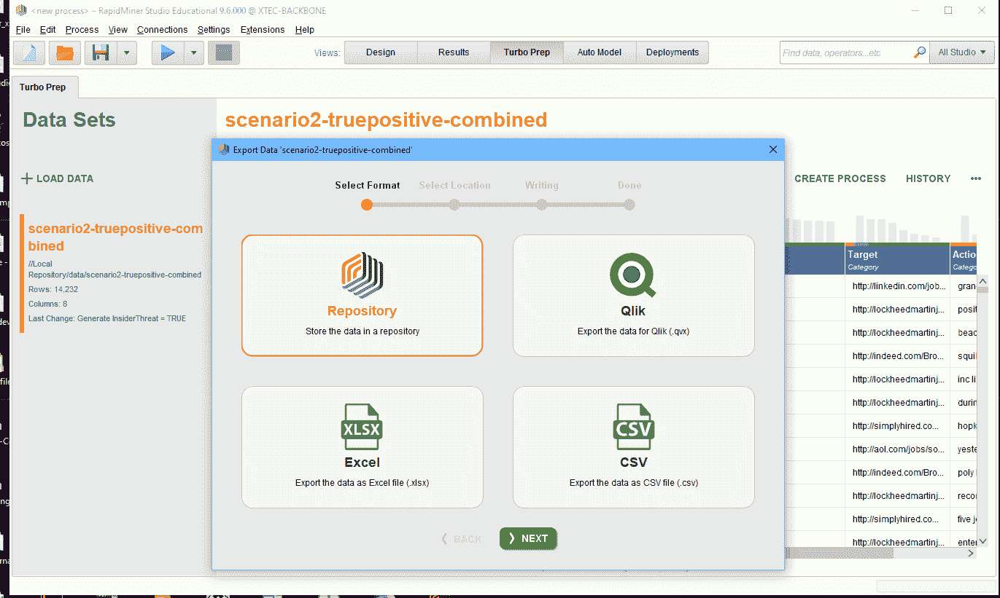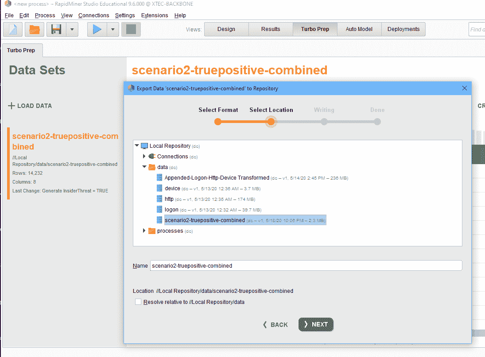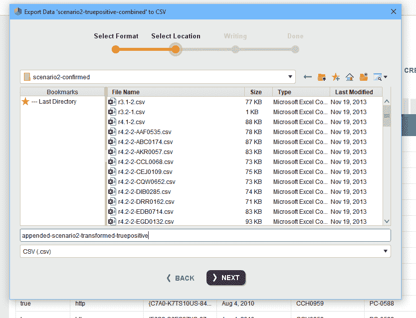

导出后，正如你在上面看到的，不要忘记我们需要用真正的负面数据来平衡数据。我们将重复同样的导入真正底片的过程。现在，我们应该在 turbo prep 屏幕中看到多个数据集。

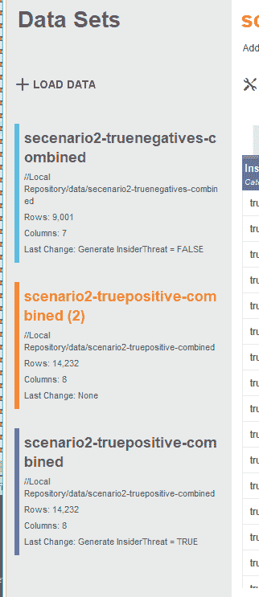

在上面，即使我们只导入了 2 个数据集，记住通过添加一个名为 insiderthreat 的列(真/假布尔逻辑)来转换真正值。我们对真正的否定做同样的事情，你最终会得到 4 个这样的列表。

在我们开始做任何有趣的事情之前，我们需要将真正的积极因素和真正的消极因素合并到一个“训练集”中。但首先，我们还需要删除我们认为不相关的列，如交易 ID 和网站关键字的描述列，因为其他行数据都没有这些；和将包含一组对计算权重无用的空值。

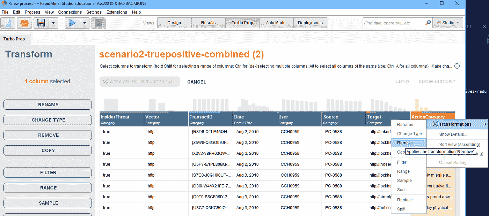

重要提示:正如我们在其他研究论文中提到的，选择包含复杂字符串的计算列(也称为“特征集”)必须使用自然语言处理(NLP)进行标记化。这增加了除标签编码之外的预处理要求，在 Tensorflow + Pandas Python 方法中，通常需要处理多个数据帧，并根据每个记录的列键将它们合并在一起。虽然这在 RapidMiner 中是自动完成的，但在 Tensorflow 中，您必须将其包含在预处理脚本中。关于这个的更多文档可以在这里找到[。](https://www.tensorflow.org/tutorials/text/text_classification_rnn)

请注意，我们没有在我们的数据集中这样做，因为您将在稍后的优化 RapidMiner Studio 建议中看到，更重的权重和对日期和时间的强调是更有效的功能集，复杂性更低。另一方面，对于不同的数据集和应用程序，您可能需要 NLP 进行情感分析，以添加到内部威胁建模中。

完成您的训练集:虽然我们没有说明这一点，但在 Turbo prep 菜单中导入真阴性和真阳性后，单击“merge”按钮，选择两个转换的数据集，并选择“Append”选项，因为两个数据集都已按日期预先排序。

# 继续到自动模型特征

在 RapidMiner Studio 中，我们继续“自动建模”选项卡，并利用我们选择的聚合“训练”数据(记住训练数据包括真阳性和真阴性)来预测 insiderthreat 列(真或假)

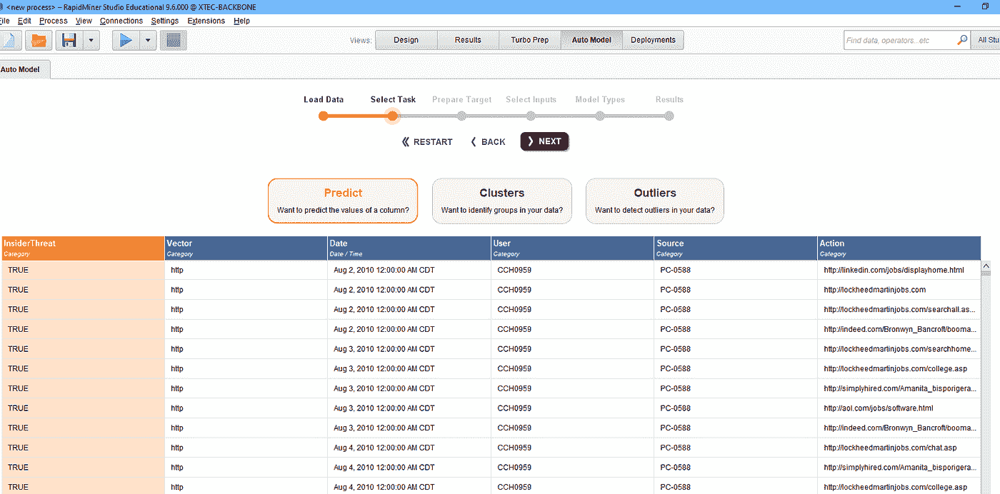

我们也注意到我们的实际余额是多少。我们仍然不平衡，只有 9001 条非威胁记录与大约 14K 的威胁记录。它是不平衡的，如果你愿意，可以用额外的记录来填充。现在，我们将接受它，看看我们能用不那么完美的数据做些什么。

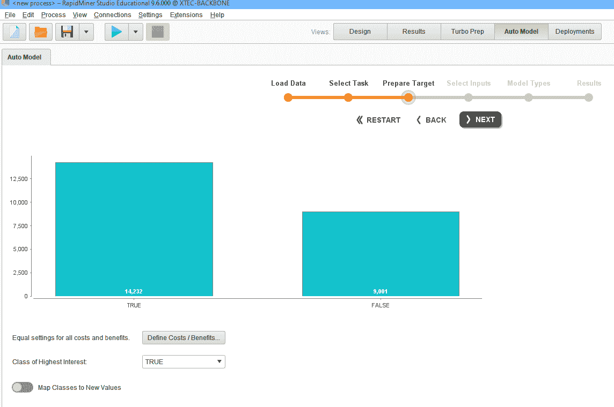

在这里，自动建模器用绿色和黄色推荐不同的特性列以及它们各自的相关性。有趣的是，它是估计数据的高相关性，但稳定性不如行动和向量。

重要的想法:在我们的头脑中，我们会认为所有的特性集都适用于每个专栏，因为我们已经尽可能地减少了相关性和复杂性。还值得一提的是，这是基于一个单一的事件。请记住，正如我们在 insiders.csv 的答案部分看到的那样，内部威胁通常会发生多个事件。绿色指示器向我们展示的是独一无二的单一事件识别记录。

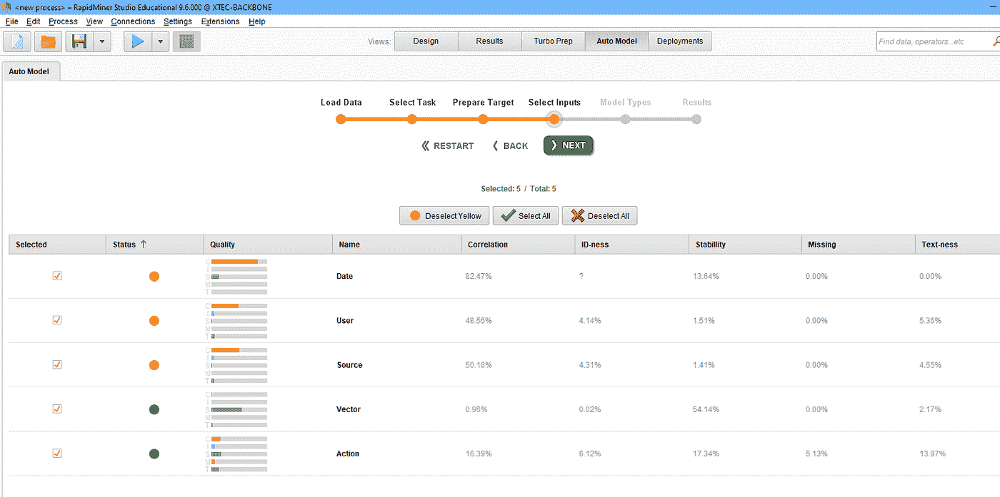

我们无论如何都要使用所有的列，因为我们认为这些都是可以使用的相关列。我们还转到模型类型的下一个屏幕，因为我们不是领域专家，所以我们将尝试几乎所有的模型，我们希望计算机多次重新运行每个模型，找到输入和特征列的优化集。

请记住，功能集可以包含基于现有列洞察的元信息。我们保留标记化的默认值，并希望提取日期和文本信息。显然，带有自由格式文本的项目是带有所有不同 URL 的“Action”列，以及我们希望应用 NLP 的事件活动。我们想要在列之间建立关联，列的重要性，以及解释预测。

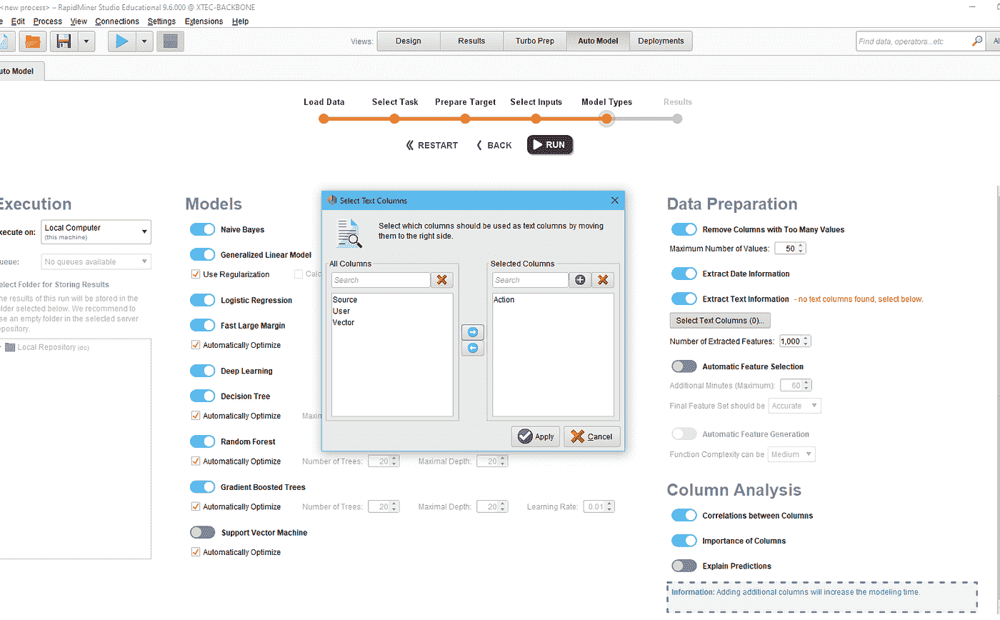

注意，在上面的例子中，我们在批处理作业中选择了大量的处理参数。在运行 Windows 10 的 8 核单线程处理器、24 GB 内存和配有 SSD 的镭龙 RX570 value 系列 GPU 上，所有这些模型在所有选项设置下总共需要大约 6 个小时才能运行。完成所有工作后，我们在屏幕对比中测试了 8000 多个型号和 2600 多个功能组合。

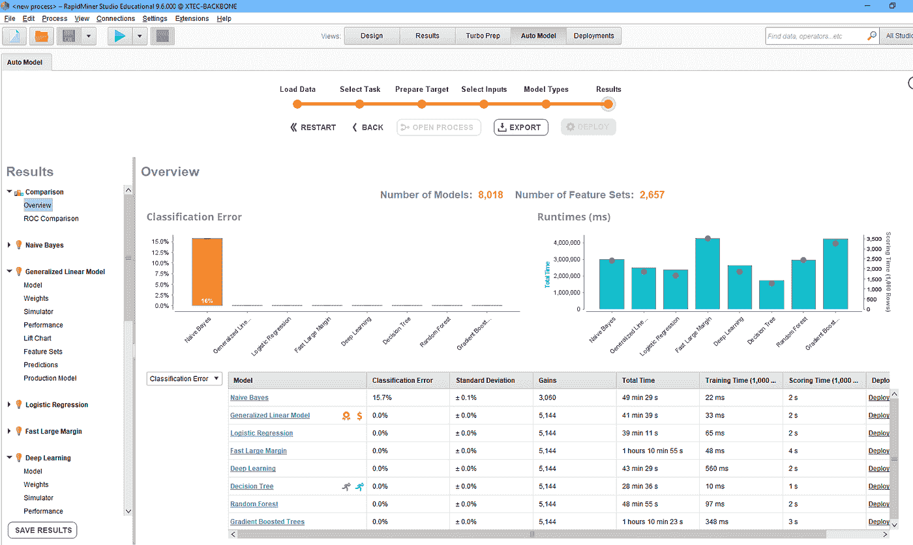

据 RapidMiner 工作室；深度学习神经网络方法不是最佳 ROI 拟合；与线性一般模型相比。虽然没有错误——但这令人担忧，这可能意味着我们的数据质量很差，或者模型存在[过拟合](https://statisticsbyjim.com/regression/overfitting-regression-models/)问题。让我们来看看深度学习，因为它也指出了潜在的 100%准确性，只是为了进行比较。

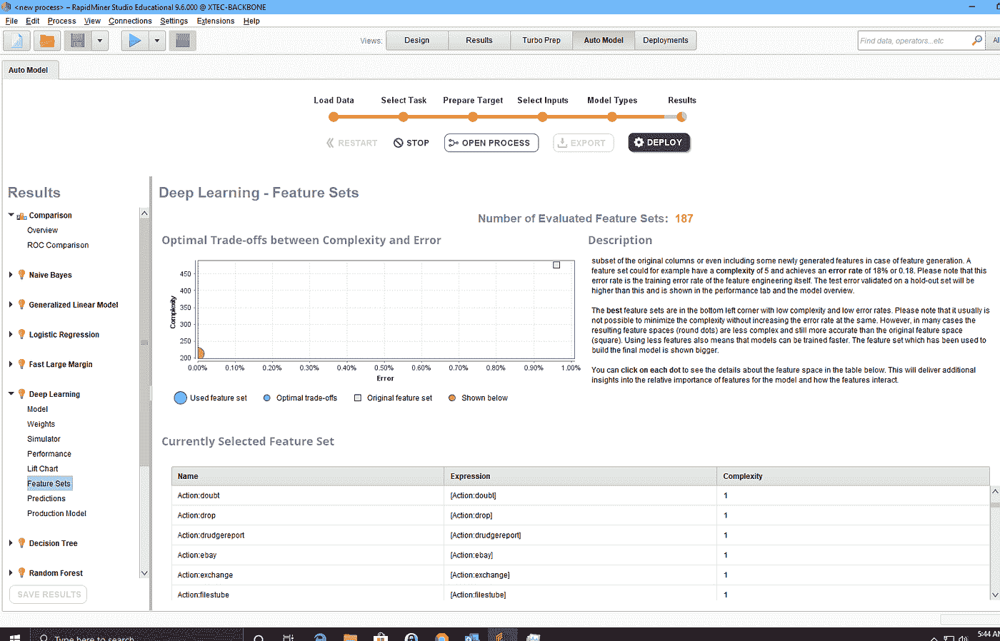

在上面的深度学习中，它针对 187 种不同的特征集组合进行了测试，优化的模型显示，与我们自己的想法不同，哪些特征会是好的，主要包括向量和动作。我们看到更多的重量放在了有趣的单词和日期上。令人惊讶的是；作为优化模型的一部分，我们在操作中没有看到任何与“电子邮件”或“设备”相关的内容。

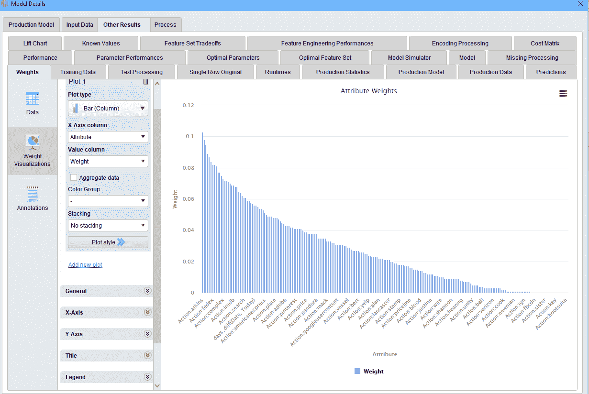

不要担心，因为这并不意味着我们大错特错。这只是意味着它在训练中选择的特征集(列和提取的元列)在训练集中提供了较少的错误。这可能是因为我们的数据集中没有足够多样或高质量的数据。在上面的屏幕中，你看到了一个橙色的圆圈和一个半透明的正方形。

橙色圆圈表示模型建议的优化器功能，正方形是我们最初选择的功能集。如果你检查规模，我们的人类选择的特征集是 0.9 和 1%的误差率，这使我们的准确性接近 99%的标志；但只有在更高复杂性的模型中(需要神经网络中更多的层和连接),才能让我感觉好一点，并告诉你在从表面上解释所有这些时需要谨慎。

# 调整注意事项

假设你不完全信任这样一个高度“100%准确的模型”。我们可以尝试以普通的方式使用我们的功能集作为纯令牌标签来重新运行它。我们*不会*提取日期信息，不会通过 NLP 进行文本标记化，我们也不希望它基于我们的原始选择自动创建新的功能集元。基本上，我们将使用一组普通的列来进行计算。

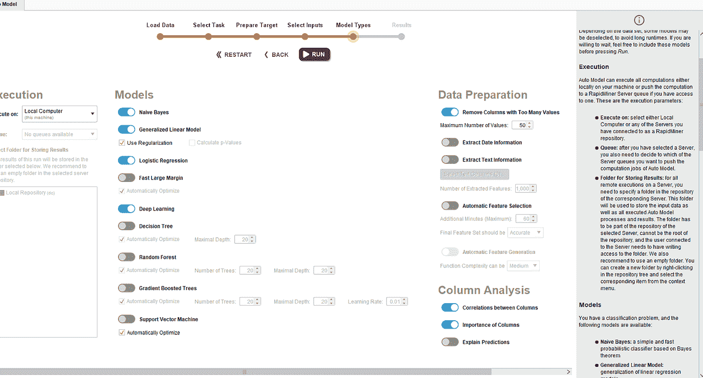

所以在上面，让我们重新运行它，看看 3 个不同的模型，包括原始的最佳拟合模型和深度学习，我们绝对没有优化和额外的 NLP 应用。因此，这就好像我们只在计算中使用编码标签值，而不在其他地方使用。

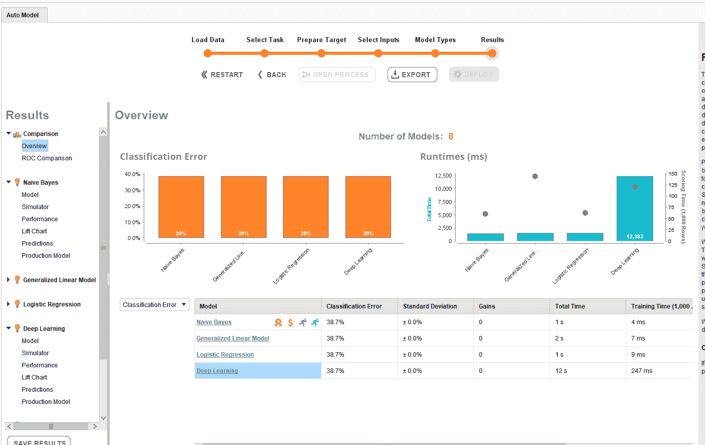

在上面的例子中，我们得到了更糟糕的结果，误差率为 39%,几乎所有模型的准确率为 61%。在不使用文本标记提取的情况下，我们的选择和缺乏复杂性是如此之少，以至于即使更“原始”的贝叶斯模型(通常用于基本的电子邮件垃圾邮件过滤引擎)似乎也一样准确，并且具有快速的计算时间。这一切看起来很糟糕，但让我们再深入一点:

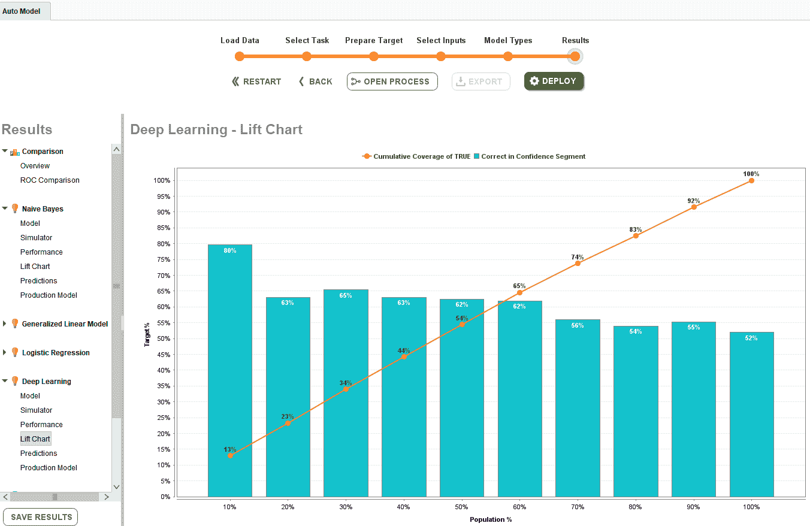

当我们再次选择深度学习模型的细节时，我们看到准确性以线性方式攀升，因为更多的训练集群体被发现并验证。从解释的角度来看，这向我们展示了一些东西:

*   我们最初关于只使用唯一编码值来关注向量和动作频率的特征集的想法，与分析师在数据中发现威胁的可能性一样大。从表面上看，我们发现内部威胁的几率最多有 10%的提高。
*   它还表明，尽管行动和向量最初被认为是“绿色的”,但对于更好的输入选择，唯一的记录事件实际上与内部威胁场景相反，我们需要为每个事件/警报考虑多个事件。在优化的模型中，使用的许多权重和标记是时间相关的特定和动作标记词
*   这也告诉我们，我们的这个数据集的基础数据质量相当低，我们将需要额外的上下文，并可能需要对每个独特事件的每个用户的情绪分析，这也是心理测量. csv 文件中包含的 HR 数据度量' [OCEAN](https://positivepsychology.com/big-five-personality-theory/) '。通过 NLP 使用令牌；当在我们的数据预处理中执行这些连接时，我们可能会调整以包括空值混合的列，以包括来自原始数据集的网站描述符单词，并且可能包括必须基于时间和事务 ID 合并到我们的训练集中作为关键字的 files.csv

# 部署优化的(或未优化的)模型

虽然本节没有显示屏幕截图，但 RapidMiner studio 的最后一步是部署您选择的优化或非优化模型。在 studio 的上下文中进行本地部署，除了重用您真正喜欢的模型和通过 Studio 应用程序的交互加载新数据之外，不会为您做太多事情。您将需要 RapidMiner 服务器来自动进行本地或远程部署，以便与生产应用程序集成。我们在这里不举例说明这些步骤，但是在他们的网站上有很棒的文档:[https://docs . rapid miner . com/latest/studio/guided/deployments/](https://docs.rapidminer.com/latest/studio/guided/deployments/)

# 但是 Tensorflow 2.0 和 Keras 呢？

也许 RapidMiner Studio 不适合我们，每个人都在谈论 Tensorflow (TF)是领先的解决方案之一。但是，TF 没有 GUI。新的 TF v2.0 安装了 Keras API，这使得创建神经网络层的交互更加容易，同时可以将 Python 的 Panda 数据框中的数据输入到模型执行中。让我们开始吧。

正如您从我们的手动步骤中回忆的那样，我们开始数据预处理。我们重新使用相同的场景 2 和数据集，并将使用基本的标签编码，就像我们在 RapidMiner Studio 中对非优化模型所做的那样，以向您展示方法上的比较，以及最终都是基于转换为库的算法函数的统计数据这一事实。再次使用截图，记住我们做了一些手动预处理工作，将 insiderthreat、vector 和 date 列转换为类别数值，如下所示:


如果您希望在我们运行 Python 脚本进一步预处理之前查看[中间数据集](https://raw.githubusercontent.com/dc401/tensorflow-insiderthreat/master/scenario2-training-dataset-transformed-tf.csv)，我已经在 Github 上放置了一份半清理数据的副本:

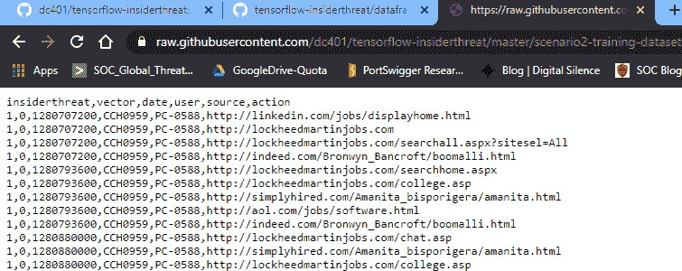

让我们研究一下 python 代码，以帮助我们达到我们想要的最终状态，即:

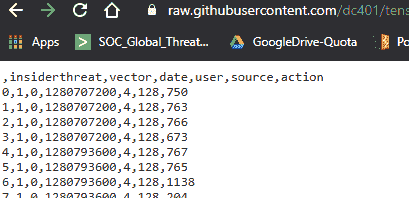

代码可复制如下:

```
import numpy as np
import pandas as pd
import tensorflow as tf
from tensorflow import feature_column
from tensorflow.keras import layers
from sklearn.model_selection import train_test_split
from pandas.api.types import CategoricalDtype
#Use Pandas to create a dataframe
#In windows to get file from path other than same run directory see:
#https://stackoverflow.com/questions/16952632/read-a-csv-into-pandas-from-f-drive-on-windows-7
URL = 'https://raw.githubusercontent.com/dc401/tensorflow-insiderthreat/master/scenario2-training-dataset-transformed-tf.csv'
dataframe = pd.read_csv(URL)
#print(dataframe.head())
#show dataframe details for column types
#print(dataframe.info())
#print(pd.unique(dataframe['user']))
#https://pbpython.com/categorical-encoding.html
dataframe["user"] = dataframe["user"].astype('category')
dataframe["source"] = dataframe["source"].astype('category')
dataframe["action"] = dataframe["action"].astype('category')
dataframe["user_cat"] = dataframe["user"].cat.codes
dataframe["source_cat"] = dataframe["source"].cat.codes
dataframe["action_cat"] = dataframe["action"].cat.codes
#print(dataframe.info())
#print(dataframe.head())
#save dataframe with new columns for future datmapping
dataframe.to_csv('dataframe-export-allcolumns.csv')
#remove old columns
del dataframe["user"]
del dataframe["source"]
del dataframe["action"]
#restore original names of columns
dataframe.rename(columns={"user_cat": "user", "source_cat": "source", "action_cat": "action"}, inplace=True)
print(dataframe.head())
print(dataframe.info())
#save dataframe cleaned up
dataframe.to_csv('dataframe-export-int-cleaned.csv')
#Split the dataframe into train, validation, and test
train, test = train_test_split(dataframe, test_size=0.2)
train, val = train_test_split(train, test_size=0.2)
print(len(train), 'train examples')
print(len(val), 'validation examples')
print(len(test), 'test examples')
#Create an input pipeline using tf.data
# A utility method to create a tf.data dataset from a Pandas Dataframe
def df_to_dataset(dataframe, shuffle=True, batch_size=32):
  dataframe = dataframe.copy()
  labels = dataframe.pop('insiderthreat')
  ds = tf.data.Dataset.from_tensor_slices((dict(dataframe), labels))
  if shuffle:
    ds = ds.shuffle(buffer_size=len(dataframe))
  ds = ds.batch(batch_size)
  return ds
#choose columns needed for calculations (features)
feature_columns = []
for header in ["vector", "date", "user", "source", "action"]:
    feature_columns.append(feature_column.numeric_column(header))
#create feature layer
feature_layer = tf.keras.layers.DenseFeatures(feature_columns)
#set batch size pipeline
batch_size = 32
train_ds = df_to_dataset(train, batch_size=batch_size)
val_ds = df_to_dataset(val, shuffle=False, batch_size=batch_size)
test_ds = df_to_dataset(test, shuffle=False, batch_size=batch_size)
#create compile and train model
model = tf.keras.Sequential([
  feature_layer,
  layers.Dense(128, activation='relu'),
  layers.Dense(128, activation='relu'),
  layers.Dense(1)
])
model.compile(optimizer='adam',
              loss=tf.keras.losses.BinaryCrossentropy(from_logits=True),
              metrics=['accuracy'])
model.fit(train_ds,
          validation_data=val_ds,
          epochs=5)
loss, accuracy = model.evaluate(test_ds)
print("Accuracy", accuracy)
```

在我们的场景中，我们将从 Github 获取数据。我已经在注释中包含了使用 os import 从本地文件导入到磁盘的方法。需要指出的一点是，我们使用 Pandas dataframe 构造和方法，通过输入的标签编码来操作列。请注意，这不是 RapidMiner Studio 向我们报告的优化方式。

在第二轮建模中，我们仍然使用我们在前面屏幕中重新运行的相同特性集列；不过这次是在 Tensorflow 进行方法演示。

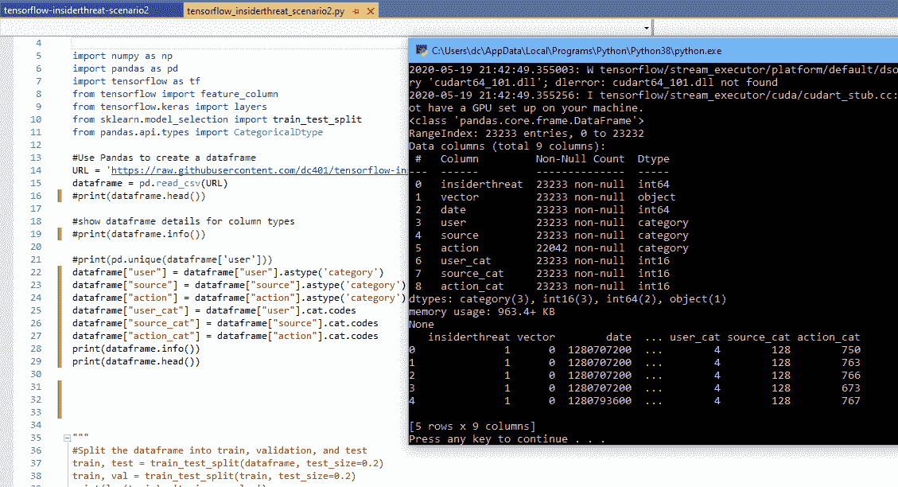

*注意，在上面的数据类型中，vector 仍然显示“object ”,这是一个错误。我急得要命，发现我需要更新数据集，因为我没有像我最初想的那样将所有值作为类别数字捕获到向量列中。很明显，我漏了一个。一旦这一切都被纠正，错误消失，模型训练运行没有问题。*

与 RapidMiner Studio 不同，我们不只是有一个大型训练集，并让系统为我们做这件事。我们必须将训练集分成更小的部分，这些部分必须根据以下内容进行批处理，作为使用已知正确的真/假内部威胁数据进行训练的模型的子集，并保留一部分进行分割，剩余部分仅进行验证。

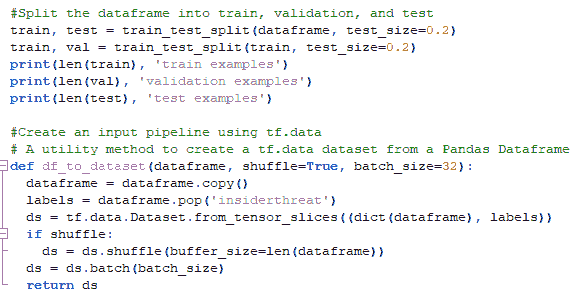

接下来，我们需要选择我们的特征列，这也是我们编码的 5 列数据中的“非优化”列。我们在管道的每轮验证(时期)中使用 32 的抽样批量，正如我们在早期定义的那样。

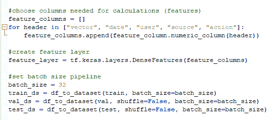

请注意，我们还没有执行任何与张量相关的操作，甚至还没有创建模型。这只是数据准备和建立供给张量的“管道”。下面是当我们使用 Keras 以连续格式使用层创建模型时，我们使用 Google TF 的教程演示优化器和损失函数编译模型，重点是准确性。我们尝试用 5 轮来拟合和验证模型，然后打印显示。

欢迎来到剩余的 10%旅程，将人工智能应用于您的内部威胁数据集！

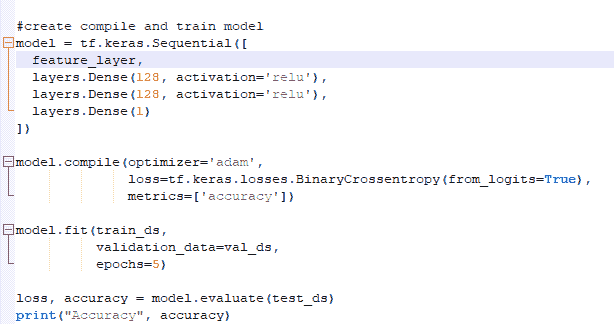

让我们再次运行它，现在我们看到像上次一样有大约 61%的准确率！这再次证明，您的大部分成果将来自数据科学过程本身以及预处理、调优和数据的质量。你选择哪种核心软件解决方案并不重要。没有在变化的特征集合中进行优化和测试的多模型实验模拟；我们的原始模型最多只比随机抽样好 10%,人类分析师可能会也可能不会查看相同的数据。


# 人工智能在网络安全领域的投资回报率在哪里

对于可以在单个事件上完成的简单项目任务，作为警报，而不是使用非领域专家的事件；通过 SOC 或威胁搜索实现人工智能的防御者可以更快更好地实现被认为异常或不使用基线数据的 ROI。例如，异常用户代理字符串可能显示 C2 病毒感染，K-means 或 KNN 聚类基于网络威胁情报 IOC，可能显示特定的 APT 相似性。

Github 上有一些很棒的精选列表，可以给你的团队一些想法，让他们用一些我们在本文中展示的简单方法去做其他的事情。无论你选择使用哪种软件解决方案，我们的警报有效载荷很可能真的需要应用 NLP 和一个[大小合适的神经网络](https://www.tensorflow.org/tutorials/text/text_classification_rnn)来进行更精确的建模。请随意修改我们的基本 python 模板并亲自试用。

# 将大约 60%的准确率与其他真实世界的网络使用案例进行比较

我不得不承认，一开始我对自己相当失望；即使我们知道这不是一个带有标签和输入选择的优化模型。但是当我们将它与社区中其他更复杂的数据集和模型进行交叉比较时，比如 [Kaggle](https://www.kaggle.com/) :它真的没有我们最初想象的那么糟糕。

微软为社区举办了一场恶意软件检测比赛，并提供了丰富的数据集。比赛最高分显示预测准确率为 67%，这是在 2019 年，有超过 2400 支球队参赛。一名成员分享了他们的代码，该代码获得了 63%的分数，免费向公众发布，如果你想进一步研究，可以作为一个很好的模板。他标题为 [LightGBM](https://www.kaggle.com/bogorodvo/lightgbm-baseline-model-using-sparse-matrix) 。

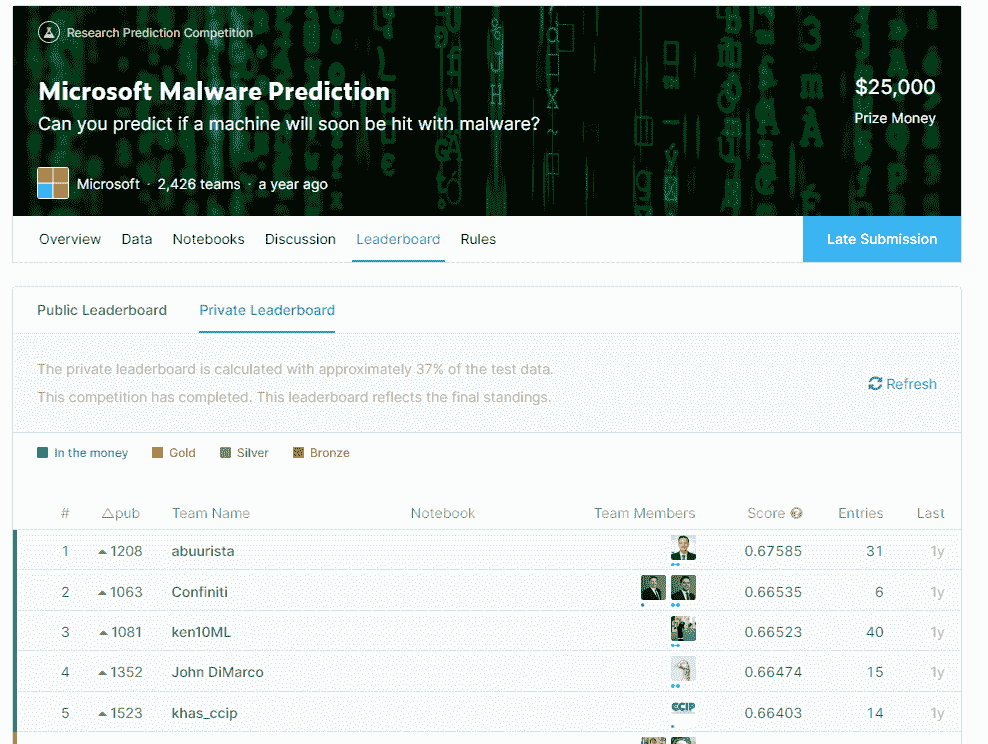

与排行榜积分相比，面向公众的解决方案仅“差”5%在数据科学领域，5%的差异是一个巨大的数字吗？是的(尽管这也取决于你如何衡量信心水平)。因此，在 2400+个团队中，最好的模型取得了大约 68%的成功准确率。但是从预算投资回报率的角度来看，当 CISO 要求他们下一财年的资本支出时，68%对大多数安全项目来说是不够的。

虽然有些令人沮丧，但重要的是要记住，有专门的数据科学和开发运营专业人员花费他们的整个职业生涯来完成这项工作，以使 models u 达到 95%或更高的范围。为了实现这一点，需要大量的模型测试、额外的数据和额外的特征集提取(正如我们在 RapidMiner Studio 中看到的那样)。

# 对于将人工智能应用于内部威胁，我们将何去何从？

显然，这是一项复杂的任务。迪肯大学的研究人员在年发表了一篇名为“[基于图像的内部威胁分类特征表示法](https://arxiv.org/pdf/1911.05879.pdf) n”的论文，该论文在文章的前面部分简要提到过。他们讨论了根据同一 US-CERT CMU 数据集提供的大量数据创建特征集的方法，并创建了可用于预测分类的“图像”,准确率达到 98%。

在论文中，研究人员还讨论了对先前模型的检查，如针对内部威胁的“[诱饵](http://users.umiacs.umd.edu/~sarit/data/articles/TCSS-submission-insider-threat%20-%20Final-Revision.pdf)”，该模型使用不平衡数据最多也有 70%的准确性。有足够预算的安全程序可以在数据科学家和开发运营工程师的帮助下从头开始制作内部模型，他们可以将这份研究报告转化为适用的代码。

# 网络防御者如何在 AI 方面变得更好，并开始在内部开发技能？

少关注解决方案，多关注数据科学和预处理。我拿了 EdX [的 Data8x 课件](https://www.edx.org/professional-certificate/berkeleyx-foundations-of-data-science?source=aw&utm_source=aw&utm_medium=affiliate_partner&utm_content=text-link&utm_term=85386_VigLink+Content)(总共 3 个)和参考的[书](https://www.inferentialthinking.com/)(也是免费的)提供了很多细节和方法，任何人都可以用来正确地检查数据，并知道他们在这个过程中在看什么。本课程集和其他课程集可以真正增强和提高现有的网络安全技能，让我们做好如下准备:

*   评估提供“人工智能”服务和解决方案的供应商的实际效率，例如询问使用了哪些数据预处理、功能集、模型架构和优化功能
*   构建用例，并在被视为异常的情况下，通过更明智的人工智能特定建模选择来增强他们的 SOC 或威胁搜索程序
*   能够将高质量数据传输并自动化到经过验证的可靠模型中，以实现高效的警报和响应

# 关闭

我希望你喜欢这篇关于内部威胁的网络安全应用的文章和教程简介，或者使用两种不同的解决方案将任何数据设置到神经网络中。如果您对专业服务或 MSSP 感兴趣，以加强您组织的网络安全，请随时联系我们，电话:[www.scissecurity.com](https://www.scissecurity.com/)