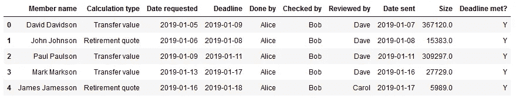
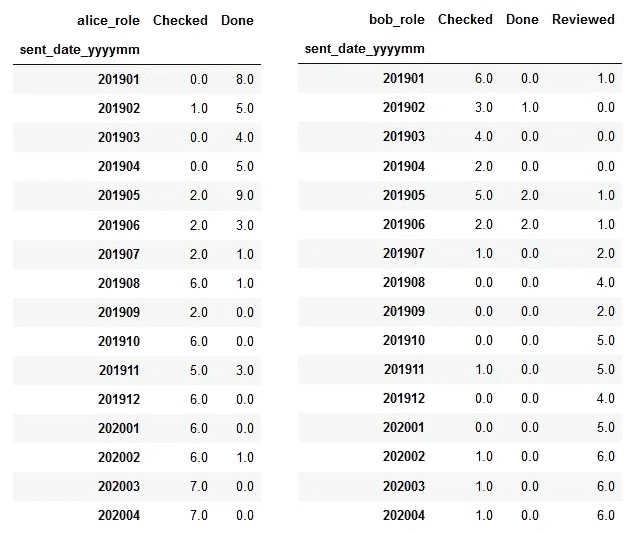
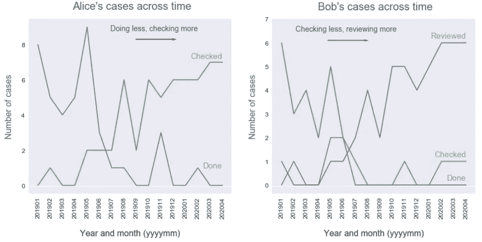
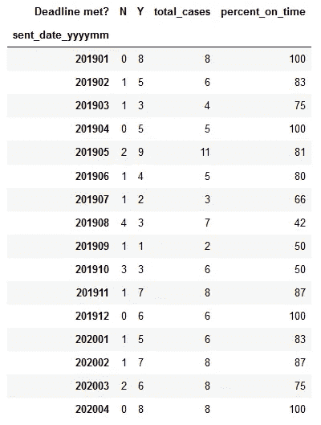
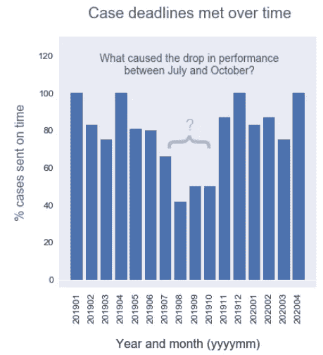
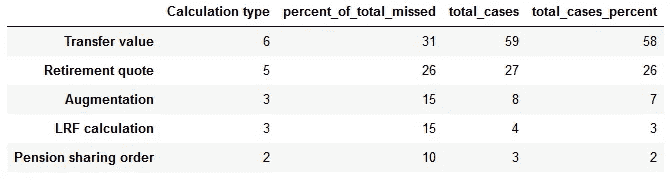
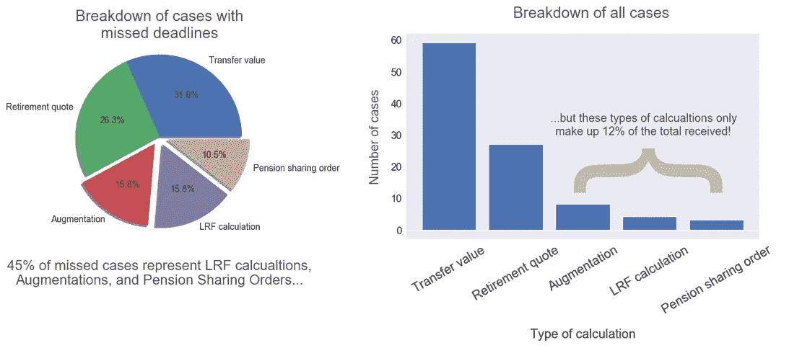

# 洞察力无处不在。

> 原文：<https://towardsdatascience.com/insight-is-everywhere-6bae83729b?source=collection_archive---------67----------------------->

## 你的数据包含洞察力。是的，你的！

数据科学不是为那些受过正规 it 培训的人保留的。任何有动机的人都可以跳上他们的笔记本电脑，开始挖掘、调查和想象。

他们可以从手头的数据着手。天哪，我们到处都有——通常数量非常大。在我们的工作和生活中，我们不断地抛出数据——尽管这些数据的质量因来源而异，但如果你告诉我，从你可以访问的数据中提取不出任何有价值的东西，我是不会相信你的。我想证明，即使是从最初可能会忽略的简单数据源中，也完全有可能获得洞察力。

照片由[S O C I A L C U T](https://unsplash.com/@socialcut?utm_source=unsplash&utm_medium=referral&utm_content=creditCopyText)在 [Unsplash](https://unsplash.com/s/photos/insight?utm_source=unsplash&utm_medium=referral&utm_content=creditCopyText) 上拍摄

## 那交易是什么？

在某些行业，比如金融业，通常不缺乏可供分析的数字数据——但我意识到，其他行业可能不存在这种情况。因此，为了表明这些原则更普遍地适用于其他类型的组织，我们将放弃这些数字，研究一个相当通用的数据文件。

对于那些渴望了解数据是如何被处理的人，你可以跟随我上传到 GitHub 的 [Jupyter 笔记本](https://github.com/andrewhetherington/python-projects/blob/master/Blog%E2%80%94Insight%20Is%20Everywhere/Insight%20Is%20Everywhere.ipynb)。 [Python](https://www.python.org/) 用于此分析。 [Numpy](https://numpy.org/) 和 [Pandas](https://pandas.pydata.org/) 用于数据操作和计算。所有的图都是使用 [Matplotlib](https://matplotlib.org/) 生成的。

数据文件的前几行。

我们正在使用工作进展(WIP)文档，该文档用于记录自 2019 年以来已完成的许多精算工作项目的详细信息。我们有:

*   成员名称:任务已完成的成员的名称
*   计算类型:所需的计算类型
*   请求日期:请求工作的日期
*   截止日期:要求完成工作的日期
*   完成者:谁完成了这项工作
*   检查者:谁检查了工作
*   审核人:谁审核并批准了该工作
*   发送日期:作品完成并发送出去的日期
*   期限到了吗？:工作是否在截止日期前及时完成，即发送日期是在截止日期之前还是同一天

一旦我们检查了数据的完整性，并处理了任何错误或缺失的值，我们就可以开始了。

## 谁在做什么？

假设我们想跟踪 Alice 和 Bob 在工作流程中接触每个角色的程度，我们想确保他们都获得了经验并取得了进步。经过一些处理后，我们可以计算出自 2019 年初以来，爱丽丝和鲍勃每个月完成、检查和审查了多少个案例:

爱丽丝和鲍勃参与这些工作任务。

表格固然很好，但是我们的大脑不能像一个好的可视化一样真正掌握表格数据。让我们来绘制这些发现:

现在我们可以更清楚地了解这些趋势。

我们可以看到，Alice 最初做了许多案例，但现在已经转变为更多的检查角色。同样，Bob 在 2019 年初主要是检查案例，而现在他正在审查他看到的大多数案例。这两个指标都很好地表明了我们的员工正在学习和接受挑战！

## 我们是否按时完成了任务？

我们可能会签订某种服务水平协议，以确保我们的工作速度足够快。提供低于约定水平的服务会损害我们与客户的关系。如果他们最终去找我们的竞争对手寻求更好的服务，我们可能会失去业务。记住这一点，让我们看看最近我们是否按时完成了任务。

看起来…好吗？这有点难以判断

同样，让我们用图表来表示数据:

看起来我们有点不稳定

看起来我们通常保持 80%到 100%的案例按时交付的服务水平。然而，从 2019 年 7 月到 10 月，服务水平有相当大的下降。如果我们还没有意识到，我们会深入了解为什么我们的团队表现不佳，并解决这个问题。我们人手不足吗？那是一个特别繁忙的时期吗？我们是否需要雇用更多的长期或临时工作人员来应付？

有时候，数据分析产生的问题比它回答的问题还多，但是如果它们是正确的问题，那么我们就在朝着正确的方向前进，并增加价值。

## 我们错过了什么案子的最后期限？

按时完成对我们的团队和我们与客户的关系都很重要。让我们来看看在错过最后期限时最容易出问题的案例。

等着吧…

像往常一样，让我们看看是否可以用一种更清楚地揭示正在发生什么的方式来绘制这些数据:

啊哈！

有意思！有一些类型的计算相对来说很少收到，但是它们在我们错过最后期限的所有案例中占了很大比例。换句话说，不管出于什么原因，我们在这方面都差得不成比例。

潜在的行动可能是对团队如何处理这些情况进行更多的在职指导，或者可能是向全公司的培训和发展团队反馈，在新员工入职时需要更彻底地涵盖这些类型的计算。

## 洞察力无处不在

希望这在某种程度上证明了，当涉及到您的数据时，几乎总是有一些有趣的东西需要研究。我们仅仅触及了这个相当基础的数据集所能提供的皮毛。限制因素不是技术。它不是在现实世界中应用数据科学的机会的可用性。它甚至不是知识——有无穷无尽的资源可供我们学习。

*限制因素是动机*。学习曲线一开始可能很难管理，我们在学习过程中都会遇到问题。其中一些问题可能看起来无法克服，并可能导致我们在愤怒和沮丧中放弃。但是，寻求这些棘手问题的解决方案是我们发展最快的领域。只要你坚持努力，这些问题就能够也一定会被克服。

您可能不认为自己是数据科学家，但事实上，任何人都可以学习在工作中应用这些工具。所以我鼓励你——挑选一份你认为可能包含有用见解的数据。一旦你开始探索和使用它，*你将很快证明自己的能力*。

# 更多信息和积分

**Andrew Hetherington** 是英国伦敦的一名见习精算师和数据爱好者。

*   在 [LinkedIn](https://www.linkedin.com/in/andrewmhetherington/) 上和我联系。
*   看看我在 [GitHub](https://github.com/andrewhetherington/python-projects) 上鼓捣什么。
*   用于制作本文作品的笔记本可以在[这里](https://github.com/andrewhetherington/python-projects/blob/master/Blog%E2%80%94Insight%20Is%20Everywhere/Insight%20Is%20Everywhere.ipynb)找到。

图片:由[S O C I A L C U T](https://unsplash.com/@socialcut)在 [Unsplash](https://unsplash.com/) 上拍摄的望远镜照片。