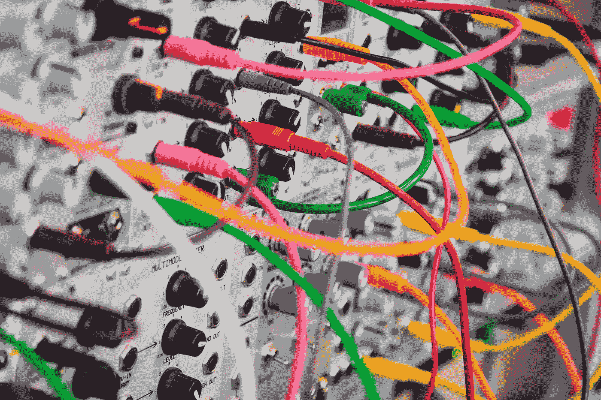

# 洞察力是王道——如何获得洞察力并避免陷阱

> 原文：<https://towardsdatascience.com/insight-is-king-how-to-get-it-and-avoid-pitfalls-ea0276541006?source=collection_archive---------80----------------------->

很难*找到对数据集如何运行的直观理解！然而，连贯地解释你的系统是如何工作的，对于找到一种建模或分析任何特征的方法是至关重要的。坚持到最后，找出为什么最初的洞察力是良好分析的关键，你必须做什么来形成你的理解，以及如何轻松避免和克服问题。*

我在一个 5 人团队中一直在做一个[项目，利用澳大利亚的天气数据](https://github.com/KamWithK/Temp2Enrgy)来预测能源需求。它历时半年，模仿了一个经典的数据科学项目。*从数据收集开始，转移到清理、建模，然后撰写报告。*进行到一半的时候，我发现了一件事——我还在*清理数据*,尽管有另外四个人在做这件事，但还是花了很长时间！看起来我们有一百万个功能需要处理，其中大部分都离*很远，很难使用*。我认为这是一个学习更多不同的(奇特的)技术的机会，这些技术可以用来插入(填充)缺失的数据。但是… **我完全误解了我的项目**。

> *我们不明白我们的数据是如何工作的，所以必须考虑 100 个特征，而不是 3 个…*

约翰·巴克利普在 Unsplash 上的照片

这是一个幼稚的错误，但却给了我几个宝贵的教训:

1.  低质量/不相关的数据弊大于利
2.  我的团队的工作只能在被理解的情况下完成

现在不要担心，我们确实按时完成了，有一个模型和完整的报告！但是…只有在我考虑了这些缺陷之后，我的团队才能像一台运转良好的机器一样运转。因此，在这里，我们将探讨如何找到洞察力并从中受益，以及如何避免一直存在的缺陷和潜在的陷阱(每个人在某个时候都会遇到)。

强调理解数据如何运作的重要性很容易，但要发现它却很难。有了教程、kaggle 竞赛和简单的初学者练习，就很容易了……理解和翻译部分已经轻而易举地交给你了。只要拿出你的金叉(*代号*)和刀(*合奏模型*)，开始切割(*测试*)和你能吃的 whala(*高性能模型*)！

然后你取得进展，开始一些真正的项目…哦，不。也许没有一个放之四海而皆准的策略，但是我们可以通过适当地设置自己，让这个过程变得更顺利，更少痛苦。

杨静在 Unsplash 上的照片

# 从哪里开始

> 只是酷……不，请等等！

代码很重要，但是我要告诉你一个小秘密——*当你知道过程*时，花费的时间会更少。Bbubbbut…如何在第一次开始之前了解流程？简单，解释任务目标。缺失的目标是你想从项目中得到的。任务目标包括模型和报告本身，但也包括您需要学习的内容、您将经历的阶段以及需要考虑的挑战。

> *我以为我的目标是尽我所能创造最好的模型来预测能源需求，哈哈哈。我完全错了！*

我的目标不是预测能源需求…因为那几乎是不可能的。我真正想要的是识别和模拟短期内发生的能源需求趋势和季节模式，以及温度如何适应这个等式。它包括导入数据，研究哪些变量是有用的，创建图表以直观地显示数据的外观/工作方式，然后最终创建一个模型来具体测量温度和能源需求之间的关系。主要的困难在于了解能源时间序列是如何工作的，以及如何指导我的团队完成这个过程的每个阶段。还很啰嗦吗？最终目标可能是一个报告，展示了在我们得到一个模型之前一切是如何工作的，但是实际上，模型只是工作的 10%!

虽然很容易把它放在一边…说它是软的，不必要的计划，现在不太可能直接影响项目。事实上……是的，这是额外的工作，也很公平，如果你不是被迫像这样计划每件事的话。如果你有更好的选择，请告诉我。如果没有，试一试。它可能不会马上影响到你，但是它将有助于缓解大问题，并阐明所有事情是如何联系在一起的！

凯尔·格伦在 Unsplash 上的照片

# 找出下一步去哪里

但是我不知道如何做这些… 不要担心，随着时间的推移，你会明白的。请记住:

> 一旦开始，道路似乎就不那么崎岖不平了！

如果你不知道从哪里开始，找出你需要学习的内容，并找到学习的方法。简单的教程和视频是开始的好方法。然后，一旦你对事情应该是什么样子和该做什么有了一个模糊的想法，就开始吧。简单地跟着这条路走，看看它通向哪里！

对于数据科学项目，要知道实用的步骤和流程。我在我的[机器学习领域指南文章](https://www.kamwithk.com/machine-learning-field-guide-ckbbqt0iv025u5ks1a7kgjckx)中解释了这些，该文章详细介绍了该过程的每一步！如果你想了解更多，像[动手机器学习](https://amzn.to/3fua1k8)和[百页机器学习书](https://amzn.to/2UVmHZE)这样的书是非常有用的。

为了在团队中更好地工作，确保你了解协作编码工具(所有解释[在这里](https://www.kamwithk.com/the-complete-coding-practitioners-handbook-ck9u1vmgv03kg7bs1e5zwit2z))和如何领导。《极端所有权》这本书是一个关于团队合作和领导力的惊人指南(不是专门针对数据科学的，但 Jocko Willink 的建议仍然适用)。

Josh Calabrese 在 Unsplash 上拍摄的照片

# 避免崩溃

一切都进行得如此顺利…直到我意识到我们仍然在项目中途清理数据。一切似乎都很好，进展似乎还不错，不完美…但很好。

即使你已经为自己的成功做好了准备，而且一切都进展顺利，事情也可能会变糟！但是……我很幸运，因为一位老师告诉我要定期做一件事:

> 做一个简单的进度日志，特别是评论你做了什么，结果如何，以及可以做些什么来改进。

[Toa Heftiba](https://unsplash.com/@heftiba?utm_source=unsplash&utm_medium=referral&utm_content=creditCopyText) 在 [Unsplash](https://unsplash.com/?utm_source=unsplash&utm_medium=referral&utm_content=creditCopyText) 上拍摄的照片

它创造了奇迹！在了解我需要完成多少任务后，我没有感到压力，而是能够区分优先次序并执行，因为我知道哪里可能出错，并且我可以解释。我知道我的团队可能会分心，失去注意力，所以我确保抓住要点，强调我们试图完成的事情，而不是写下狭窄的任务。我知道很难调整自己的节奏，所以我数了数还剩多少周，确保每个人都明白。我知道编码对大多数人来说是特别具有挑战性和威胁性的，所以我做了一个简短的概述，关于它将涉及什么/它应该看起来像样本代码。简而言之，我说明了自己的弱点，并设法扭转了糟糕的局面。

这个过程*每周只需要大约 5 分钟*，极大地提高了进度。

> *你所要做的就是反思你的行为，考虑什么能进一步帮助你。*

这个**导致简单可行的步骤**。

# 感谢阅读！

我希望你喜欢这本书，并且发现它很有帮助！请随时与任何人分享这可能会有所帮助。

我其他关于[实用编码技巧](https://www.kamwithk.com/the-complete-coding-practitioners-handbook-ck9u1vmgv03kg7bs1e5zwit2z)、[机器学习](https://www.kamwithk.com/machine-learning-field-guide-ckbbqt0iv025u5ks1a7kgjckx)、[起步项目](https://www.kamwithk.com/zero-to-hero-nlp-project-edition-ck6zsqtbo05srdfs135o8blcf)和[网页抓取](https://www.kamwithk.com/zero-to-hero-data-collection-through-web-scraping-ck78o0bmg08ktd9s1bi7znd19)的文章可能会比较有意思。

在推特[上关注我的更新。](https://twitter.com/kamwithk_)

*原载于 https://www.kamwithk.com***。**