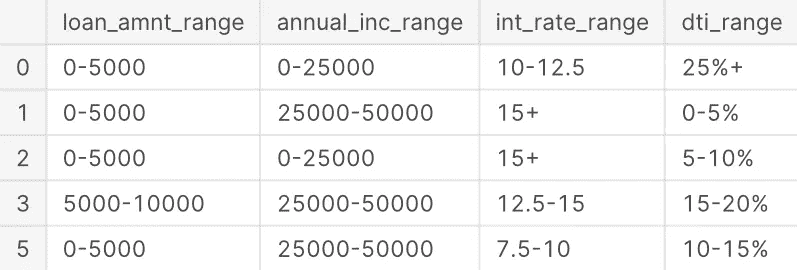
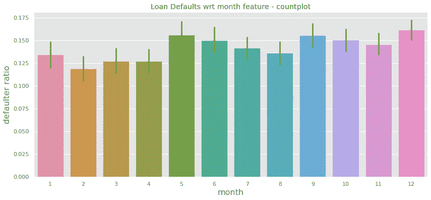
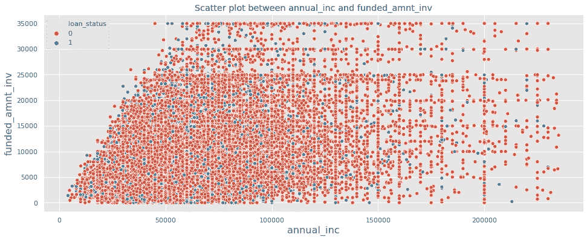
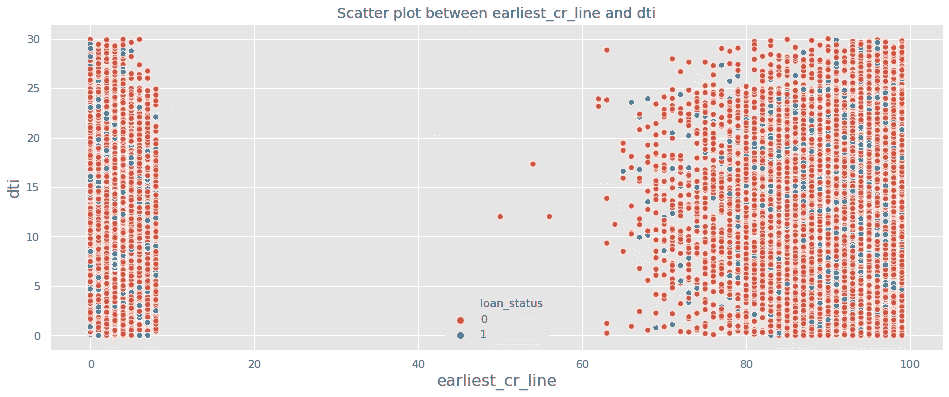
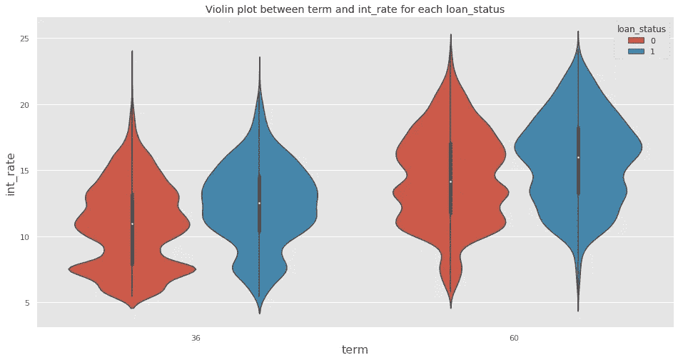
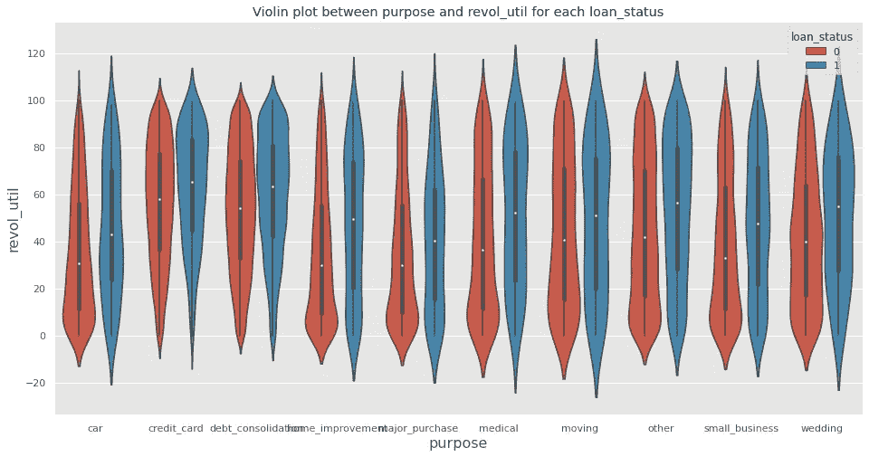

# 深刻的贷款违约分析

> 原文：<https://towardsdatascience.com/insightful-loan-default-analysis-in-lending-credit-risk-model-b16bbfc94a2f?source=collection_archive---------10----------------------->

## 深入分析

## 可视化洞察并发现贷款违约的贷款信用风险模型中的驱动特征


(图片由作者提供)

L [ending Club](https://www.lendingclub.com/) 是最大的在线贷款市场，为个人贷款、商业贷款和医疗程序融资提供便利。借款人可以通过快速的在线界面轻松获得低利率贷款。

与大多数其他贷款公司一样，向“高风险”申请人发放贷款是财务损失(称为信用损失)的最大来源。信用损失是指当借款人拒绝付款或带着所欠的钱逃跑时，贷款人所损失的金额。换句话说，违约的借款人给贷款人造成的损失最大。

因此，使用**数据科学**、**探索性数据分析**和来自 **Lending Club** 的公开数据，我们将探索和计算出贷款违约背后存在的驱动因素，即作为违约强指标的变量。此外，公司可以利用这些知识进行投资组合和风险评估。


由 [Shane](https://unsplash.com/@theyshane?utm_source=medium&utm_medium=referral) 在 [Unsplash](https://unsplash.com?utm_source=medium&utm_medium=referral) 上拍摄的照片

# **关于 Lending Club 贷款数据集**

该数据集包含通过**2007–2011**发放的所有贷款的完整贷款数据，包括当前贷款状态(**当前、已核销、已完全支付**)和最新支付信息。其他功能包括信用评分、财务查询次数和收款等。该文件是一个大约 39，000 个观察值和 111 个变量的矩阵。数据集中的一个单独文件中提供了一个**数据字典**。数据集可以在 [Kaggle](https://www.kaggle.com/imsparsh/lending-club-loan-dataset-2007-2011) 上下载。

# 问题

*   我们正在处理哪组贷款数据？
*   我们有哪些类型的**功能**？
*   我们需要治疗**缺失值**吗？
*   贷款状态分布如何？
*   具有其他特征的贷款违约分布是怎样的？
*   我们可以为**画出什么样的图来推断**与贷款违约的关系？
*   主要描述贷款违约的**驱动特征**有哪些？

# 特征分布

*   **贷款特征**，如**贷款金额、期限、目的**，显示有关贷款的信息，帮助我们发现贷款违约。
*   **人口统计变量**，如**年龄、就业状况、关系状况**，这些信息显示了对我们无用的借款人概况。
*   **行为变量**，如**下一个付款日期、EMI、拖欠**显示提供贷款后更新的信息，在我们的情况下，这些信息并不有用，因为我们需要通过违约分析来决定是否批准贷款。

*下面是我们将在本文中看到的内容的快速概述:*

*   **数据集概述**(贷款分布)
*   **数据清理**(缺失值、标准化数据、异常值处理)
*   **指标推导**(宁滨)
*   **单变量分析**(分类/连续特征)
*   **双变量分析**(箱线图、散点图、小提琴图)
*   **多变量分析**(相关热图)

# 数据/库导入

```
*# import required libraries*
import numpy as np
print('numpy version:',np.__version__)
import pandas as pd
print('pandas version:',pd.__version__)
import matplotlib.pyplot as plt
import seaborn as sns
%matplotlib inline
sns.set(style="whitegrid")
plt.style.use('ggplot')
plt.rcParams['figure.figsize'] = (12, 8)
pd.options.mode.chained_assignment = None
pd.options.display.float_format = '**{:.2f}**'.format
pd.set_option('display.max_columns', 200)
pd.set_option('display.width', 400)*# file path variable*
case_data = "/kaggle/input/lending-club-loan-dataset-2007-2011/loan.csv"
loan = pd.read_csv(case_data, low_memory=False)
```

> 数据集有 111 列和 39717 行

# 数据集概述

```
# plotting pie chart for different types of loan_status
chargedOffLoans = loan.loc[(loan["loan_status"] == "Charged Off")]
currentLoans = loan.loc[(loan["loan_status"] == "Current")]
fullyPaidLoans = loan.loc[(loan["loan_status"]== "Fully Paid")]data  = [{"Charged Off": chargedOffLoans["funded_amnt_inv"].sum(), "Fully Paid":fullyPaidLoans["funded_amnt_inv"].sum(), "Current":currentLoans["funded_amnt_inv"].sum()}]investment_sum = pd.DataFrame(data) 
chargedOffTotalSum = float(investment_sum["Charged Off"])
fullyPaidTotalSum = float(investment_sum["Fully Paid"])
currentTotalSum = float(investment_sum["Current"])
loan_status = [chargedOffTotalSum,fullyPaidTotalSum,currentTotalSum]
loan_status_labels = 'Charged Off','Fully Paid','Current'
plt.pie(loan_status,labels=loan_status_labels,autopct='**%1.1f%%**')
plt.title('Loan Status Aggregate Information')
plt.axis('equal')
plt.legend(loan_status,title="Loan Amount",loc="center left",bbox_to_anchor=(1, 0, 0.5, 1))
plt.show()
```


(图片由作者提供)

```
*# plotting pie chart for different types of purpose*
loans_purpose = loan.groupby(['purpose'])['funded_amnt_inv'].sum().reset_index()plt.figure(figsize=(14, 10))
plt.pie(loans_purpose["funded_amnt_inv"],labels=loans_purpose["purpose"],autopct='%1.1f%%')plt.title('Loan purpose Aggregate Information')
plt.axis('equal')
plt.legend(loan_status,title="Loan purpose",loc="center left",bbox_to_anchor=(1, 0, 0.5, 1))
plt.show()
```


(图片由作者提供)

# 数据清理

```
*# in dataset, we can see around half of the columns are null*
*# completely, hence remove all columns having no values*
loan = loan.dropna(axis=1, how="all")
print("Looking into remaining columns info:")
print(loan.info(max_cols=200))
```

我们剩下以下几列:

```
Looking into remaining columns info:
<class 'pandas.core.frame.DataFrame'>
RangeIndex: 39717 entries, 0 to 39716
Data columns (total 57 columns):
 #   Column                      Non-Null Count  Dtype  
---  ------                      --------------  -----  
 0   id                          39717 non-null  int64  
 1   member_id                   39717 non-null  int64  
 2   loan_amnt                   39717 non-null  int64  
 3   funded_amnt                 39717 non-null  int64  
 4   funded_amnt_inv             39717 non-null  float64
 5   term                        39717 non-null  object 
 6   int_rate                    39717 non-null  object 
 7   installment                 39717 non-null  float64
 8   grade                       39717 non-null  object 
 9   sub_grade                   39717 non-null  object 
 10  emp_title                   37258 non-null  object 
 11  emp_length                  38642 non-null  object 
 12  home_ownership              39717 non-null  object 
 13  annual_inc                  39717 non-null  float64
 14  verification_status         39717 non-null  object 
 15  issue_d                     39717 non-null  object 
 16  loan_status                 39717 non-null  object 
 17  pymnt_plan                  39717 non-null  object 
 18  url                         39717 non-null  object 
 19  desc                        26777 non-null  object 
 20  purpose                     39717 non-null  object 
 21  title                       39706 non-null  object 
 22  zip_code                    39717 non-null  object 
 23  addr_state                  39717 non-null  object 
 24  dti                         39717 non-null  float64
 25  delinq_2yrs                 39717 non-null  int64  
 26  earliest_cr_line            39717 non-null  object 
 27  inq_last_6mths              39717 non-null  int64  
 28  mths_since_last_delinq      14035 non-null  float64
 29  mths_since_last_record      2786 non-null   float64
 30  open_acc                    39717 non-null  int64  
 31  pub_rec                     39717 non-null  int64  
 32  revol_bal                   39717 non-null  int64  
 33  revol_util                  39667 non-null  object 
 34  total_acc                   39717 non-null  int64  
 35  initial_list_status         39717 non-null  object 
 36  out_prncp                   39717 non-null  float64
 37  out_prncp_inv               39717 non-null  float64
 38  total_pymnt                 39717 non-null  float64
 39  total_pymnt_inv             39717 non-null  float64
 40  total_rec_prncp             39717 non-null  float64
 41  total_rec_int               39717 non-null  float64
 42  total_rec_late_fee          39717 non-null  float64
 43  recoveries                  39717 non-null  float64
 44  collection_recovery_fee     39717 non-null  float64
 45  last_pymnt_d                39646 non-null  object 
 46  last_pymnt_amnt             39717 non-null  float64
 47  next_pymnt_d                1140 non-null   object 
 48  last_credit_pull_d          39715 non-null  object 
 49  collections_12_mths_ex_med  39661 non-null  float64
 50  policy_code                 39717 non-null  int64  
 51  application_type            39717 non-null  object 
 52  acc_now_delinq              39717 non-null  int64  
 53  chargeoff_within_12_mths    39661 non-null  float64
 54  delinq_amnt                 39717 non-null  int64  
 55  pub_rec_bankruptcies        39020 non-null  float64
 56  tax_liens                   39678 non-null  float64
dtypes: float64(20), int64(13), object(24)
memory usage: 17.3+ MB
```

现在，我们将删除所有**人口统计和客户行为**特征，这些特征对于信贷审批的违约分析毫无用处。

```
*# remove non-required columns*
*# id - not required*
*# member_id - not required*
*# acc_now_delinq - empty*
*# funded_amnt - not useful, funded_amnt_inv is useful which is funded to person*
*# emp_title - brand names not useful*
*# pymnt_plan - fixed value as n for all*
*# url - not useful*
*# desc - can be applied some NLP but not for EDA*
*# title - too many distinct values not useful*
*# zip_code - complete zip is not available*
*# delinq_2yrs - post approval feature*
*# mths_since_last_delinq - only half values are there, not much information*
*# mths_since_last_record - only 10% values are there*
*# revol_bal - post/behavioural feature*
*# initial_list_status - fixed value as f for all*
*# out_prncp - post approval feature*
*# out_prncp_inv - not useful as its for investors*
*# total_pymnt - post approval feature*
*# total_pymnt_inv - not useful as it is for investors*
*# total_rec_prncp - post approval feature*
*# total_rec_int - post approval feature*
*# total_rec_late_fee - post approval feature*
*# recoveries - post approval feature*
*# collection_recovery_fee - post approval feature*
*# last_pymnt_d - post approval feature*
*# last_credit_pull_d - irrelevant for approval*
*# last_pymnt_amnt - post feature*
*# next_pymnt_d - post feature*
*# collections_12_mths_ex_med - only 1 value* 
*# policy_code - only 1 value*
*# acc_now_delinq - single valued*
*# chargeoff_within_12_mths - post feature*
*# delinq_amnt - single valued*
*# tax_liens - single valued*
*# application_type - single*
*# pub_rec_bankruptcies - single valued for more than 99%*
*# addr_state - may not depend on location as its in financial domain*

colsToDrop = ["id", "member_id", "funded_amnt", "emp_title", "pymnt_plan", "url", "desc", "title", "zip_code", "delinq_2yrs", "mths_since_last_delinq", "mths_since_last_record", "revol_bal", "initial_list_status", "out_prncp", "out_prncp_inv", "total_pymnt", "total_pymnt_inv", "total_rec_prncp", "total_rec_int", "total_rec_late_fee", "recoveries", "collection_recovery_fee", "last_pymnt_d", "last_pymnt_amnt", "next_pymnt_d", "last_credit_pull_d", "collections_12_mths_ex_med", "policy_code", "acc_now_delinq", "chargeoff_within_12_mths", "delinq_amnt", "tax_liens", "application_type", "pub_rec_bankruptcies", "addr_state"]
loan.drop(colsToDrop, axis=1, inplace=True)
print("Features we are left with",list(loan.columns))
```

> 我们只剩下 *['loan_amnt '，' funded_amnt_inv '，' term '，' int_rate '，' partition '，' grade '，' sub_grade '，' emp_length '，' home_ownership '，' annual_inc '，' verification_status '，' issue_d '，' loan_status '，' purpose '，' earliest_cr_line '，' inq_last_6mths '，' open_acc '，' pub_rec '，' revol_util '，' total_acc']*

现在，通过移除/输入来处理**缺失值**:

```
*# in 12 unique values we have 10+ years the most for emp_length,* 
*# but it is highly dependent variable so we will not impute*
*# but remove the rows with null values which is around 2.5%*loan.dropna(axis=0, subset=["emp_length"], inplace=True)*# remove NA rows for revol_util as its dependent and is around 0.1%*loan.dropna(axis=0, subset=["revol_util"], inplace=True)
```

现在，我们将一些特征列标准化，以使数据兼容用于分析:

```
*# update int_rate, revol_util without % sign and as numeric type*loan["int_rate"] = pd.to_numeric(loan["int_rate"].apply(lambda x:x.split('%')[0]))loan["revol_util"] = pd.to_numeric(loan["revol_util"].apply(lambda x:x.split('%')[0]))*# remove text data from term feature and store as numerical*loan["term"] = pd.to_numeric(loan["term"].apply(lambda x:x.split()[0]))
```

**删除贷款状态为“当前”的记录，因为贷款当前正在运行，我们无法从这些贷款中推断出任何有关违约的信息。**

```
*# remove the rows with loan_status as "Current"*
loan = loan[loan["loan_status"].apply(lambda x:False if x == "Current" else True)] *# update loan_status as Fully Paid to 0 and Charged Off to 1*
loan["loan_status"] = loan["loan_status"].apply(lambda x: 0 if x == "Fully Paid" else 1)*# update emp_length feature with continuous values as int*
*# where (< 1 year) is assumed as 0 and 10+ years is assumed as 10 and rest are stored as their magnitude*loan["emp_length"] = pd.to_numeric(loan["emp_length"].apply(lambda x:0 if "<" in x else (x.split('+')[0] if "+" in x else x.split()[0])))*# look through the purpose value counts*
loan_purpose_values = loan["purpose"].value_counts()*100/loan.shape[0]

*# remove rows with less than 1% of value counts in paricular purpose* 
loan_purpose_delete = loan_purpose_values[loan_purpose_values<1].index.values
loan = loan[[False if p in loan_purpose_delete else True for p in loan["purpose"]]]
```

# 异常值处理

查看每个特征的分位数值，我们将处理某些特征的异常值。

```
*# for annual_inc, the highest value is 6000000 where 75% quantile value is 83000, and is 100 times the mean
# we need to remomve outliers from annual_inc i.e. 99 to 100%*
annual_inc_q = loan["annual_inc"].quantile(0.99)
loan = loan[loan["annual_inc"] < annual_inc_q]*# for open_acc, the highest value is 44 where 75% quantile value is 12, and is 5 times the mean
# we need to remomve outliers from open_acc i.e. 99.9 to 100%*
open_acc_q = loan["open_acc"].quantile(0.999)
loan = loan[loan["open_acc"] < open_acc_q]*# for total_acc, the highest value is 90 where 75% quantile value is 29, and is 4 times the mean
# we need to remomve outliers from total_acc i.e. 98 to 100%*
total_acc_q = loan["total_acc"].quantile(0.98)
loan = loan[loan["total_acc"] < total_acc_q]*# for pub_rec, the highest value is 4 where 75% quantile value is 0, and is 4 times the mean
# we need to remomve outliers from pub_rec i.e. 99.5 to 100%*
pub_rec_q = loan["pub_rec"].quantile(0.995)
loan = loan[loan["pub_rec"] <= pub_rec_q] 
```

这是我们的数据在清理和标准化功能后的样子:


(图片由作者提供)

# 度量派生

*   发行日期不是标准格式，我们也可以将日期分为月和年两栏，这样便于分析
*   日期时间中的 Year 要求 year 介于 00 到 99 之间，在某些情况下 year 是一位数，即 9 编写一个将转换此类日期的函数，以避免日期转换中出现异常。

```
def standerdisedate(date):
    year = date.split("-")[0]
    if(len(year) == 1):
        date = "0"+date
    return datefrom datetime import datetime
loan['issue_d'] = loan['issue_d'].apply(lambda x:standerdisedate(x))
loan['issue_d'] = loan['issue_d'].apply(lambda x: datetime.strptime(x, '%b-%y'))*# extracting month and year from issue_date*
loan['month'] = loan['issue_d'].apply(lambda x: x.month)
loan['year'] = loan['issue_d'].apply(lambda x: x.year)*# get year from issue_d and replace the same*
loan["earliest_cr_line"] = pd.to_numeric(loan["earliest_cr_line"].apply(lambda x:x.split('-')[1]))
```

宁滨连续特征:

```
*# create bins for loan_amnt range*
bins = [0, 5000, 10000, 15000, 20000, 25000, 36000]
bucket_l = ['0-5000', '5000-10000', '10000-15000', '15000-20000', '20000-25000','25000+']
loan['loan_amnt_range'] = pd.cut(loan['loan_amnt'], bins, labels=bucket_l)*# create bins for int_rate range*
bins = [0, 7.5, 10, 12.5, 15, 100]
bucket_l = ['0-7.5', '7.5-10', '10-12.5', '12.5-15', '15+']
loan['int_rate_range'] = pd.cut(loan['int_rate'], bins, labels=bucket_l)*# create bins for annual_inc range*
bins = [0, 25000, 50000, 75000, 100000, 1000000]
bucket_l = ['0-25000', '25000-50000', '50000-75000', '75000-100000', '100000+']
loan['annual_inc_range'] = pd.cut(loan['annual_inc'], bins, labels=bucket_l)*# create bins for installment range*
def installment(n):
    if n <= 200:
        return 'low'
    elif n > 200 and n <=500:
        return 'medium'
    elif n > 500 and n <=800:
        return 'high'
    else:
        return 'very high'

loan['installment'] = loan['installment'].apply(lambda x: installment(x))*# create bins for dti range*
bins = [-1, 5.00, 10.00, 15.00, 20.00, 25.00, 50.00]
bucket_l = ['0-5%', '5-10%', '10-15%', '15-20%', '20-25%', '25%+']
loan['dti_range'] = pd.cut(loan['dti'], bins, labels=bucket_l)
```

将创建以下箱:



(图片由作者提供)

# 可视化数据洞察力

```
*# check for amount of defaults in the data using countplot*
plt.figure(figsize=(14,5))
sns.countplot(y="loan_status", data=loan)
plt.show()
```


(图片由作者提供)

> 从上图我们可以看出，在总共 35152 条记录中，约有 16%即 5062 人是违约者。

## 单变量分析

```
*# function for plotting the count plot features wrt default ratio*
def plotUnivariateRatioBar(feature, data=loan, figsize=(10,5), rsorted=True):
    plt.figure(figsize=figsize)
    if rsorted:
        feature_dimension = sorted(data[feature].unique())
    else:
        feature_dimension = data[feature].unique()
    feature_values = []
    for fd in feature_dimension:
        feature_filter = data[data[feature]==fd]
        feature_count = len(feature_filter[feature_filter["loan_status"]==1])
        feature_values.append(feature_count*100/feature_filter["loan_status"].count())
    plt.bar(feature_dimension, feature_values, color='orange', edgecolor='white')
    plt.title("Loan Defaults wrt "+str(feature)+" feature - countplot")
    plt.xlabel(feature, fontsize=16)
    plt.ylabel("defaulter %", fontsize=16)
    plt.show()# function to plot univariate with default status scale 0 - 1
def plotUnivariateBar(x, figsize=(10,5)):
    plt.figure(figsize=figsize)
    sns.barplot(x=x, y='loan_status', data=loan)
    plt.title("Loan Defaults wrt "+str(x)+" feature - countplot")
    plt.xlabel(x, fontsize=16)
    plt.ylabel("defaulter ratio", fontsize=16)
    plt.show()
```

**a .分类特征**

```
*# check for defaulters wrt term in the data using countplot*
plotUnivariateBar("term", figsize=(8,5))
```


(图片由作者提供)

> 从上面的“期限”图中，我们可以推断，违约率在期限内不断增加，因此，3600 万英镑贷款违约的可能性小于 6000 万英镑。
> 
> `**is term benificial -> Yes**`

```
*# check for defaulters wrt grade in the data using countplot*
plotUnivariateRatioBar("grade")
```


(图片由作者提供)

> 从上面的“等级”图中，我们可以推断出违约率随着等级的增加而增加，因此贷款违约的几率随着等级从 A 向 g 的增加而增加。
> 
> `**is grade benificial -> Yes**`

```
*# check for defaulters wrt sub_grade in the data using countplot*
plotUnivariateBar("sub_grade", figsize=(16,5))
```


(图片由作者提供)

> 从上面的“路基”图中，我们可以推断出违约率在路基中增加，因此贷款违约的机会随着路基从 A1 向 G5 移动而增加。
> 
> `**is sub_grade benificial -> Yes**`

```
*# check for defaulters wrt home_ownership in the data* 
plotUnivariateRatioBar("home_ownership")
```


(图片由作者提供)

> 从上面的“房屋所有权”图中，我们可以推断这里的违约率是恒定的(其他人的违约率相当高，但我们不知道那里有什么，所以我们不会考虑它进行分析)，因此违约率不取决于房屋所有权
> 
> `**is home_ownership benificial -> No**`

```
*# check for defaulters wrt verification_status in the data*
plotUnivariateRatioBar("verification_status")
```


(图片由作者提供)

> 从上面的“验证 _ 状态”图中，我们可以推断出违约率正在增加，并且未验证用户的违约率小于已验证用户的违约率，但是对分析没有用处。
> 
> `**is verification_status benificial -> No**`

```
*# check for defaulters wrt purpose in the data using countplot*
plotUnivariateBar("purpose", figsize=(16,6))
```


(图片由作者提供)

> 从上述“目的”图中，我们可以推断，除“小企业”外，所有目的类型的违约率几乎是恒定的，因此违约率将取决于贷款的目的
> 
> `**is purpose benificial -> Yes**`

```
*# check for defaulters wrt open_acc in the data using countplot*
plotUnivariateRatioBar("open_acc", figsize=(16,6))
```


(图片由作者提供)

> 从上面的“open_acc”图中，我们可以推断，对于功能 open_acc，违约率几乎是恒定的，因此违约率不依赖于 open_acc 功能
> 
> `**is open_acc benificial -> No**`

```
*# check for defaulters wrt pub_rec in the data using countplot*
plotUnivariateRatioBar("pub_rec")
```


(图片由作者提供)

> 从上面的“pub_rec”图中，我们可以推断出违约率几乎在增加，因为 0 的违约率较小，而值为 1 的 pub_rec 的违约率较大，但由于其他值与 0 相比非常小，因此我们不会考虑这一点
> 
> `**is pub_rec benificial -> No**`

**b .连续特征**

```
*# check for defaulters wrt emp_length in the data using countplot*
plotUnivariateBar("emp_length", figsize=(14,6))
```


(图片由作者提供)

> 从上面的“雇员长度”图中，我们可以推断出违约率在这里是常数，因此违约率不依赖于雇员长度
> 
> `**is emp_length benificial -> No**`

```
*# check for defaulters wrt month in the data using countplot*
plotUnivariateBar("month", figsize=(14,6))
```



(图片由作者提供)

> 从上面的“月”图中，我们可以推断出违约率在这里几乎是常数，没有用
> 
> `**is month benificial -> No**`

```
*# check for defaulters wrt year in the data using countplot*
plotUnivariateBar("year")
```


(图片由作者提供)

> 从上面的“年”图中，我们可以推断出违约率在这里几乎是常数，没有用
> 
> `**is year benificial -> No**`

```
*# check for defaulters wrt earliest_cr_line in the data*
plotUnivariateBar("earliest_cr_line", figsize=(16,10))
```


(图片由作者提供)

> 从上面的“earliest_cr_line”图中，我们可以推断，除了 65 岁左右的年份，所有目的类型的违约率几乎都是恒定的，因此违约率不依赖于人的 earliest_cr_line
> 
> `**is earliest_cr_line benificial -> No**`

```
*# check for defaulters wrt inq_last_6mths in the data*
plotUnivariateBar("inq_last_6mths")
```


(图片由作者提供)

> 从上面的“inq_last_6mths”图中，我们可以推断，违约率不会随着 inq_last_6mths 类型的增加而持续增加，因此没有用
> 
> `**is inq_last_6mths benificial -> No**`

```
*# check for defaulters wrt revol_util in the data using countplot*
plotUnivariateRatioBar("revol_util", figsize=(16,6))
```


(图片由作者提供)

> 从上述“革命”图中，我们可以推断，违约率是波动的，有些违约率为 100%,并且随着规模的增加而增加，因此违约率将取决于革命的特点
> 
> `**is revol_util benificial -> Yes**`

```
*# check for defaulters wrt total_acc in the data using countplot*
plotUnivariateRatioBar("total_acc", figsize=(14,6))
```


(图片由作者提供)

> 从上面的‘total_acc’图中，我们可以推断出，对于所有的 total_acc 值，违约率几乎是恒定的，因此违约率不依赖于 total _ ACC 特性
> 
> `**is total_acc benificial -> No**`

```
*# check for defaulters wrt loan_amnt_range in the data using countplot*
plotUnivariateBar("loan_amnt_range")
```


(图片由作者提供)

> 从上面的“贷款 _amnt_range”图中，我们可以推断出违约率正在增加贷款 _amnt_range 值，因此利率将取决于贷款 _amnt_range 特征
> 
> `**is loan_amnt_range benificial -> Yes**`

```
*# check for defaulters wrt int_rate_range in the data*
plotUnivariateBar("int_rate_range")
```


(图片由作者提供)

> 从上面的“int_rate_range”图中，我们可以推断出违约率随着 int_rate_range 值的增加而降低，因此违约率将取决于 int_rate_range 特性
> 
> `**is int_rate_range benificial -> Yes**`

```
*# check for defaulters wrt annual_inc_range in the data*
plotUnivariateBar("annual_inc_range")
```


(图片由作者提供)

> 从上述“年度收入范围”图中，我们可以推断违约率随着年度收入范围值的增加而降低，因此违约率将取决于年度收入范围特征
> 
> `**is annual_inc_range benificial -> Yes**`

```
*# check for defaulters wrt dti_range in the data using countplot*
plotUnivariateBar("dti_range", figsize=(16,5))
```


(图片由作者提供)

> 从上面的“dti_range”图中，我们可以推断违约率随着 dti_range 值的增加而增加，因此违约率将取决于 dti_range 特性
> 
> `**is dti_range benificial -> Yes**`

```
*# check for defaulters wrt installment range in the data*
plotUnivariateBar("installment", figsize=(8,5))
```


(图片由作者提供)

> 从上述“分期付款”图中，我们可以推断违约率随着分期付款值的增加而增加，因此违约率将取决于 dti_range 特征
> 
> `**is installment benificial -> Yes**`

*因此，以下是我们从上述单变量分析中推导出的重要特征:*

`**term, grade, purpose, pub_rec, revol_util, funded_amnt_inv, int_rate, annual_inc, dti, installment**`

# 双变量分析

```
*# function to plot scatter plot for two features*
def plotScatter(x, y):
    plt.figure(figsize=(16,6))
    sns.scatterplot(x=x, y=y, hue="loan_status", data=loan)
    plt.title("Scatter plot between "+x+" and "+y)
    plt.xlabel(x, fontsize=16)
    plt.ylabel(y, fontsize=16)
    plt.show()

def plotBivariateBar(x, hue, figsize=(16,6)):
    plt.figure(figsize=figsize)
    sns.barplot(x=x, y='loan_status', hue=hue, data=loan)
    plt.title("Loan Default ratio wrt "+x+" feature for hue "+hue+" in the data using countplot")
    plt.xlabel(x, fontsize=16)
    plt.ylabel("defaulter ratio", fontsize=16)
    plt.show()
```

用条形图和散点图在 y 轴上绘制关于贷款违约率的两种不同特征。

```
*# check for defaulters wrt annual_inc and purpose in the data using countplot*
plotBivariateBar("annual_inc_range", "purpose")
```


(图片由作者提供)

> 从上面的图中，我们可以推断出它没有显示任何相关性
> 
> `**related - N**`

```
*# check for defaulters wrt term and purpose in the data* 
plotBivariateBar("term", "purpose")
```


(图片由作者提供)

> 正如我们在图上看到的直线，违约率随着每一个目的贷款期限的增加而增加
> 
> `**related - Y**`

```
*# check for defaulters wrt grade and purpose in the data* 
plotBivariateBar("grade", "purpose")
```


(图片由作者提供)

> 正如我们在图上看到的直线，违约率随着各种用途的 wrt 等级而增加
> 
> `**related - Y**`

```
*# check for defaulters wrt loan_amnt_range and purpose in the data*
plotBivariateBar("loan_amnt_range", "purpose")
```


(图片由作者提供)

> 正如我们在图上看到的直线，违约率在每种用途下都增加
> 
> `**related - Y**`

```
*# check for defaulters wrt loan_amnt_range and term in the data*
plotBivariateBar("loan_amnt_range", "term")
```


(图片由作者提供)

> 正如我们在图上看到的直线一样，每一个期限的违约率都在增加
> 
> `**related - Y**`

```
*# check for defaulters wrt annual_inc_range and purpose in the data*
plotBivariateBar("annual_inc_range", "purpose")
```


(图片由作者提供)

> 正如我们在图上看到的直线，违约率在 wrt annual_inc_range 的各种用途下都会增加
> 
> `**related - Y**`

```
*# check for defaulters wrt annual_inc_range and purpose in the data*
plotBivariateBar("installment", "purpose")
```


(图片由作者提供)

> 正如我们在图上看到的直线一样，除了小企业之外，每个目的的 wrt 分期付款的违约率都在增加
> 
> `**related - Y**`

```
*# check for defaulters wrt loan_amnt_range in the data*
plotScatter("int_rate", "annual_inc")
```


(图片由作者提供)

> 正如我们在图上看到的直线，上述特征之间没有关系
> 
> `**related - N**`

```
*# plot scatter for funded_amnt_inv with dti*
plotScatter("funded_amnt_inv", "dti")
```


(图片由作者提供)

> 正如我们在图上看到的直线，上述特征之间没有关系
> 
> `**related - N**`

```
*# plot scatter for funded_amnt_inv with annual_inc*
plotScatter("annual_inc", "funded_amnt_inv")
```



(图片由作者提供)

> 正如我们在图上看到的斜率模式，上述特征之间存在正相关关系
> 
> `**related - Y**`

```
*# plot scatter for loan_amnt with int_rate*
plotScatter("loan_amnt", "int_rate")
```


(图片由作者提供)

> 正如我们在图上看到的直线模式，上述特征之间没有关系
> 
> `**related - N**`

```
*# plot scatter for int_rate with annual_inc*
plotScatter("int_rate", "annual_inc")
```


(图片由作者提供)

> 正如我们在图上看到的密度降低的负相关模式，上述特征之间存在某种关系
> 
> `**related - Y**`

```
*# plot scatter for earliest_cr_line with int_rate*
plotScatter("earliest_cr_line", "int_rate")
```


(图片由作者提供)

> 正如我们在图上看到的密度增加的正相关模式，上述特征之间存在相互关系
> 
> `**related - Y**`

```
*# plot scatter for annual_inc with emp_length*
plotScatter("annual_inc", "emp_length")
```


(图片由作者提供)

> 正如我们在图上看到的直线模式，上述特征之间没有关系
> 
> `**related - N**`

```
*# plot scatter for earliest_cr_line with dti*
plotScatter("earliest_cr_line", "dti")
```



(图片由作者提供)

用箱线图和小提琴图在 y 轴上绘制关于贷款违约率的两种不同特征。

```
*# function to plot boxplot for comparing two features*
def plotBox(x, y, hue="loan_status"):
    plt.figure(figsize=(16,6))
    sns.boxplot(x=x, y=y, data=loan, hue=hue, order=sorted(loan[x].unique()))
    plt.title("Box plot between "+x+" and "+y+" for each "+hue)
    plt.xlabel(x, fontsize=16)
    plt.ylabel(y, fontsize=16)
    plt.show()
    plt.figure(figsize=(16,8))
    sns.violinplot(x=x, y=y, data=loan, hue=hue, order=sorted(loan[x].unique()))
    plt.title("Violin plot between "+x+" and "+y+" for each "+hue)
    plt.xlabel(x, fontsize=16)
    plt.ylabel(y, fontsize=16)
    plt.show()*# plot box for term vs int_rate for each loan_status*
plotBox("term", "int_rate")
```


(图片由作者提供)



(图片由作者提供)

> **贷款期限越长，利率越高，违约几率也越大**

```
*# plot box for loan_status vs int_rate for each purpose*
plotBox("loan_status", "int_rate", hue="purpose")
```


(图片由作者提供)


(图片由作者提供)

> **int_rate 相当高，其中贷款对于每个目的值都是默认的**

```
*# plot box for purpose vs revo_util for each status*
plotBox("purpose", "revol_util")
```


(图片由作者提供)



(图片由作者提供)

> **在贷款违约的情况下，revol_util 更适用于各种用途价值，对于信用卡来说，revol _ util 相当高**

```
*# plot box for grade vs int_rate for each loan_status*
plotBox("grade", "int_rate", "loan_status")
```


(图片由作者提供)


(图片由作者提供)

> **int_rate 随着每个年级而增加，并且每个年级的违约者的中位数接近 int_rate 的非违约者的 75%分位数**

```
*# plot box for issue_d vs int_rate for each loan_status*
plotBox("month", "int_rate", "loan_status")
```


(图片由作者提供)


(图片由作者提供)

> **违约者的 int_rate 随着每个月而增加，其中每个月的违约者的中位数接近非违约者的 int_rate 的 75%分位数，但是每个月几乎是恒定的，没有用**

*因此，以下是我们从上述双变量分析中推导出的重要特征:*

`**term, grade, purpose, pub_rec, revol_util, funded_amnt_inv, int_rate, annual_inc, installment**`

# 多元分析(相关性)

```
*# plot heat map to see correlation between features*
continuous_f = ["funded_amnt_inv", "annual_inc", "term", "int_rate", "loan_status", "revol_util", "pub_rec", "earliest_cr_line"]
loan_corr = loan[continuous_f].corr()
sns.heatmap(loan_corr,vmin=-1.0,vmax=1.0,annot=True, cmap="YlGnBu")
plt.title("Correlation Heatmap")
plt.show()
```


(图片由作者提供)

因此，来自上述**多变量分析**的重要相关特征是:

`**term, grade, purpose, revol_util, int_rate, installment, annual_inc, funded_amnt_inv**`

# 最终调查结果

在分析了数据集中所有可用的相关特征后，我们已经结束，为 **Lending Club 贷款违约**分析推导出主要的*驱动特征*:

*贷款违约分析的最佳驱动特征是:* **期限、等级、用途、周转、利率、分期、年度公司、基金 _ 资产 _ 投资**