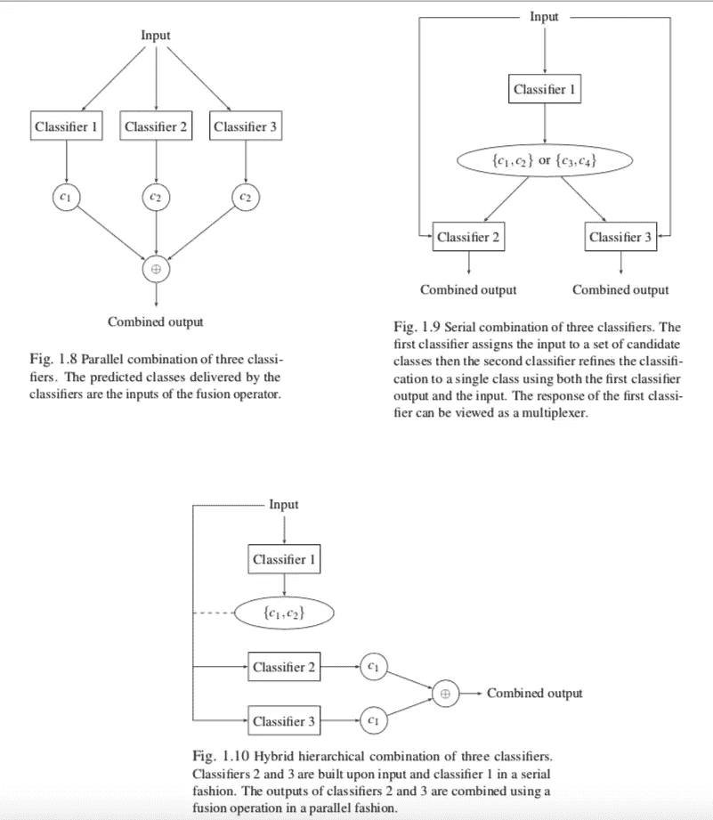

# 关于分类器组合的见解

> 原文：<https://towardsdatascience.com/insights-on-classifier-combination-da56f764fcfa?source=collection_archive---------55----------------------->

随着分类算法库的急剧增加，使用几个分类器，然后组合它们的决策以获得准确性并避免选择正确的一个的负担变得越来越有吸引力。注意，分类器的组合本身仍然是一个分类器，没有免费的午餐定理也适用于它。普遍最优的分类器是没有希望的，但是我们可以实现其他形式的鲁棒性，我们将在后面讨论。最简单的融合方法之一是对每个分类器提供的预测类别集执行多数投票。

在这篇文章中，我提出了一些在组合量词时要记住的一般性原则。具体来说，我研究了关于组合信息的性质、组合规则、单个分类器的类型和组合结构的融合方案的分类。然后，我们讨论了多样性在多分类器系统中的重要性。

[https://pix abay . com/插图/交通信号灯-交通信号灯-相位-2147790/](https://pixabay.com/illustrations/traffic-lights-traffic-light-phases-2147790/)

# **1)分类器组合的说明**

四个问题有助于确定我们解决组合问题的角度:

**Q1:输出什么性质的信息要组合？**

**Q2:什么类型的分类器要组合起来**

**Q3:用什么组合规则来组合决策？**

**Q4:这个组合的结构是怎样的？**

1.  分类器输出性质的相关分类( **Q1** )在文献中给出:基本输出(分类器的输出是单个标签)、分级输出(分类器的输出是从最可能到最不可能分级的标签列表)和评分输出(分类器给每个类别标签分配置信度)。
2.  基于来自相同分类算法的分类器的融合方法被称为同质组合方法(例如，随机森林使用决策树)或集成方法。这一类别中的标准方法是由 Breiman 首次引入并随后开发的 bagging(引导聚合)。另一种非常流行的集成方法是 boosting，其最广泛使用的实现是 AdaBoost。在过去的二十年里，机器学习社区对打包和提升进行了很好的探索和研究。最近，一种新的升压设计利用了线性规划支持向量机(LPSVM)。如果融合面板包含不同的分类器，那么我们讨论异构组合方法，即组合神经网络和决策树。这两种类型的面板(同质和异质)是源于( **Q2** )的多分类器系统的主要类别。
3.  更不用说组合分类器的类型，组合方法也根据允许决策融合的规则来分类。两个主要类别是确定性方法和概率性方法，这是对( **Q3** )的两种可能的回答。通过概率方法，我们意味着分类函数依赖于类别概率分布的最大化。分类器组合也可以在其他不确定性框架内执行，这些框架可以是诸如模糊逻辑之类的概率论的替代方案，或者与诸如信任函数框架之类的概率论相关。在 Dempster 的原始论文中，通过用多值映射插入概率测度来获得信任函数。其他作者主张该理论是独立的，不需要建立在概率对象上。
4.  关于组合架构( **Q4** )，我们指的是分类器如何组织成一个网络并连接到融合过程。有三种主要的拓扑类型:并行、顺序或混合组合。*在并行融合*中，基本分类器独立工作，它们可以用不同特征空间中的输入进行训练，并且特征向量可以或可以不从相同的原始训练样本中导出。然而，给定分类器的输出不能作为另一个分类器的输入。在*顺序(串行)融合*中，基本分类器以顺序方式堆叠，一个分类器的决策取决于先前的决策。一些类别标签在每个分类步骤中被去除，直到剩下一个类别。*混合分层*融合是并行和顺序架构的混合。

该图与( **Q4** )相关，展示了三种不同的分类器组合方案。这个数字摘自我自己的博士报告。

作者图片

# 2)多样性问题

设计多分类器系统(MCS)需要在选择单个分类器时特别小心，以便实现更高的分类精度或获得更鲁棒的算法。例如，在同一数据集上训练的一组线性分类器肯定会收敛到非常接近的分离超平面，并且组合非常相似的决策规则注定会获得平均结果。因此，多样性是设计有效的多分类器系统的指导原则。

## 应对措施需要多样化

多样性和独立性的概念是密切相关的，但两者之间的分界线仍然不清楚。然而，我们可能不期望高度依赖的分类器池输出非常不同的响应，因为依赖的分类器肯定会产生相关的响应。在这一节中，我们讨论测量多样性的方法以及在分类器响应中诱导多样性的方法。

Brow *等人*主张可以通过两种方式在分类器集成中引入多样性。第一种方式是显式的，它基于对分类器池的多样性度量的优化。第二种是隐式的，它包括使用不同的机制生成分类器，并希望在它们的响应中具有显著的独立性。这通常通过在不同的学习数据样本或特征空间的不同区域上训练它们来完成。

## 隐式分集诱导方案

第二类多样性归纳涉及基于输入数据、输出决策或分类器类型的操纵的一些隐含方法。

在他们的调查中，沃兹尼亚克*等人*为数据操作制定了以下分类法:

*分割数据点*:这允许在不同的训练集上训练单个分类器。尽管学习样本在某种程度上是相关的，但我们使用不同的训练数据在分类器响应中保持一定程度的多样性，这些数据可能是通过对学习样本进行拆分或随机采样(如 Bagging)而获得的。

*选择特征子集*:同样，基本分类器因此在不同的数据集上被训练，在某种意义上，它们可以访问每个训练示例的不同信息。因此，决策函数有不同的领域，如果特征是弱相关的，那么我们实现多样性。在这种情况下，一种流行的策略是随机选择那些被选择来训练每个基本分类器的特征的子集。这种策略被称为随机子空间方法。另一种策略包括为特征空间中的每个分区选择具有最佳性能的分类器。

*   *修改分类器输出* : MCS 可以通过要求每个分类器只区分类的子集来享受另一种形式的多样性。为了恢复整个类别集的决策粒度，需要设计特定的信息融合策略。这一类别中一个著名的方法是*一对一*分类器，在这种情况下，多类分类问题被分解为二类分类问题。分类器将在给定标签和剩余标签之间进行选择。纠错输出码方法也属于这一类方法。在这种设置中，每个标签都有一个码字(二进制值序列)，然后构建二进制分类器，为每个测试样本产生一个*码字*。所选择的标签是与测试样本码字具有最接近汉明距离的标签。

# 结论

在这个故事中，我谈了一些关于分类器组合的见解，以及应该如何看待这个问题。

在我未来的故事中，我将讲述经典的分类器组合方法，如投票、Borda 计数。我还将讨论在不确定性框架内组合分类器决策，如概率和可能性理论。