# 使用新标签对新冠肺炎疫情建模的见解

> 原文：<https://towardsdatascience.com/insights-to-modeling-covid-19-epidemic-using-new-labels-4dee6d493e29?source=collection_archive---------57----------------------->

## 爵士和 SEIR 模型中缺少了什么？

流行病学中的建模是使用给所有人分配标签的分室模型来执行的。这些标签可以被认为是状态机中的状态，并且整个群体被分配不同的类别。用于模拟新冠肺炎的一个普遍的房室模型是 SIR 模型(易感-感染-康复)。SIR 模型使用一组方程(ODEs)来计算在给定时间易感、感染和康复的人。SIR 模型是有界的，因为它认为所有感染的人都会立即被感染(或出现症状)。这与冠状病毒疾病的情况不同，在冠状病毒疾病中，不同的个体在不同的时间开始出现症状。SEIR(易感-暴露-感染-康复)模型是 SIR 的变体，也不能用于准确模拟新冠肺炎，因为它是基于每个感染个体都被报告的假设。有多种原因可以解释为什么会有感染者没有被报告，比如缺乏检测设备，不知道等等。

本文将解释 SIRU(易感-感染-报告-未报告)模型，该模型通过在新冠肺炎疫情中的应用，克服了 SIR 和 SEIR 模型的缺点。此外，本文重点分析了公共卫生组织的干预措施，如隔离和封锁，以及在不同国家的积极测试的效果。我的文章是受[1]和[2]中的工作的启发，其中 SIRU 模型已经被提出用于流行病建模以及逼近其参数的方法。

# **SIRU(易感-感染-报告-未报告)**

它是流行病学中使用的分室模型，专门用于将未报告的感染个体病例纳入建模，从而捕捉公共测试的影响。社会距离的影响也可以被这个模型所容纳。

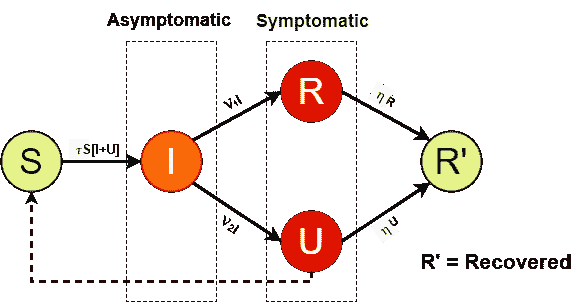

图 1: SIRU 流程图

该模型由以下常微分方程系统组成:

## **参数**

*   *t ≥ t₀* 为天数， *t₀* 为疫情开始， *t=0* 对应 2019 年 12 月 31 日
*   *τ* :传染率
*   *S(t) = S* :在时间 *t* 易受感染的个体数量
*   *I(t) = I* :时间 *t* 无症状感染个体数
*   *R(t) = R* :在 *t* 时间报告的有症状的感染个体数
*   *U(t) = U* :在时间 *t* 未报告的有症状的感染个体数
*   无症状个体变成有症状个体的速度
*   *ƞ:* 已报告/未报告症状的个体恢复的速度

## **假设**

*   与个体的一生相比，感染的过程是短暂的，并且疾病不是致命的，因此出生和死亡可以被忽略。
*   人口保持不变，没有移民。
*   所报告的有症状的个体被立即报告和隔离，并且不会引起进一步的感染。
*   所有感染都是从传染性无症状个体( *I* )或未报告的传染性个体( *U* )获得的。
*   从感染中康复的个体获得了对病原体的完全免疫力。
*   无症状感染个体( *I* )在平均 *1/ ѵ* 天的时间内(潜伏期)具有传染性。
*   已报告的症状( *R* )和未报告的症状( *U* )个体在平均 *1/ ƞ* 天的时间内(恢复期)具有传染性。
*   *f* :无症状感染个体( *I* )成为报告症状个体( *R* )的比例。
*   *(1 — f)* :无症状感染个体( *I* )变成未报告的有症状个体( *U* )的比例。
*   *ν₁ = ѵ * f* :无症状传染个体( *I* )成为报告症状个体( *R* )的比率。
*   *ν₂ = ѵ * (1 — f)* :无症状传染个体( *I* )变成未报告症状个体( *U* )的比率。

## **初始条件**

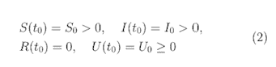

## **估计参数**

我们利用确诊病例数据来确定参数 *τ，ν，ν₁，ν₂，η* 的值，以及初始条件*s(t₀】**i(t₀】**u(t₀)*。

我们假设在时间 *t* 、 *CR(t)* 累计报告的有症状的感染病例，由到时间 *t* 为止的有症状的感染病例总数的恒定部分组成。由于 *ν₁* 是报告的有症状的感染个体的去除率， *CR(t)* 表示为:

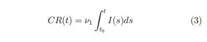

假设在疫情初期，累计报告的有症状传染病病例呈指数增长

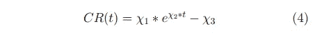

通过将该曲线与报道的病例数据进行拟合，我们得到了χ₁*、χ₂* 和χ₃*的值。*

# *实验*

*我们使用 Kaggle 上提供的数据集([小说电晕病毒 2019 数据集](https://www.kaggle.com/sudalairajkumar/novel-corona-virus-2019-dataset#covid_19_data.csv))。以西班牙为例，我们设定 *S₀* 的数值为西班牙总人口，*s₀= 4690 万*。然后我们根据最初的发现确定 *ν，η，f* ， *ѵ=1/7* ， *η=1/7* 和 *f = 0.8。*图 2 显示了前 45 天冠状病毒病例的拟合曲线。*

*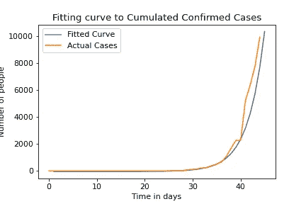*

*图 2:显示西班牙冠状病毒病例前 45 天拟合曲线的图*

*拟合曲线为我们提供了χ1、χ2 和-χ3，分别为 0.01920、0.29338 和-36.47589。这条曲线帮助我们:*

1.  *获得疫情开始的时间，t₀*
2.  *获得 I₀无症状感染者的初始人数*
3.  *获得 U₀未报告症状个体的初始数量*
4.  *获得传输速率τ*

*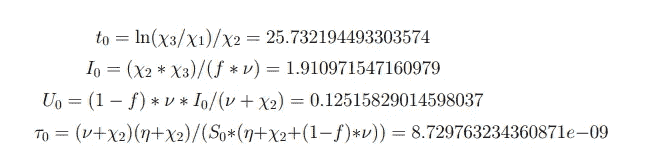*

*详细推导请参考最后的附录。*

*使用上述计算值，从方程(3)中绘制 *CR(t)* ，从方程(1c)中绘制 *R(t)* ，从方程(1d)中绘制 *U(t)* ，如图 3 所示(左图)。*

*由于传播率( *τ* 因封锁而降低，社会距离和报告的感染个体比例( *f* 随着攻击性检测而增加，将参数 *τ* 和 *f* 视为时间变量系数 *τ(t)* 和 *f(t)* 在解释公共卫生措施的效果时非常有用。*

*假设 *τ* 在 *t=N₁* 被国家严格封锁时变为 0。*

**

*此外，假设在 *t= N₂* 的状态下采用积极测试后，f 增加到 0.9。*

**

*在西班牙的情况下，我们采用 *N₁=N₂= 76 天*(封锁从 3 月 14 日开始，因此假设传输速率从 3 月 16 日开始变为 0)。在图-3(右)中绘制来自(3)的 *CR(t)* 、来自(1c)的 *R(t)* 和来自(1d)的 *U(t)* 。*

*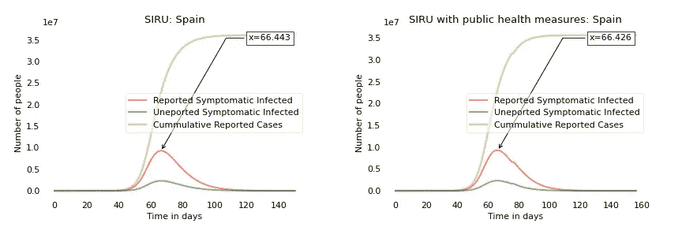*

*图 3:西班牙实验*

*西班牙的公共卫生措施从 3 月 14 日开始在全国范围内实行封锁，但对控制疫情没有太大效果。转折点，即 R(t)达到最大值的时间，还没有从 66 天下来。该国报告了世界上第二高的病例数。[3]*

*现在，我们来考虑对比一下各个国家的场景。*

*以下实验的假设:在宣布封锁两天后，传播率变为 0。随着测试增加的 *f* 的值也假定在锁定两天后从 0.8 变为 0.9。在南韩，政府宣布了“红色级别”警报，但没有封锁，假设在“红色级别”警报宣布两天后，传输率和 *f* 发生类似变化。*

*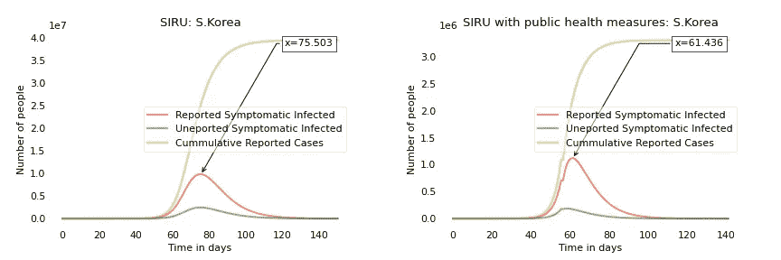*

*图 4:韩国实验*

*韩国遏制病毒传播的措施包括积极的检测策略和严重依赖移动应用程序，这些应用程序通过帮助人们避免接触阳性病例来帮助减少感染的传播。在 2015 年面临类似危机(中东呼吸综合征)后，在政府于 2 月 23 日宣布“红色级别”警报后，人们在采取预防措施方面保持警惕。这帮助韩国将转折点提前了 14 天。*

*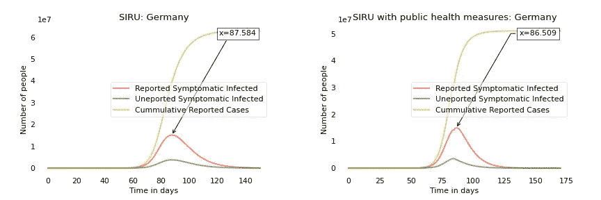*

*图 5:德国实验*

*德国从 3 月 22 日开始的大规模测试和全国宵禁虽然降低了疫情的规模，但并没有带来其转折点的改变。*

*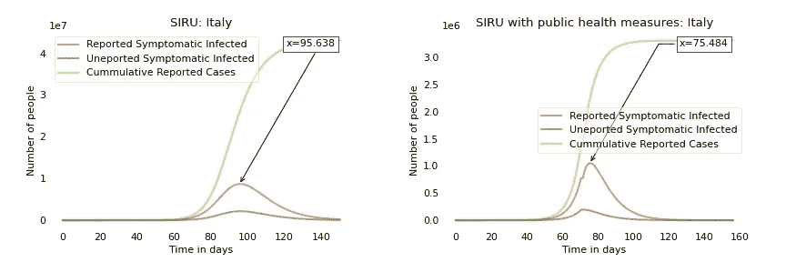*

*图 6:意大利实验*

*意大利政府采取的公共卫生措施将转折点提前了 20 天，并降低了疫情规模。*

*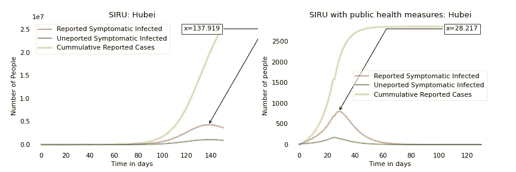*

*图 7:湖北实验*

*由于有效的公共卫生措施，如从 1 月 23 日起严格封锁和增加检测，转折点已从 138 天下降到 28 天，新冠肺炎疫情在中国湖北省的规模大幅缩小。*

# *结论*

*通过 SIRU 模型，我试图比较公共卫生措施在世界不同地区遏制冠状病毒传播的效果。此外，我还通过当局积极的病毒检测纳入了报告病例的增加，从而发现了未报告的病例。这种措施的效果并没有反映在其他车厢模型中，如 SIR 及其不同的变体。*

# ***参考文献***

*[1] Z. Liu，P. Magal，O. Seydi，G. Webb，**了解中国武汉新冠肺炎疫情暴发中未报告的病例，以及重大公共卫生干预的重要性**。*生物* 2020， *9* ，50。*

*[2] R.M. Cotta，C.P. Naveira-Cotta，P. Magal，**模拟巴西的新冠肺炎流行病:参数识别和公共卫生措施的影响，**medRxiv 2020 . 03 . 31 . 30303030331*

*[3]世界计量仪，[https://www.worldometers.info/coronavirus/](https://www.worldometers.info/coronavirus/)*

# ***附录***

*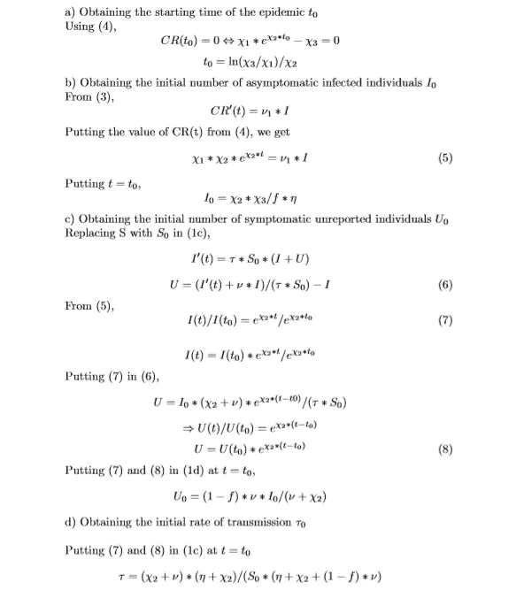*

*在我的 [Github](https://github.com/sharvi24/SIRU-Model) 上可以找到本分析中使用的代码。*