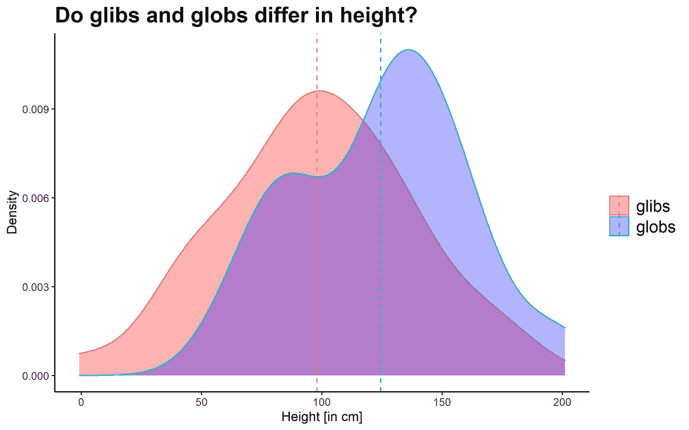

# 充分解释了统计显著性——为什么不应高估 p 值

> 原文：<https://towardsdatascience.com/insignificance-of-statistical-significance-why-the-p-value-should-not-be-overrated-da5711b7960d?source=collection_archive---------39----------------------->

## 传统统计学中最著名也最令人困惑的概念指南:零假设显著性检验(NHST)。

马克斯·麦金农在 [Unsplash](https://unsplash.com/s/photos/space?utm_source=unsplash&utm_medium=referral&utm_content=creditCopyText) 上的照片

你有没有听过有人说一项研究揭示了*【重大成果】*？这到底是什么意思？让我给你介绍一个科学界的实践，这是一个被深入争论并且仍然被用来回答研究问题的实践。简单地说，大致是这样的:如果你运行一个模型，而你的计算机给出的 p 值小于 0.05，那么你的结果已经达到了具有统计学意义的圣杯，因此更有可能被发表。另一方面，如果 p 大于 0.05，你的观察结果似乎不会偏离已知的结果。然而，这可能是一种从数据中得出结论的危险方式，并且会引起几乎机械地使用这一工具的诱惑。这种做法受到了热烈的讨论，美国统计协会(ASA)发表了一份关于 p 值的声明，以阐明这一问题(瓦瑟斯坦&耶戈，2016)。一些专家甚至认为 p 值是大多数研究结果错误的原因(Ioannidis，2018)，并认为其滥用导致了研究中的可重复性危机(彭，2015)。围绕这一概念有一个完整的误解指南，因为 p 值远非直观、简单明了(Greenland 等人，2016 年)-对于业余爱好者和研究人员来说都是如此。因此，掌握基本概念是值得的。因此，我想给你一个温和而基本的介绍，介绍统计学中最著名但也最令人困惑的概念:零假设显著性检验。

**为什么这很重要？**

如今，我们身边有大量随时可用的数据。《福布斯》杂志在 2018 年的一篇文章中提出，仅互联网就创造了 2.5 万亿(！！！)仅[链接](https://www.forbes.com/sites/bernardmarr/2018/05/21/how-much-data-do-we-create-every-day-the-mind-blowing-stats-everyone-should-read/#2237aedb60ba)一项，过去两年领先的每日字节数就占了**世界**数据的 90%。这句话绝对值得再读一遍。你可能也已经意识到，数据科学家的数量正在增长，尽管他们分析这些数据的努力无法弥补这些巨大的数量。此外，科学界有一个悠久的传统，即使用一种叫做零假设显著性检验(NHST)的方法来回答他们的研究问题。因此，鉴于我们有机会分析数据来满足我们的好奇心并为我们的决策提供信息，我们应该知道使用关键的统计概念来得出不太不可靠的结论。看下面的问题:

*   特朗普总统任期如何改变了国际关系？
*   间歇性禁食有长期的健康益处吗？
*   这种新药 X 如何改善疾病 Y 的症状？
*   社交媒体是增强了还是降低了青少年对连通性的感知？
*   人工智能如何帮助残障人士？
*   学生在同性教室里学得更好吗？
*   随着年龄的增长，我们能控制记忆力的衰退吗？

这些只是我们问自己的问题的一小部分，因为一个答案可能会影响我们塑造生活、教育孩子或开发新技术的方式——正如我所说的，这只是其中的几个例子。所有这些都只能用数据做出超出你自己的鼻子的推论来可靠地回答。作为一名心理学毕业生，我了解到，大多数人讨厌一切与统计数字接近的东西，一提到数学公式，就会让人产生相当大的焦虑感。为了让你放心，我不想在这里包括任何数学。我保证，最终一切都是值得的。

因此，我试图解释统计推断是什么，以及为什么它不那么简单——为此，我想邀请你来一次太空之旅。你想加入吗？

照片由 [SpaceX](https://unsplash.com/@spacex?utm_source=unsplash&utm_medium=referral&utm_content=creditCopyText) 在 [Unsplash](https://unsplash.com/?utm_source=unsplash&utm_medium=referral&utm_content=creditCopyText) 上拍摄

**一个假想的案例研究——研究太空中的外星生命**

想象一下，你是一个研究小组的成员，在植物 X 上发现了非人类的智慧，似乎对人类没有危险。你渴望更多地了解这一物种，于是指示你的同事收集关于它们的一些主要特征的数据。除了细胞样本和行为观察，你还会派一群太空机器人去收集他们的身高数据，因为他们的身高和人类差不多。它们光滑的皮肤纹理让你在实验室里给它们取名为*glibglobs*——就像你最喜欢的卡通系列*里的一些生物叫瑞克和莫蒂*一样。现在你的同事已经注意到 glibglobs 有不同的性别——其中一个比另一个高一点。由于地球上女性的身高通常比男性低，你开始想知道:这种性别差异可能是我们宇宙中的一种普遍模式吗？好吧——这是一个大问题，所以让我们把它变得更具体些:油腔滑调的人比他们的小吗？或者这只是你的一个同事的随机观察？

当你收集了每种性别的 100 个身高样本后，你开始直观地研究这一现象，并问自己，油嘴滑舌和珠珠之间是否真的有根本的区别。看着这些图，你可以看到 globs 平均比 glibs 高，但是也有很多变化。在某些情况下，glibglob 甚至比 glob 还高，所以如果你有资源来测量整个 x 星球上的每一个 glibglob，性别之间甚至可能没有差异。你如何判断你的数据假设甚至根本没有身高差异的可能性有多大？

glibglob 身高数据的密度图(用 R 模拟)，每种性别都有颜色(红色= glibs，蓝色= globs)

在你检查了数据是否适合你想要用来回答这个问题的测试之后，你运行一个计算机程序来比较两性的平均值。有两种可能的情况:

1.真正的身高差异在人群中等于 0。

2.真正的身高差异在人群中不等于 0。

你可以把第一个假设(称为“零假设”)想象成一种在显著性检验中的默认假设——这可能是乍一看最令人困惑的事情，因为你实际上对第二个假设感兴趣。现在想象你的计算机程序的一部分是一个重要的陪练，这表明没有区别。尽管这很合理，但它表明机会是独自运作的。尽管如此，你仍然假设可能有一些不同的事情正在发生，用一些真实的 glibglob 数据来支持，并提出你对此观点的替代方案。来辩论吧！为了更接近答案，计算机为你进行了一些计算。它现在“假装”一遍又一遍地运行同一个实验，从而产生了许许多多虚构的油嘴滑舌的数据的模拟样本。这些假样本代表了如果 glibs 和 globs 实际上具有相同的高度，允许一些随机变化，那么高度差异会是什么样子。现在，计算机为 a)您的观察样本数据以及 b)每个模拟样本(假数据)生成一个汇总统计数据(例如，*t-统计数据*)。

经验表明，只要我们有很多观测值，自然界中的很多现象都近似成一个钟形分布，叫做*正态分布*。这也适用于理论上可能的 glibglob 身高差异的假数据:如果你从假数据中随机抽取一个样本，你将更有可能观察到零附近的身高差异，允许一点随机变化。另一方面，它不太可能观察到偶然发生的极端差异。仍然不确定是否存在身高差异的假设，您的计算机最终会将观察到的汇总统计数据与之前生成的假样本汇总统计数据进行比较，并告诉您您的数据在完全随机的假样本分布中的位置。给你一个 p 值< 0.01，计算机必须承认你的样本使他的默认状态(*“glibglob 身高没有差别！*)看起来有点不寻常。为什么？因为在假设机会独自运行时，似乎不可能观察到这种甚至更极端的数据。

> *p 值估计观察到这种或更极端数据的概率，假设实际上在自然界中没有任何影响——假设您的模型符合数据，并且您坚持自己的初衷。*

那么，这个 p 值能告诉我什么呢？什么不是？

恭喜你走到这一步。看看那个冗长的定义。p 值现在能回答你原来的问题吗？

1.  *鉴于你观察到的这些数据，你能否告诉你的同事，glibglobs 之间很可能存在真正的身高差异？*

没有。很困惑，对吧？虽然这实际上是我们感兴趣的问题，但这个问题只能使用贝叶斯统计来回答，贝叶斯统计包含了一种完全不同的思维方式和数学方法(Dienes & Mclatchie，2018；Kruschke & Liddell，2018a，2018bVandekerckhove、Rouder 和 Kruschke，2018 年)。如果使用传统显著性检验的人声称他们的假设是真的，因为零假设被拒绝，这应该给你一些危险信号。就其本身而言，一个小的 p 值确实表明，就目前而言，这些数据似乎与实际上没有任何影响的情景不相容。但是它不能告诉你你提出的替代方案(如*)是否存在性别相关的 glibglob 身高差异大于零。"*)很可能是真的，因为它没有结合任何先前的知识(例如，首先这种替代的可能性有多大？)—这可能是由我们最新的 glibglob 数据更新的备选方案的*后验概率*，但这超出了当前文章的范围。

2.*你能告诉你的同事，考虑到 glibglobs 中没有真正的身高差异的说法，这些数据似乎有点有趣吗？*

是的，你可以。如果您已经检查了模型所需的前提条件，并且在实验过程中严格保持您的采样意图不变(例如，不管实验结果如何，在收集到预定义的样本量后停止测量)，这种高度现象可能值得进一步研究。鉴于之前没有人测量过这些生物，因此你的实验具有探索性，这一结果为正在进行的该主题的研究提供了初步的起点。

3.你能告诉你的同事这些结果有实际意义吗？

没有。你不知道 glibglobs 之间的身高差异是否对他们在 X 行星上的生活有任何作用，甚至不能仅仅根据 p 值来判断这种差异是否和在人类中观察到的一样大。同样，你也不知道你是否问对了问题。也许 glibglobs 有一些你目前还没有考虑到的更有趣的特性？

现在你可能会感到有点失望。你已经走了这么长的路来到行星 X，测量了一群 glibglobs，但对它们仍然知之甚少——这似乎只是各种研究团队近距离观察这种外来物种的更漫长旅程的开始。知道你是研究 glibglobs 的第一个研究团队的一部分，你仍然在黑暗中敲击，即使你有一个指向特定方向的微小信号。

好吧——这个故事可能看起来有点牵强，过于简单。尽管如此，它还是以简明易懂的方式阐明了对待统计重要性的传统方法。如果你还在挣扎，不要担心:即使是科学家或健康专家通常也很难解释 p 值(Gigerenzer，2004；吉杰伦泽、盖斯迈尔、库尔茨-米尔克、施瓦茨和沃洛欣，2007 年；Gigerenzer 和 Marewski，2015 年)。所以，如果你还停留在你的头脑中，这并不奇怪。

乔尔·菲利普在 [Unsplash](https://unsplash.com/s/photos/nasa?utm_source=unsplash&utm_medium=referral&utm_content=creditCopyText) 上的照片

**那又怎样？**

基本上，我们可以告别快速、轻松、精确地回答自然问题的想法。因此，要做到以下几点可能需要很大的毅力和忍耐力:a)接受这个事实；b)能够忍受自己的好奇心；c)忘记拥有一个适用于所有问题的神奇通用统计工具的梦想。为了对复杂现象做出有意义的结论，每次我们解决一个新问题时，我们需要有目的地从整个统计工具箱中挑选。分析师需要接受大量的培训，不仅要能够进行分析，还要在第一时间提出正确的问题，选择合适的方法进行测试，并最终解释研究结果。当涉及到人类行为时，应该变得更加明显的是，要对其进行可靠的测量，并对多种个体的总和做出一般性的推断，需要花费大量的时间。这就是为什么专家建议总是明确传达伴随研究发现的不确定性，提供关于导致结果的每一个步骤的详细文件，并与研究界共享数据。这使得科学推理更具可追溯性，证明了一种效应是否适用于不同的实验室，并为未来的研究人员共同回答关键问题铺平了道路。通过整合与感兴趣的现象有关的证据，我们能够描绘出一幅更大的图景，可能更精确地代表其本质(Hunter & Schmidt，2004；温伯格，2001)。

p 值被批评为将研究结果分为重要和不重要，因此可悲且错误地被认为不值得在许多研究期刊上发表。因为对于被认为具有统计显著性的结果，p 值有明确的临界值(通常为 p < .05 or p < .01), it supports a black-or-white style of thinking. Moreover, significance testing is only the end result of a long chain of other decisions the researcher makes beforehand (e.g. the research design, sampling method, model selection etc.) which determine the quality of the research but this simply cannot get expressed into a single value. However, the p-value taken by itself is a useful tool to indicate non-random patterns in the data and — if used thoughtfully — allows statistical inference to become fast and scalable.

I would never claim that science is nonsense because of this practice — the p-value just needs to be used and interpreted as one of many tools and not put as a mindless decision-making cut-off. This is exactly what the inventor of p-value, Sir Ronald Fisher, aimed for — it should be taken as a hint that indicates whether your observations are worth a closer look. Nevertheless, the p-value is not a fool-proof concept, seems to be quite a bit counterintuitive and therefore does require in-depth training of the analyst to interpret the results with the right amount of scepticism. Fisher (1956) even writes: *),没有一个科学工作者每年都有固定的显著性水平，在任何情况下，他都拒绝假设；他更愿意根据他的证据和想法来考虑每一个具体的案例。'【T1]因此，这不是 p 值故障，因为它只是做了它应该做的事情。我们只是不应该对它期望过高，也不应该屈服于关闭我们思维的诱惑。*

**参考文献**

[1] R. L. Wasserstein & N. A .耶戈，[美国儿科学会关于 p 值的声明:背景、过程和目的](https://www.tandfonline.com/doi/full/10.1080/00031305.2016.1154108) (2016)，*美国统计学家*， *70* (2)，129–133。

[2] J. P. A .约安尼迪斯(J. P. A. Ioannidis)，[为什么大多数发表的研究结果是假的](https://journals.plos.org/plosmedicine/article?id=10.1371/journal.pmed.0020124) (2018)，*变好:生物医学科学中的研究诚信*， *2* (8)，2–8。

[3] R .彭，[科学中的再现性危机:一次统计学反击](https://rss.onlinelibrary.wiley.com/doi/full/10.1111/j.1740-9713.2015.00827.x) (2015)，*显著性*， *12* (3)，30–32。

[4] S. Greenland，S. J. Senn，K. J. Rothman，J. B. Carlin，C. Poole，S. N. Goodman & D. G. Altman，[统计检验，P 值，置信区间和功效:误解指南](https://link.springer.com/article/10.1007/s10654-016-0149-3) (2016)，*《欧洲流行病学杂志》*， *31* (4)，337–350。

[5] Z. Dienes & N. Mclatchie，[比显著性检验更喜欢贝叶斯分析的四个理由](https://link.springer.com/article/10.3758/s13423-017-1266-z) (2018)，*心理经济学通报和评论*， *25* (1)，207–218。

[6] J. K. Kruschke & T. M. Liddell，[新人贝叶斯数据分析](https://link.springer.com/article/10.3758/s13423-017-1272-1) (2018a)，*心理计量学通报与评论*， *25* (1)，155–177。

[7] J. K. Kruschke & T. M. Liddell，[贝叶斯新统计:从贝叶斯角度进行假设检验、估计、元分析和功效分析](https://link.springer.com/article/10.3758/s13423-016-1221-4?wt_mc=Other.Other.8.CON1172.PSBR%20VSI%20Art02%20&%20utm_medium=other%20&%20utm_source=other%20&%20utm_content=2062018%20&%20utm_campaign=8_ago1936_psbr%20vsi%20art02) (2018b)，*心理经济学通报和评论*， *25* (1)，178–206。

[8] J. Vandekerckhove，J. N. Rouder & J. K. Kruschke，[社论:推进心理科学的贝叶斯方法](https://link.springer.com/article/10.3758/s13423-018-1443-8) (2018)，*心理计量学通报与评论*， *25* (1)，1–4。

[9] G .吉杰伦泽，[无脑统计学](https://library.mpib-berlin.mpg.de/ft/gg/GG_Mindless_2004.pdf) (2004)，*社会经济学杂志*， *33* (5)，587–606。

[10] G .吉杰伦泽、w .盖斯迈尔、e .库尔茨-米尔克、L. M .施瓦茨和 s .沃洛申，[帮助医生和病人理解健康统计](https://journals.sagepub.com/doi/full/10.1111/j.1539-6053.2008.00033.x) (2007)，*公众利益中的心理科学，补编*， *8* (2)，53–96。

[11] G. Gigerenzer，[代理科学:科学推理的普遍方法的偶像](http://www.dcscience.net/Gigerenzer-Journal-of-Management-2015.pdf) (2015)，*管理杂志*， *41* (2)，421–440。

[12] J. E. Hunter & F. L. Schmidt，[荟萃分析方法:纠正研究结果中的错误和偏差](https://www.researchgate.net/publication/235726244_Methods_of_Meta-Analysis_Corrected_Error_and_Bias_in_Research_Findings) (2004)，Sage。

[13] C. R. Weinberg，[是时候恢复 P 值了](https://www.jstor.org/stable/3703701?seq=1) (2001)，流行病学，12(3)，288–290。

[14] R. A .费希尔，[《统计方法与科学推断》](https://psycnet.apa.org/record/1957-00078-000) (1956)，爱丁堡:奥利弗和博伊德。