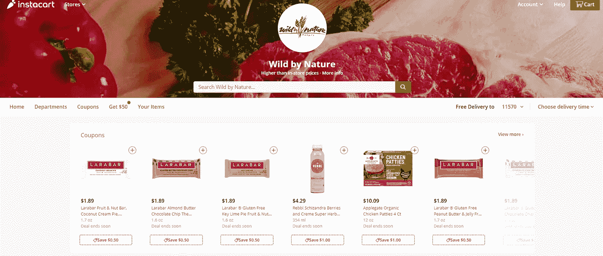

# Instacart 探索性分析

> 原文：<https://towardsdatascience.com/instacart-exploratory-analysis-fdd5e3f9bf60?source=collection_archive---------16----------------------->

## 在没有领域专家或业务涉众的情况下，制定可能的业务问题陈述。

# 介绍

Instacart 是一项当天送货和提货服务，允许消费者通过该公司的移动应用程序或网站从选定的杂货店购物，如 Trader Joe's、Costco 和 Fairway。该公司有专门的员工从选定的商店购买食品并送货上门。该公司产生收入的方式是通过增加特定商店的价格、送货和会员费。因此，该组织的主要业务目标是，不仅增加客户会员的数量，而且改善回头客和订单。预测消费者对产品和杂货店的参与度和行为对 Instacart 的成功有着巨大的影响。

此分析的主要目的是执行探索性分析，并阐明增量业务问题以增加收入。为此，我们将依赖 Instacart 提供的历史数据。关于这个公开发布的数据集的更多信息可以在这里找到:[https://www.instacart.com/datasets/grocery-shopping-2017](https://www.instacart.com/datasets/grocery-shopping-2017)

# 关于数据

该数据集由 Instacart 为 Kaggle 竞赛提供，是一组描述客户订单的关系文件。该数据集是匿名的，包含来自 20 多万 Instacart 用户的 300 多万份杂货订单样本。对于每个用户，数据集提供他们的 4 到 100 个订单，以及每个订单中购买的产品序列。该数据集还提供了下订单的星期和小时以及订单之间的相对时间度量。

每个变量的描述如下:

**订单数据集:** *order_id:订单标识符，user_id:客户标识符，eval_set:此订单属于哪个评估集(参见下面描述的训练和先前数据集)，order_number:此用户的订单序列号(1 =第一个，n =第 n 个)，order_dow:订单是在一周中的哪一天下的，order_hour_of_day:订单是在一天中的哪一个小时下的，days_since_prior:自上一次订单以来的天数，上限为 30(order _ number 的 NAs = 1*

**产品数据集:** *产品标识:产品标识，产品名称:产品名称，过道标识:外键，部门标识:外键*

**过道数据集:** *过道 id:过道标识符，过道:过道名称*

**部门数据集:** *部门标识:部门标识，部门:部门名称*

**order_products_prior 和 train 数据集:** *order_id:外键，product_id:外键，add_to_cart_order:每个产品被添加到购物车的顺序，重新排序:1，如果该产品在过去已经被该用户订购，0，否则，“prior”:在该用户最近的订单之前的订单，“train”:提供给竞赛参与者的训练数据，“test”:为机器学习竞赛保留的测试数据*

# 数据收集和清理

理想情况下，在数据收集阶段之前，我们希望根据问题陈述定义数据需求，以便收集所需的数据。然而，在这种情况下，我们执行不同的方法，我们真的不知道 instacart 业务有什么问题，我们希望用可用数据来描述问题。这与数据科学项目流程观点完全不同，在数据科学项目流程观点中，我们通常希望首先与领域专家和利益相关者一起概述业务理解，并进一步定义收集方法、数据收集、清理和探索性分析。让我们从导入我们的包开始，加载每个数据集并简要地看一下它们。

instacart 订单数据集汇总

instacart 订单缺少值

查看来自客户的所有订单，我们总共有超过 300 万个订单，数字和字符串数据类型都符合预期，不需要我们更新。自从上一个订单以来，我们有超过 200，000 个丢失的值。然而，正如在变量描述中所解释的，NA 表示特定客户的 order_number 1。

instacart 产品概述

instacart 产品数据集摘要

instacart 产品缺少值

我们大约有 50，000 种产品带有产品 id、名称、通道 id 和部门 id。所有数据类型都符合预期，我们没有任何缺失值。

instacart 通道信息

instacart 通道数据汇总和缺失值

有 134 个通道具有通道 id 和通道名称。数据类型和预期的一样，我们没有任何缺失值。正如您可能注意到的，过道 id 变量是产品数据框架的常用变量。我们可以合并这两个数据框架，看看哪些产品属于哪个通道。

instacart 产品数据集

instacart 部门数据集

instacard 部门汇总

总共有 21 个部门有部门名称和 id。数据类型和预期的一样，我们没有任何缺失值。对于产品数据框架，我们有另一个公共变量“department_id”。我们可以合并部门数据框架，以查看什么产品属于哪个部门。

正如变量描述中所解释的，order products prior 数据集让我们了解在用户最近订单之前订购的订单。我们有超过 300 万的订单。数据类型正确，没有缺失值。我们还有 product_id 公共变量，我们可以将这个数据集与产品合并，以查看什么产品映射到什么订单。

我们在产品和订单数据集之间还有另一个公共变量 order_id。我们可以合并这两个数据框架，以帮助进一步收集产品和订单之间的信息。

instacart 最终产品和订单数据集

我们已经获得了超过 130 万个训练数据，数据类型正确，没有缺失值。在这一点上，instacart 提供的数据集似乎非常干净，除了合并过道、部门、产品和订单数据集，我们不需要做太多的数据争论。

# 数据探索

在这个阶段，我们将单独查看数据集的更新版本，并收集见解以开始创建可能的业务问题。

instacart 客户订单数量

我们在这里看到的是，23986 名客户只下了 4 份订单，19590 名客户只下了 5 份订单，依此类推……随着客户下订单数量的增加，下订单的客户数量会减少。大多数客户会下 4 到 12 份订单。如果一家企业找到了增加回头客订单数量的方法，它就能增加收入。

instacart 客户本周采购

大多数购买发生在周一和周二，其次是周日。消费者可能会在一周的第一天和第二天进行每周一次的杂货店购物。一周的其他日子之间也没有太大的差距。例如，周三和周二之间的差异并不显著。

instacart 客户购买时间

大多数购买发生在上午 10 点到下午 4 点之间。

instacart 客户购买频率

大多数顾客每周或每月都购物。考虑到大多数客户也在每周的周一或周二下订单，下订单可能需要计划工作。这可能是由于非无缝订购流程造成的。

Instacart 篮子大小分析

我们可以看到，根据购物篮的大小分布，大多数客户在每个订单中购买了 5 到 6 件产品。考虑到回头客的订单量较低，每个客户的产品量较低可能会给企业带来巨大的收入问题。

Instacart 热门产品分析

Instacart 顶级产品

前十个重新排序的项目与通常排序的前十个项目完全匹配。此外，十大购买商品中的大部分都在新鲜水果区。

Instacart 顶级部门

顶部通道是新鲜水果、新鲜蔬菜、包装蔬菜和水果，其次是酸奶和包装奶酪。

Instacart 客户购买日

正如我们前面指出的，订单百分比最高和篮子容量最大的时间是星期一和星期二。

Instacart 产品百分比日分布

正如我们之前发现的，订购量最高的产品是香蕉、有机香蕉袋、有机菠菜和有机草莓。有趣的是，在前四种产品中，香蕉在每天的订单中所占比例最大，但其他四种产品对周三、周四、周五、周六和周日的订单比例没有任何贡献。这是否与物料库存问题相关？

Instacart 部门分布

最高的部门是农产品，其次是奶制品、鸡蛋和小吃。除了一般的个人偏好和需求，消费者不从其他部门购买可能还有其他原因。例如，如果 instacart 对罐装商品具有最大的加价，但 instacart 网站或应用程序内的用户体验并不能吸引消费者购买罐装商品，则无论消费者的需求如何，罐装商品的订单金额都会很低。

数据集相当大，有许多变量可供我们分析。与我们在之前的[学习关联](/learning-associations-74a8c27cf142)文章中所做的类似，我们可以进一步查看产品之间的详细关联规则(尽管将现有的大型数据集拆分并转换为交易数据集具有挑战性)，从天数和小时数、再订购率与订单小时数等方面调查消费者的再订购模式…

# 结论

查看各种数据科学流程和方法，您会发现几乎所有的流程和方法都有类似的方法，即从业务理解开始，概述要验证和解决的业务问题陈述。然而，我们可能会遇到这样的情况，领域专家、品牌所有者、业务单位或利益相关者可能不一定知道或没有时间找出业务问题是什么。在大多数情况下，他们会通过产品经理来识别、阐述业务问题，并提供切实可行的建议来解决这些问题。

在我们的 instacart 分析中，我们可以总结出可能影响收入的业务问题有:

*   客户订单的频率较低，从 4 到 12 不等。**企业可以采取什么措施来提高客户订单的频率？**
*   大多数客户计划每周和每月购买一次。**企业可以采取什么措施来改善一周和一月中任何一天的采购？举个例子；亚马逊把他们的整个订购产品和过程做得天衣无缝，以至于我个人不会广泛地计划我的杂货购买。如果我需要亚马逊的产品，我会在当天订购。**
*   除了香蕉，顶级商品大多在周一和周二出售。**这是否与零售商的商品库存问题有关？比如说；有没有可能 Trader Joe's 的有机草莓在周三就卖完了，instacart 的员工会根据顾客的要求用普通草莓代替订单？**
*   **除了一般的消费者和市场需求，某些部门的销售额比其他部门低还有什么原因吗？(如 instacart 网站或手机 app 可用性问题)**

阐明和定义业务问题陈述对于为业务目标找到正确的解决方案极其重要。在我之前关于[线性回归](/introduction-to-linear-regression-141cde7a46b2)的文章中，我提到了一些统计学家在没有创建问题陈述的情况下就开始数据分析是多么有问题，然而，在许多情况下，利益相关者期望数据驱动和制定这些问题陈述。