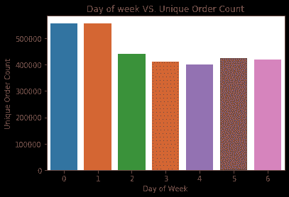
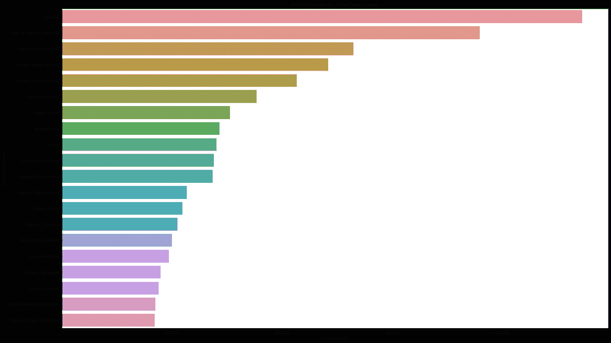

# Instacart 用户细分和购物篮分析

> 原文：<https://towardsdatascience.com/instacart-users-segmentation-and-market-basket-analysis-d88378f75f73?source=collection_archive---------49----------------------->

## 了解客户在 Instacart 上的购物行为，并做出有效的推荐

编剧:[颖园(瓦莱丽)张](https://medium.com/u/c4de36e239a7?source=post_page-----d88378f75f73--------------------------------)、[雨桐(璇)朱](https://medium.com/u/cdb36961304e?source=post_page-----d88378f75f73--------------------------------)、【德克兰】向、[辛雨](https://medium.com/u/81ad6d74f0bd?source=post_page-----d88378f75f73--------------------------------)

新冠肺炎在 2020 年已经是一个世界传播的疫情。因此，纽约人遵循隔离政策，彼此保持社交距离。众所周知，在纽约最受欢迎的交通方式是地铁。然而，地铁是传播新冠肺炎最危险的交通工具之一，这可能会增加地铁乘客感染新冠肺炎的风险。因此，外出获取日常所需成了纽约人头疼的问题。杂货店里的人保持社交距离是不实际的。在新冠肺炎疫情爆发期间，纽约市发布了“呆在家里”的命令，这增加了对网上购物的需求。Instacart 是一个杂货交付平台，在新冠肺炎危机期间经历了快速增长。现在，用户获得了呆在家里的价值，以使曲线变平，并降低他们自己感染病毒的风险。

主要研究目标是基于时间间隔进行用户细分，并基于用户的产品选择建立推荐系统。本研究期望在不违反社会距离规则的前提下，优化供应方的库存分配，增加顾客获得必需品的概率。

## 首先，我们来探究一下数据！

主要数据来源于 Instacart 的 2017 年匿名化客户随时间的订单(Stanley，2017)。它包含订单文件、产品文件、订单和产品文件、过道文件和部门文件。数据集中的每个实体都有一个关联的唯一 id。

在订单数据集中，它包含用户 id、订单 id、订单购买日期(order_dow)、订单购买时间(order_hour_of_the_day)、自上次购买以来的天数(day_since_prior)以及订单所属的指示符(eval_set)。如果是第一次购买，则自上次购买后的天数为 NaN。在部门数据集中，它包含唯一的部门 id 和关联的部门名称。在过道数据集中，它有过道 id 和过道名称。在产品数据集中，它包含产品 id、产品名称、过道 id 和部门 id。

为了制定用户订单的时间间隔，我们首先以天为单位划分用户订单。我们这里使用的数据是 order.csv，列名为“dow”。从图 1 来看，用户订单最多的日子是第 0 天和第 1 天。查看数据说明后，我们没有找到第 0 天到第 6 天的定义。我们认为 0 和 1 这两个繁忙的日子应该是周日和周一。

图 1(作者图片)

有了更详细的视图，我们选择小时作为单位来绘制订单频率条形图。两条尾巴表明 Instacart 在早上和傍晚时间没有太多的交付。大多数订单是在时间间隔小时[9，16]下的，平均每小时约有 25000 个订单。

图 2(作者图片)

结合上面的两个数字，我们决定使用热图来检查最受欢迎的订单时间。y 轴是按天计数的订单，x 轴是按小时计数的订单。从图 3 来看，较暗的部分意味着用户订单密度较高的时间段，大约是第 0 天和第 1 天的上午 9 点到下午 4 点。

图 3(作者图片)

图 4 显示了下降趋势。大部分用户在频率区间[0，40]下单。少数用户订单在 60 以上。超过 100 的唯一订单被计为一组。x 轴限制了将所有计数订单放在一个图表上。

图 4(作者图片)

一个有趣的发现是，从图 5 中，我们发现超过 400，000 个用户可能会将香蕉添加到他们的订单中。名单上大部分产品都是有机蔬菜和水果！

图 5(作者图片)

# 机器学习建模:

**K-表示:**

基于 EDA 的结果，很可能得出这样的结论:消费者更有可能在上午 10 点到下午 4 点之间购买。此外，如图所示，在第 0 天和第 1 天，Instacart 的交易量与其他日期相比相对较高。为了进一步了解消费者的购买行为并进行具体的消费者细分，我们使用了 k-means 聚类。不仅基于在星期几、星期几购买的订单，还基于自上次购买以来的天数和添加到购物车订单，来计算每个用户使用 Instacart 的频率和每个订单购买的商品的中位数。

首先，利用轮廓得分选择 k-means 中的最佳聚类数。

由于处理量大，我们对 5%的数据集(超过 10，000 条用户记录)进行了五次采样，以生成训练数据集的准确轮廓分数。正如它所建议的，我们在 k-means 算法中设置了 3 个聚类。在应用 PCA 降低维度之后，我们能够绘制每个聚类(图 6)。

图 6(作者图片)

**随机森林:**

在进行 k-means 聚类和标记数据后，我们使用聚类 0，1，2 来训练我们的第一个 K-means 模型。我们希望将我们的模型从无监督学习转移到有监督学习。因此，我们将数据集分为训练样本和测试样本。通过使用 GridSearchCV，我们发现应该使用 21 作为我们的估计量，使用 97 作为我们的最大叶节点。**在训练我们的模型并拟合测试集之后，**我们计算了多类别 ROC AUC 得分，该得分为 0.999，这意味着我们的随机森林模型很好地分离了三个类别。

特征重要性(作者图片)

**推荐系统**

在我们的推荐系统模型中，输出是大多数其他客户会购买但输入客户不经常购买的部门和通道。由于输出不仅基于大多数训练数据，而且基于输入客户购买历史的皮尔逊相似性，我们的模型考虑了不同组的客户偏好。

出于节省时间和计算的原因，我们使用来自前 10，000 个用户的数据来训练我们的模型。通过从每个集群中随机抽取 5 个用户作为输入，结果证明了我们的假设。对于每个集群中的 5 个用户和 5 个推荐的部门和通道，我们在 25 个值中寻找共享最多的前 3 个常用名称。

推荐部门:

*   第 0 类:酒精、散装、婴儿
*   第 1 类:酒、干粮和散装面食
*   第 2 组:酒类、散装、肉类和海鲜

推荐过道:

*   第 0 类:面部护理、皮肤护理、头发护理
*   集群 1:散装谷物大米干货，面部护理，皮肤护理
*   第二组:护肤、烈酒、面部护理

从该表中，我们可以看出，集群 0 和集群 1 中的客户(占总用户的 64.6%)是 Instacart 的忠实用户，他们可能有很高的需求，并在新冠肺炎期间给 Instacart 的运营带来巨大压力。