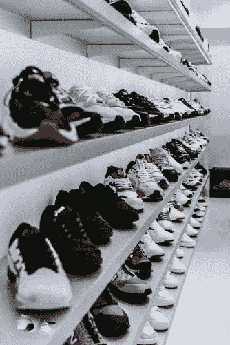
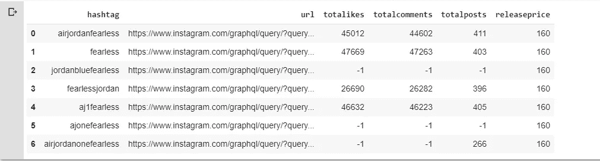
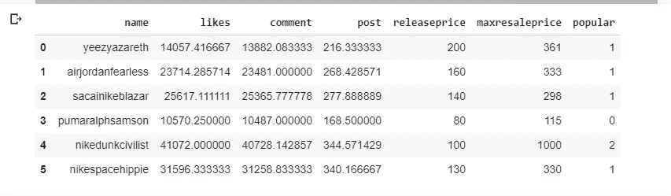
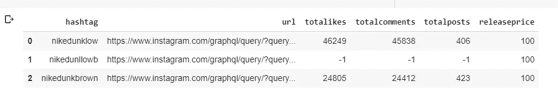
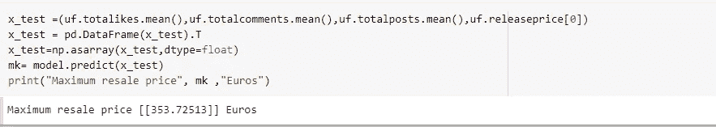

# 用人工神经网络预测限量版运动鞋转售价格的 Instagram 分析

> 原文：<https://towardsdatascience.com/instagram-analysis-to-predict-limited-edition-sneakers-resale-price-with-ann-5838cbecfab3?source=collection_archive---------68----------------------->

## “我喜欢运动鞋。我想我可以称自己为收藏家”——麦克·信田

## 用神经网络从大量运动鞋中寻找独角兽运动鞋



来自[https://unsplash.com/photos/5d4EhqeV0Og](https://unsplash.com/photos/5d4EhqeV0Og)的免版税图片

做球鞋头本身就是一种文化，有自己的行业。每个月，最大的品牌都会推出一些精选的限量版运动鞋，根据名为“抽奖”的抽奖系统在市场上销售。这创造了一个自己的新市场，在这个市场中，能够从彩票系统中赢得运动鞋的人希望以更高的价格卖给那些更想要这双鞋的人。你可以找到许多网站，像 stockx.com 的[、goat.com 的](http://www.stockx.com)，来转售未接触过的限量版运动鞋。

但转售运动鞋的问题是，每一款限量版运动鞋都不成功，也不能获得高额利润。人们必须研究“炒作”，“流行度”，这种模型是一个热门话题，比其他模型讨论得更多，如果人们能够发现这一点，甚至可以获得高达 300%的利润。

我发现了一种方法，可以通过 Instagram 分析发现某些型号的“炒作”或受欢迎程度，并研究与运动鞋相关的标签，找出哪只运动鞋是独角兽。

# **准备数据**

Instagram Api 不允许您研究其他个人资料上的喜欢和评论，所以我们不使用 Instagram Api，而是需要像这样使用哈希查询

```
url='https://www.instagram.com/graphql/query/?query_hash=c769cb6c71b24c8a86590b22402fda50&variables=%7B%22tag_name%22%3A%22**azareth**%22%2C%22first%22%3A2%2C%22after%22%3A%22QVFCVDVxVUdMLWlnTlBaQjNtcUktUkR4M2dSUS1lSzkzdGVkSkUyMFB1aXRadkE1RzFINHdzTmprY1Yxd0ZnemZQSFJ5Q1hXMm9KZGdLeXJuLWRScXlqMA%3D%3D%22%7D' 
```

如你所见，关键字 *azareth，*是我的标签。您可以简单地将关键字更改为您想要从中获取数据的任何标签。

让我们为 Air Jordan 1“无畏”球鞋选择一些标签# airjordanfearless，# fearless，# jordanbluefearless，#fearlessjordan，# aj1fearless，# ajonefearless，# airjordanonefearless

有了数据框架后，就该看看我们可以用 Instagram 散列查询做些什么了。我们可以找到与某个标签相关的总点赞数、总评论数、总发帖数，这些参数可以帮助我们预测运动鞋的“炒作”和“受欢迎程度”。

我们将需要 urlib 和请求库来打开 URL，并检索我们需要的某些值，如总喜欢，总评论，甚至图像本身。



为了创建训练数据，我制作了一些精选运动鞋的类似数据框——yee zy 700 Azareth、Nike X Sacai Blazar、Puma 拉尔夫·桑普森 OG、Nike SB Dunk X Civilist、Nike Space 嬉皮士系列。

我取了每双运动鞋的所有标签的总点赞、评论和帖子的平均值来创建训练数据。以下运动鞋的最高转售价格来自 goat.com。



# 数据训练和人工神经网络模型构建

**数据训练**

1-哈希查询为某些标签提供来自 Instagram 的最新照片，因此它减少了将任何旧型号运动鞋照片纳入数据的可能性，这验证了，因为某一运动鞋的“炒作”或“受欢迎程度”可能是根据最新照片估计的，因此我们可以知道哪些运动鞋现在正在谈论和热门，并具有更多转售价值。

2-对于照片上标签重叠的任何可能性，(这是很有可能的)，我说的是总喜欢/评论和帖子的计数，以训练数据和预测转售价格。

3-为了验证模型，而不是分割数据来训练或测试，我们可以简单地将标签放入最近发布的运动鞋的 **x_test** 中，并将我们的预测与实际的持续转售价格进行比较。

**人工神经网络**

对于 X，我使用了变量“likes”、“comment”、“post”、“releaseprice”，对于 Y/Labels，我使用了“maxretailprices”，以便让模型通过从 X 变量获取数据来学习如何在神经元中放置不同的权重，并达到“maxretailprices”/Y 数据，并找到 Instagram 上的赞数和评论数与最大零售价格之间的模式。

原因是，Instagram 上与特定运动鞋相关的更多喜欢、评论和帖子将反映其炒作，在 Instagram 用户中的受欢迎程度，模型可以找到准确的权重来确定两者之间的关系

**模式调谐**

**学习率** —我选择了 0.001 的低学习率，以便让模型找到权重并制作梯度，而不会超过最小值。

**损失方法** -我选择 MSE 作为损失方法，因为我试图找到变量之间的关系，所以它是一种回归

**激活方法** -Relu 是最佳选择，因为它会将所有负值变为 Instagram 显示-1 值为 0 ),如果大于 0，则放置精确值)

**层和神经元** -我用神经元和层来寻找梯度不会爆炸的最佳组合，并最大限度地减少损失，并且能够在 50 个时期内找到更好的模式和权重。

# 结果

我没有创建足够大的训练数据来在训练和测试之间分割数据。因此，为了验证结果，我简单地创建了一些最近发布的 x_test 数据框架，就像我向您展示的那样，并将我的模型预测与 goat.com.Here 的转售价格进行了比较，例如耐克 dunk LOW sb Black 在 goat.com 的转售价格为 326 欧元

因此，通过简单的神经网络，该算法能够将运动鞋的受欢迎程度与运动鞋在市场上的估计转售价值联系起来，因此经销商和收藏家可以轻松预测哪些运动鞋是独角兽，哪些运动鞋与商店中的其他运动鞋一样。



对于完整的 jupyter 笔记本和代码，您可以通过[github.com](https://github.com/Alexamannn/Instagram-analysis-to-predict-Sneaker-resale-prices-with-ANN)—[https://github . com/Alexa Mann/insta gram-analysis-to-predict-Sneaker-retail-prices-with-ANN](https://github.com/Alexamannn/Instagram-analysis-to-predict-Sneaker-resale-prices-with-ANN)查看我的知识库