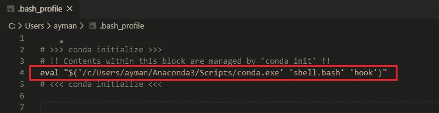
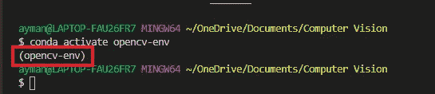

# 在 Windows 10 中安装和配置 OpenCV-4 . 2 . 0—Python

> 原文：<https://towardsdatascience.com/install-and-configure-opencv-4-2-0-in-windows-10-python-7a7386ae024?source=collection_archive---------20----------------------->

## 在 Windows 10 中安装 OpenCV-4.2.0 的完整指南

这篇文章将指导您在 Windows 10 (64 位)中安装和配置 OpenCV-4.2.0 的所有步骤，以便在 Anaconda 环境中使用 python。

*   OpenCV 和 Anaconda，用于 Python 3.6.0+开发

我将在这里重点介绍 OpenCV for python 3.6.0+，我之前关于 VC++集成的帖子可以在这里**找到。**

> ***注意**:为了跟随教程，我假设你已经安装了 [Anaconda](https://www.anaconda.com/distribution/) 和 [Python 3.6.0](https://www.python.org/downloads/windows/) 。如果没有，请在继续阅读之前安装这些工具。*

# *用于 Python 的 OpenCV-4.2.0*

*通过 Anaconda 安装 OpenCV 的步骤非常简单直接。不要忘记将 Anaconda 添加到您的路径中，这样您可以很容易地从提示符下访问`conda` 命令。*

## *步骤 1:为 OpenCV 创建一个 conda 虚拟环境*

*   *`conda create --name opencv-env python=3.6`*

*`opencv-env` 是指虚拟环境的名字，你可以随意命名，但记得要挑一个有意义的名字。*

*   *为项目创建一个文件夹，用于存放 python 脚本。*
*   *通过命令行`cd C:\Users\<username>\my_folder`进入您的文件夹，使用以下命令激活您刚刚创建的虚拟环境:*
*   *`conda activate opencv-env`*

> *注意:如果您在 windows 中使用 bash 作为默认终端，`*conda activate opencv-env*`可能不会像预期的那样工作。这是因为默认情况下，bash 没有正确配置为运行 anaconda 脚本，所以您可以为它提供一个解决方法:*

1.  *编辑您的。bashrc 文件`c:\Users\<username>\.bash_profile`添加下面一行代码:*

**

*用 [Visual Studio 代码](https://code.visualstudio.com/)编辑*

*2.每当您想要午餐您的 bash 终端时，添加下面的参数:`--login -i`，因此您将午餐您的定制 bash 概要文件，它已经被授权访问 conda 脚本。*

**

*现在，您的 conda 环境已经激活，并且完全可用。*

**

## *步骤 2:安装 OpenCV 和所需的包*

*要使用 OpenCV，你必须安装一些重要的软件包:*

*`pip install numpy scipy matplotlib scikit-learn`*

*`pip install opencv-contrib-python`*

*`pip install dlib`*

## *步骤 3:测试您的安装*

*您应该可以在 python repo 中获得最新的 OpenCV 版本。*

*就这些了，好好享受 OpenCV 吧。*

*更多安装信息，请访问 [OpenCV 官方指南](https://opencv-python-tutroals.readthedocs.io/en/latest/py_tutorials/py_setup/py_setup_in_windows/py_setup_in_windows.html)。*