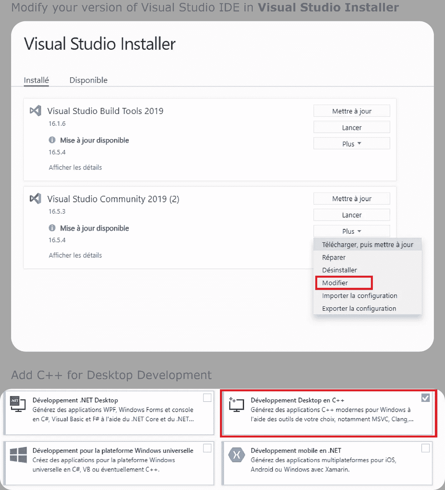
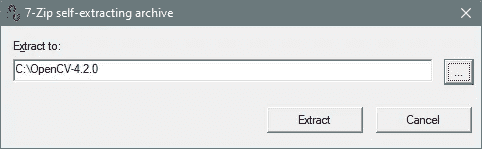
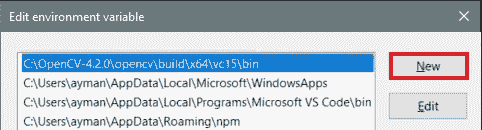
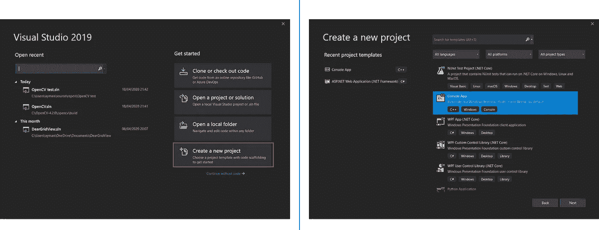
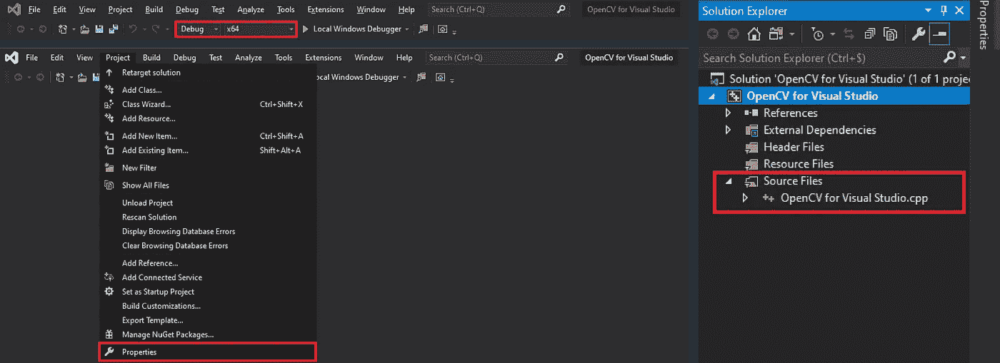
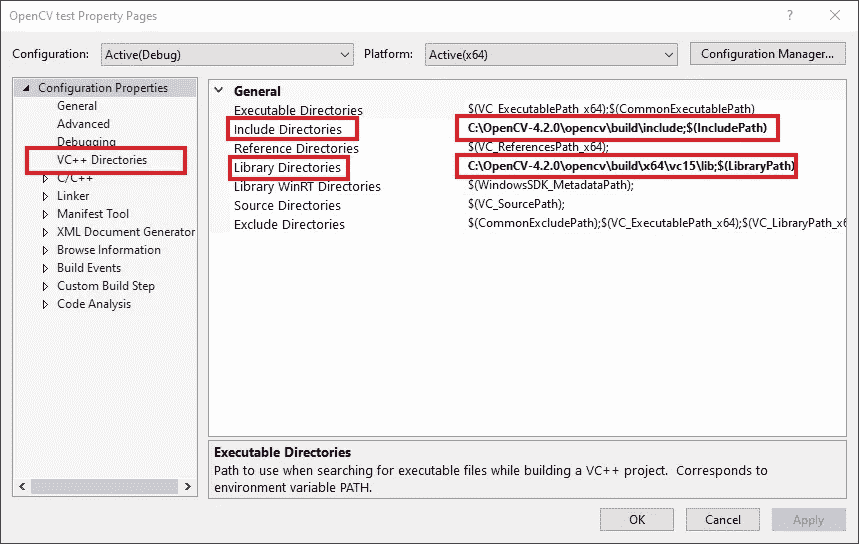
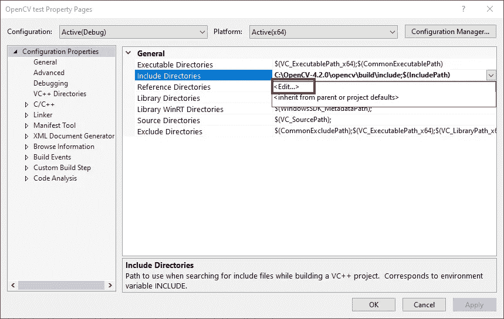
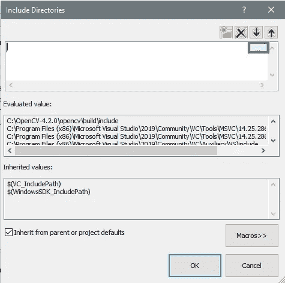
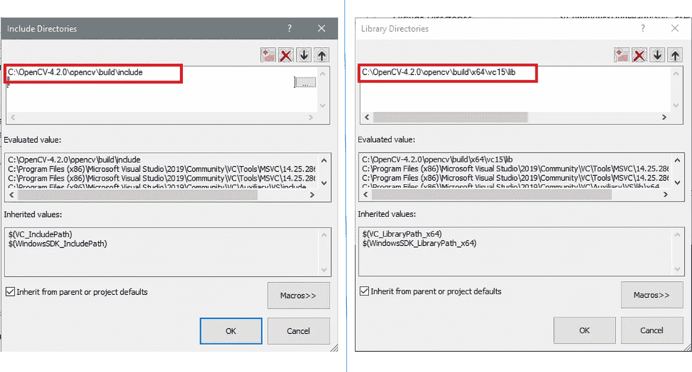
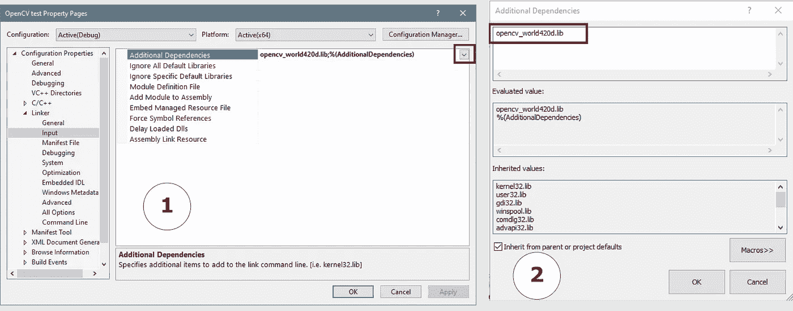

# 在 Windows 10 中安装和配置 OpenCV-4 . 2 . 0—v c++

> 原文：<https://towardsdatascience.com/install-and-configure-opencv-4-2-0-in-windows-10-vc-d132c52063a1?source=collection_archive---------1----------------------->

## 在 Windows 10 中安装 OpenCV-4.2.0 的完整指南

这篇文章将指导你在两种不同的环境下在 Windows 10 (64 位)中安装和配置 OpenCV-4.2.0 的所有步骤:

*   OpenCV 与 Visual Studio 2019，用于 C++开发
*   OpenCV 和 Anaconda，用于 Python 3.6.0+开发

我将在这里重点介绍 OpenCV for Visual Studio with C++，python 和 Anaconda 的其他教程部分可以在 [*这里*](https://medium.com/p/7a7386ae024/edit) *找到。*

> **注意**:为了跟随教程，我假设你已经安装了 [Visual Studio 2019](https://visualstudio.microsoft.com/vs/community/) 。如果没有，请在继续阅读之前安装这些工具。

# 适用于 Visual Studio 2019 的 OpenCV-4.2.0

为 Visual C++开发设置 OpenCV 的所有必要步骤。

## 步骤 1:安装 C++桌面开发工作负载

打开 Visual Studio 安装工具，将 C++ for desktop development 作为工作负载添加到当前的 Visual Studio IDE 版本中。这一步是必不可少的，因为如果没有所有 C++所需的库，就不能在 VS 中使用 OpenCV。

Visual Studio 安装程序向导

## 步骤 2:下载并安装 OpenCV-4.2.0

下载适用于 Windows 平台的 OpenCV 4.2.0 最新稳定版(opencv-4.2.0-vc14_vc15.exe)。进入 OpenCV 官方网站:[https://opencv.org/](https://opencv.org/)->-**资源**->-**发布**点击 Windows 平台。你将被重定向到 SourceForge，下载将自动开始。

OpenCV-4.2.0 版本:[https://opencv.org/releases/](https://opencv.org/releases/)

在运行下载之前。exe 文件，转到 C:\文件夹并添加一个名为 opencv-4.2.0 的新文件夹。运行安装程序并将 zip 文件解压到新创建的 opencv-4.2.0 文件夹中。

将包含 OpenCV 编译版本的 zip 文件解压到您的文件夹中

## 步骤 3:将 OpenCV 二进制文件添加到您的系统路径中

一旦 OpenCV 正确地安装在您的文件夹中，您现在必须将二进制文件`C:\OpenCV-4.2.0\opencv\build\x64\vc15\bin`添加到您的系统路径中，这样您就可以通过命令行轻松地访问 OpenCV 可执行文件。

编辑系统路径

## 步骤 4:配置 Visual Studio 项目以运行 OpenCV

打开 Visual Studio 2019，选择创建一个新项目，然后转到 C++控制台应用程序模板。

创建一个新项目，并选择控制台应用程序 C++模板

创建项目后，您应该有一个布局，其右侧有一个解决方案资源管理器，其中有一个源文件，并且在窗口上方的功能区中，您应该看到针对`x86`平台的`Debug`，这意味着该项目将针对 x86 windows 体系结构以调试模式构建和运行。

*   首先，您应该将解决方案平台从`x86`更改为`x64`
*   其次，您必须更改**项目属性**来添加 OpenCV 库

更改目标解决方案平台，并转到项目属性

在能够执行任何代码之前，有许多属性需要编辑:

1.  转到**配置属性/VC++目录**为 OpenCV 添加包含和库目录。

编辑包含目录和库目录

单击蓝色条目旁边的右箭头

包括内部系统路径

对于包含目录，您必须添加以下路径:`C:\OpenCV-4.2.0\opencv\build\include.`对**库目录**做同样的操作，添加这个内部路径:`C:\OpenCV-4.2.0\opencv\build\x64\vc15\lib.`

Include 和 Lib 目录都添加到项目中

2.用`opencv_world420d.lib` OpenCV 动态库编辑 VC++项目链接器。你会在这里找到**DLL**(**D***dynamic****L****ink****L****ibrary*):`C:\OpenCV-4.2.0\opencv\build\x64\vc15\lib`复制文件名`opencv_world420d.lib`粘贴到依赖框中。

完成后，单击“确定”按钮

## 最后一步:测试一些代码

最后，您可以在 visual studio IDE 中运行这个演示代码，看看它是否工作正常。

生成的图像

就这样，您现在可以轻松地使用 OpenCV 了。😉

更多安装信息，请访问 [OpenCV 官方指南](https://docs.opencv.org/2.4/doc/tutorials/introduction/windows_visual_studio_Opencv/windows_visual_studio_Opencv.html)。