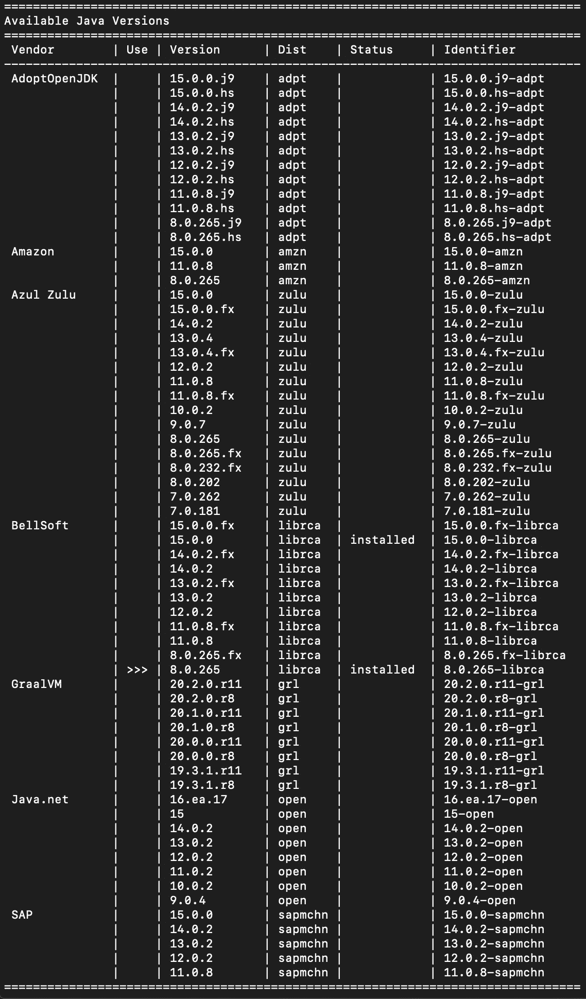

# 在 Linux 和 MacOS 上安装和运行多个 Java 版本

> 原文：<https://towardsdatascience.com/install-and-run-multiple-java-versions-on-linux-using-sdkman-858571bce6cf?source=collection_archive---------4----------------------->

## 在任何基于 UNIX 的系统上安装并行 Java 版本的分步指南


图片由来自 [Pixabay](https://pixabay.com/?utm_source=link-attribution&utm_medium=referral&utm_campaign=image&utm_content=430441) 的[巴克提·伊亚塔](https://pixabay.com/users/soapwitch-387310/?utm_source=link-attribution&utm_medium=referral&utm_campaign=image&utm_content=430441)提供

如果您是 Java 开发人员，您可能需要在您的机器上安装多个 Java 版本。您可以在项目中使用 Java8 或 Java11，但希望学习更新版本的 Java。或者也许你正在做两个不同的项目，其中使用了两个不同版本的 Java。

实现这一点的一种方法是安装多个 Java 版本，并手动配置不同的 Java 版本。在这种情况下，当您需要切换 Java 版本时，您必须修改一些环境变量。另一种优雅便捷的方式是使用 **SDKMAN** 。

SDKMAN 是一个软件开发工具包管理器，用于管理大多数基于 Unix 的系统上的多个**软件开发工具包**的并行版本。它允许我们安装、移除、切换和列出不同 SDK 的候选版本，包括 **Java** (例如，JDK、Ant、Dotty、Gradle、Scala 等等)。

在这里，我将展示如何使用 SDKMAN 在基于 UNIX 机器上管理多个 Java 版本。通过阅读本文，您将了解以下内容:

*   安装 SDKMAN
*   使用 SDKMAN 列出候选人 JDK
*   使用 SDKMAN 安装多个候选 JDK
*   使用 SDKMAN 切换候选 JDK
*   使用 SDKMAN 删除/卸载 JDK

这些指令对大多数基于 **UNIX** 的操作系统有效，包括 **MacOS、任何 Linux OS (Ubuntu、Debian、MINT、Manjaro、OpenSUSE)、FreeBSD、Solaris、Cygwin** 。

# 步骤 1:安装 SDKMAN

打开一个新的终端并输入

```
**curl -s “https://get.sdkman.io" | bash**
```

现在，在终端中复制并粘贴以下内容，然后输入

```
**source "$HOME/.sdkman/bin/sdkman-init.sh"**
```

它会在你的机器上安装 SDKMAN。然后，您可以检查 SDKMAN 的版本

```
**sdk version**
```

# 步骤 2:列出可用的 JDK

通过给出以下命令，查看 SDKMAN 提供的可用 Java 版本

```
**sdk list java**
```

它将显示来自不同供应商的所有可用 JDK 及其支持的版本。

# 步骤 3:安装并行 JDK

安装特定的 JDK，例如 BellSoft 的 JDK 15 Liberica

```
**sdk install java 15.0.0-librca**
Installing: java 15.0.0-librca
Done installing!Do you want java 15.0.0-librca to be set as default? (Y/n):
```

现在，您可以使用以下命令检查安装的 Java 版本

```
**java -version** openjdk version "15" 2020-09-15
OpenJDK Runtime Environment (build 15+36)
OpenJDK 64-Bit Server VM (build 15+36, mixed mode, sharing)
```

您现在可以安装另一个 JDK，例如 BellSoft 的 JDK 8 Liberica

```
**sdk install java 8.0.265-librca**
Installing: java 8.0.265-librca
Done installing!Do you want java 15.0.0-librca to be set as default? (Y/n):
```

# 步骤 4:在 JDK 之间切换

如果您现在列出可用的 JDK，您将看到已安装的 JDK 标记为 **installed，**如下所示。

```
**sdk list java**
```



然后，您可以使用以下命令更改 JDK

```
**sdk use java 8.0.265-librca** Using java version 8.0.265-librca in this shell.
```

您可以按如下方式检查已安装的 JDK

```
**jdk -version**
openjdk version "1.8.0_265"
OpenJDK Runtime Environment (build 1.8.0_265-b01)
OpenJDK 64-Bit Server VM (build 25.265-b01, mixed mode)
```

# 步骤 5:卸载 JDK

您可以使用以下命令卸载 JDK

```
**sdk uninstall java 15.0.0-librca**
Uninstalling java 15.0.0-librca…
```

# 结论

在本文中，我展示了如何使用 SDKMAN 在基于 UNIX 操作系统中轻松优雅地管理多个 Java 版本。我使用 NVM 来管理本地机器上的多个 Node.js 版本，我认为 SDKMAN 在有用性和开发人员友好性方面与 NVM 不相上下。事实上，SDKMAN 支持安装其他 JVM 工具和 SDK，如 **Groovy、Scala、Kotlin、Ceylon。蚂蚁，格雷尔，格雷尔斯，梅文，SBT，火花，Spring Boot，Vert.x** 。如果你使用 Java 和 JVM，你应该试试 SDKMAN。管理多个 Java 和其他基于 JVM 的 SDK 版本将使您的生活更加轻松。

# 类似文章:

[](/top-10-libraries-every-java-developer-should-know-37dd136dff54) [## 每个 Java 开发人员都应该知道的 10 大库

### Java 和 JVM 软件开发中基本 Java 库的精选列表

towardsdatascience.com](/top-10-libraries-every-java-developer-should-know-37dd136dff54) [](/10-excellent-github-repositories-for-every-java-developer-41084a91ade9) [## 10 个优秀的 GitHub 库，适合每一个 Java 开发者

### 面向 Java 开发人员的基本 GitHub 库的精选列表

towardsdatascience.com](/10-excellent-github-repositories-for-every-java-developer-41084a91ade9) [](/25-lesser-known-java-libraries-you-should-try-ff8abd354a94) [## 您应该尝试的 25 个鲜为人知的 Java 库

### 对 Java 和 JVM 软件开发有很大帮助的库

towardsdatascience.com](/25-lesser-known-java-libraries-you-should-try-ff8abd354a94)