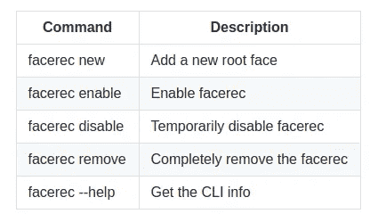

# 在你的 Ubuntu 上安装我的面部解锁

> 原文：<https://towardsdatascience.com/install-my-face-unlock-on-your-ubuntu-b27d73fcf54b?source=collection_archive---------52----------------------->

**是福斯…！**

# TL；速度三角形定位法(dead reckoning)

在你的 Ubuntu 上安装我的软件`Facerec-Linux face unlock`。它是高度优化的，并有一个用户友好的 CLI 来操作它。你可以用`*apt install*`像安装其他 ubuntu 软件一样安装它。 ***查看安装指南*** [***此处***](https://github.com/rushabh-v/linux_face_unlock#readme) ***。***


照片由[凯特琳·贝克](https://unsplash.com/@kaitlynbaker?utm_source=medium&utm_medium=referral)在 [Unsplash](https://unsplash.com?utm_source=medium&utm_medium=referral) 上拍摄

# 故事

大约一年前，作为我在大学的学术项目，我第一次开发了这个软件。我决定它的名字是 **Facerec** 。最后我把它推到 GitHub 上，并附上了一套安装说明。最初，我没想到会有很多人使用它。它没有友好的安装/使用指南。当人们通过电子邮件和 LinkedIn 联系我，告诉我他们面临的问题时，我感到惊喜。所以我决定花更多的时间让它变得更好和用户友好。

所以我又花了几个星期在这个项目上。这一次，我想我让它变得非常神奇。我几乎重写了整个代码库，现在我正式以`facerec v1.1`的名字发布它，这一切都是值得的。响应时间减少 70%，现在超级安全。此外，我已经为它创建了一个 PPA(个人包档案)。所以，现在你可以像其他 Ubuntu 软件一样安装它，用`apt install`。

# 怎么样

*   整个模型已经更新，以获得更好的性能。
*   提高安全性。
*   严重的错误修正，如软件中心冻结问题等。
*   一个有更多功能的更好的 CLI。
*   CLI 的自动完成。这是我特别引以为豪的小功能之一😂
*   一个 deb 包，PPA，和一个 docker 镜像用于测试。

## 欢迎投稿

*   错误报告，功能请求和 PRs 将被高度赞赏。
*   测试环境的 Dockerfile 可以在这里找到[。(即将上传图片到 docker hub)](https://github.com/rushabh-v/linux_face_unlock/blob/master/Dockerfile)
*   目前只有 Ubuntu 支持 facerec。平我，如果你想为其他发行。

# **安装**

**1。更新来源**

```
sudo apt update
```

**2。将 PPA 添加到您的机器中**

```
sudo add-apt-repository ppa:rushabh-v/facerec
```

**3。安装 Facerec**

```
sudo apt install facerec
```

**4。来源 bashrc**

```
source ~/.bashrc
```

## 命令行界面



截图来自[自述](https://github.com/rushabh-v/linux_face_unlock/blob/master/README.md)

# 仔细讨论

点击查看[。如果你用 Ubuntu，可以考虑试一试，对于其他发行版，可以查看](https://github.com/rushabh-v/linux_face_unlock/) [howdy](https://github.com/boltgolt/howdy) 。你可以在这里阅读更多关于我如何构建这个项目[的信息。](https://medium.com/analytics-vidhya/how-i-built-face-unlock-for-ubuntu-linux-a2b769d1fbc1)

## 回购的链接

[](https://github.com/rushabh-v/linux_face_unlock/) [## rushabh-v/linux_face_unlock

### Facerec 是一个面向 Ubuntu Linux 的人脸认证系统，可以在登录、运行“sudo”命令等时工作

github.com](https://github.com/rushabh-v/linux_face_unlock/)