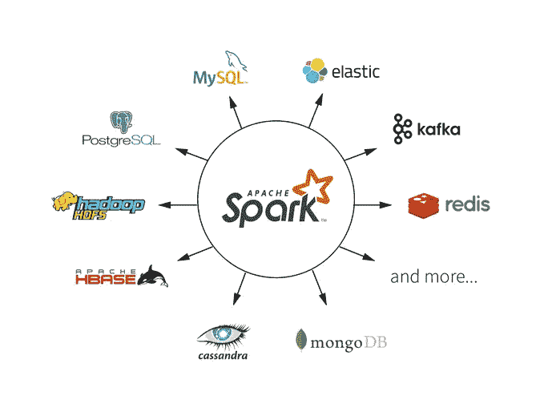

# 安装 Pyspark 并在 macOS 和 Linux 上使用 GraphFrames

> 原文：<https://towardsdatascience.com/install-pyspark-and-use-graphframes-on-macos-and-linux-f2fe62fc3c2d?source=collection_archive---------17----------------------->

## 关于如何在不同操作系统上安装 Pyspark 和使用 Spark GraphFrames 的详细指南



image_credit —数据块([https://databricks.com/spark/about](https://databricks.com/spark/about))

# Linux(Ubuntu)

**以下所有操作都应在终端下完成。**

1.  下载 Spark

```
wget [http://d3kbcqa49mib13.cloudfront.net/spark-2.2.0-bin-hadoop2.7.tgz](http://d3kbcqa49mib13.cloudfront.net/spark-2.2.0-bin-hadoop2.7.tgz)
```

2.解压缩文件

```
tar xf spark-2.2.0-bin-hadoop2.7.tgz
```

3.如有必要，安装 Java8

```
sudo add-apt-repository ppa:openjdk-r/ppasudo apt-get updatesudo apt-get install openjdk-8-jdk
```

您可以通过“java -version”来检查您的安装。如果不是“1.8.xxx”，您需要按照步骤 5–6 选择正确的 java 版本供 spark 使用。

```
sudo update-java-alternatives — set java-1.8.0-openjdk-amd64
```

重启你的终端。

4.(可选)如果你想更熟练地使用 Spark，你最好熟悉基本的 Linux 命令和基本的 Bash 操作。可以参考下面这本书【http://linux-training.be/linuxfun.pdf

# mac 操作系统

1.  安装自制软件:

/usr/bin/ruby-e " $(curl-fsSL[https://raw . githubusercontent . com/home brew/install/master/install](https://raw.githubusercontent.com/Homebrew/install/master/install))"

2.安装 Scala:

```
brew install scala
```

3.安装 Spark:

```
brew install apache-spark
```

4.启动 spark python shell(在 spark 目录中):

```
pyspark
```

# **Jupyter 安装(Linux & Mac OS)**


Jupyter 笔记本徽标

1.  安装 Anaconda。

Linux:

```
wget [https://repo.continuum.io/archive/Anaconda2-4.3.0-Linux-x86_64.sh](https://repo.continuum.io/archive/Anaconda2-4.3.0-Linux-x86_64.sh)
```

Mac OS:

```
wget [https://repo.anaconda.com/archive/Anaconda2-2019.07-MacOSX-x86_64.sh](https://repo.anaconda.com/archive/Anaconda2-2019.07-MacOSX-x86_64.sh)
```

安装:

bash anaconda 2–4 . 3 . 0-Linux-x86 _ 64 . sh(使用相应的文件)

更新$PATH 变量

Linux:源码~/。bashrc

Mac OS: source ~/。bash_profile

修改 pyspark 驱动程序

导出 PYSPARK_DRIVER_PYTHON="jupyter "

导出 py spark _ DRIVER _ PYTHON _ OPTS = " notebook "

启动 spark python shell(在 spark 目录中):

。/bin/pyspark

注意事项:

1.  可以执行“unset py spark _ DRIVER _ PYTHON py spark _ DRIVER _ PYTHON _ OPTS”来运行普通的 pyspark shell
2.  如果你发现这个错误“我找不到匹配 PySpark 的内核。请选择一个内核:“你从讲义上传笔记本后，你只要选择已经支持 pyspark 内核的 Python2 内核即可。
3.  完成这些步骤后，创建一个新的笔记本，键入“sc”并运行它。如果在输出中看到“pyspark.context.SparkContext ”,安装应该成功。

# **图表框架:**

**对于预装 Spark 版本的 ubuntu，要使用 GraphFrames:**

获取 jar 文件:

wget[http://dl . bin tray . com/spark-packages/maven/graph frames/graph frames/0 . 7 . 0-spark 2.4-s _ 2.11/graph frames-0 . 7 . 0-spark 2.4-s _ 2.11 . jar](http://dl.bintray.com/spark-packages/maven/graphframes/graphframes/0.7.0-spark2.4-s_2.11/graphframes-0.7.0-spark2.4-s_2.11.jar)

在 Jupyter 笔记本
sc . addpyfile(' path _ to _ the _ jar _ file ')中加载 jar 文件

将 pyspark shell 直接用于 GraphFrames:

。/bin/pyspark —包 graph frames:graph frames:0 . 7 . 0-spark 2.4-s _ 2.11

**本地使用 Jupyter:**

设置环境变量:
export SPARK _ OPTS = "—packages graph frames:graph frames:0 . 7 . 0-SPARK 2.4-s _ 2.11 "

获取 jar 文件:
wget[http://dl . bin tray . com/spark-packages/maven/graph frames/graph frames/0 . 7 . 0-spark 2.4-s _ 2.11/graph frames-0 . 7 . 0-spark 2.4-s _ 2.11 . jar](http://dl.bintray.com/spark-packages/maven/graphframes/graphframes/0.7.0-spark2.4-s_2.11/graphframes-0.7.0-spark2.4-s_2.11.jar)

在 Jupyter 笔记本
sc . addpyfile(' path _ to _ the _ jar _ file ')中加载 jar 文件

**在 Azure Databricks 服务中:**

启动集群

搜索“graphframes”并安装库


弗洛里安·奥利沃在 [Unsplash](https://unsplash.com?utm_source=medium&utm_medium=referral) 上拍摄的照片

**感谢您的阅读，我期待听到您的问题和想法。如果你想了解更多关于数据科学和云计算的知识，可以在**[**Linkedin**](https://www.linkedin.com/in/andrewngai9255/)**上找我。**