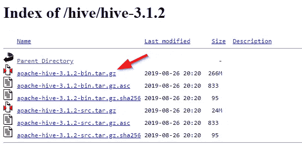
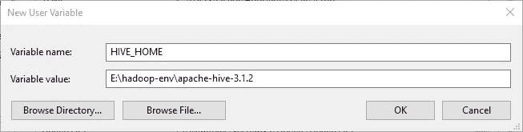
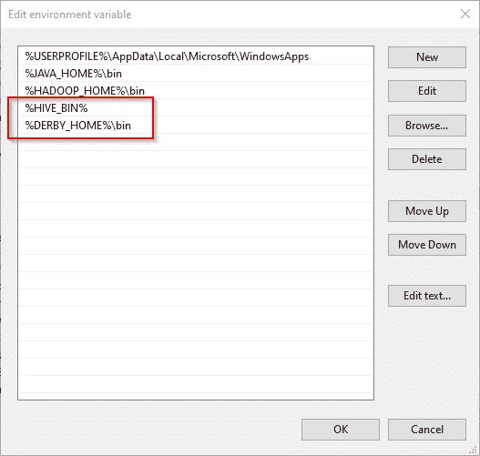
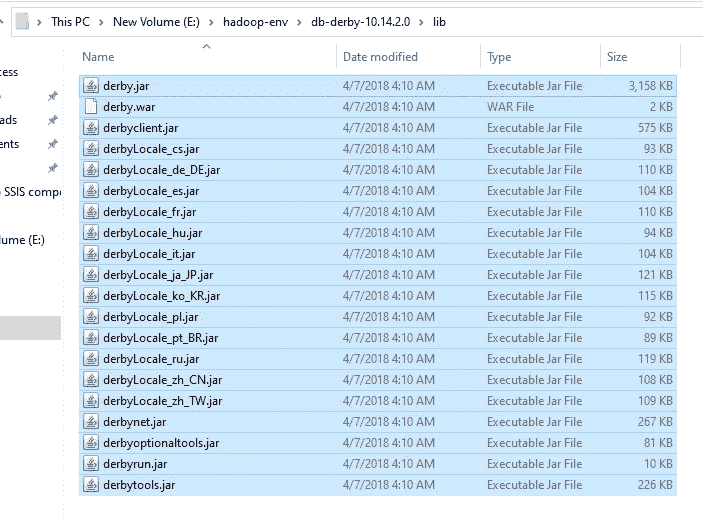
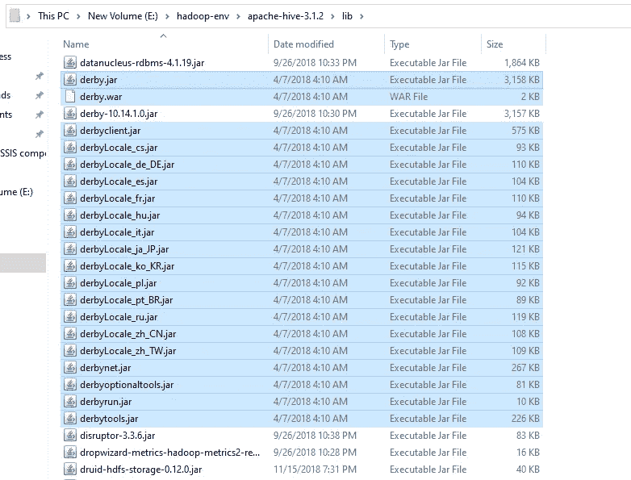
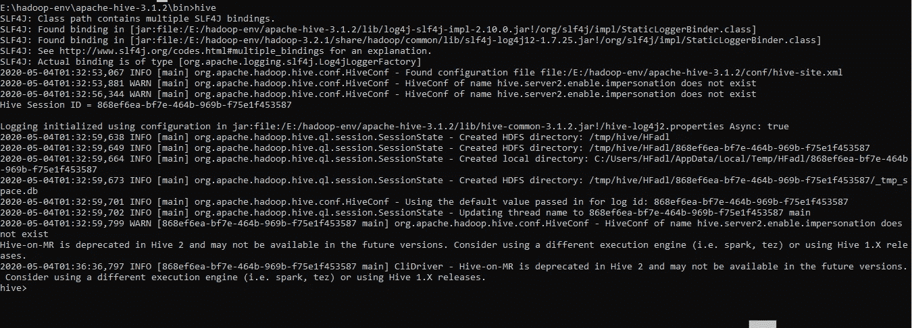

# 在 Windows 10 上安装 Apache Hive 3.1.2

> 原文：<https://towardsdatascience.com/installing-apache-hive-3-1-2-on-windows-10-70669ce79c79?source=collection_archive---------2----------------------->

## 在 Windows 10 操作系统上安装 Apache Hive 3.1.2 的分步指南

在进行一个项目时，我们被要求在 Windows 10 操作系统上安装 Apache Hive。网上找到了许多指南，但不幸的是，它们不起作用。为此，我决定写一个循序渐进的指南来帮助别人。

本指南的起点是我在 Youtube 上找到的一个很棒的视频，它提供了 Hive 2.x 的一个工作场景，没有太多细节。

本文是我们在 TowardsDataScience.com 上发布的系列文章的一部分，旨在说明如何在 Windows 操作系统上安装大数据技术。

**本系列其他发表文章:**

*   [在 Windows 10 上安装 Hadoop 3.2.1 单节点集群](/installing-hadoop-3-2-1-single-node-cluster-on-windows-10-ac258dd48aef)
*   [在 Windows 10 上安装 Apache Pig 0 . 17 . 0](/installing-apache-pig-0-17-0-on-windows-10-7b19ce61900d)

# 1.先决条件

## 1.1.7zip

为了提取 tar.gz 档案，你应该安装[7 压缩工具](https://www.7-zip.org/download.html)。

## 1.2.安装 Hadoop

要安装 Apache Hive，必须安装并运行 Hadoop 集群:可以参考我们之前发布的[分步指南，在 Windows 10](/installing-hadoop-3-2-1-single-node-cluster-on-windows-10-ac258dd48aef) 上安装 Hadoop 3.2.1。

## 1.3.阿帕奇德比

此外，Apache Hive 需要一个关系数据库来创建它的 Metastore(所有元数据都将存储在这里)。在本指南中，我们将使用 Apache Derby 数据库 4。

既然我们已经安装了 Java 8，我们必须安装 Apache Derby 10.14.2.0 版本([查看下载页面](https://db.apache.org/derby/derby_downloads.html))，可以从下面的[链接](https://downloads.apache.org//db/derby/db-derby-10.14.2.0/db-derby-10.14.2.0-bin.tar.gz)下载。

下载后，我们必须解压两次*(使用 7zip:第一次解压. tar.gz 文件，第二次解压。tar file)* 将 db-derby-10.14.2.0-bin.tar.gz 的内容归档到所需的安装目录下。由于在上一个指南中，我们已经在“E:\hadoop-env\hadoop-3.2.1”目录中安装了 Hadoop，因此我们将 Derby 提取到“E:\ Hadoop-env \ d b-Derby-10 . 14 . 2 . 0”目录中。

## 1.4.Cygwin

因为有一些 Hive 3.1.2 工具与 Windows 不兼容(比如 schematool)。我们将需要 [Cygwin](https://www.cygwin.com/) 工具来运行一些 Linux 命令。

# 2.下载 Apache Hive 二进制文件

为了下载 Apache Hive 二进制文件，你应该去下面的网站:【https://downloads.apache.org/hive/hive-3.1.2/】T2。然后，下载 apache-hive-3.1.2。-bin.tar.gz 文件。



图 1—apache-hive.3.1.2-bin.tar.gz 文件

文件下载完成后，我们应该将两次*(如上所述)*apache-hive.3.1.2-bin.tar.gz 归档文件解压到“E:\hadoop-env\ Apache-hive-3 . 1 . 2”目录中(因为我们决定使用 E:\ Hadoop-env \ "作为上一指南中使用的所有技术的安装目录。

# 3.设置环境变量

提取 Derby 和 Hive 档案后，我们应该进入控制面板>系统和安全>系统。然后点击“高级系统设置”。


图 2-高级系统设置

在高级系统设置对话框中，点击“环境变量”按钮。


图 3 —打开环境变量编辑器

现在我们应该添加以下用户变量:


图 4 —添加用户变量

*   HIVE _ HOME:" E:\ Hadoop-env \ Apache-HIVE-3 . 1 . 2 \ "
*   DERBY _ HOME:" E:\ Hadoop-env \ d b-DERBY-10 . 14 . 2 . 0 \ "
*   HIVE_LIB: "%HIVE_HOME%\lib "
*   HIVE_BIN: "%HIVE_HOME%\bin "
*   HADOOP _ USER _ class path _ FIRST:" true "



图 5 —添加 HIVE_HOME 用户变量

此外，我们应该添加以下系统变量:

*   HADOOP _ USER _ class path _ FIRST:" true "

现在，我们应该编辑 Path 用户变量以添加以下路径:

*   %HIVE_BIN%
*   %DERBY_HOME%\bin



图 6 —编辑路径环境变量

# 4.正在配置配置单元

## 4.1.复制 Derby 库

现在，我们应该转到 Derby 库目录(E:\ Hadoop-env \ d b-Derby-10 . 14 . 2 . 0 \ lib)并复制所有*。jar 文件。



图 7 —复制 Derby 库

然后，我们应该将它们粘贴到配置单元库目录中(E:\ Hadoop-env \ Apache-Hive-3 . 1 . 2 \ lib)。



图 8 —在配置单元库目录中粘贴 Derby 库

## 4.2.配置 hive-site.xml

现在，我们应该转到 Apache Hive 配置目录(E:\ Hadoop-env \ Apache-Hive-3 . 1 . 2 \ conf)创建一个新文件“hive-site.xml”。我们应该将以下 XML 代码粘贴到该文件中:

```
<?xml version="1.0"?>
<?xml-stylesheet type="text/xsl" href="configuration.xsl"?>
<configuration><property> <name>javax.jdo.option.ConnectionURL</name> 
<value>jdbc:derby://localhost:1527/metastore_db;create=true</value> 
<description>JDBC connect string for a JDBC metastore</description>
</property><property> 
<name>javax.jdo.option.ConnectionDriverName</name> 
<value>org.apache.derby.jdbc.ClientDriver</value> 
<description>Driver class name for a JDBC metastore</description>
</property>
<property> 
<name>hive.server2.enable.doAs</name> 
<description>Enable user impersonation for HiveServer2</description>
<value>true</value>
</property>
<property>
<name>hive.server2.authentication</name> 
<value>NONE</value>
<description> Client authentication types. NONE: no authentication check LDAP: LDAP/AD based authentication KERBEROS: Kerberos/GSSAPI authentication CUSTOM: Custom authentication provider (Use with property hive.server2.custom.authentication.class) </description>
</property>
<property>
<name>datanucleus.autoCreateTables</name>
<value>True</value>
</property>
</configuration>
```

# 5.启动服务

## 5.1.Hadoop 服务

要启动 Apache Hive，请以管理员身份打开命令提示符实用程序。然后，使用 start-dfs 和 start-yarn 命令启动 Hadoop 服务(如 Hadoop 安装指南中所示)。

## 5.2.Derby 网络服务器

然后，我们应该使用以下命令在本地主机上启动 Derby 网络服务器:

```
E:\hadoop-env\db-derby-10.14.2.0\bin\StartNetworkServer -h 0.0.0.0
```

# 6.正在启动 Apache Hive

现在，让我们尝试打开一个命令提示工具，转到配置单元二进制文件目录(E:\ Hadoop-env \ Apache-Hive-3 . 1 . 2 \ bin)并执行以下命令:

```
hive
```

我们将收到以下错误:

```
'hive' is not recognized as an internal or external command, operable program or batch file.
```

由于 Hive 3.x 版本不是为 Windows 构建的(仅在某些 Hive 2.x 版本中)，因此会引发此错误。为了让事情顺利进行，我们应该下载必要的*。来自以下链接的 cmd 文件:h[ttps://SVN . Apache . org/repos/ASF/hive/trunk/bin/](https://svn.apache.org/repos/asf/hive/trunk/bin/hive.cmd)。请注意，您应该保留文件夹层次结构(bin\ext\util)。

您可以下载所有*。来自以下 GitHub 存储库的 cmd 文件

*   https://github.com/HadiFadl/Hive-cmd

现在，如果我们尝试执行“hive”命令，我们将收到以下错误:

```
Exception in thread "main" java.lang.NoSuchMethodError: com.google.common.base.Preconditions.checkArgument(ZLjava/lang/String;Ljava/lang/Object;)V
at org.apache.hadoop.conf.Configuration.set(Configuration.java:1357)
at org.apache.hadoop.conf.Configuration.set(Configuration.java:1338)
at org.apache.hadoop.mapred.JobConf.setJar(JobConf.java:518)
at org.apache.hadoop.mapred.JobConf.setJarByClass(JobConf.java:536)
at org.apache.hadoop.mapred.JobConf.<init>(JobConf.java:430)
at org.apache.hadoop.hive.conf.HiveConf.initialize(HiveConf.java:5141)
at org.apache.hadoop.hive.conf.HiveConf.<init>(HiveConf.java:5104)
at org.apache.hive.beeline.HiveSchemaTool.<init>(HiveSchemaTool.java:96)
at org.apache.hive.beeline.HiveSchemaTool.main(HiveSchemaTool.java:1473)
at sun.reflect.NativeMethodAccessorImpl.invoke0(Native Method)
at sun.reflect.NativeMethodAccessorImpl.invoke(NativeMethodAccessorImpl.java:62)
at sun.reflect.DelegatingMethodAccessorImpl.invoke(DelegatingMethodAccessorImpl.java:43)
at java.lang.reflect.Method.invoke(Method.java:498)
at org.apache.hadoop.util.RunJar.run(RunJar.java:318)
at org.apache.hadoop.util.RunJar.main(RunJar.java:232)
```

这个错误是由于下面的 Hive 问题链接中提到的一个错误引起的: [HIVE-22718](https://issues.apache.org/jira/browse/HIVE-22718) 。

评论中提到，这个问题可以通过将“E:\ hadoop-env \ Apache-hive-3 . 1 . 2 \ lib”中存储的 guava-19.0.jar 替换为“E:\ Hadoop-env \ Hadoop-3 . 2 . 1 \ share \ Hadoop \ HDFS \ lib”中找到的 Hadoop 的 guava-27.0-jre.jar 来解决。

> 注意:这个文件也被上传到上面提到的 GitHub 存储库中。

现在，如果我们再次运行 hive 命令，那么 Apache Hive 将成功启动。



图 9 —启动 Apache Hive

# 7.正在初始化配置单元

在确保 Apache Hive 成功启动后。我们可能无法运行任何 HiveQL 命令。这是因为 Metastore 尚未初始化。此外，HiveServer2 服务必须正在运行。

要初始化 Metastore，我们需要使用与 windows 不兼容的 schematool 实用程序。为了解决这个问题，我们将使用 Cygwin 实用程序，它允许从 windows 执行 Linux 命令。

## 7.1.创建符号链接

首先，我们需要创建以下目录:

*   E:\cygdrive
*   C:\cygdrive

现在，以管理员身份打开命令提示符并执行以下命令:

```
mklink /J  E:\cygdrive\e\ E:\
mklink /J  C:\cygdrive\c\ C:\
```

这些符号链接是正确使用 Cygwin 实用程序所必需的，因为 Java 可能会导致一些问题。

## 7.2.正在初始化配置单元 Metastore

打开 Cygwin 实用程序并执行以下命令来定义环境变量:

```
export HADOOP_HOME='/cygdrive/e/hadoop-env/hadoop-3.2.1'
export PATH=$PATH:$HADOOP_HOME/bin
export HIVE_HOME='/cygdrive/e/hadoop-env/apache-hive-3.1.2'
export PATH=$PATH:$HIVE_HOME/bin
export HADOOP_CLASSPATH=$HADOOP_CLASSPATH:$HIVE_HOME/lib/*.jar
```

我们可以将这些行添加到“~/”中。bashrc”文件，这样你就不需要每次打开 Cygwin 时都写它们。

现在，我们应该使用 schematool 实用程序来初始化 Metastore:

```
$HIVE_HOME/bin/schematool -dbType derby -initSchema
```

## 7.3.正在启动 HiveServer2 服务

现在，打开命令提示符并运行以下命令:

```
hive --service hiveserver2 start
```

我们应该让这个命令提示符处于打开状态，并打开一个新的命令提示符，我们应该使用下面的命令启动 Apache Hive:

```
hive
```

## 7.4.启动 WebHCat 服务(可选)

在我们正在进行的项目中，我们需要从 SQL Server Integration Services 执行 HiveQL 语句，该语句可以从 WebHCat 服务器访问 Hive。

要启动 WebHCat 服务器，我们应该打开 Cygwin 实用程序并执行以下命令:

```
$HIVE_HOME/hcatalog/sbin/webhcat_server.sh start
```

# 8.参考

1.  Stackoverflow.com 问答网站
2.  阿帕奇蜂巢官网
3.  YouTube:[WINDOWS 上的简易 HIVE 安装](https://www.youtube.com/watch?v=npyRXkMhrgk)
4.  kon text . tech:[Windows 10 上 Apache Hive 3.0.0 安装分步指南](https://kontext.tech/column/hadoop/291/apache-hive-300-installation-on-windows-10-step-by-step-guide)