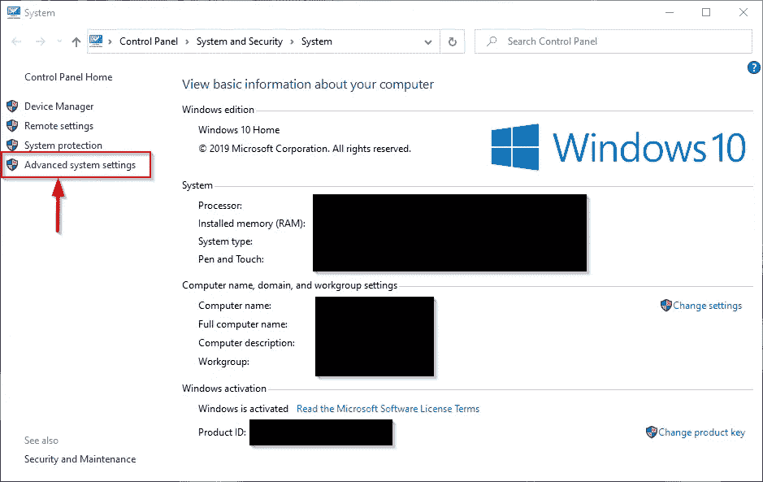
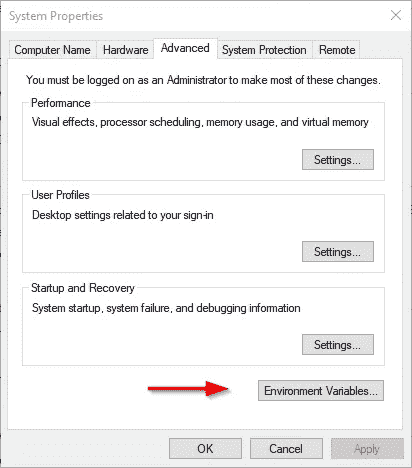
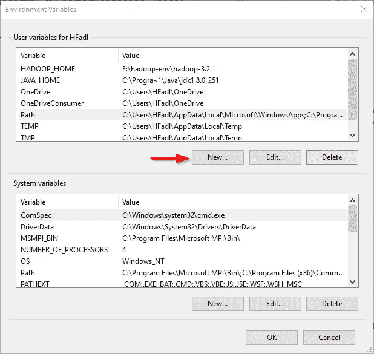

# 在 Windows 10 上安装 Apache Pig 0.17.0

> 原文：<https://towardsdatascience.com/installing-apache-pig-0-17-0-on-windows-10-7b19ce61900d?source=collection_archive---------11----------------------->

本文是我们在 TowardsDataScience.com 上发布的系列文章的一部分，旨在说明如何在 Windows 操作系统上安装大数据技术。

**之前发布:**

*   [在 Windows 10 上安装 Hadoop 3.2.1 单节点集群](/installing-hadoop-3-2-1-single-node-cluster-on-windows-10-ac258dd48aef)
*   [在 Windows 10 上安装 Apache Hive 3 . 1 . 2](/installing-apache-hive-3-1-2-on-windows-10-70669ce79c79)

在本文中，我们将提供在 Windows 10 上安装 Apache Pig 0.17.0 的分步指南。

# 1.先决条件

## 1.1.Hadoop 集群安装

Apache Pig 是基于 Hadoop 构建的平台。可以参考我们之前发表的文章，在 Windows 10 上安装 Hadoop 单节点集群。

> 注意 Apache Pig 最新版本 0.17.0 [支持 Hadoop 2.x 版本](https://pig.apache.org/releases.html#Download)和[仍然面临一些与 Hadoop 3.x](https://issues.apache.org/jira/browse/PIG-5253) 的兼容性问题。在本文中，我们将只说明安装，因为我们使用的是 Hadoop 3.2.1

## 1.2.7zip

7 需要 zip 来解压缩我们将在本指南中下载的. tar.gz 归档文件。

# 2.下载阿帕奇猪

要下载 Apache Pig，您应该访问以下链接:

*   [https://downloads.apache.org/pig/](https://downloads.apache.org/pig/)


图 1 — Apache Pig 发布目录

如果你正在寻找最新版本，导航到“最新”目录，然后下载 pig-x.xx.x.tar.gz 文件。


图 2 —下载 Apache Pig 二进制文件

文件下载后，我们应该用 7zip *解压两次(用 7zip:第一次解压. tar.gz 文件，第二次解压。tar 文件)。*我们将把 Pig 文件夹提取到“E:\hadoop-env”目录中，就像在以前的文章中使用的那样。

# 3.设置环境变量

提取 Derby 和 Hive 档案后，我们应该进入控制面板>系统和安全>系统。然后点击“高级系统设置”。



图 3-高级系统设置

在高级系统设置对话框中，点击“环境变量”按钮。



图 4 —打开环境变量编辑器

现在我们应该添加以下用户变量:



图 5 —添加用户变量

*   PIG _ HOME:" E:\ Hadoop-env \ PIG-0 . 17 . 0 "


图 6 —添加 PIG_HOME 变量

现在，我们应该编辑 Path 用户变量以添加以下路径:

*   %PIG_HOME%\bin


图 7 —编辑路径变量

# 4.启动阿帕奇猪

设置完环境变量后，我们来试着运行 Apache Pig。

> **注意** : Hadoop 服务必须正在运行

以管理员身份打开命令提示符，并执行以下命令

```
pig -version
```

您将收到以下异常:

```
'E:\hadoop-env\hadoop-3.2.1\bin\hadoop-config.cmd' is not recognized as an internal or external command,
operable program or batch file.
'-Xmx1000M' is not recognized as an internal or external command,
operable program or batch file.
```


图 8-清管器异常

要修复此错误，我们应该编辑位于“pig-0.17.0\bin”目录中的 pig.cmd 文件，方法是将 HADOOP_BIN_PATH 值从“%HADOOP_HOME%\bin”更改为“%HADOOP_HOME%\libexec”。

现在，让我们再次尝试运行“pig -version”命令:


图 9-清管器安装已验证

编写 PigLatin 语句最简单的方法是使用 Grunt shell，这是一个交互式工具，我们可以在其中编写语句并获得所需的输出。有两种模式涉及 Grunt Shell:

1.  本地:所有脚本都在一台机器上执行，不需要 Hadoop。(命令:pig -x local)
2.  MapReduce:在 Hadoop 集群上执行脚本(命令:pig -x MapReduce)

由于我们安装了与 Pig 0.17.0 不兼容的 Apache Hadoop 3.2.1，我们将尝试使用本地模式运行 Pig。


图 10 —在本地模式下启动 Grunt Shell

# 5.参考

1.  Stackoverflow.com 问答网站
2.  阿帕奇猪官网
3.  解决方案 Mandi: [在 Windows 10 上安装 Pig](https://www.solutionmandi.com/2018/11/pig-installation-on-windows-10.html)