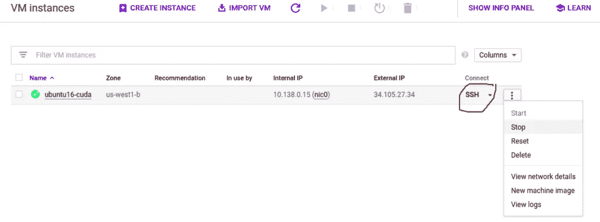

# 10 分钟在谷歌云平台上安装 CUDA

> 原文：<https://towardsdatascience.com/installing-cuda-on-google-cloud-platform-in-10-minutes-9525d874c8c1?source=collection_archive---------16----------------------->

## 剥离支持 GPU 的实例的 4 步指南


最近，我花了相当多的时间在谷歌云平台(GCP)上建立我的 CUDA 实例。在大量的错误和文章之后，我发现如果我第一次就发现了正确的设置过程的话，这本来可以很快完成的！

所以我决定写这篇文章来让你的 CUDA 实例在几分钟内运行起来。到这篇文章结束时，你将在 GCP 上安装 CUDA 10.0、cuDNN 7.6.5 和 Ubuntu 16.04。

**第 0 步:在谷歌云平台(GCP)上创建一个免费账户**

在谷歌云平台上创建一个免费账户。输入您的信用卡详细信息并验证。你将获得 300 美元的信用。

> 要使用 GPU，您需要将[升级到付费账户，并增加您的 GPU 配额](https://stackoverflow.com/questions/45227064/how-to-request-gpu-quota-increase-in-google-cloud)。如果您还没有经过验证的升级帐户，这一步可能需要一些时间(通常为 1-2 天)。

**步骤 1:在 GCP 上设置一个虚拟机实例**

选择一个**项目**。我选择了“我的第一个项目”


在您的项目中创建一个 **VM 实例**。点击“创建”。


选择您需要的 CPU 内核数量，以及您想要的 GPU。我选择了‘n1-standard-8’CPU 和一个‘P100 GPU’。


设置 CPU 和 GPU 类型和数量

选择 **OS** 为 Ubuntu 16.04 和引导盘大小。200 GB 是推荐的大小。


设置操作系统类型和引导磁盘大小

勾选**防火墙**规则，然后点击“管理、安全、磁盘、网络、单独租赁”。


更改防火墙设置

禁用“磁盘”下的**引导磁盘删除**选项


取消启动磁盘删除检查

点击最后的 **create** ，你的实例就准备好了！

点击 **SSH** 打开一个终端。您的实例应该正在运行。



单击 SSH 以连接到终端

不要关闭终端。您将在这个终端中安装 CUDA 和 cuDNN，**而不是**在您的本地桌面终端中。

> 警惕！！您的实例现在已经启动并运行。你被起诉了。如果你的使用超过 300 美元信用，你将不得不支付余额。不要忘记在不使用时停止实例。

**第二步:安装 CUDA**

我给 Ubuntu1604 装了 CUDA 10.0。你也可以安装其他的 [CUDA 版本](http://developer.download.nvidia.com/compute/cuda/repos/ubuntu1604/x86_64/)并相应地编辑下面的代码。

Ubuntu 16.04 上的 CUDA 10.0

> 你可能会得到 [libcudnn.so 此时不是符号链接错误](https://askubuntu.com/questions/1025928/why-do-i-get-sbin-ldconfig-real-usr-local-cuda-lib64-libcudnn-so-7-is-not-a)。查看这篇文章底部的解决方案

**第三步:安装**T5 cud nn

你需要在 Nvidia 上免费创建一个开发者[账户。](https://developer.nvidia.com/rdp/cudnn-download)

Ubuntu 16.04 上的 CuDNN 7.6.5

要验证 CUDA 10.0 安装，请运行以下命令。它应该打印安装的 CUDA 版本。

```
nvcc -V 
```

## 恭喜你！您成功安装了 CUDA 10.0

完整的[代码](https://gist.github.com/MittalShruti/ee472685ac984ece698af7dd27ef8614)便于参考。

**第四步:**安装 **Tensorflow** 等软件包

可以安装 Tensorflow 和基本的 python 包，比如 **ipython** 和 **pip** 。

安装 tensorflow 和 python 包

> 警惕！！不要忘记停止实例！

# 注意:

在`sudo ldconfig`上，您可能会得到以下错误:

```
/usr/local/cuda/lib64/libcudnn.so.7 is not a symbolic link
```

这是因为 libcudnn.so.5 和 libcudnn.so 不是符号链接。你可以在这里阅读详情[。](https://askubuntu.com/questions/1025928/why-do-i-get-sbin-ldconfig-real-usr-local-cuda-lib64-libcudnn-so-7-is-not-a)

要解决该错误，请执行以下步骤:

libcudnn.so 符号链接错误

我们关于在 Google 云平台上设置支持 CUDA 的 VM 实例的快速帖子到此结束。

我希望你喜欢这个技术性更强的帖子！