# 在 Windows 10 的 Visual Studio 代码中安装 GitHub

> 原文：<https://towardsdatascience.com/installing-github-in-visual-studio-code-for-windows-10-6abd3325ab1?source=collection_archive---------4----------------------->

## VS 代码/ GitHub

## 将 GitHub 与 VS 代码集成的分步安装指南。

照片由 iambipin 拍摄

isual Studio Code 已经成为全球大多数开发人员的首选代码编辑器。它的受欢迎程度每时每刻都在飙升。这要归功于它吸引人的一系列特性，如智能感知，这些特性使它成为开发人员不可或缺的工具。

和 VS 代码一样，GitHub 对于开发者社区也是必不可少的。因此，知道如何在 Visual Studio 代码中安装 GitHub 是非常重要的。对于外行来说，GitHub 是一个基于 Git 版本控制系统的基于 web 的托管服务。

在安装之前，检查 Git 是否安装在 Windows 上是必不可少的。要进行验证，请通过按 windows 键和 r 键打开 Windows 的命令提示符。

在命令提示符中，键入 git-version 以了解安装的 Git 版本。如果没有安装 Git，命令提示符将返回一条消息，如下图所示。

现在打开 VS 代码，进入它的活动栏的源代码控制。在没有 Git 的系统中，将显示“没有注册源代码管理提供程序”消息。

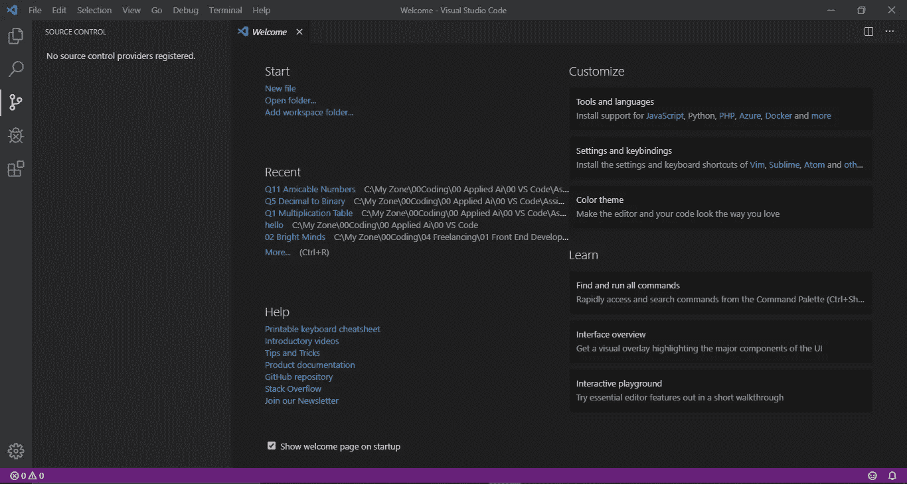

# Windows 安装

让我们从 https://git-scm.com/downloads 的[下载 git。](https://git-scm.com/downloads)

运行。从 Git 网站下载的. exe 文件。按照下面给出的镜像顺序在 Windows 10 中安装 Git。

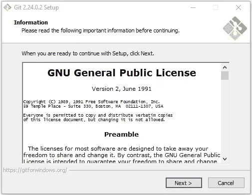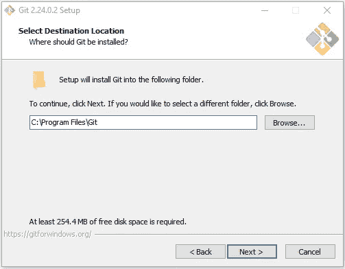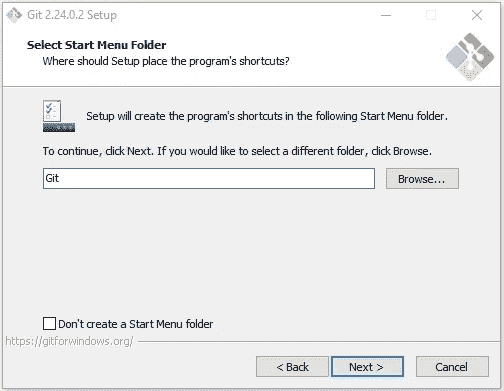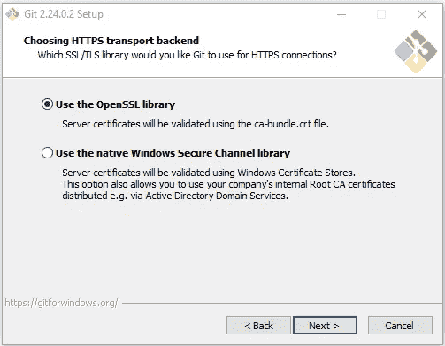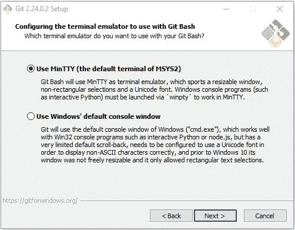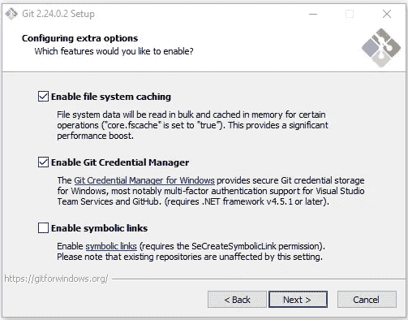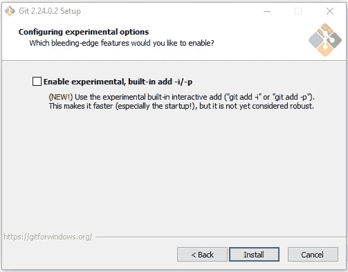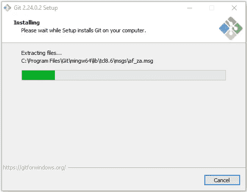

现在已经安装了 Git，让我们通过打开 Git Bash 来验证这一点。

# 使用 VS 代码从 GitHub 克隆一个 repo

**第一步:**在 GitHub 中选择一个库，点击右上角的绿色按钮**克隆或下载**。复制出现在下拉栏上的链接。

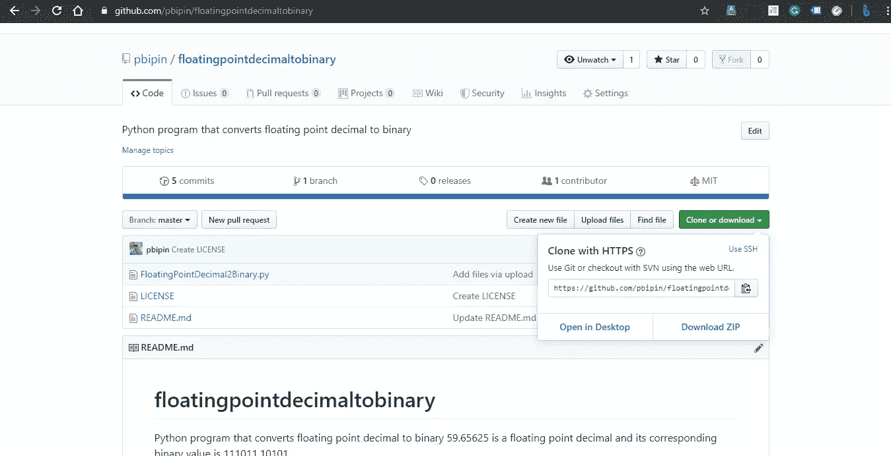

**步骤 2:** 打开 VS 代码，转到文件- >将文件夹添加到工作区…

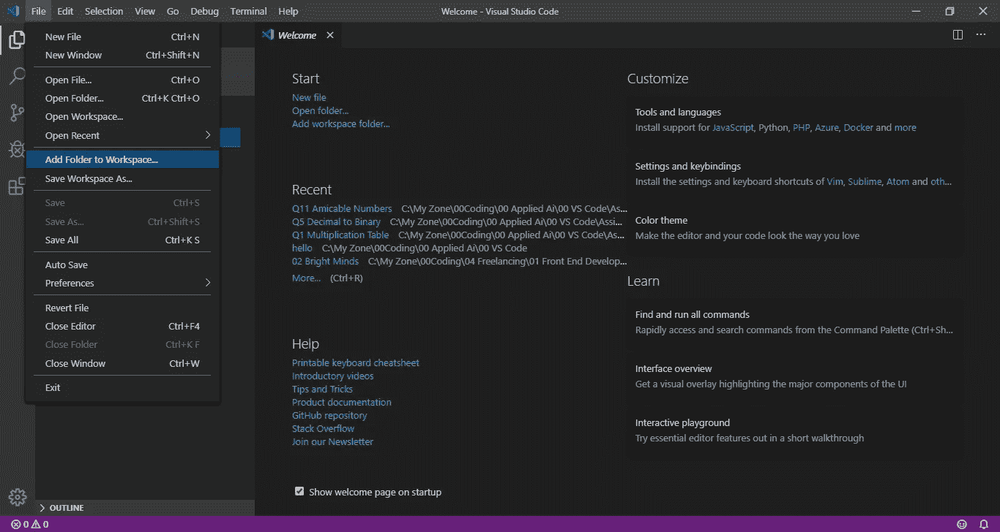

添加新创建的文件夹。

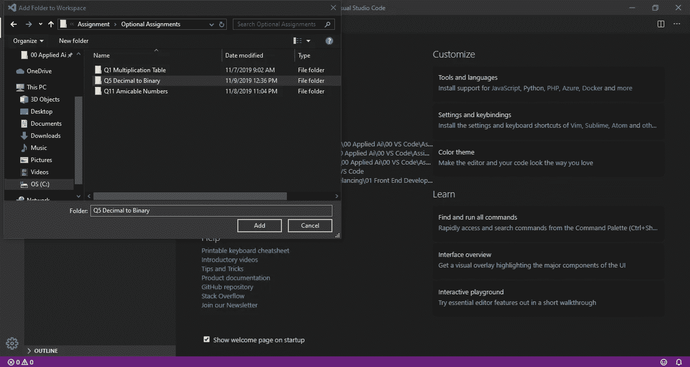

VS 代码界面将类似于下图:

**第三步:**打开终端。

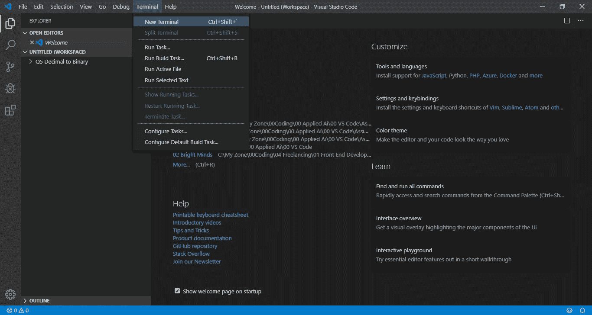

**步骤 4:** 要链接您的 GitHub 帐户，请键入***git config-global user . name<GitHub 用户 ID >***

**步骤 5:** 键入 ***git 克隆< url 在步骤 1 >*** 中从 GitHub 复制一个 repo 使用 VS 代码。

安装完成后，VS 代码用户界面将如下图所示。

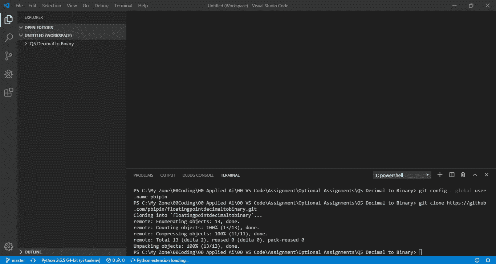

转到活动栏的源代码控制，验证 Git 是否已经正确安装。如果安装正确，UI 将类似于下图(**源代码控制:GIT** 可以在底层图像的左上角看到)。

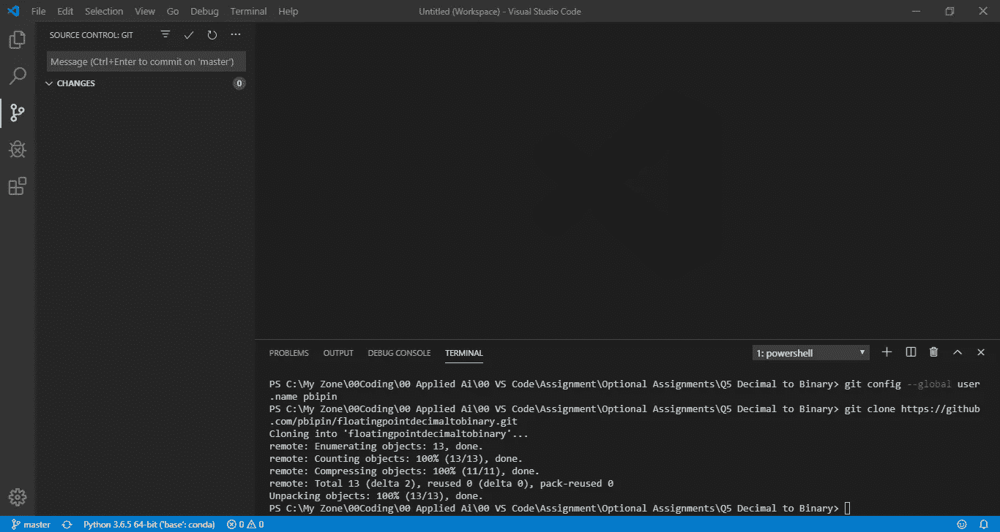

## 附加注释

要从当前工作目录(CWD)打开 VS 代码，有下面提到的两种方法:

**方法一**:打开命令提示符(Windows 键+ R >键入 cmd)。然后通过 ***cd <路径转到所需目录>***

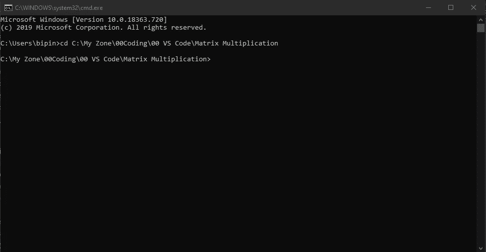

然后键入 ***代码。*** 在命令提示符下打开 VS 代码。

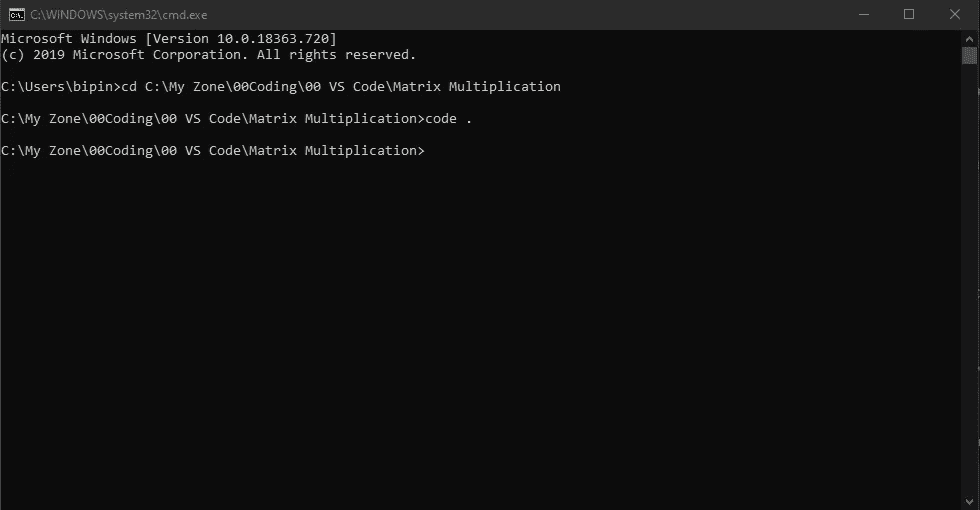

您可以通过打开终端并检查 Windows Powershell 来验证这一点。

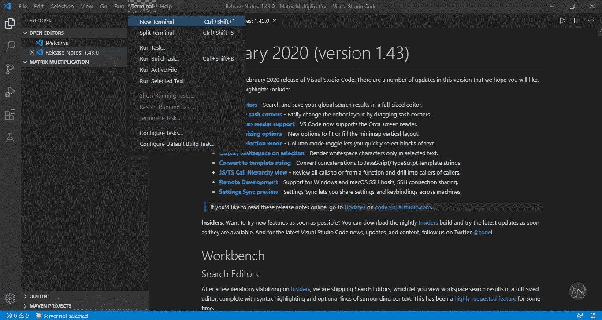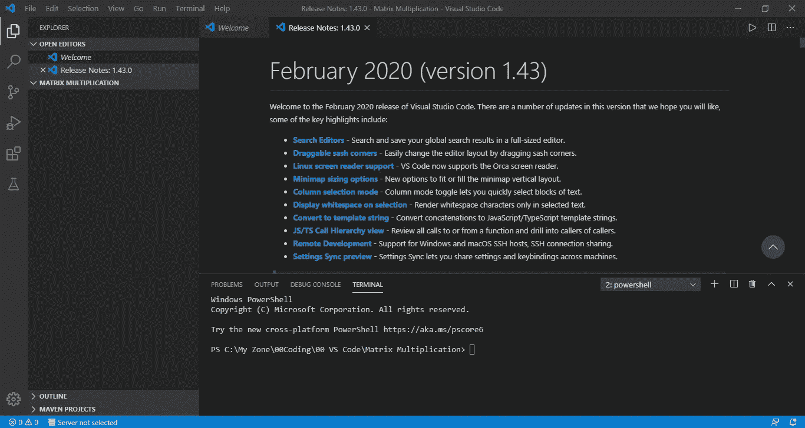

**方法二** : ***文件>打开文件夹……***

选择所需的文件夹。

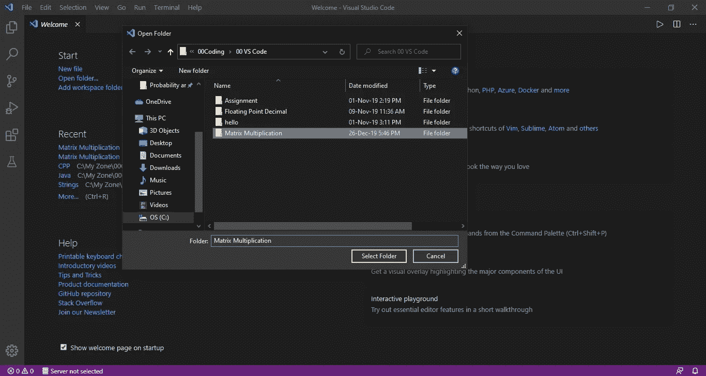

那么当前工作目录将是所选的文件夹。

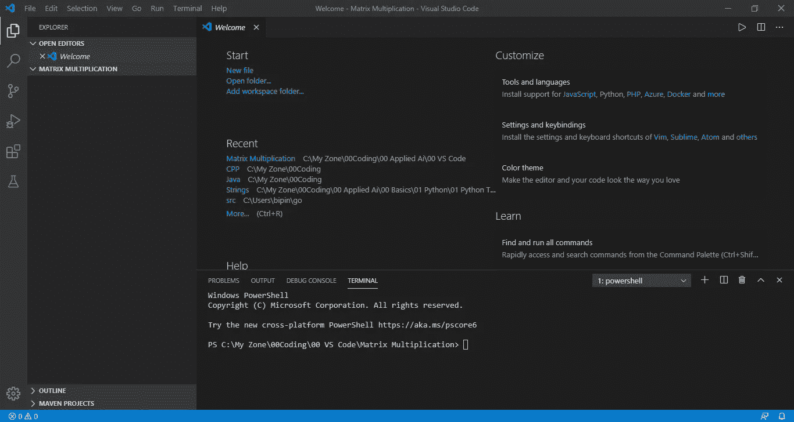

我希望这些信息对你们有所帮助。编码快乐！！！