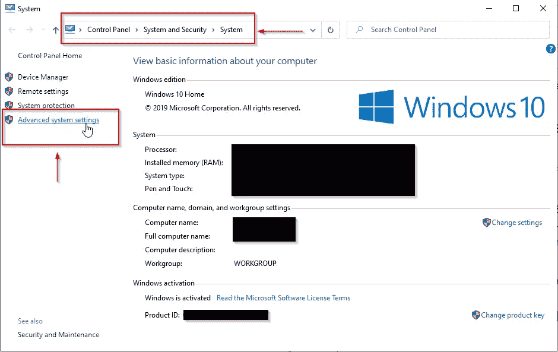
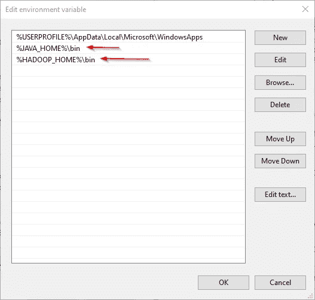
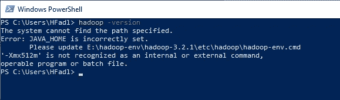

# 在 Windows 10 上安装 Hadoop 3.2.1 单节点集群

> 原文：<https://towardsdatascience.com/installing-hadoop-3-2-1-single-node-cluster-on-windows-10-ac258dd48aef?source=collection_archive---------0----------------------->

两年前在做一个[项目](https://www.researchgate.net/project/ORADIEX-A-Big-Data-driven-smart-framework-for-real-time-surveillance-and-analysis-of-individual-exposure-to-radioactive-pollution)的时候，我写了一个[在 Ubuntu 16.04](/installing-hadoop-3-1-0-multi-node-cluster-on-ubuntu-16-04-step-by-step-8d1954b31505) 操作系统上安装 Hadoop 3.1.0 的分步指南。由于我们目前正在进行一个新项目，需要在 Windows 10 上安装 Hadoop 集群，我决定为这个过程编写一个指南。

本文是我们在 TowardsDataScience.com 上发布的系列文章的一部分，旨在说明如何在 Windows 操作系统上安装大数据技术。

**本系列其他发表文章:**

*   [在 Windows 10 上安装 Apache Pig 0 . 17 . 0](/installing-apache-pig-0-17-0-on-windows-10-7b19ce61900d)
*   [在 Windows 10 上安装 Apache Hive 3 . 1 . 2](/installing-apache-hive-3-1-2-on-windows-10-70669ce79c79)

# 1.先决条件

首先，我们需要确保安装了以下先决条件:

1.Java 8 运行时环境(JRE): [Hadoop 3 需要安装 Java 8](https://cwiki.apache.org/confluence/display/HADOOP/Hadoop+Java+Versions)。我更喜欢使用离线安装程序。

2. [Java 8 开发套件(JDK)](https://www.oracle.com/java/technologies/javase-jdk8-downloads.html)

3.为了解压下载的 Hadoop 二进制文件，我们应该安装 [7zip](https://www.7-zip.org/download.html) 。

4.我将在本地机器上创建一个文件夹“E:\hadoop-env”来存储下载的文件。

# 2.下载 Hadoop 二进制文件

第一步，从[官网](https://www.apache.org/dyn/closer.cgi/hadoop/common/hadoop-3.2.1/hadoop-3.2.1.tar.gz)下载 Hadoop 二进制。二进制包的大小约为 342 MB。


图 1 — Hadoop 二进制文件下载链接

完成文件下载后，我们应该使用 7zip int 分两步解压软件包。首先，我们应该提取 hadoop-3.2.1.tar.gz 库，然后，我们应该解压缩提取的 tar 文件:


图 2 —使用 7zip 提取 hadoop-3.2.1.tar.gz 包


图 3 —提取的 hadoop-3.2.1.tar 文件


图 4 —提取 hadoop-3.2.1.tar 文件

tar 文件提取可能需要几分钟才能完成。最后，您可能会看到一些关于符号链接创建的警告。请忽略这些警告，因为它们与 windows 无关。


图 5-符号链接警告

解包后，我们要添加 Hadoop 原生 IO 库，可以在下面的 GitHub 库找到:[https://github.com/cdarlint/winutils](https://github.com/cdarlint/winutils)。

由于我们正在安装 Hadoop 3.2.1，我们应该下载位于[https://github . com/cdarlint/winutils/tree/master/Hadoop-3 . 2 . 1/bin](https://github.com/cdarlint/winutils/tree/master/hadoop-3.2.1/bin)中的文件，并将其复制到“hadoop-3.2.1\bin”目录中。

# 3.设置环境变量

安装 Hadoop 及其先决条件后，我们应该配置环境变量来定义 Hadoop 和 Java 默认路径。

要编辑环境变量，请转到控制面板>系统和安全>系统(或右键单击>我的电脑上的属性图标)，然后单击“高级系统设置”链接。



图 6 —打开高级系统设置

当“高级系统设置”对话框出现时，转到“高级”选项卡并单击位于对话框底部的“环境变量”按钮。


图 7 —高级系统设置对话框

在“环境变量”对话框中，按“新建”按钮添加一个新变量。

> 注意:在本指南中，我们将添加用户变量，因为我们是为单个用户配置 Hadoop。如果您希望为多个用户配置 Hadoop，您可以改为定义系统变量。

有两个变量需要定义:

1.JAVA_HOME: JDK 安装文件夹路径

2.HADOOP_HOME: Hadoop 安装文件夹路径


图 8 —添加 JAVA_HOME 变量


图 9 —添加 HADOOP_HOME 变量

现在，我们应该编辑 PATH 变量来添加 Java 和 Hadoop 二进制文件路径，如下图所示。


图 10 —编辑路径变量


图 11 —编辑路径变量



图 12—向 PATH 变量添加新路径

## 3.1.JAVA_HOME 设置错误

现在，让我们打开 PowerShell 并尝试运行以下命令:

```
hadoop -version
```

在本例中，由于 JAVA_HOME 路径包含空格，我收到了以下错误:

```
JAVA_HOME is incorrectly set
```



图 13 — JAVA_HOME 错误

要解决这个问题，我们应该改用 windows 8.3 路径。举个例子:

*   使用“Progra~1”而不是“程序文件”
*   使用“Progra~2”而不是“程序文件(x86)”

在将“程序文件”替换为“Progra~1”之后，我们关闭并重新打开 PowerShell，并尝试了相同的命令。如下图所示，它运行时没有错误。


图 14 — hadoop 版本命令成功执行

# 4.配置 Hadoop 集群

为了配置 Hadoop 集群，我们应该更改四个文件:

1.  % HADOOP _ HOME % \ etc \ HADOOP \ HDFS-site . XML
2.  % HADOOP _ HOME % \ etc \ HADOOP \ core-site . XML
3.  % HADOOP _ HOME % \ etc \ HADOOP \ map red-site . XML
4.  % HADOOP _ HOME % \ etc \ HADOOP \ yarn-site . XML

## 4.1.HDFS 站点配置

众所周知，Hadoop 是使用主从模式构建的。在修改 HDFS 配置文件之前，我们应该创建一个目录来存储所有主节点(名称节点)数据，并创建另一个目录来存储数据(数据节点)。在本例中，我们创建了以下目录:

*   e:\ Hadoop-env \ Hadoop-3 . 2 . 1 \ data \ DFS \ NameNode
*   e:\ Hadoop-env \ Hadoop-3 . 2 . 1 \ data \ DFS \ datanode

现在，让我们打开位于“%HADOOP_HOME%\etc\hadoop”目录中的“hdfs-site.xml”文件，我们应该在 <configuration></configuration> 元素中添加以下属性:

```
<property><name>dfs.replication</name><value>1</value></property><property><name>dfs.namenode.name.dir</name><value>file:///E:/hadoop-env/hadoop-3.2.1/data/dfs/namenode</value></property><property><name>dfs.datanode.data.dir</name><value>file:///E:/hadoop-env/hadoop-3.2.1/data/dfs/datanode</value></property>
```

> 请注意，我们已经将复制因子设置为 1，因为我们正在创建单节点集群。

## 4.2.核心站点配置

现在，我们应该配置名称节点 URL，将以下 XML 代码添加到“core-site.xml”内的 <configuration></configuration> 元素中:

```
<property><name>fs.default.name</name><value>hdfs://localhost:9820</value></property>
```

## 4.3.地图简化站点配置

现在，我们应该将下面的 XML 代码添加到“mapred-site.xml”中的 <configuration></configuration> 元素中:

```
<property><name>mapreduce.framework.name</name><value>yarn</value><description>MapReduce framework name</description></property>
```

## 4.4.纱线位置配置

现在，我们应该将下面的 XML 代码添加到“yarn-site.xml”中的 <configuration></configuration> 元素中:

```
<property><name>yarn.nodemanager.aux-services</name><value>mapreduce_shuffle</value><description>Yarn Node Manager Aux Service</description></property>
```

# 5.格式化名称节点

完成配置后，让我们尝试使用以下命令格式化名称节点:

```
hdfs namenode -format
```

由于 Hadoop 3.2.1 版本中的[错误，您将收到以下错误:](https://issues.apache.org/jira/browse/HDFS-14890)

```
2020–04–17 22:04:01,503 ERROR namenode.NameNode: Failed to start namenode.java.lang.UnsupportedOperationExceptionat java.nio.file.Files.setPosixFilePermissions(Files.java:2044)at org.apache.hadoop.hdfs.server.common.Storage$StorageDirectory.clearDirectory(Storage.java:452)at org.apache.hadoop.hdfs.server.namenode.NNStorage.format(NNStorage.java:591)at org.apache.hadoop.hdfs.server.namenode.NNStorage.format(NNStorage.java:613)at org.apache.hadoop.hdfs.server.namenode.FSImage.format(FSImage.java:188)at org.apache.hadoop.hdfs.server.namenode.NameNode.format(NameNode.java:1206)at org.apache.hadoop.hdfs.server.namenode.NameNode.createNameNode(NameNode.java:1649)at org.apache.hadoop.hdfs.server.namenode.NameNode.main(NameNode.java:1759)2020–04–17 22:04:01,511 INFO util.ExitUtil: Exiting with status 1: java.lang.UnsupportedOperationException2020–04–17 22:04:01,518 INFO namenode.NameNode: SHUTDOWN_MSG:
```

这个问题将在下一个版本中解决。目前，您可以使用以下步骤暂时修复它([参考](https://kontext.tech/column/hadoop/377/latest-hadoop-321-installation-on-windows-10-step-by-step-guide)):

1.  从[下面的链接](https://github.com/FahaoTang/big-data/blob/master/hadoop-hdfs-3.2.1.jar)下载 hadoop-hdfs-3.2.1.jar 文件。
2.  将文件夹% HADOOP _ HOME % \ share \ HADOOP \ HDFS 中的文件名 hadoop-hdfs-3.2.1.jar 重命名为 hadoop-hdfs-3.2.1.bak
3.  将下载的 hadoop-hdfs-3.2.1.jar 复制到文件夹% HADOOP _ HOME % \ share \ HADOOP \ HDFS

现在，如果我们尝试重新执行 format 命令(以管理员身份运行命令提示符或 PowerShell)，您需要批准文件系统格式。


图 15 —文件系统格式批准

并且命令成功执行:


图 16 —成功执行的命令

# 6.启动 Hadoop 服务

现在，我们将打开 PowerShell，并导航到“%HADOOP_HOME%\sbin”目录。然后，我们将运行以下命令来启动 Hadoop 节点:

```
.\start-dfs.cmd
```


图 17 —启动 Hadoop 节点

将打开两个命令提示符窗口(一个用于名称节点，一个用于数据节点)，如下所示:


图 18 — Hadoop 节点命令提示符窗口

接下来，我们必须使用以下命令启动 Hadoop Yarn 服务:

```
./start-yarn.cmd
```


图 19 —启动 Hadoop 纱线服务

将打开两个命令提示符窗口(一个用于资源管理器，一个用于节点管理器)，如下所示:


图 20—节点管理器和资源管理器命令提示符窗口

为了确保所有服务都成功启动，我们可以运行以下命令:

```
jps
```

它应该显示以下服务:

```
14560 DataNode
4960 ResourceManager
5936 NameNode
768 NodeManager
14636 Jps
```


图 21 —执行 jps 命令

# 7.Hadoop Web 用户界面

有三种网络用户界面可供使用:

*   名称节点网页:[http://localhost:9870/DFS health . html](http://localhost:9870/dfshealth.html)


图 22 —名称节点网页

*   数据节点网页:[http://localhost:9864/datanode . html](http://localhost:9864/datanode.html)


图 23 —数据节点网页

*   纱线网页:[http://localhost:8088/cluster](http://localhost:8088/cluster)


图 24 —纱线网页

# 8.参考

1.  Hadi Fadlallah，[在 Ubuntu 16.04 上逐步安装 Hadoop 3.1.0 多节点集群](/installing-hadoop-3-1-0-multi-node-cluster-on-ubuntu-16-04-step-by-step-8d1954b31505)，TowardsDataScience.com
2.  [Jozef Jarosciak](https://www.joe0.com/about-me/) ，[如何在 Windows 10 上安装 Hadoop 单节点集群](https://www.joe0.com/2017/02/02/how-to-install-a-hadoop-single-node-cluster-on-windows-10/)
3.  Raymond Tang，[在 Windows 10 上安装 Hadoop 3.2.1 分步指南](https://kontext.tech/column/hadoop/377/latest-hadoop-321-installation-on-windows-10-step-by-step-guide)，kontext.tech
4.  [栈溢出问答网站](http://www.stackoverflow.com)