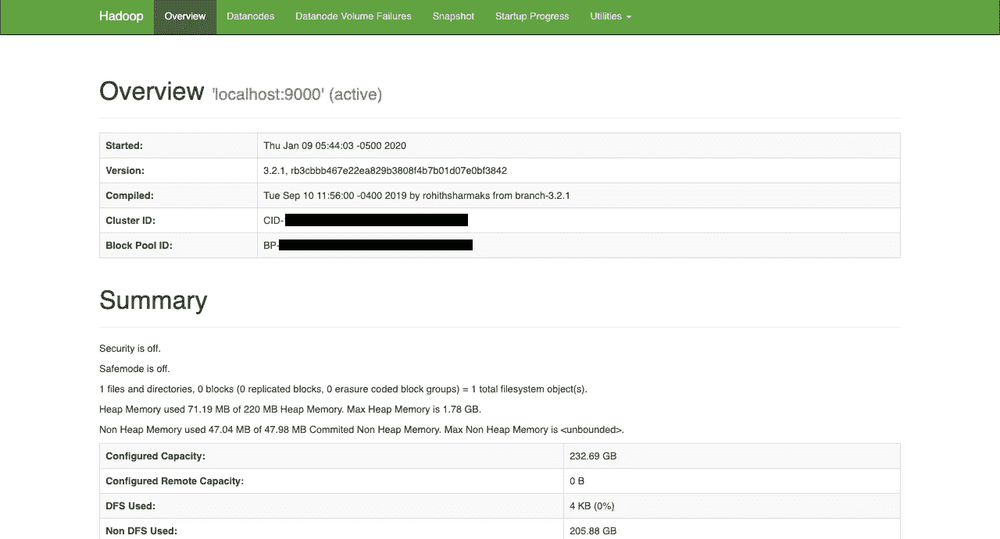

# 在 Mac 上安装 Hadoop

> 原文：<https://towardsdatascience.com/installing-hadoop-on-a-mac-ec01c67b003c?source=collection_archive---------2----------------------->

## 你需要的唯一向导！


马库斯·斯皮斯克在 [Unsplash](https://unsplash.com?utm_source=medium&utm_medium=referral) 上的照片

难道是你和 Hadoop 之间唯一的障碍，只是想知道如何在 Mac 上安装它吗？一个快速的互联网搜索会告诉你缺乏关于这个相当简单的过程的信息。在这个简短的教程中，我将向您展示如何在伪分布式模式下使用单节点集群的终端在一个 **macOS Mojave** (版本 **10.14.6** )上非常容易地安装 **Hadoop 3.2.1** 。

首先，您需要安装几个需要放在适当目录中的包。 [**家酿**网站](https://brew.sh/)让这个任务变得非常简单，自动确定你的机器上需要什么，安装正确的目录并把它们的文件符号链接到/user/local。其他文档也可以在他们的网站上找到。

# 安装自制软件

复制页面顶部的命令并粘贴到新的终端窗口中。将会通知您将要安装的内容。按回车键启动该过程:

```
$ /usr/bin/ruby -e "$(curl -fsSL https://raw.githubusercontent.com/Homebrew/install/master/install)"
```

确认您的机器上有正确的 java 版本(版本 8)。如果它返回的不是 1.8。，请确保安装正确的版本。

```
$ java -version$ brew cask install homebrew/cask-versions/adoptopenjdk8
```

# 安装 Hadoop

接下来，您将在以下路径安装最新版本的 Hadoop:/usr/local/Cellar/Hadoop。在撰写本文时，这恰好是 3.2.1:

```
$ brew install hadoop
```

# 配置 Hadoop

配置 Hadoop 需要几个步骤。关于设置单节点集群的更详细版本可以在 [**Apache Hadoop 文档**](https://hadoop.apache.org/docs/stable/hadoop-project-dist/hadoop-common/SingleCluster.html) 中找到。(确保遵循机器上安装的正确版本。)

1.  更新**环境变量设置**
2.  对 **core** -、 **hdfs** -、 **mapred** -和 **yarn** -site.xml 文件进行更改
3.  取消**密码**要求(如有必要)
4.  格式**命名节点**

打开包含环境变量设置的文档:

```
$ cd /usr/local/cellar/hadoop/3.2.1/libexec/etc/hadoop
$ open hadoop-env.sh
```

对文档进行以下更改，保存并关闭。

## 添加导出 JAVA_HOME 的位置

export JAVA _ HOME = "/Library/JAVA/JAVA virtual machines/adopt open JDK-8 . JDK/Contents/HOME "

您可以通过在终端窗口中使用以下代码来找到此路径:

```
$ /usr/libexec/java_home
```

## 替换导出 HADOOP_OPTS 的信息

更改导出 HADOOP _ OPTS = "-DJ ava . net . preferipv 4 stack = true "

要导出 HADOOP _ OPTS = "-djava . net . preferipv 4 stack = true-djava . security . krb5 . realm =-djava . security . krb5 . KDC = "

## 对核心文件进行更改

```
$ open core-site.xml<configuration>
  <property>
    <name>fs.defaultFS</name>
    <value>hdfs://localhost:9000</value>
  </property>
</configuration>
```

## 对 hdfs 文件进行更改

```
$ open hdfs-site.xml<configuration>
  <property>
    <name>dfs.replication</name>
    <value>1</value>
  </property>
</configuration>
```

## 对映射的文件进行更改

```
$ open mapred-site.xml<configuration>
  <property>
    <name>mapreduce.framework.name</name>
    <value>yarn</value>
  </property>
  <property>
    <name>mapreduce.application.classpath</name>   <value>$HADOOP_MAPRED_HOME/share/hadoop/mapreduce/*:$HADOOP_MAPRED_HOME/share/hadoop/mapreduce/lib/*</value>
  </property>
</configuration>
```

## 对纱线文件进行更改

```
$ open yarn-site.xml
```

 <configuration><属性>
<名称>YARN . nodemanager . aux-services</名称>
<值>MapReduce _ shuffle</值>
</属性>
<属性>
<名称>YARN . nodemanager . env-whitelist</名称>

值【JAVA _ JAVA</configuration>

## 删除密码要求

在进入下一步之前，检查您是否能够在没有密码的情况下进行 ssh，以防止格式化 NameNode 时出现意外结果。

```
$ ssh localhost
```

如果这没有返回上次登录时间，请使用以下命令来消除插入密码的需要。

```
$ ssh-keygen -t rsa -P '' -f ~/.ssh/id_rsa
$ cat ~/.ssh/id_rsa.pub >> ~/.ssh/authorized_keys
$ chmod 0600 ~/.ssh/authorized_keys
```

## 格式化 NameNode

```
$ cd /usr/local/cellar/hadoop/3.2.1/libexec/bin
$ hdfs namenode -format
```

一条警告将告诉您正在创建日志目录。系统将提示您重新格式化存储目录根目录中的文件系统。说出 **Y** 并按下**返回**。

# 运行 Hadoop

```
$ cd /usr/local/cellar/hadoop/3.2.1/libexec/sbin
$ ./start-all.sh
$ jps
```

运行 jps 后，您应该确认 Hadoop 的所有部分都已安装并运行。您应该会看到类似这样的内容:

```
66896 ResourceManager
66692 SecondaryNameNode
66535 DataNode
67350 Jps
66422 NameNode67005 NodeManager
```

打开 web 浏览器查看当前会话的配置。

[http://localhost:9870](http://localhost:9870)



关于您当前 Hadoop 会话的信息。

# 关闭 Hadoop

全部完成后关闭 Hadoop。

```
$ ./stop-all.sh
```

我希望这篇短文已经帮助你克服了在 macOS 机器上安装 Hadoop 的障碍！

请在 [LinkedIn](https://www.linkedin.com/in/SiphuLangeni) 上联系我！