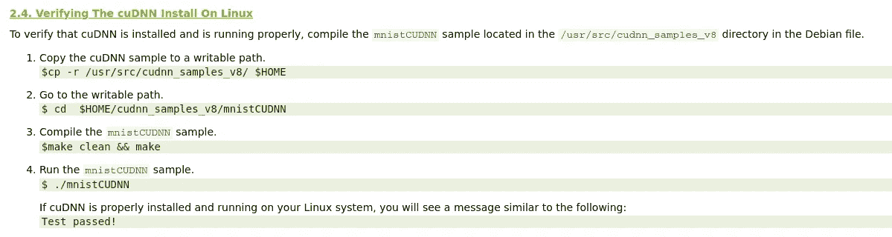
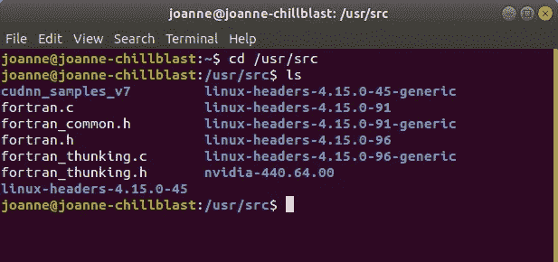
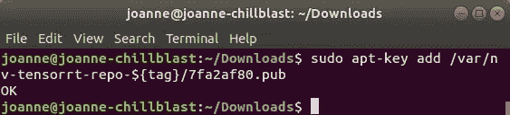
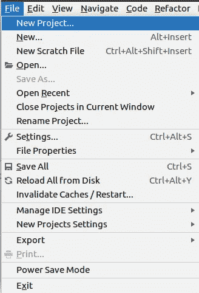

# 如何在有 GPU 支持的 Ubuntu 18.04 LTS 上安装 tensor flow 2.1:Nvidia 驱动，CUDA 10，cuDNN

> 原文：<https://towardsdatascience.com/installing-nvidia-drivers-cuda-10-cudnn-for-tensorflow-2-1-on-ubuntu-18-04-lts-f1db8bff9ea?source=collection_archive---------6----------------------->

## 为深度学习系列提升您的 PC——第 4 部分

# 介绍

在本系列的第 1 部分中，我讨论了如何升级你的电脑硬件来整合 CUDA Toolkit 兼容图形处理卡，我安装了一个 Nvidia GTX 1060 6GB。[本系列的第 2 部分](/installing-tensorflow-with-cuda-cudnn-and-gpu-support-on-windows-10-60693e46e781)讲述了在 Windows 10 上安装 CUDA、cuDNN 和 Tensorflow。在第 3 部分中，我从我的电脑上删除了 Windows 10，并从一张可启动的 DVD 上安装了 Ubuntu 18.04 LTS。

在本系列的第 4 部分，我正在为 Nvidia GPU 安装驱动程序，这些驱动程序与我希望安装在 Ubuntu 18.04 上的 CUDA Toolkit、cuDNN 和 Tensorflow 版本兼容，即 tensor flow 2.1——这需要 CUDA 10.1 或更高版本。在这样做的时候，在我的情况下，这也涉及到处理我的*当前*安装的 Nvidia 驱动程序、CUDA、cuDNN 和 Tensorflow(细节在步骤 1 中列出)。

# 步骤 1:检查要安装的驱动程序和软件版本是否与 Tensorflow 2.1 兼容

您选择的 Tensorflow 版本将决定 CUDA、cuDNN、编译器、工具链的兼容版本以及要安装的 Nvidia 驱动程序版本。因此，在安装 Nvidia 驱动程序、CUDA、cuDNN 以及 Tensorflow 2.1 之前，我会"*先想好最终目标*"，首先检查与我的 Tensorflow 目标版本兼容的正确软件版本。

根据 [Tensorflow 网站](https://www.tensorflow.org/install/gpu#install_cuda_with_apt)和 [CUDA 安装指南](https://docs.nvidia.com/cuda/cuda-installation-guide-linux/index.html#pre-installation-actions):

*   NVIDIA GPU 驱动程序— CUDA 10.1 要求 418.x 或更高版本。
*   [CUDA 工具包](https://developer.nvidia.com/cuda-toolkit-archive) — TensorFlow 支持 CUDA 10.1 (TensorFlow > = 2.1.0)。Tensorflow 1.13 及以上需要 CUDA 10。我希望能够在 1.13-2.1 之间安装各种版本的 Tensorflow(带 GPU 支持)，因此 CUDA 10.1 是绝对需要的
*   [CUPTI](http://docs.nvidia.com/cuda/cupti/) (附带 CUDA 工具包)
*   g++编译器和工具链
*   [cuDNN SDK](https://developer.nvidia.com/cudnn) ( > = 7.6)
*   *(可选)* [TensorRT 6.0](https://docs.nvidia.com/deeplearning/sdk/tensorrt-install-guide/index.html) 提高某些模型上推理的延迟和吞吐量。

当我之前在这台 Ubuntu 18.04 机器上安装 Tensorflow 时，只有 Tensorflow 1.12/CUDA 9 可用，CUDA 10 还不兼容 Tensorflow。因此，在完成下面的新步骤之前，我已经在该计算机上安装了以下内容:

*   Tensorflow 版本 1.12
*   CUDA 工具包版本 9.0
*   7.2 版 cuDNN，Tensorflow 版需要
*   gcc 和 g++编译器和工具链
*   NVIDIA GPU 驱动程序 390.132 (CUDA 9.0 需要 384.x 或更高版本)

# 步骤 2:CUDA 安装前:检查现有安装

在开始 CUDA 下载和安装之前，请在 Nvidia CUDA 网站上进行建议的检查[此处](https://docs.nvidia.com/cuda/cuda-installation-guide-linux/index.html#ubuntu-installation):

*   验证系统是否具有支持 CUDA 的 GPU
*   验证系统运行的是支持的 Linux 版本。
*   验证系统是否安装了 gcc。
*   验证系统是否安装了正确的内核头文件和开发包。

**步骤 2.1:检查系统是否有支持 CUDA 的 GPU**

在 Ubuntu 终端中运行以下命令来检查您的图形卡(GPU):

```
lspci | grep -i nvidia
```


图 2.1:检查安装的图形卡(GPU)版本

如果您的显卡来自 NVIDIA，并且在此处[列出](http://developer.nvidia.com/cuda-gpus)，则您的 GPU 支持 CUDA。

**步骤 2.2:检查您即将安装的 CUDA 是否支持您的 linux 版本**

使用以下命令检查您的系统版本:

```
uname -m && cat /etc/*release
```


图 2.2:使用终端检查系统版本

当您获得与您系统版本相关的结果时，您可以查看 CUDA 在线文档以确保该版本受支持。

**步骤 2.3:检查 gcc 安装**

```
gcc --version
```


图 2.3:检查 gcc 安装(CUDA 所需)

**步骤 2.4:检查 Ubuntu 系统是否有正确的内核头文件，开发包是否已安装**

您的系统正在运行的内核版本可以通过运行以下命令找到:

```
uname -r
```


图 2.4:检查系统的内核头

对于 Ubuntu，当前运行的内核的内核头文件和开发包可以安装在:

```
# my current kernel header is 4.15.0-99-generic, yours may differ
uname_r =”4.15.0-99-generic” 
sudo apt-get install linux-headers-${uname_r}
```


图 2.5:为当前运行的内核安装内核头文件和开发包

**步骤 2.5:检查任何当前的 Nvidia 驱动程序**

您还可以通过运行“nvidia-smi”命令来检查您当前使用的 Nvidia GPU 驱动程序(如果有),您可以看到，最初，我使用的是 Nvidia 驱动程序 390.132:


图 2.6:开始升级前运行命令检查当前 GPU 驱动程序

# 步骤 3:下载 NVIDIA 软件包仓库

接下来，下载 Nvidia 软件包库。这些命令基于来自 [Tensorflow 网站](https://www.tensorflow.org/install/gpu#install_cuda_with_apt)的添加 Nvidia 包存储库的指令。从下载 CUDA 10.1 开始。deb 文件，方法是在 Ubuntu 18.04 机器上的 bash 终端中键入以下内容:

```
wget https://developer.download.nvidia.com/compute/cuda/repos/ubuntu1804/x86_64/cuda-repo-ubuntu1804_10.1.243-1_amd64.deb
```


图 3.1:下载 CUDA 10.1。deb 文件

接下来，拿钥匙:

```
sudo apt-key adv --fetch-keys https://developer.download.nvidia.com/compute/cuda/repos/ubuntu1804/x86_64/7fa2af80.pub
```


图 3.2:从 Nvidia 网站获取密钥

然后安装 CUDA 10.1。64 位 Ubuntu 18.04 的 deb 文件:

```
sudo dpkg -i cuda-repo-ubuntu1804_10.1.243-1_amd64.deb 
```


图 3.3:安装 CUDA 10.1 deb 文件

运行更新软件包命令下载各种软件包的更新版本:

```
sudo apt-get update
```


图 3.4:更新软件包命令以获得最新版本

获取更多适用于 CUDA 10.1 的 Nvidia 软件包库(根据 [Tensorflow 网站](https://www.tensorflow.org/install/gpu#install_cuda_with_apt)上的命令):

```
wget http://developer.download.nvidia.com/compute/machine-learning/repos/ubuntu1804/x86_64/nvidia-machine-learning-repo-ubuntu1804_1.0.0-1_amd64.deb
```


图 3.5:获取更多的 Nvidia 软件包库

一旦下载了 Nvidia 软件包库，安装 Nvidia。带权限的 deb 包(sudo):

```
sudo apt install ./nvidia-machine-learning-repo-ubuntu1804_1.0.0-1_amd64.deb
```


图 3.6:安装。带权限的 deb 包

并再次更新软件包:

```
sudo apt-get update
```


图 3.7:再次更新软件包

# 步骤 4:安装 NVIDIA 驱动程序版本 430

我已经安装了 NVIDIA 驱动程序版本 390；安装 nvidia 驱动程序版本 430。

```
sudo apt-get install --no-install-recommends nvidia-driver-430
```


图 4.1:首次尝试安装 nvidia 驱动程序 430

我得到消息说我的系统有未满足的依赖项，因此我通过使用以下命令删除 PPA 来解决这个问题(注意:-r 表示删除):

```
sudo apt-add-repository -r ppa:graphics-drivers/ppa 
```


图 4.2:删除 PPA 的命令

确保包列表是最新的:

```
sudo apt update
```

删除所有现有的 nvidia 驱动程序:

```
sudo apt-get remove --purge '^nvidia-.*'
```


图 4.3:删除现有的 nvidia 驱动程序

然后尝试重新安装 Nvidia 驱动程序版本 430:

```
sudo apt-get install --no-install-recommends nvidia-driver-430
```

全新的 Nvidia 版本 430 驱动程序安装给出了下面的输出，并成功完成。


图 4.4:NVIDIA 驱动程序版本 430 的全新安装

***一旦你安装了 nvidia 驱动 430，关闭并重启你的电脑。***

# 步骤 5:检查新的 Nvidia GPU 驱动程序安装

在 bash 终端中使用以下命令检查新的 GPU 驱动程序是否可见:

```
nvidia-smi
```

该命令的输出如下所示，将确认新的 Nvidia 驱动程序版本是 430.50。请注意，CUDA 版本现在是 10.1(如上所述):


图 5.1:检查 Nvidia 驱动程序 430.50 是否已成功安装

# 步骤 6:安装 CUDA 10.1 和 CuDNN 开发和运行时库

为了安装 CUDA 和 cuDNN 开发和运行时库，Tensorflow 安装页面建议使用以下命令:

第一，安装 CUDA 10.1 运行时，下载、解压缩和安装大约需要 20-30 分钟:

```
# Install development and runtime libraries (~4GB)
sudo apt-get install --no-install-recommends cuda-10-1 
```


图 6.1:安装 CUDA 10.1(显示终端输出的第一部分)

请注意，在终端打印输出中，有一个“重新启动计算机并验证 NVIDIA 图形驱动程序是否可以加载”的指令(图 6.2)。


图 6.2:重新启动计算机并验证 NVIDIA 图形驱动程序的说明

安装信息如下所示(图 6.3)


图 6.3:完成 CUDA 10.1 的安装

# 第 7 步:重新启动计算机(按照上述说明)并检查驱动程序版本

重启计算机(按照图 6.2 中的说明)。重新启动后，运行以下命令再次检查驱动程序的安装:

```
nvidia-smi
```


图 7.1:安装/更新驱动程序后检查已安装的 Nvidia 驱动程序

请注意，重启后，NVIDIA 驱动程序(*意外地*)升级到版本 440.64.00，CUDA 版本从版本 **10.1** 升级到版本 **10.2，**，如图 7.1 所示。因此，我为 CUDA 10.2 选择了合适的 cuDNN 用于下面的说明。

# 步骤 8:为 Ubuntu 18.04 下载 CuDNN

你可以从[这里](https://developer.nvidia.com/cudnn)下载 cuDNN。以下是我下载 cuDNN 文件的步骤。


图 8.1:可以下载 cuDNN 的 Nvidia 网站截图

您必须注册才能下载 cuDNN(免费),登录截图如图 8.2 所示:


图 8.2:截图来自 Nvidia 网站:下载 cuDNN 必须登录

登录后，您将进入 cuDNN 下载页面:


图 8.3:登录 Nvidia cuDNN 网站时可用的 cuDNN 下载选项

要获得 v.7.6.4 或任何其他稍旧的 cuDNN 版本，请单击图 8.3 所示的“存档的 cuDNN 版本”。由于我的机器上似乎安装了 CUDA 10.2(而不是 CUDA 10.1)，所以我为 CUDA 10.2 选择了合适的 cuDNN 库。这是 cuDNN 版本 7.6.5:


图 8.4:Nvidia cud nn 网站截图——下载 cuDNN 7.6.5 时不同操作系统的选项

从图 8.4 中，从列表中选择以下三项:

*   Ubuntu 18.04 的 cuDNN 运行时库(Deb)
*   适用于 Ubuntu 18.04 的 cuDNN 开发人员库(Deb)
*   适用于 Ubuntu 18.04 (Deb)的 cuDNN 代码示例和用户指南—可选

这给出了以下内容。要下载的 deb 包:


图 8.5:Ubuntu 的 cuDNN 运行时库。deb 包


图 8.6:Ubuntu 18.04 的 cuDNN 开发者库。deb 下载


图 8.7:Ubuntu 18.04 的 cuDNN 代码样本和用户指南。deb 下载

# 步骤 9:为 Ubuntu 18.04 安装 CuDNN

为了安装 cuDNN，说明可从 [tensorflow 网站](https://www.tensorflow.org/install/gpu)获得一些说明，更详细的 cuDNN 库命令见 [cuDNN 安装指南](https://docs.nvidia.com/deeplearning/sdk/cudnn-install/index.html#installlinux-deb)。下面是一个截图:


图 9.1:[Nvidia 网站](https://docs.nvidia.com/deeplearning/sdk/cudnn-install/index.html#installlinux-deb)上 cuDNN 安装指南的截图

```
# change directory to where the cuDNN runtime library is downloaded 
cd ~/Downloads# Install cuDNN runtime library
sudo dpkg -i libcudnn7_7.6.5.32-1+cuda10.2_amd64.deb# Install cuDNN developer library
sudo dpkg -i libcudnn7-dev_7.6.5.32-1+cuda10.2_amd64.deb# (optional) install code samples and the cuDNN library documentation
sudo dpkg -i libcudnn7-doc_7.6.5.32-1+cuda10.2_amd64.deb
```


图 9.2:安装 cuDNN 运行时库


图 9.3:安装 cuDNN 开发人员库


图 9.4:安装代码示例和 cuDNN 库文档

# 步骤 10:测试 cuDNN 安装

在第 9 步下载了与 cuDNN 相关的内容之后，第 10 步将测试新的 cuDNN 安装。测试 cuDNN 安装的命令包含在 [cuDNN 安装指南](https://docs.nvidia.com/deeplearning/sdk/cudnn-install/index.html#installlinux-deb)中:



图 10.1:验证 cuDNN 安装的步骤截图，在这里找到了

应用 cuDNN 安装指南中的，通过编译位于/usr/scr/cudnn_samples_v7 中的 mnistCUDNN 示例(由 Debian 安装)来验证 cuDNN 是否已正确安装和运行。deb)文件。

当您安装了。deb 文件，您可以通过转到/usr/src 文件夹找到下面的示例，在那里您可以看到“cudnn_samples_v7”(图 10.1):



图 10.2:将目录更改为“/usr/src/”，其中可以找到 cudnn_samples_v7

然后将 cudnn_samples_v7 文件夹复制到 home，如图 10.1 所示:


图 10.3:将 cuDNN v7 示例从那里复制到主文件夹

将 samples 文件夹复制到主文件夹(您可以在那里运行它们)后，将目录切换到 mnistCUDNN 文件夹，并运行以下代码来编译 mnistCUDNN 示例:

```
make clean && make
```

该命令的输出如图 9.8 所示:


图 10.4:编译 mnistCUDNN 示例后的输出

然后使用以下命令在 mnishCUDNN 文件夹中运行 mnistCUDNN 示例:

```
./mnistCUDNN
```


图 10.5:运行 mnistCUDNN 示例后的输出——“测试通过！”

当您运行 mnistCUDNN 示例时，成功的运行应该以“Test passed！”连同分类结果，如图 10.4 所示。

# **步骤 11:下载 Tensorflow RT**

作为软件需求的一部分列出的最后一个包是 ***可选的*** Tensorflow RT，可以下载并安装该包，“以提高某些模型上推理的延迟和吞吐量”。

Tensorflow RT 的安装说明在 Tensorflow 自己的网站[这里](https://www.tensorflow.org/install/gpu)有概述，但是关于不同操作系统的 tensorflow RT 安装的更详细的说明和更清晰的信息，包括我正在使用的 Linux Debian，可以在这里找到[。](https://docs.nvidia.com/deeplearning/sdk/tensorrt-install-guide/index.html#installing-debian)


图 11.1:从[深度学习 sdk 文档](https://docs.nvidia.com/deeplearning/sdk/tensorrt-install-guide/index.html#installing-debian)安装 TensorRT 的说明

点击图 11.1 中的“下载”将带您进入图 11.2 所示的屏幕截图页面(注意，您必须免费注册 cuDNN，并使用您在上面 cuDNN 中使用的 Nvidia 开发人员凭据再次登录，以便下载 TensorRT):


图 11.2:登录并下载 TensorRT

这将带您进入下一页(图 11.3)，其中显示了可用的 TensorRT 版本。按照步骤 1 中 Tensorflow 的建议，我选择下载 TensorRT 6。


图 11.3:选择要下载的 tensort 版本(我选择了 TensorRT 6)

选择 TensorRT 6.0 后，这提供了更多下载选择，如图 11.4 所示:


图 11.4:各种 Ubuntu 和 CUDA 版本的 TensorRT 选择

我将为 Ubuntu 1804 和 CUDA 10.2 选择 TensorRT 6.0.1.8 GA。deb 本地回购包(在上面的步骤中，我的系统从 10.1 升级到了 CUDA 10.2)。


图 11.5:为 Ubuntu 1804 和 CUDA 10.2 下载坦索特 6.0.1.8 GA。债券本地回购包

您可以检查已安装的 CUDA 版本，如下所示:


图 11.6:检查已安装的 CUDA 版本

图 11.6 显示我有 CUDA 9.0，CUDA 10.1，CUDA 10.2 (CUDA 10.2 是最后安装的)。基于这篇名为 [MultiCUDA](https://medium.com/@peterjussi/multicuda-multiple-versions-of-cuda-on-one-machine-4b6ccda6faae) : [一机多版本 CUDA](https://medium.com/@peterjussi/multicuda-multiple-versions-of-cuda-on-one-machine-4b6ccda6faae)的优秀文章，多个版本的 CUDA 可以并存。它说“*安装多个版本不会导致任何以前的版本被覆盖，所以没有必要担心。您安装的每个版本都将覆盖导致操作系统使用某个版本的配置，但是默认情况下，它们都按照版本号安装在/usr/local 下的单独目录中。*

因此，我保留了 CUDA 的所有三个版本——首先将使用 CUDA 10.2。

# 步骤 12:安装 Tensorflow RT

安装 Tensorflow RT 的注意事项在 Nvidia 网站[这里](https://docs.nvidia.com/deeplearning/sdk/tensorrt-install-guide/index.html#installing-debian)。


图 12.1:为 Debian 安装 TensorRT 指令(。deb 文件)——在这里找到了

我正在安装。Tensorflow RT 的 deb 版本，如上图 12.1 所示，自动安装依赖项。安装 Tensorflow RT 的版本独立说明如下:

```
os=”ubuntu1x04”
tag=”cudax.x-trt7.x.x.x-ea-yyyymmdd”
sudo dpkg -i nv-tensorrt-repo-${os}-${tag}_1-1_amd64.deb
sudo apt-key add /var/nv-tensorrt-repo-${tag}/7fa2af80.pub

sudo apt-get update
sudo apt-get install tensorrt
```

的。我下载的 TensorRT 的 deb 文件是“NV-tensor rt-repo-Ubuntu 1804-cuda 10.2-TRT 6 . 0 . 1 . 8-ga-2019 11 08 _ 1–1 _ amd64 . deb”，我已经下载到“下载”中。

对于我的操作系统和 CUDA“标签”,这些安装说明变成:

```
# change directory to where you have downloaded the .deb file 
# (in my case, downloads)
cd ~/Downloads# specific instructions for nv-tensorrt-repo-ubuntu1804-cuda10.2-trt6.0.1.8-ga-20191108_1–1_amd64.deb os=”ubuntu1804”
tag=”cuda10.2-trt6.0.1.8-ga-20191108”
sudo dpkg -i nv-tensorrt-repo-${os}-${tag}_1-1_amd64.debsudo apt-key add /var/nv-tensorrt-repo-${tag}/7fa2af80.pub
```

转到下载文件夹并安装 TensorflowRT。deb 文件显示在图 12.2 的终端中。


图 12.2:运行 TensorRT 包



图 12.3:为 TensorRT 安装添加密钥

添加 TensorRT 安装的密钥后，最后，更新软件包，并安装 Tensor RT。这将需要几分钟时间。在 tensor RT 安装过程中，系统会提示您输入“y/n”答案，您可以通过在安装命令中添加一个“-y”标志来预先设置。

```
sudo apt-get update#install tensor rt - optionally add a '-y' flag at the end of the command below to pre-empt the prompt sudo apt-get install tensorrt -y
```


图 12.4:安装 TensorRT

根据此处的指令[，使用以下命令:](https://docs.nvidia.com/deeplearning/sdk/tensorrt-install-guide/index.html#installing-debian)

```
sudo apt-get install python3-libnvinfer-dev
```


图 12.5:安装 python3-libnvinfer-dev 包(TensorRT 的一部分)

如果您计划将 TensorRT 与 TensorFlow 一起使用，请运行以下命令:

```
sudo apt-get install uff-converter-tf
```


图 12.6:运行命令以使用 Tensorflow 启用 TensorRT

使用以下命令验证 TensorRT 安装

```
dpkg -l | grep TensorRT
```


图 12.7:检查 TensorRT 安装

# 步骤 13:安装 Tensorflow(推荐:在虚拟环境中安装)

到目前为止，我执行的每一个安装步骤(如上所述)都是系统范围的安装。您 ***可以*** 在类似的系统范围基础上安装 Tensorflow，但更可取的是 ***将其安装在虚拟环境*** 中，这样它会在无意中安装/卸载(或通常干扰)其他包时停止您的 Tensorflow 安装。

这一步使用命令行和 Pycharm IDE 在新的虚拟环境中进行安装，但是您可以使用自己喜欢的方法创建一个虚拟环境。在虚拟环境中安装 Tensorflow 2 的命令是[这里是](https://www.tensorflow.org/install/pip#virtualenv-install)。从 Tensorflow 版本[X]开始，CPU 和 GPU 支持的版本没有单独的安装命令。

## **步骤 13.1:用虚拟环境建立一个新的 Pycharm 项目**

我在 Pycharm 中创建了一个说明性的项目来展示虚拟环境的最初创建。Pycharm 的版本是社区版 2020.1.1。

首先在 Pycharm 中创建一个新的(演示)项目，使用 File -> New Project，如图 13.1 所示



图 13.1:在 Pycharm 中创建新项目

这将产生一个在虚拟环境中创建项目的窗口，如图 13.2 所示


图 13.2:使用 Pycharm 在虚拟环境中创建新项目

图 13.2 中的窗口给出了命名新项目的选项。如果您单击“项目解释器”左侧的箭头，它会提供如图 13.3 所示的选项。


图 13.3:在 pycharm 中设置新的环境设置

在位置框中将项目命名为“example_tf_2”会对窗口进行更改，如图 13.4 所示


图 13.4:创建一个名为 example _ TF _ 2(tensor flow 2 的缩写)的新项目

当您单击“创建”来创建新项目时，会出现图 13.5 所示的窗口:


图 13.5:显示新项目的选项

我选择“attach ”,将这个新项目添加到我已经打开的 Pycharm 中其他项目的下拉列表中。这将创建一个名为“example_tf_2”的新项目文件夹；请注意，它有一个“venv”文件夹。


图 13.6:py charm 中的新项目结构，包括 venv 文件夹

在 Pycharm 查看器(终端)的底部窗口中，将目录更改为相关目录(在本例中，新的项目目录是“example_tf_2”)。)


图 pycharm 中的终端显示了到新 example_tf_2 项目的路径

在命令行中使用以下命令激活新的虚拟环境(称为“venv”):

```
source venv/bin/activate 
```

如果你把你的虚拟环境叫做别的东西，比如‘myvenv’，那么相应的命令*将改为*:

```
source myvenv/bin/activate
```

当您运行激活命令时，命令行开始显示“(venv)”，这意味着虚拟环境已经被激活。


图 13.8:在 Pycharm 上激活终端内的虚拟环境

## 步骤 13.2:在虚拟环境中安装 Tensorflow 2

要在此虚拟环境中安装 Tensorflow，请在命令行窗口中运行以下 pip 命令(在 Pycharm 或您自己的终端中):

```
# choosing 'tensorflow' without specifying the version installs the # latest stable version of tensorflow (here, version 2.1.0)
# the command prompt should read something like:
# (venv) /your/particular/path$
# installs latest stable version of tensorflow, with GPU or CPU supportpip install tensorflow
```


图 13.9:使用 Pycharm 中的终端在新的虚拟环境中安装 Tensorflow 2.1

在虚拟环境中完成 Tensorflow 2.1.0 的安装后，终端将返回到命令提示符“$”:


图 13.10:在虚拟环境中安装 Tensorflow 2.1 后，终端返回到命令提示符$处

# 步骤 14:检查 Tensorflow 和 GPU 支持的安装是否正确

要测试您的 Tensorflow 安装对 CUDA 的支持，以及 Tensorflow 是否找到了您的 GPU 设备，首先在命令行中键入“python”从终端调用 Python:

```
python
```


通过在虚拟环境的命令行中键入“python”来调用由“> > >”表示的 python 命令提示符

命令提示符应该从“$”更改为“> >”。然后导入 Tensorflow，之后您可以在 shell 中运行构建测试:

```
# import tensorflow package 
import tensorflow as tf# test that tensorflow has been built with cuda
tf.test.is_built_with_cuda()
```

这将返回输出“True”。

为了检查 Tensorflow 找到的 GPU，您可以使用以下命令列出这些 GPU:

```
tf.config.list_physical_devices(‘GPU’)
```


Tensorflow 应该输出类似上面示例的内容—名称和设备类型。

最后，您可以使用 [Tensorflow 网站](https://www.tensorflow.org/install/pip)上显示的命令来验证安装(从标准命令提示符“$”)。注意:如果您有 python 命令提示符("> > >")，并且希望返回到标准 shell 命令提示符(" $ ")，请按 CTRL+ Z。

以下命令导入 Tensorflow 并执行计算，例如:

```
python -c "import tensorflow as tf;print(tf.reduce_sum(tf.random.normal([1000, 1000])))"
```

这将输出关于您的 GPU 和已安装的软件包的信息，以及测试函数的输出。


# 关于 Keras 和张量流的结论和注记

本文列出了我用来安装新的 Nvidia 驱动程序 CUDA、cuDNN 和 TensorRT(可选)的过程，所有这些都是在我的 Ubuntu 18.04 机器上使用 Tensorflow 2 和 GPU 支持的前兆。

以前我一直使用[独立 Keras](https://keras.io/) 和 Tensorflow 后端。现在有了 Tensorflow 2.0 及以上版本，keras 被包含在“tf.keras”形式中，所以不再需要单独安装 Keras(虽然我假设你仍然可以)。

Tensorflow Keras (tf.keras)似乎有许多与独立 Keras 相同的功能，tf.keras 的指南可以在[这里](https://www.tensorflow.org/guide/keras/overview)找到。

该指南声明`[tf.keras](https://www.tensorflow.org/api_docs/python/tf/keras)`可以运行任何 Keras 兼容的代码，但是请注意:

*   最新 TensorFlow 版本中的`[tf.keras](https://www.tensorflow.org/api_docs/python/tf/keras)`版本可能与 PyPI 的最新`keras`版本不同。检查`[tf.keras.**version**](https://www.tensorflow.org/api_docs/python/tf/keras#__version__)`。
*   当[保存模型的权重](https://www.tensorflow.org/guide/keras/save_and_serialize)时，`[tf.keras](https://www.tensorflow.org/api_docs/python/tf/keras)`默认为[检查点格式](https://www.tensorflow.org/guide/checkpoint)。传递`save_format='h5'`以使用 HDF5(或者传递一个以`.h5`结尾的文件名)。

这篇文章也发表在[https://schoolforengineering.com](https://schoolforengineering.com)上，可以在[这里](https://schoolforengineering.com/tutorial/install-tensorflow-2-1-gpu-linux-ubuntu/)找到。