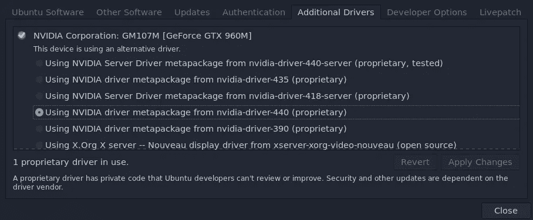
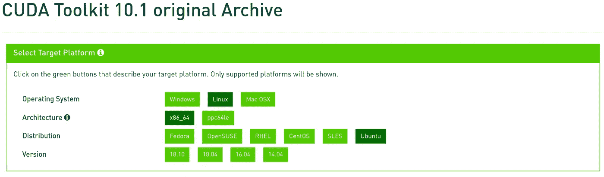

# 在 Ubuntu 20.04 中安装 TensorFlow GPU

> 原文：<https://towardsdatascience.com/installing-tensorflow-gpu-in-ubuntu-20-04-4ee3ca4cb75d?source=collection_archive---------0----------------------->

## 安装 TensorFlow GPU 及其必备包的简短指南

> 同时发布在[https://afagarap . works/2020/07/26/installing-TF-GPU-Ubuntu 2004 . html](https://afagarap.works/2020/07/26/installing-tf-gpu-ubuntu2004.html)

当 Ubuntu 发布长期支持(LTS)版本时，我通常会等待一段时间再升级，主要是因为我在等待 CUDA 和 cuDNN 对新版本的支持。这一次，我只用了三个月就从 Ubuntu 18.04 迁移到了 Ubuntu 20.04——嗯，技术上来说是基于 Ubuntu 的发行版，也就是 [Regolith Linux](https://regolith-linux.org/) 。我这样做的决定只是因为我将我的 SSD 从 120GB 升级到 1TB，所以我也迁移到了一个不同的操作系统——尽管只是一个 [Ubuntu 的衍生物](https://www.omgubuntu.co.uk/2019/06/install-regolith-linux-i3-gaps-ubuntu)。


照片来自 [Pixabay](https://pixabay.com/photos/laptop-computer-business-tech-5421966/) 的 [geordie_strike](https://pixabay.com/users/geordie_strike-17222189/) 。

正如我预料的那样，我花了一段时间来适应我的新系统。幸运的是，我在网上看到了一些有用的答案，现在我在他们的答案上增加了一些解释。所以，这个帖子实际上是基于 [meetnick](https://askubuntu.com/users/263979/meetnick) 和 [singrium](https://askubuntu.com/users/822295/singrium) 在[这个相关问题](https://askubuntu.com/questions/1230645/when-is-cuda-gonna-be-released-for-ubuntu-20-04)中给出的答案。

Ubuntu 20.04 中 TensorFlow GPU 的安装可以总结为以下几点，

*   通过安装`nvidia-cuda-toolkit`来安装 CUDA 10.1。
*   安装与 CUDA 10.1 兼容的 cuDNN 版本。
*   导出 CUDA 环境变量。
*   安装带 GPU 支持的 TensorFlow 2.0。

## 安装 CUDA 10.1

首先，通过转到“附加驱动程序”，确保您使用的是 NVIDIA 专有驱动程序，然后选择合适的驱动程序，即对于 CUDA 10.1，[所需的驱动程序版本是≥ 418.39](https://docs.nvidia.com/cuda/cuda-toolkit-release-notes/index.html) 。我们使用专有版本而不是开源版本[，因为 CUDA 只能使用专有驱动](https://forums.developer.nvidia.com/t/can-cuda-operate-with-open-source-nvidia-driver-or-only-with-nvidia-proprietary-driver/48039/5)。

我们正在安装 CUDA 10.1，因为它是与 TensorFlow GPU 兼容的版本。



图片由作者提供。为 CUDA 10.1 选择合适的专有驱动程序版本，即≥ 418.39。

在撰写本文时，还没有适用于 Ubuntu 20.04 的 CUDA 10.1，但正如 meetnick 在引用的 Ask Ubuntu 帖子中指出的那样，安装`nvidia-cuda-toolkit`也会安装 CUDA 10.1。



图片由作者提供。 [CUDA 工具包存档](https://developer.nvidia.com/cuda-10.1-download-archive-base?target_os=Linux&target_arch=x86_64&target_distro=Ubuntu)。

为了啰嗦起见，Ubuntu 20.04 不要尝试使用 18.10 或 18.04 CUDA 10.1。我是吃了苦头才知道的，哈哈！

所以，你可以在 Ubuntu 20.04 中安装 CUDA 10.1，

```
$ sudo apt install nvidia-cuda-toolkit
```

安装 CUDA 10.1 后，运行`nvcc -V`。然后，您将得到与下面类似的输出，以验证您是否成功安装，

```
nvcc: NVIDIA (R) Cuda compiler driver
Copyright (c) 2005-2019 NVIDIA Corporation
Built on Sun_Jul_28_19:07:16_PDT_2019
Cuda compilation tools, release 10.1, V10.1.243
```

与 Ubuntu 18.04(我来自的地方)不同，CUDA 在 20.04 中安装在不同的路径中，即`/usr/lib/cuda`——你可以通过运行，

```
$ whereis cuda
cuda: /usr/lib/cuda /usr/include/cuda.h
```

在 Ubuntu 18.04 中，你可能知道，CUDA 安装在`/usr/local/cuda`或者`/usr/local/cuda-10.1`中。

## 安装 cuDNN

安装 CUDA 10.1 后，现在可以从这个[链接](https://developer.nvidia.com/rdp/form/cudnn-download-survey)下载安装 cuDNN 7.6.5。然后，选择“下载 cuDNN”，你会被要求登录或创建一个 NVIDIA 帐户。登录并接受 cuDNN 软件许可协议的条款后，您将看到可用 cuDNN 软件的列表。

点击“CUDA 10.1 下载 cud nn v 7 . 6 . 5(2019 . 11 . 5)”，然后选择“cuDNN Library for Linux”下载 cuDNN 7.6.5 for CUDA 10.1。下载 cuDNN 后，通过运行，

```
$ tar -xvzf cudnn-10.1-linux-x64-v7.6.5.32.tgz
```

接下来，将提取的文件复制到 CUDA 安装文件夹中，

```
$ sudo cp cuda/include/cudnn.h /usr/lib/cuda/include/
$ sudo cp cuda/lib64/libcudnn* /usr/lib/cuda/lib64/
```

设置 cuDNN 的文件权限，

```
$ sudo chmod a+r /usr/lib/cuda/include/cudnn.h /usr/lib/cuda/lib64/libcudnn*
```

## 导出 CUDA 环境变量

TensorFlow 需要 CUDA 环境变量来支持 GPU。要设置它们，我们需要通过运行，

```
$ echo 'export LD_LIBRARY_PATH=/usr/lib/cuda/lib64:$LD_LIBRARY_PATH' >> ~/.bashrc
$ echo 'export LD_LIBRARY_PATH=/usr/lib/cuda/include:$LD_LIBRARY_PATH' >> ~/.bashrc
```

通过运行以下命令加载导出的环境变量:

```
$ source ~/.bashrc
```

## 安装 TensorFlow 2.0

安装好必备包后，最后就可以安装 TensorFlow 2.0 了，

```
$ pip install tensorflow==2.2.0
```

默认情况下,`tensorflow`包现在包含了 GPU 支持，而过去我们需要专门安装`tensorflow-gpu`。

通过运行以下命令验证 TensorFlow 可以检测到您的 GPU，

```
>>> import tensorflow as tf
>>> tf.config.list_physical_devices("GPU")
[PhysicalDevice(name='/physical_device:GPU:0', device_type='GPU')]
```

如果事情进展顺利，应该会有类似的输出。

您现在可以享受使用 TensorFlow 进行深度学习项目了！万岁！

如果你正在寻找一个 TensorFlow 项目，也许你会发现我的博客[在 TensorFlow 2.0](/implementing-an-autoencoder-in-tensorflow-2-0-5e86126e9f7) 中实现自动编码器很有趣！

另外，如果你喜欢这篇文章，也许你也会喜欢我的其他博客！

[](https://medium.com/@afagarap/how-can-i-trust-you-fb433a06256c) [## 我怎么能相信你？

### 关于信任分数的直觉和指南

medium.com](https://medium.com/@afagarap/how-can-i-trust-you-fb433a06256c) [](/avoiding-the-vanishing-gradients-problem-96183fd03343) [## 使用梯度噪声添加避免消失梯度问题

### 添加梯度噪声改善了深度神经网络的学习。

towardsdatascience.com](/avoiding-the-vanishing-gradients-problem-96183fd03343) [](https://medium.com/pytorch/implementing-an-autoencoder-in-pytorch-19baa22647d1) [## 在 PyTorch 中实现自动编码器

### 构建用于重建的自动编码器模型

medium.com](https://medium.com/pytorch/implementing-an-autoencoder-in-pytorch-19baa22647d1)