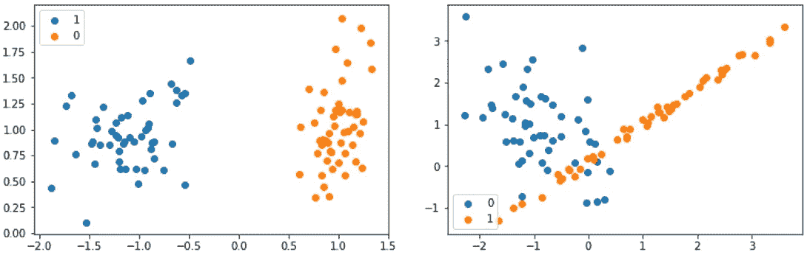
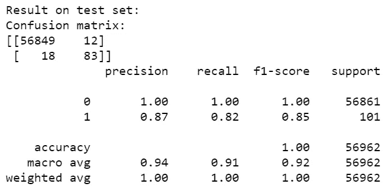
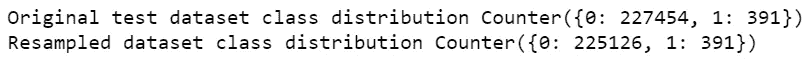
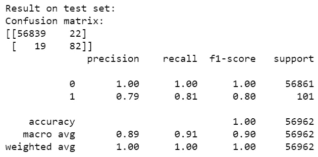

# 实例硬度阈值:一种解决不平衡分类问题的欠采样方法

> 原文：<https://towardsdatascience.com/instance-hardness-threshold-an-undersampling-method-to-tackle-imbalanced-classification-problems-6d80f91f0581?source=collection_archive---------35----------------------->

## 从多数类中移除“困难”样本


卡洛斯·埃斯特韦斯在 [Unsplash](https://unsplash.com?utm_source=medium&utm_medium=referral) 上拍摄的照片|钻石是坚硬的——样品也可能是坚硬的

如果你认真看过[吴恩达在 Coursera](https://www.coursera.org/specializations/deep-learning) 上的深度学习课程，你可能就知道错误分析需要什么了。Andrew 提倡在确定需要改进的地方并相应地修改系统之前，快速构建第一个工作系统。找出分类系统改进领域的一种方法是通过对错误分类样本的研究。对于 Andrew 作为例子使用的猫图像分类器，大型猫的图像可能经常被错误分类。在这方面，大猫样本是*硬的。*

对于机器学习从业者来说，*‘硬’*这个术语太模糊，无法描述单个样本(即实例)。迈克尔·史密斯、托尼·马丁内斯和克里斯托夫·吉罗德·卡里尔肯定也遇到了这个问题，他们写了一篇名为 [*数据复杂性的实例级分析*](https://link.springer.com/article/10.1007/s10994-013-5422-z) *的研究文章。*在这篇文章中，他们基于一组选定的学习算法的分类行为，提出了实例难度的经验定义。

为什么要有一套学习算法？作者解释说，样本的错误分类取决于所使用的学习算法以及样本与其对应样本之间的关系。实例硬度的概念是相对的；将在同一实例上应用一组不同且实用的学习算法的结果聚集在一起具有泛化效果。

# 实例硬度的定义(IH)

史密斯、马丁内兹和吉罗-卡里尔在他们的文章中对 IH 给出了严格的表述。强烈鼓励那些不回避数学符号的人看一看它。

粗略地说，作者事先选择了一组选定的 *n* 学习算法，并在训练集上逐一应用它们。这样， *n* 个量词就产生了。对于单个实例(即样本)，可以使用指示函数和分类器分数来估计分类器 *i* 向其分配正确标签的概率*pi(I 的范围从 1 到 n)* 。取 *n* 个估计量的 *P_i* 的平均值，我们得到了正确分类这种情况的可能性。IH，错误分类实例的可能性，因此将是 1 减去这个平均值。

# 为什么硬实例很难分类

在论文中，作者还继续研究了为什么硬实例很难分类。他们对 19 万个样本的实验结果显示，类别重叠对 IH 的影响最大。

下图举例说明了类别重叠的含义:



左:没有类重叠问题；右图:出现班级重叠(这两张图片是我自己的)

当样本空间中的一个区域包含来自另一个类别的样本时，就会发生类别重叠。重叠样品具有高的实例硬度。**当数据集中同时出现类别不平衡和类别重叠时，分类问题变得更加困难。**

# 一举两得——IHT

实例硬度阈值(IHT)是一种欠采样方法，用于通过移除硬样本来缓解类别不平衡。在此基础上，本文提出了一个非均衡学习图书馆 IHT 的实现方案。**分类概率低的样本将从数据集中删除。**之后，将在欠采样数据的基础上建立模型。

让我们检查一下 *imblearn.under_sampling 的关键参数。InstanceHardnessThreshold:*

*   *估计器*:估计样本 IH 的学习算法。只需要一个估计器，默认算法是随机森林。
*   *sampling_strategy* :用户并没有真正指定实例硬度的阈值。相反，这里的采样策略更注重结果。当提供浮点数时，它将是 IHT 算法输出的少数类样本与多数类样本的比率。如果提供了一个字符串，相应的类将成为欠采样的目标。用户甚至可以输入一个字典来指定每个类输出的样本数。
*   *cv* :评估样品实例硬度时使用的交叉验证折叠数。

# 在现实生活中的一个问题上尝试 IHT:欺诈检测

类似于[我之前关于处理不平衡数据集的文章](https://medium.com/swlh/tree-based-machine-learning-models-for-handling-imbalanced-datasets-26560b5865f6)，我将使用来自 [kaggle](https://www.kaggle.com/mlg-ulb/creditcardfraud) 的信用卡交易数据集来演示使用 IHT 的代码。数据集极度不平衡；在 284，807 笔交易中，只有 492 笔欺诈。80%的事务将从决策树分类器(max_depth=5)中学习，20%的事务将形成测试集。

```
from sklearn.tree import DecisionTreeClassifier
dt = DecisionTreeClassifier(max_depth=5,random_state=42)
dt.fit(X_train, y_train)
```



决策树应用于测试集时的分类结果

接下来，我们使用分类器 *dt* 作为估计器来估计样本的 IH。对于使用 IHT 方法进行欠采样，直到多数类与少数类的比率为 0.0019，并计算该变换前后训练集的形状:

```
from imblearn.under_sampling import InstanceHardnessThreshold
from collections import Counterprint('Original test dataset shape %s' % Counter(y_train))
iht = InstanceHardnessThreshold(estimator=dt, sampling_strategy='majority', random_state=42)
X_train_res, y_train_res = iht.fit_resample(X_train, y_train)
print('Resampled dataset shape %s' % Counter(y_train_res))
```



类别分布

如上面的输出所示，从多数类中移除了 2328 个样本。少数类样本保持不变。

接下来，将 max_depth 为 5 的决策树拟合到重新采样的数据集:

```
dt_new = DecisionTreeClassifier(max_depth=5,random_state=42)
dt_new.fit(X_train_res, y_train_res)
```

分类结果是:



当新的决策树分类器被应用于测试数据集时

新的决策树分类器在分类少数类样本方面具有与旧的相似的能力。然而，更多的正常交易被归类为欺诈，这导致精确度下降。由 IHT 去除的样本可能携带有帮助分类器识别正常交易更好者的信息。

虽然 IHT 对于这个特殊的问题不是很有效，但是希望通过代码片段，那些不熟悉这种欠采样方法的人可以很容易地掌握它。

# 结论

实例硬度阈值(IHT)是一种相当特殊的欠采样方法，其方法是移除与少数类样本空间重叠的多数类样本。这篇文章介绍了 IHT 的基础知识，并展示了如何实现它来解决不平衡的类问题。

谢谢你读了这个故事！

***参考文献***

1.  数据复杂性的实例级分析。*马赫学* **95，**225–256(2014)。[https://doi.org/10.1007/s10994-013-5422-z](https://doi.org/10.1007/s10994-013-5422-z)
2.  不平衡学习库中 InstanceHardnessThreshold 的文档:[https://不平衡学习. readthedocs . io/en/stable/generated/imb learn . under _ sampling。instance hardness threshold . html # r 2 bfe 4 eaac 981-1](https://imbalanced-learn.readthedocs.io/en/stable/generated/imblearn.under_sampling.InstanceHardnessThreshold.html#r2bfe4eaac981-1)