# 实例级识别

> 原文：<https://towardsdatascience.com/instance-level-recognition-6afa229e2151?source=collection_archive---------40----------------------->

## *实例级识别的简介、挑战和最新获奖解决方案。*

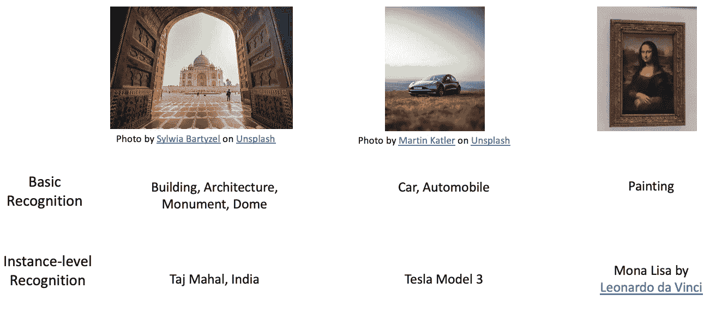

实例级识别，按作者分类的图像

在这篇博客中，我将介绍实例级识别、用例、挑战、当前可用的数据集，以及这些挑战/数据集的最新成果(最近的获奖解决方案)。

# 介绍

**I**instance**L**level**R**ecognition(ILR)，是一个视觉识别任务，用来识别一个对象的特定实例，而不仅仅是对象类。

例如，如上图所示，painting 是一个对象类，达芬奇的“蒙娜丽莎”是该绘画的一个实例。同样，印度的泰姬陵也是物体类建筑的一个实例。

# 用例

*   [地标识别](https://www.kaggle.com/c/landmark-recognition-2020):识别图像中的地标。
*   [地标检索](https://www.kaggle.com/c/landmark-retrieval-2020):从大规模数据库中检索相关地标图像。
*   艺术品识别:识别图像中的艺术品。
*   产品检索:从大规模数据库中检索相关产品图片。

# 挑战

*   **大规模:**识别任务的大多数当前技术水平的结果是在非常有限的类别上测量的，例如 [ImageNet](http://www.image-net.org/) 中的大约 1000 个图像类别， [COCO](https://cocodataset.org/#home) 中的大约 80 个类别。但像地标检索和识别这样的用例有 20 万多个类别，例如在[谷歌地标数据集 V2 (GLDv2)](https://www.kaggle.com/c/landmark-recognition-2020) 中，亚马逊上有 10 万多个产品类别。
*   [**长尾**](https://en.wikipedia.org/wiki/Long_tail) **:** 很少热门的地方有超过 1000+的图片但是很多不太知名的地方在 [**GLDv2**](https://www.kaggle.com/c/landmark-recognition-2020) **中图片少于 5 张。**

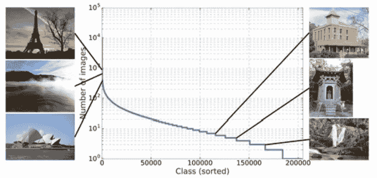

[谷歌地标数据集 v2](https://github.com/cvdfoundation/google-landmark)**【gld v2】**类别分布，图片来自[https://arxiv.org/pdf/2004.01804.pdf](https://arxiv.org/pdf/2004.01804.pdf)

*   **类内可变性:**地标大多分布在广阔的区域内，并且具有非常高的类内可变性，如下图所示。

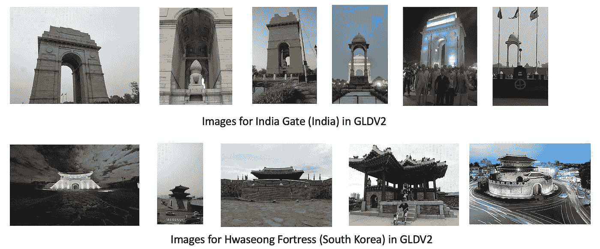

图片来自[谷歌地标数据集 v2](https://github.com/cvdfoundation/google-landmark) **(GLDv2)**

*   **嘈杂的标签:**机器学习模型的成功依赖于高质量的带标签训练数据，因为标签错误的存在会大大降低模型的性能。这些噪声标签如下图所示，不幸的是，噪声标签是大型训练集的一部分，需要额外的学习步骤。

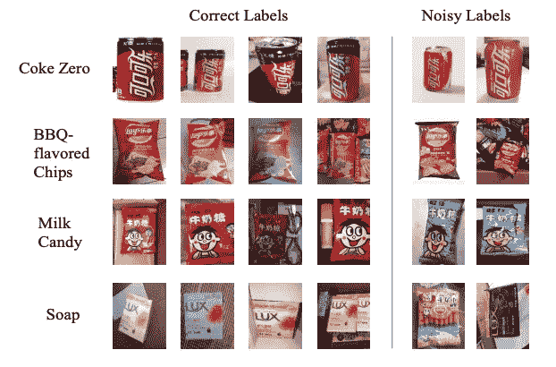

来自 AliProducts 的嘈杂标签。图片来自[https://arxiv.org/pdf/2008.11586.pdf](https://arxiv.org/pdf/2008.11586.pdf)

# 数据集

*   [**谷歌地标数据集 V2 (GLDV2)**](https://arxiv.org/pdf/2004.01804.pdf) **:** 谷歌地标数据集 v2 是人工和自然地标领域大规模、细粒度实例识别和图像检索的新基准。下图显示了地标数据集的所有细节

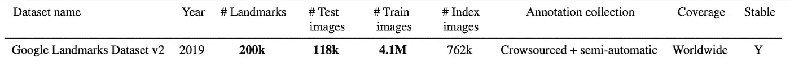

图片来自[https://arxiv.org/pdf/2004.01804.pdf](https://arxiv.org/pdf/2004.01804.pdf)

*   [**CVPR 2020 阿里产品挑战赛**](https://retailvisionworkshop.github.io/recognition_challenge_2020/) **:** 阿里产品挑战赛是一个大规模、嘈杂、细粒度的产品数据集，包含约 50K 个类别，约 3M 张图片。该数据集是作为研究世界领先的电子商务公司遇到的商品图像识别问题的竞赛而提出的。本次比赛是零售视觉研讨会[的一部分，零售视觉 CVPR 2020 研讨会](https://retailvisionworkshop.github.io/)在 [CVPR 2020](http://cvpr2020.thecvf.com/) 举行。

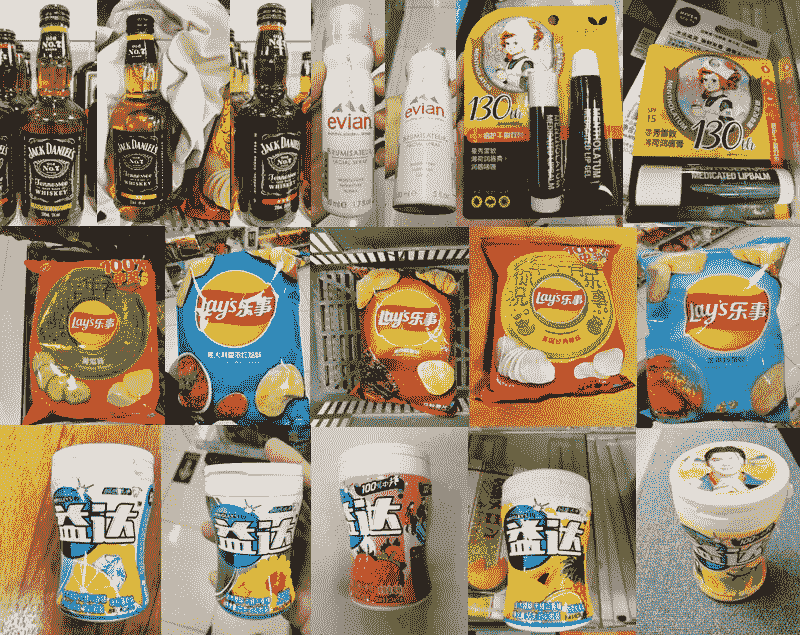

图片来自[https://retail vision workshop . github . io/recognition _ challenge _ 2020/](https://retailvisionworkshop.github.io/recognition_challenge_2020/)

*   [**亚马逊产品挑战赛**](https://drive.google.com/file/d/1SgSbVnvXLHKEhAjdlmQbwMWiC9HLl0DN/view) **:** 亚马逊产品数据集在 [ILR ECCVW 2020](https://ilr-workshop.github.io/ECCVW2020/) workshop 公布，将于 **2021 Q1** 发布。由于产品目录图像是由专业人员拍摄的，而查询图像通常是由手机摄像头拍摄的，并且光照条件差，背景杂乱，因此数据集中的图像存在域不匹配。


图片来自[https://drive . Google . com/file/d/1 sgsvnvxlhkehajdlmlqbwmwic 9 hll 0 dn/view](https://drive.google.com/file/d/1SgSbVnvXLHKEhAjdlmQbwMWiC9HLl0DN/view)

# 结果

下面我将讨论地标识别和产品识别的最新获奖解决方案。

# **谷歌地标识别**

在[地标识别挑战赛](https://www.kaggle.com/c/landmark-recognition-2020/)中，任务是从图像中预测地标标签，自 2018 年起每年都进行。下图显示了本次比赛的[全球平均精度](https://www.kaggle.com/c/landmark-recognition-2020/overview/evaluation)的进度。

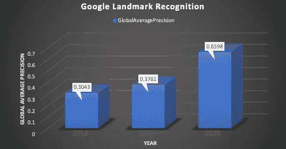

作者图片

## [2020 年解决方案](https://www.kaggle.com/c/landmark-recognition-2020/discussion/187821)

## **建筑**

一个集合了 7 个全局描述符的模型( [SeResNext101](https://openaccess.thecvf.com/content_cvpr_2018/papers/Hu_Squeeze-and-Excitation_Networks_CVPR_2018_paper.pdf) ， [EfficientNet-B3](https://arxiv.org/pdf/1905.11946.pdf) ， [ResNet152](https://arxiv.org/pdf/1512.03385.pdf) ，Res2Net101)。下图显示了 SeResNext101 主干的设置，对于其他主干，我们也遵循类似的架构。每个主干网络使用[广义平均(GeM)池](https://arxiv.org/pdf/1711.02512.pdf)聚合，然后是线性颈(Linear neck)【512， [BatchNorm1D](https://arxiv.org/pdf/1502.03167.pdf) ， [PReLU](https://arxiv.org/pdf/1502.01852v1.pdf) ，最后馈入[弧形边缘头](https://arxiv.org/pdf/1801.07698.pdf)。

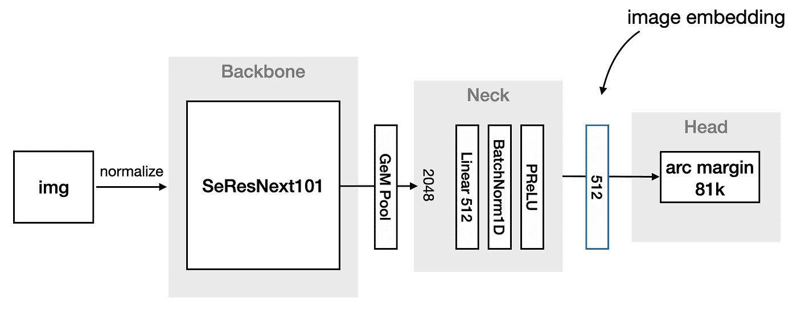

SEResNext101 backbone 的设置，图片来自[https://www . ka ggle . com/c/landmark-recognition-2020/discussion/187821](https://www.kaggle.com/c/landmark-recognition-2020/discussion/187821)

[ResNet 变体](/an-overview-of-resnet-and-its-variants-5281e2f56035) (152 & 101)都依赖于识别跳过一层或多层的快捷连接来解决渐变消失的问题。[SeResNeXt](https://arxiv.org/pdf/1709.01507.pdf)是 ResNeXt 的变种，是一个[初始网](/a-simple-guide-to-the-versions-of-the-inception-network-7fc52b863202)的快捷连接， **Se** 是指 ResNeXt 中增加的[挤压和激励](/squeeze-and-excitation-networks-9ef5e71eacd7)模块。Se 网络通过自适应调整特征图的权重来改善信道相关性。 [EfficientNet](https://ai.googleblog.com/2019/05/efficientnet-improving-accuracy-and.html) 是一种先进的图像分类网络，它依靠自动机器学习来找出最佳的基础网络和高效的复合缩放，以根据可用的计算资源来实现改进的结果。

[颈网络中的广义均值池( **GeM** )](https://arxiv.org/pdf/1711.02512.pdf) 计算张量中每个通道的广义均值。如果 p𝑘 → **∞，GeM** 表现为最大池，p𝑘 → 1，表现为平均池。随着 p𝑘的增加，汇集的特征地图的对比度增加并聚焦于图像的显著特征。

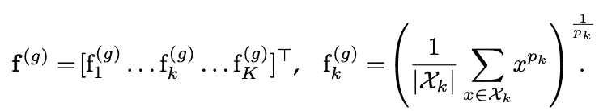

广义平均池方程。图片来自[https://arxiv.org/pdf/1711.02512.pdf](https://arxiv.org/pdf/1711.02512.pdf)

[PReLU](https://arxiv.org/pdf/1502.01852v1.pdf) : PReLU 是 leaky ReLU 的推广，用于解决当数据没有归一化或网络权重没有正确初始化时出现的神经元死亡问题。

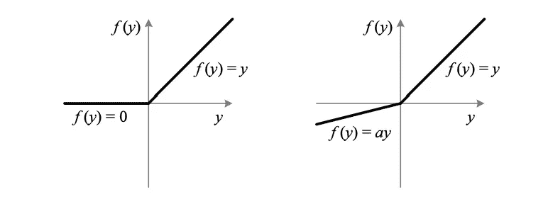

ReLU(左)和 PReLU(右)。对于 PReLU，自适应地学习负部分的系数。图片来自[https://arxiv.org/pdf/1502.01852v1.pdf](https://arxiv.org/pdf/1502.01852v1.pdf)

[Arc margin](https://arxiv.org/pdf/1801.07698.pdf) 对 softmax loss 进行了改进，通过在半径为 s 的超球面上分布学习嵌入，加强了类内变化的相似性和类间的多样性。下面是 MxNet 上 ArcFace loss 的伪代码。

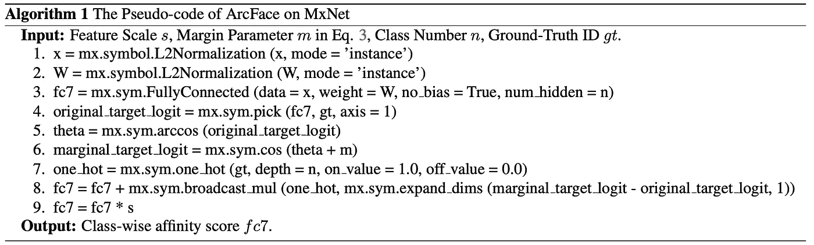

图片来自 https://arxiv.org/pdf/1801.07698.pdf

## 培养

*   使用[相册](https://github.com/albumentations-team/albumentations)在不同的图像比例【448x448，568x568，600x600，512x512】下训练模型。
*   使用[余弦退火调度程序对每个模型进行 10 个时期的训练。](https://arxiv.org/pdf/1704.00109.pdf)
*   2019 年比赛的测试集与标签一起发布，用作验证。

## **重新排名**

作为后处理步骤，进行重新排序以惩罚非界标图像，从而改善[间隙度量](https://www.kaggle.com/c/landmark-recognition-2020/overview/evaluation)。

*   测试:排行榜测试集。
*   训练:确定标签和置信度候选图像。
*   非界标:来自 [GLDv2](https://www.kaggle.com/c/landmark-recognition-2020/data) 测试集的无界标图像。

## 重新排序步骤:

1.  计算测试图像和训练图像之间的余弦相似度 **(A)**
2.  计算训练和非标志图像之间的平均(前 5 或前 10)余弦相似性。 **(B)**
3.  计算 Ai，j — Bj
4.  对同一标签的置信度求和，选取最高的。

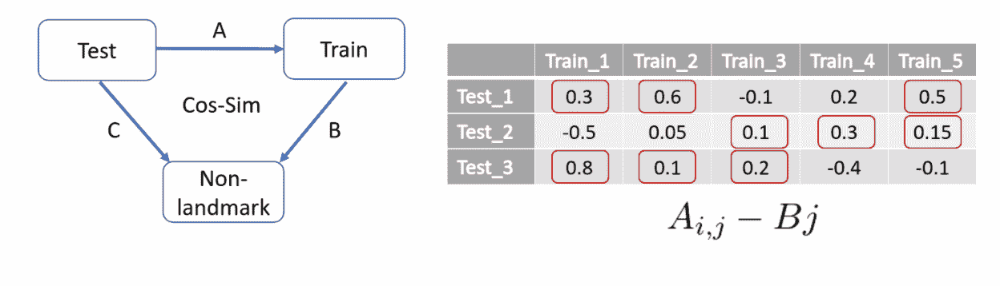

后处理重新排序。图片来自[https://www . ka ggle . com/c/landmark-recognition-2020/discussion/187821](https://www.kaggle.com/c/landmark-recognition-2020/discussion/187821)

上述解决方案最重要的一点是使用 2019 年的竞赛测试集作为推理后处理重新排名的验证，并导致排行榜最高得分 **0.6598** ，比 2019 年的结果好**~ 1.75 倍**。

# **CVPR 2020 阿里产品挑战赛**

## [赢家方案](https://trax-geometry.s3.amazonaws.com/cvpr_challenge/recognition_challenge_technical_reports/1st__Winner+Solution+for+AliProducts+Challenge+Large-scale+Product+Recognition.pdf)

## 体系结构

骨干网( [EfficientNet-B3](https://arxiv.org/pdf/1905.11946.pdf) 、 [EfficientNet-B](https://arxiv.org/pdf/1905.11946.pdf) 4、 [ResNet50](https://arxiv.org/pdf/1512.03385.pdf) 、 [SeResNext50](https://openaccess.thecvf.com/content_cvpr_2018/papers/Hu_Squeeze-and-Excitation_Networks_CVPR_2018_paper.pdf) 、 [SeResNext101](https://openaccess.thecvf.com/content_cvpr_2018/papers/Hu_Squeeze-and-Excitation_Networks_CVPR_2018_paper.pdf) )用[破坏与构造学习(DCL)](https://openaccess.thecvf.com/content_CVPR_2019/papers/Chen_Destruction_and_Construction_Learning_for_Fine-Grained_Image_Recognition_CVPR_2019_paper.pdf) 、[查看对象(LIO)](https://arxiv.org/abs/2003.14142) 方法进行微调。模型平均用于集成所有微调模型，实现 **6.27%** 的前 1 位错误率。

[如下图所示的 DCL](https://openaccess.thecvf.com/content_CVPR_2019/papers/Chen_Destruction_and_Construction_Learning_for_Fine-Grained_Image_Recognition_CVPR_2019_paper.pdf) 通过洗牌局部区域来学习局部区别区域和特征，从而增强细粒度识别。为了防止网络学习有噪声的模式，提出了一个对抗性的对等体来拒绝区域混淆机制(RCM)引起的不相关的模式。更多详情请查看[文件](https://openaccess.thecvf.com/content_CVPR_2019/papers/Chen_Destruction_and_Construction_Learning_for_Fine-Grained_Image_Recognition_CVPR_2019_paper.pdf)。

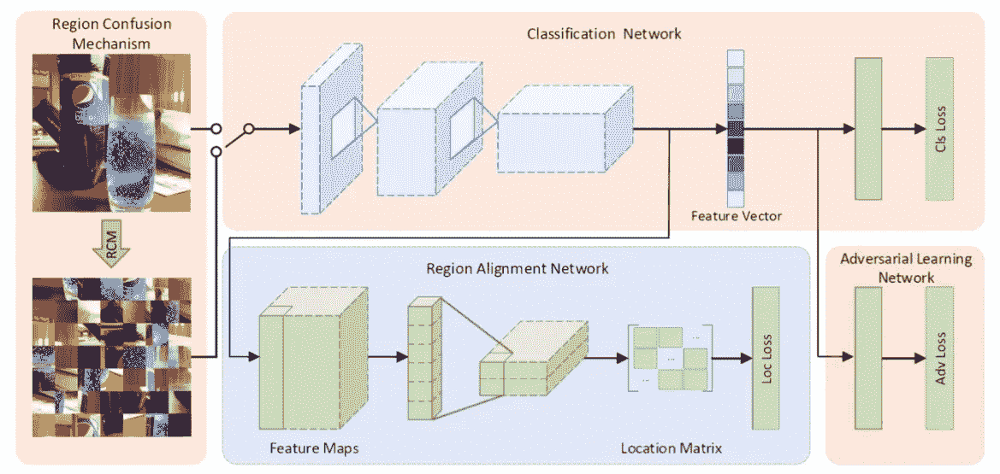

DCL 网络，图片来自[https://trax-geometry . S3 . amazonaws . com/cvpr _ challenge/retail vision _ challenge talk 1 . MP4](https://trax-geometry.s3.amazonaws.com/cvpr_challenge/RetailVision_ChallengeTalk1.mp4)

[LIO](https://arxiv.org/pdf/2003.14142.pdf) 如下图所示，模型结构采用[自监督学习](https://www.fast.ai/2020/01/13/self_supervised/)。对象范围学习帮助主干网络区分前景和背景。使用自我监督的空间上下文学习加强了主干网络的结构信息。更多细节请查看[论文](https://arxiv.org/pdf/2003.14142.pdf)。

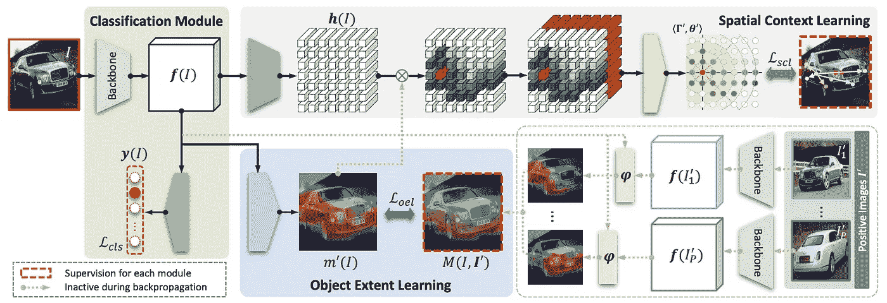

探究对象(LIO)框架。图片来自[https://arxiv.org/pdf/2003.14142.pdf](https://arxiv.org/pdf/2003.14142.pdf)

## 预处理

所有图像的大小都调整为 256x256，然后随机裁剪为 224x224 用于训练，中间裁剪为 224x224 用于测试。使用以下工具扩充训练数据

*   [自动增强](https://github.com/kakaobrain/fast-autoaugment)
*   [断流器](https://github.com/uoguelph-mlrg/Cutout)

**培训**

所有模型都由一个 [SGD 优化器](https://ruder.io/optimizing-gradient-descent/index.html#stochasticgradientdescent)训练，该优化器具有手动学习率衰减功能。

1.  所有经过基本培训的骨干网络都达到了**20–25%**的最高错误率。
2.  所有的主干网络都通过平衡训练进行了微调，实现了**9–12%**的顶级错误率。如果一个类别中的图像数量少于 30，则平衡训练集也包括来自验证的所有图像。
3.  在更高分辨率的图像(448x448)上使用 [DCL](https://openaccess.thecvf.com/content_CVPR_2019/papers/Chen_Destruction_and_Construction_Learning_for_Fine-Grained_Image_Recognition_CVPR_2019_paper.pdf) 进一步微调所有主干，进一步将错误率降低**1–2%**。
4.  如下图所示，使用精度损失对所有网络进行了进一步微调，针对前 1 位错误率进行了优化，将错误率降低了**~ 0.2–0.5%**。

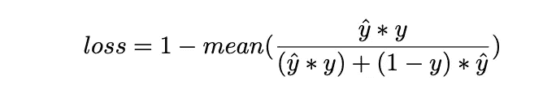

精度损失，图片来自[https://trax-geometry . S3 . Amazon AWS . com/cvpr _ Challenge/recognition _ Challenge _ technical _ reports/1st _ _ Winner+Solution+for+AliProducts+Challenge+大规模+Product+Recognition.pdf](https://trax-geometry.s3.amazonaws.com/cvpr_challenge/recognition_challenge_technical_reports/1st__Winner+Solution+for+AliProducts+Challenge+Large-scale+Product+Recognition.pdf)

```
def **acc_loss**(y_true, y_pred):
    tp = (y_pred, y_true).sum(1)
    fp = ((1-y_true)*y_pred).sum(1)
    acc = tp/(tp+fp)
    return 1 - acc.mean()
```

低于 11 个模型用于计算最终概率

*   平衡微调 resnet50、seresnext50、seresnext101、efficientnet-b3、efficientnet-b4
*   [DCL](https://openaccess.thecvf.com/content_CVPR_2019/papers/Chen_Destruction_and_Construction_Learning_for_Fine-Grained_Image_Recognition_CVPR_2019_paper.pdf) 微调 resnet50，seresnext50
*   精确损耗微调 resnet50、seresnext50、efficientnet-b3
*   [LIO](https://arxiv.org/abs/2003.14142) 微调 resnet50

# **结论**

实例级识别将揭示深度学习技术在电子商务、旅游、媒体和娱乐、农业等领域的语义图像分类/检索的真正潜力。高效的实例级解决方案的一些主要构件是

*   主干网络选择(剩余、挤压和激励、高效网络)
*   数据扩充(缓冲、自动扩充、剪切等)。
*   损失函数(ArcFace，AccuracyLoss)。
*   多尺度处理。
*   微调和后期处理。

感谢您阅读这篇文章，我希望这对您有所帮助。如果你有，请在你最喜欢的社交媒体上分享，这样其他人也可以找到它。此外，如果有不清楚或不正确的地方，请在评论区告诉我。

# 参考

1.  [https://ilr-workshop.github.io/ECCVW2020/](https://ilr-workshop.github.io/ECCVW2020/)
2.  [https://ai . Google blog . com/2020/09/advancing-instance-level-recognition . html](https://ai.googleblog.com/2020/09/advancing-instance-level-recognition.html)
3.  [https://drive . Google . com/file/d/1 F9 vzw 1 gtx aohl _ ApA-qdzkaklab 5 cz 6t/view](https://drive.google.com/file/d/1f9VZW1gtxAohL_ApA-qdZkAklAB5cZ6t/view)
4.  [https://www . ka ggle . com/c/landmark-recognition-2020/discussion/187821](https://www.kaggle.com/c/landmark-recognition-2020/discussion/187821)
5.  [https://trax-geometry . S3 . Amazon AWS . com/cvpr _ Challenge/recognition _ Challenge _ technical _ reports/1st _ _ Winner+Solution+for+AliProducts+Challenge+Large-scale+Product+recognition . pdf](https://trax-geometry.s3.amazonaws.com/cvpr_challenge/recognition_challenge_technical_reports/1st__Winner+Solution+for+AliProducts+Challenge+Large-scale+Product+Recognition.pdf)