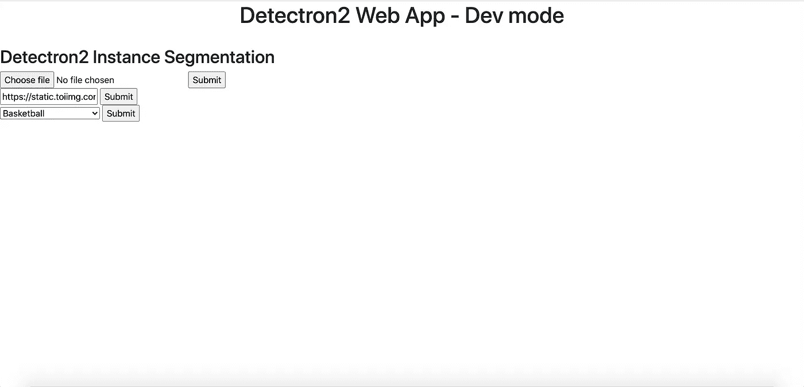
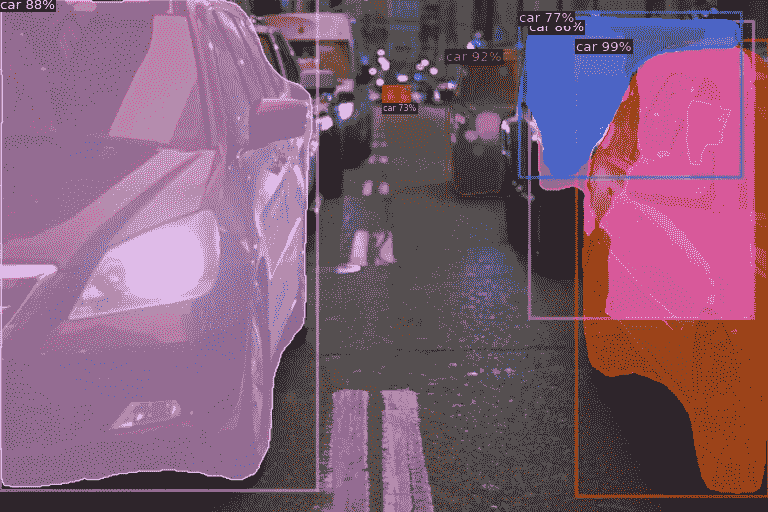

# 实例分段 Web 应用程序

> 原文：<https://towardsdatascience.com/instance-segmentation-web-app-63016b8ed4ae?source=collection_archive---------25----------------------->

## 使用 Docker、Flask 和 Detectron2 构建用于实例分割的 Web 应用程序

[Detectron2](https://github.com/facebookresearch/detectron2) 提供最先进的实例分割模型。训练非常快，而且效果非常好。

模型训练相当简单。那里有很多[教程](https://github.com/facebookresearch/detectron2/blob/master/GETTING_STARTED.md)可以帮你。将模型部署到 web 应用程序是另一回事。当我尝试这样做的时候，我没有在网上找到很多帮助。

因此，在这篇文章中，我们将为 detectron2 的实例分段创建一个 web 应用程序。

# 后端

首先，我们将创建机器学习后端。这将使用基本的[烧瓶](https://flask.palletsprojects.com/en/1.1.x/)。我们将从一些相当标准的[样板代码](https://github.com/realpython/flask-boilerplate/blob/master/app.py)开始

这个应用程序将简单地呈现模板`index.html`。我已经手动指定了端口。

接下来，我们将添加函数来获取图像。我们希望能够上传图像到网站。我们也希望能够提供一个网址和图像将自动下载的网站。我已经创建了如下代码。

这段代码允许我们将图像上传到后端(POST 请求)。或者我们可以提供一个 url 的后端，它会自动下载图像(获取请求)。该代码还将图像转换成一个`jpg`。我无法用探测器 2 对`png`图像进行推断。所以我们必须转换成一个`jpg`。

如果代码因为某种原因不能下载图像，它将返回`failure.html`模板。这基本上只是一个简单的`html`页面，说明在检索图像时出现了错误。

另外，我指定了一个不同的`@app.route`。这需要反映在`index.html`文件中。

# 前端

现在我将创建前端`html`代码。这个接口允许用户上传图片或者指定图片的 url。

没什么大不了的。我们创建一个简单的表单，并告诉它链接到@app.route('/detect') flask 代码。我们还需要指定方法。如果用户上传的是图片，那就是 POST。如果用户给我们一个图片的 url，那就是 GET。

`failure.html`模板甚至更简单。

现在我们可以进入实际的深度学习部分。

在这一部分，我们将得到一个 detectron2 预训练模型来对图像进行推理。然后我们将它链接到我们现有的后端。

这部分稍微复杂一点。我们将创建一个名为`Detector`的新类。因为我们将创建探测器 2 所需的`cfg`。然后，我们将创建另一个函数来对图像进行推理。

我将使用在 [COCO](https://cocodataset.org/) 数据集上训练的 mask rcnn 预训练模型。它将使用一个 [ResNet](/an-overview-of-resnet-and-its-variants-5281e2f56035) + [FPN](/review-fpn-feature-pyramid-network-object-detection-262fc7482610) 主干。据说这款机型获得了[最好的速度/精度权衡](https://github.com/facebookresearch/detectron2/blob/master/MODEL_ZOO.md#common-settings-for-coco-models)。

这段代码基本上完成了我们推理所需的一切。我们只需要指定我们下载的预训练模型的路径。

它从模型动物园中自动获取对应于我们的预训练模型的配置。它还应该从模型动物园获得预训练模型。但是我发现这在 docker 中并不奏效——至少对我来说是这样。

下一步是将这个`Detector`类集成到我们现有的脚本中。

在这段代码中，我添加了我们之前创建的`Detector`类。我还创建了一个名为`run_inference`的函数。这是后端将在图像上运行 detectron2 模型的地方。它将接受一个图像路径，并通过我们之前创建的`Detector`类调用 detectron2 模型。

一旦实例分割完成，`run_inference`函数将返回一个图像。我不得不对`run_inference`函数的结果做一些不寻常的事情来让它工作。`result_img`被粘贴到文件对象中，该文件对象作为 png 返回。不过，可能有更好的方法来做到这一点。

最后一步是为我们的代码创建 docker 容器。然后我们将在本地部署 docker 容器。

谢天谢地，detectron2 已经为我们创建了一个 [dockerfile](https://github.com/facebookresearch/detectron2/blob/master/docker/Dockerfile) 。

我基本上使用了 detectron2 的 [github repo](https://github.com/facebookresearch/detectron2/blob/master/docker/Dockerfile) 中提供的 dockerfile。但是我做了一些改变。

我添加了一个`[requirements.txt](https://github.com/spiyer99/detectron2_web_app/blob/master/requirements.txt)`文件。我在需求文件中做了一个`pip install`。安装了一些我们需要的库。我还修改了命令来启动我们之前创建的`app.py`脚本。这将启动 flask 应用程序并呈现`index.html`模板。

现在我们可以启动 docker 容器了。我们可以通过以下方式实现这一点:

```
docker build . -f Dockerfile -t detectron2 &&\
docker run -d -p 8080:8080 detectron2
```

这将在当前工作目录中构建当前 dockerfile。然后它将在端口 8080 上运行该映像。这是我之前指定的端口。

但问题是，如果你一直运行这些命令，你的电脑上会有太多的 docker 镜像和容器。这会在你的电脑上占据大量的空间。

Jim Hoskins 对此有一个非常优雅的解决方案，我根据自己的目的进行了修改。

我创建了一个不错的 shell 脚本:

*   停止所有容器
*   移除未标记的容器
*   生成新的容器
*   在端口 8080 上运行容器
*   显示容器的尾部日志

这个脚本非常有用。

从终端运行这个脚本。它将构建并运行 detectron2 web 应用程序。网络应用应该会出现在你浏览器的`localhost:8080`上。



作者图片



由[纳比尔·赛义德](https://unsplash.com/@nabeelsyed)在 [Unsplash](https://unsplash.com/photos/Jk3-Uhdwjcs) 上拍摄的源图像

有用！

这方面的代码可以在 [github](https://github.com/spiyer99/detectron2_web_app) 上找到。

*原载于 2020 年 7 月 19 日*[*https://spiyer 99 . github . io*](https://spiyer99.github.io/Detectron2-Web-App/)*。*