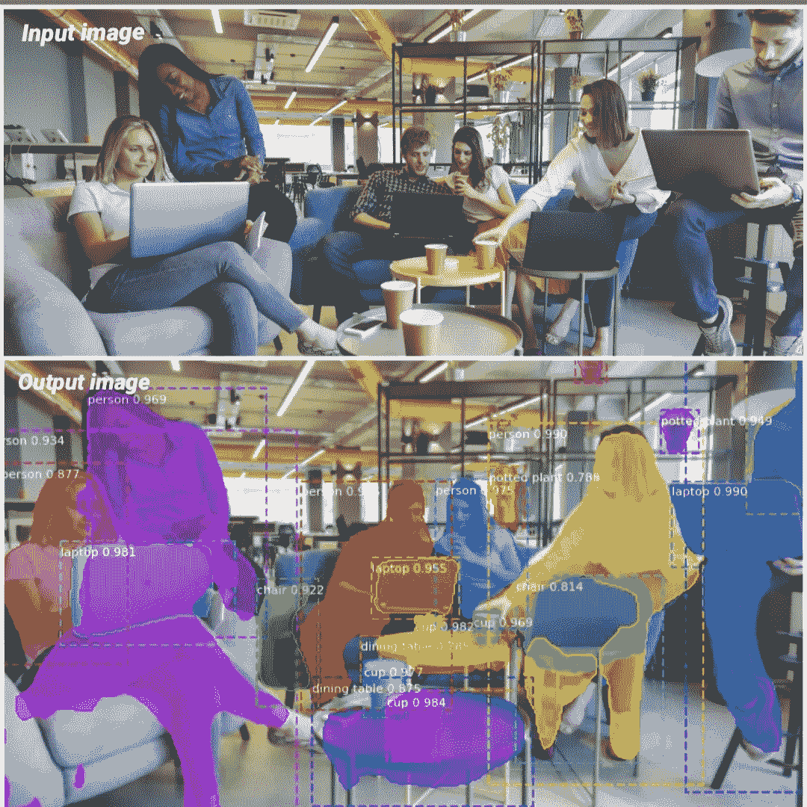
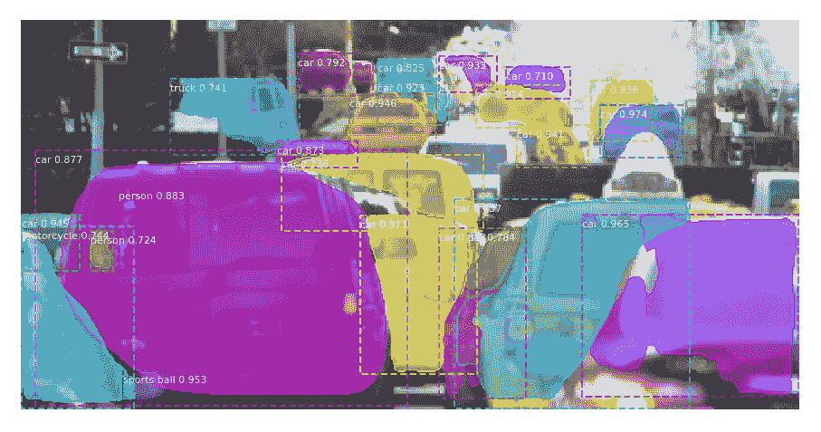
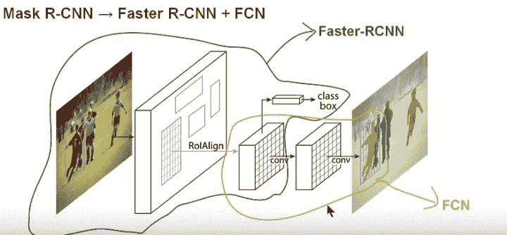
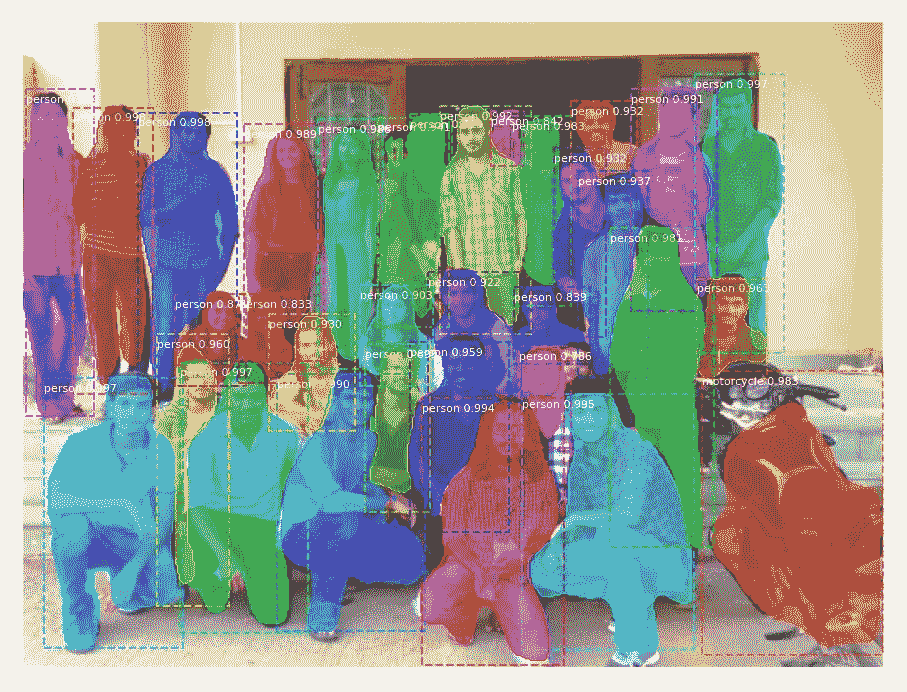
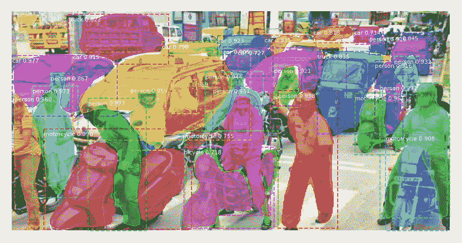

# 基于掩模 R-CNN 的实例分割

> 原文：<https://towardsdatascience.com/instance-segmentation-with-mask-r-cnn-6e5c4132030b?source=collection_archive---------28----------------------->

## 使用在 MS COCO 数据集上训练的 Mask R-CNN 的简要指南



对象检测和实例分割—输入图像源[共享空间](https://sharedspace.work/the-value-of-independent-coworking-spaces/)

诸如 YOLO、R-CNN 的目标检测模型帮助我们画出围绕目标的边界框，并且实例分割为我们提供了图像中每个目标的像素级掩模。一个问题可能会出现，为什么我们需要逐像素定位？

如果我们只是在自动驾驶汽车中使用对象检测，那么有可能多辆汽车的边界框重叠，自动驾驶汽车在这种情况下会变得混乱。实例分割可以避免这个缺陷。损伤检测和医学诊断是我想到的一些其他应用，因为知道损伤的程度或脑瘤的大小可能比仅仅检测存在更重要。



相交边界框和非重叠遮罩

在上面的图像中，我们可以看到汽车的边界框是相交的，而类名为“汽车”的蒙版没有相交/重叠。

因此，我们将介绍如何使用掩模 R-CNN(掩模区域 CNN)进行实例分割，然后使用掩模 R-CNN，我们可以获得图像中每个对象的逐个像素位置和边界框坐标。

**面具 R-CNN**

屏蔽 R-CNN 结合了更快的 R-CNN 和 FCN(全连接网络)以获得除类和盒输出之外的额外屏蔽输出。也就是说，Mask R-CNN 采用相同的两阶段过程，具有相同的第一阶段(即 RPN:区域提议网络)。第二阶段使用 RoIPool 从每个候选框中提取特征，并执行分类和包围盒回归。[阅读本文](https://arxiv.org/abs/1703.06870)以获得关于 R-CNN 面具的更详细的想法



屏蔽 R-CNN 模型— [来源](https://arxiv.org/pdf/1703.06870.pdf)

我使用了基于 FPN 和 matterport 的 ResNet101 构建的 Mask R-CNN 进行实例分割。该模型在 [MS COCO](http://cocodataset.org/#home) 上进行预训练，这是一个具有 80 个对象类的大规模对象检测、分割和字幕数据集。

在浏览代码之前，确保安装所有需要的包并屏蔽 R-CNN。

安装 Keras 和其他依赖项:

```
$ pip install numpy scipy keras h5py tensorflow
$ pip install pillow scikit-image matplotlib imutils
$ pip install "IPython[all]"
```

克隆 GitHub 存储库并安装 Mask R-CNN 的 matterplot 实现

```
$git clone [https://github.com/matterport/Mask_RCNN.git](https://github.com/matterport/Mask_RCNN.git)
$cd Mask_RCNN
$python setup.py install
```

注意:如果您已经安装或使用了 *tensorflow v2.0* ，那么您在执行脚本时可能会遇到一些回溯错误，因为 Mask R-CNN 使用的是 *tensorflow v1.3.0*

为了避免这种情况，您可以降级 tensorflow 版本，或者在安装 Mask R-CNN 之前，通过替换以下函数来编辑文件 Mask_RCNN/rcnn/model.py:

*   `tf.log()`->-`tf.math.log()`
*   `tf.sets.set_intersection()`->-
*   `tf.sparse_tensor_to_dense()`->-`tf.sparse.to_dense()`
*   `tf.to_float()`->-

现在，我们开始执行脚本:

**第一步:导入所需的包**

```
from mrcnn.config import Config
from mrcnn import model as modellib
from mrcnn import visualize
import cv2
import colorsys
import argparse
import imutils
import random
import os
import numpy as np
import matplotlib.pyplot as plt
import tensorflow as tf
```

**第二步:为每个类标签生成随机颜色。**

现在我们创建一个配置，它定义了将在下一步中加载的模型的一些属性。

如果您的 GPU 可以处理变量 IMAGES_PER_GPU，您可以随意增加它的值，否则(在 CPU 的情况下)保持它为 1。

```
class SimpleConfig(Config):
    # give the configuration a recognizable name
    NAME = "coco_inference"
    # set the number of GPUs to use along with the number of images
    # per GPU
    GPU_COUNT = 1
    IMAGES_PER_GPU = 1
    # number of classes on COCO dataset
    NUM_CLASSES = 81
```

**第四步:创建一个配置类对象，加载模型权重。**

您可以从[这里](https://github.com/matterport/Mask_RCNN/releases/tag/v1.0)下载重量。

```
config = SimpleConfig()
config.display()
model = modellib.MaskRCNN(mode="inference", config=config, model_dir=os.getcwd())
model.load_weights("mask_rcnn_coco.h5", by_name=True)
```

**步骤五:对任意图像进行正向传递，得到分割输出。**

在这一步中，我们通过加载的模型传递一个图像，以便获得带有类标签、边界框坐标和遮罩的输出变量。

```
image = cv2.imread("<image_path&name>")
image = cv2.cvtColor(image, cv2.COLOR_BGR2RGB)
image = imutils.resize(image, width=512)
# perform a forward pass of the network to obtain the results
print("[INFO] making predictions with Mask R-CNN...")
result = model.detect([image], verbose=1
```

**步骤六:可视化输出**

```
r1 = result[0]
visualize.display_instances(image, r1['rois'], r1['masks'],   r1['class_ids'], CLASS_NAMES, r1['scores'])
```

样本输出:



在 COCO 上训练的 Mask R-CNN 模型创建了我同学的像素地图。



面具 R-CNN 视角下的印度拥挤街道

总结这篇文章，我会说实例分割是对象检测的一个进一步的步骤，因为它产生了图像的像素掩码。更快的 R-CNN 计算量很大，我们在 Mask R-CNN 的基础上引入了实例分割。因此，掩模 R-CNN 在计算上变得更加昂贵。这使得 Mask R-CNN 很难在 CPU 上实时运行。

**参考文献**

[明凯·何](https://arxiv.org/search/cs?searchtype=author&query=He%2C+K)、[乔治亚·格基奥萨里](https://arxiv.org/search/cs?searchtype=author&query=Gkioxari%2C+G)、[彼得·多尔拉](https://arxiv.org/search/cs?searchtype=author&query=Doll%C3%A1r%2C+P)、[罗斯·吉尔希克](https://arxiv.org/search/cs?searchtype=author&query=Girshick%2C+R)、马斯克 R-CNN、[来源](https://arxiv.org/abs/1703.06870)