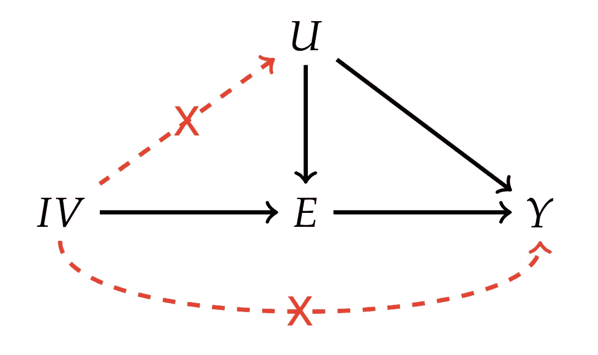
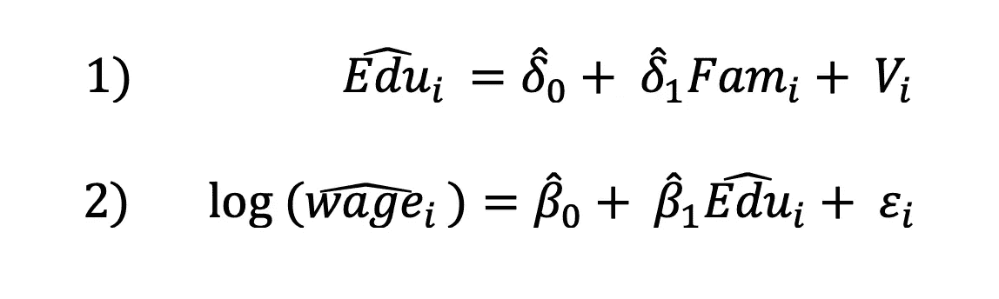

# 工具变量:一个实用的解释

> 原文：<https://towardsdatascience.com/instrumental-variables-a-practical-explanation-1a583408a5b9?source=collection_archive---------8----------------------->

# **简介**

在统计分析中，我们很容易忽略预测变量带来的某些问题。也就是说，我们的自变量通常具有直接影响模型结果有效性的潜在属性。

在回归分析中，我们的任务是估计自变量和因变量之间的因果关系。我们假设这种因果关系在整个实验中是一致的。然而，当我们认为这一假设被违反时，我们将使用工具变量(IV)来正确预测给定自变量的“治疗”效果。因此，工具变量被用来提供真实的效果，而不是有偏见的效果。

在这篇博客中，我将通过一个教育回报的例子来说明为什么 IV 估计为统计框架提供了价值。同样重要的是要注意，使用 IVs 并不总是必需的，但是这个博客将会告诉你什么时候是合适的。

# **为什么使用静脉注射？**

有时在回归分析中，我们会忽略一些与相关自变量有内在联系的因素。回归分析的目的是找出自变量对因变量的因果效应*，其他条件不变*。然而，在现实中，通常情况是，通过增加所述自变量，我们观察到与我们的模型所预测的不同的变化。

约书亚·安格里斯特(Joshua Angrist)在估算基于越南军事参与的工资回报方面的开创性工作显示了一些启发性的结果，即在引擎盖下，像军事参与这样的独立变量是如何不完全提供信息的。安格里斯特发现，虽然许多人是自愿的，但也有许多男性被征召入伍，这对工资回报产生了不同的影响。

因此，安格里斯特将征兵作为一个工具变量，我们期望它与军事参与相关，但与我们的误差项无关，因此与工资无关。通过这种方法，获得了不同的估计数，这些估计数更好地反映了军事参与的真实效果。

# **解读 OLS 系数**

假设我们观察到使用普通最小二乘法(OLS)获得的以下回归:

*y = α + βX +* ε

在模型预测中，如果我们将 *X* 增加一个单位，我们将推断出对 *y* 的以下影响:

δ*y =β×1*

当上述情况不是对 *X* 增加的真实估计时，就需要使用工具变量。本质上，我试图传达一个信息，独立变量可能与误差项*ε相关。*

当 *X* 与误差项相关时 *y* 的变化:

δ*y =β×1+δε*

在无偏 OLS 估计中，解释变量不能与误差项相关。解释变量被说成是与误差项相关的外生*和*，不应该能够解释误差。因此，上述独立变量可能与误差相关的情况违反了 OLS 假设，必须以某种方式加以考虑。以这种方式表现的变量被称为*内生*变量。

***你好工具变量***

# **四假设和方法**

在解释了为什么我们可能想要使用工具变量之后，我们需要一个工具， *Z* ，以满足以下假设:

*   *相关性* : Z 可以预测δX 即 *cov(Z，X) ≠0*
*   *外生性* : Z 与误差项不相关，即 *cov(Z，ε) = 0*

相关性很重要，因为它本质上说明了我们选择的工具与我们选择的自变量相关

*外生性*很重要，因为它表明我们的工具与误差项不相关

换句话说，这些假设意味着仪器必须仅通过 *X* 影响 *y* ，并且它必须对 *X* 有一些影响。

图 1:IV 是如何工作的

# **四申请:返校**

在试图确定学校教育的回报时，我们可能会遇到以下回归:

*log(工资)= α + βEdu + ε*

*   其中 log(工资)是我们试图预测的结果变量
*   α是某个常数
*   *Edu* 是一个自变量，它将受教育年限作为一个连续变量
*   ε是误差

我们可以相信 *Edu* 和我们的误差项有一定的关联。出现此问题可能有几个原因:

*   家庭背景可能会影响受教育年限
*   能力可以用智商来衡量，可能会影响受教育的年限

现在，我们可以用其中的一个来控制我们的自变量。我们必须确保它们满足我们的两个假设:*相关性和外生性*。它必须能够预测 *Edu* ，并且与误差项不相关。

# **下一步:2SLS**

我们使用两阶段最小二乘法来估计一个新的 *Edu* 参数，然后将它代入我们的初始回归线。

图 2:两阶段最小二乘法

首先，我们使用家庭背景的工具变量来计算教育的估计值

第二步是将这一估计值代入我们对工资估计值的初始回归中

# **结果**

现在，我们有希望获得一个关于学校教育对工资影响的无偏估计。如果我们相信我们的预测违反了外生性的性质，那么 IV 估计据说比 OLS 估计更有效

# **结论**

我希望这篇博文已经告诉了你在统计框架中使用工具变量背后的直觉。虽然这是一个相当简单的例子，但通常有机会使用几个工具变量来控制估计量。此外，用户一定会感到厌倦，因为工具变量并不总是能够提高模型的有效性或稳健性。

参考

约书亚·d·安格里斯特，终生收入和越战时期的征兵彩票:来自社会保障行政记录的证据，1990 年 6 月(【https://www.jstor.org/stable/2006669?seq=1】T2)