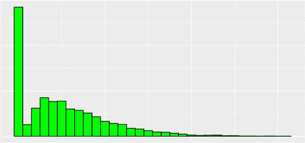
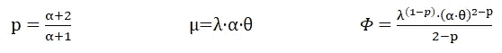
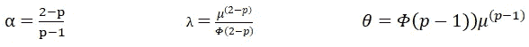
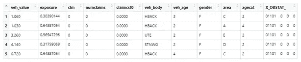
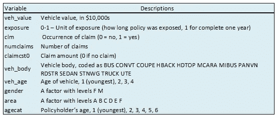
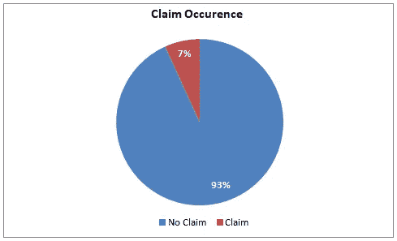
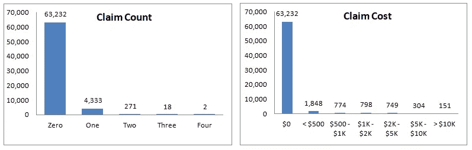
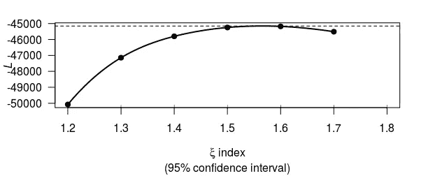
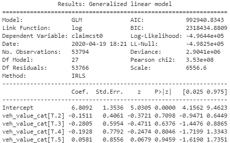

# 保险风险定价——特威迪方法

> 原文：<https://towardsdatascience.com/insurance-risk-pricing-tweedie-approach-1d71207268fc?source=collection_archive---------6----------------------->

## 在 GLMs 和机器学习中使用 Tweedie 模型估计纯保费的说明性指南


# 背景

保险业是一个独特的行业，可能是为数不多的不知道销售产品实际成本的行业之一，他们处理不可预见事件的风险。因此，在过去的几个世纪里，该行业一直依靠数学来理解其客户和前景的风险行为，以估计预期损失成本。当然，方法已经从帕斯卡三角、概率应用、最小偏差程序发展到广义线性模型，以及现在的机器学习。

# 目标

我们已经在之前的文章中详细讨论了[计数](https://medium.com/swlh/modeling-insurance-claim-frequency-a776f3bf41dc)模型(用于索赔频率)和[伽玛](https://medium.com/swlh/modeling-insurance-claim-severity-b449ac426c23)模型(用于索赔严重度)。纯保费，也称为“损失成本”，只是两个模型估计的产品。

> 索赔频率=索赔次数/风险
> 
> 索赔严重程度=索赔成本/索赔次数
> 
> 损失成本=索赔频率 x 索赔严重程度

在当前的文章中，我们将讨论一种非常重要和有趣的分布，称为 Tweedie，这种分布很有趣，因为它通过改变单个参数，提供了从高斯到逆高斯的许多其他分布。

这种分布将有助于我们直接建模纯保费，而不需要两个不同的模型。

# 特威迪分布

Tweedie 分布是指数分散模型的一种特殊情况，通常用作广义线性模型的分布。它可以有一组为零的数据项，这种特殊的属性使它在保险业的索赔建模中非常有用。该模型还可以应用于其他行业的用例，在这些用例中，您会发现零和非负连续数据点的混合。

如果你看到下图中峰值为零的直方图，它可能适合 Tweedie 模型。



## 这一系列分布具有以下特征

> 平均值，E(Y)= 1
> 
> 方差，Var(Y)= ϕ ᵖ

我们用这个表达式“Y ~ Twₚ( ,ϕ”来理解吧，其中 y 表示响应变量，Twₚ( ,ϕ)表示一个 Tweedie 随机变量，具有均值和方差ϕ ᵖ和ϕ>0，p ∈ (-∞，0]∩[1，∞)。

方差函数中的 p 是分布的附加形状参数。

*需要注意的重要一点是，这种分布不是针对 0 到 1 之间的 p 值定义的。*

*   如果 1 < p <2, the distribution are continuous for Y> 0，正质量为 Y=0
*   如果 p > 2，对于 Y > 0，分布是连续的

让我们看看 Tweedie 分布族的一些常用成员及其指数参数(p)、方差函数(V())和离差( *ф* )


指数离差模型

一个分布能够拟合许多其他分布。设置 p = 0 表示正态分布，p = 1 表示泊松分布，p = 2 表示伽马分布，p = 3 表示逆高斯分布。

## 参数从一种形式转换到另一种形式。

我们知道 Tweedie 是一种复合泊松-伽马分布，其中 N ~泊松(λ)为计数，Z ~伽马(α，θ)为连续数，在这种情况下，参数可以很容易地转换为 Tweedie 参数，如下所示:



泊松-伽马到特威迪

*方差也可以平移— Var[Y] = ϕ ᵖ =λ⋅θ ⋅α (α+1)*

类似地，Tweedie 参数也可以转换为泊松和伽马参数，如下所示:



特威迪呼叫波松伽玛

现在，我们对这种有趣的分布及其与近亲如泊松和伽马的关系有了一些了解。

# 接下来，我们将使用一个数据集并检查该分布的适用性。

回想一下我们在以前的文章中使用的保险数据集。我们希望 Tweedie 分布是该数据集的理想候选，让我们研究该数据以证实我们的假设。

这个数据集(dataCar)可以从一个名为“insuranceData”的 R 包中下载。

```
library(insuranceData)
data(dataCar)
```

## 数据集的简要概述

该数据集基于 2004 年或 2005 年购买的一年期车辆保险。共有 67，856 份保单，其中 4，624 份(6.8%的通知索赔)提出了索赔。



数据快照



只有 7%的观察值具有响应变量的正值，其余的值为零。让我们独立地看一下索赔计数和成本的分布。



正如我们在上面看到的

*   损失成本=索赔频率 x 索赔严重程度

让我们用原始变量来重写

*   损失成本=索赔成本/风险

**响应变量** —我们将使用“索赔成本”作为响应变量，将“风险敞口”作为[补偿](/offsetting-the-model-logic-to-implementation-7e333bc25798)，这是一种建议的费率和平均值建模方法。

我们来看看这个变量的分布。


我们可以看到这个数据不能符合正态分布，泊松也可以被丢弃，因为这不是一个计数数据。另一个选择是伽玛，但是这个分布不取零值。因此，最后，我们只剩下特威迪分布，它可能最适合这个数据。

现在，看看独立变量。对于这些变量的详细探索性分析和转换，您可以参考与本文一起分享的源代码。

**独立变量** —我们将使用车身、车龄、驾驶员年龄类别、性别、面积和车辆价值作为预测变量。索赔发生指标和索赔数量不能使用，因为它们与因变量有关，只能在事件发生后才知道。

**衍生变量和转换**——可以对低频率的车身类型进行分组，也为车辆价值创建了一个替代分类变量，可以对其进行显著性测试。

## 为 Tweedie 模型选择最佳“p”

基于这种探索性分析，我们可以确定 Tweedie 分布是拟合模型的理想候选，但我们尚未找到“p”的最佳值，我们知道该值在 1 到 2 之间变化。

方法 1 —手动选择方差幂。

*   通过运行迭代模型来测试 1 到 2 之间的“p”序列。
*   对数似然显示出一个倒“U”形。
*   选择对应于“最大”对数似然值的“p”。
*   使用该“p”值拟合最终模型。

方法 2——使用统计包自动选择方差功率

统计软件包(宏)在各种软件中可用，如 R、SAS、Python 和徽(行业专用软件)，用于计算一系列“p”值的最大似然估计。这些是对方法 1 的一种改进，增加了许多其他特性，如可视化。我们可以看到下面的示例输出，它是使用“Tweedie”包从 R 生成的图形。

```
#Maximum likelihood estimation of the Tweedie index parameter pest_p <-tweedie.profile(claimcst0 ~ veh_value+veh_body+veh_age+ gender+area+agecat,data=training,link.power = 0,do.smooth = TRUE, do.plot = TRUE)#Note
**link.power** - Index of power link function, link.power=0 produces a log-link
**do.smooth** - logical flag. If TRUE (the default), a spline is fitted to the data to smooth the profile likelihood plot. If FALSE, no smoothing is used (and the function is quicker)
**do.plot** - logical flag. If TRUE, a plot of the profile likelihood is produce. If FALSE (the default), no plot is produced
```



该图显示最佳“p”值位于 1.5 和 1.6 之间。我们可以使用建议值来拟合 Tweedie 模型。

*在 Python 中，statsmodels 有一个名为 estimate_tweedie_power 的函数，用于获得一个最优值。*

# 现在，让我们训练模型

我们使用 R 和 Python 来拟合广义线性模型。r 在统计模型方面已经相当成熟，python 也在追赶它的 statsmodels 包。我觉得缺少关于 statsmodels 的适当例子和文档是唯一的缺点。

在机器学习模型中，Tweedie 损失函数可用于许多算法，如 GBM、LightGBM、XGBOOST 等。在这里，我将带您了解 XGBOOST 的实现。

## R 和 Python 中的广义线性模型

R 中的实现

```
library(tweedie)
library(statmod)#Model
tweedie_model <- glm(claimcst0 ~ veh_value+veh_body+veh_age+gender+ area+agecat,data=training, family = tweedie(var.power=1.6, link. power=0),offset=log(exposure))#Note
var.power -index of power variance function, for Tweedie it ranges between 1 to 2, here we are using 1.6.
link.power -index of power link function, link.power=0 produces a log-link
```

Python 中的实现，Statsmodels

```
import pandas as pd
import numpy as np
from patsy import dmatrices
import statsmodels.api as sm# Training and test splitmask = np.random.rand(len(df3)) < 0.8
df_train = df3[mask]
df_test = df3[~mask]
print('Training data set length='+str(len(df_train)))
print('Testing data set length='+str(len(df_test)))# Model expression
expr = """claimcst0 ~ veh_value_cat+veh_age+gender+area+agecat"""# Converting data into dmatrices
y_train, X_train = dmatrices(expr,df_train,return_type='dataframe')
y_test, X_test = dmatrices(expr, df_test, return_type='dataframe')# Training modeltweedie_model = sm.GLM(y_train, X_train,exposure=df_train.exposure, family=sm.families.Tweedie(link=None,var_power= 1.6,eql=True))tweedie_result = tweedie_model.fit()#Note
**link -** The default link for the Tweedie family is the log link. Available links are log and Power
**var_power -** The variance power. The default is 1
**eql -** If True, the Extended Quasi-Likelihood is used, else the likelihood is used (however the latter is not implemented). If eql is True, var_power must be between 1 and 2.
```

GLMs 中的模型验证和拟合优度



抽样输出

我们可以像任何其他回归一样，通过查看结果摘要来分析结果。

*   如果 p 值小于或等于显著性水平，则可以断定该变量是显著的
*   其他指标，如 AIC、偏差和对数似然，对于比较相关模型也很有用。AIC 和偏差越低，模型越好，而似然值越高越好。

## Python 中的实现，XGBOOST

```
import xgboost as xgb
from sklearn.metrics import mean_squared_error
from sklearn.model_selection import train_test_split#Segregating response and predictor variables in different data frameX, y = data.iloc[:,:-1],data.iloc[:,-1]
X_train, X_test, y_train, y_test = train_test_split (X,y,test_size =.2, random_state=123)#Creating DMatrix as required for this algorithmdtrain = xgb.DMatrix(data=X_train.iloc[:,1:28],label=y_train)
dtest = xgb.DMatrix(data=X_test.iloc[:,1:28],label=y_test)#Applying offsetdtrain.set_base_margin(np.log(X_train['exposure']))
dtest.set_base_margin(np.log(X_test['exposure']))#Setting Parametersparams = 
{"objective":"reg:tweedie",'colsample_bytree': 1.0, 'learning_rate': 0.01,'gamma':1.5,'max_depth': 2, 'subsample':0.6, 'reg_alpha': 0,'reg_lambda':1,'min_child_weight':5, 'n_estimators':2000,
'tweedie_variance_power':1.6}xg_reg = xgb.train(params=params, dtrain=dtrain, num_boost_round=1000)#Note
**reg:tweedie** - Tweedie regression with log-link
**tweedie_variance_power -** default=1.5, range: (1,2)
```

XGBOOST 中的模型验证

均方根误差(rmse)、平均绝对误差(mae)和 k 倍交叉验证技术等评估指标是验证和比较模型的一些方法。

```
preds = xg_reg.predict(dtest)
rmse = np.sqrt(mean_squared_error(y_test, preds))
print("RMSE: %f" % (rmse))
```

请随时访问我的要点路径完整的代码。

# 摘要

我们已经讨论了保险行业中最常用的分布之一 Tweedie 分布，以及它与其他指数分布模型(如泊松分布和伽马分布)的关系。我们还学会了估计 Tweedie 方差幂，这是拟合精确模型所需的最重要的参数。

尽管我们在一些流行的开源包中讨论了 Tweedie 实现的例子，但是很少有其他软件有这样的实现，比如 H2O、SAS 和徽。

感谢您的阅读，希望您发现这篇文章内容丰富。如有任何疑问或建议，请随时联系我。

# 参考

[1]Tweedie，M. C. K .，“区分一些重要指数族的指数”，《统计学:应用和新方向》，印度统计金禧国际会议记录，J. K. Ghosh 和 J. Roy(编辑。)，印度统计研究所，1984 年，579–604 页

 [## [2]XGBoost 参数—XGBoost 1 . 1 . 0—快照文档

### max_delta_step [default=0]我们允许每个叶片输出的最大 delta 步长为。如果该值设置为 0，则表示存在…

xgboost.readthedocs.io](https://xgboost.readthedocs.io/en/latest/parameter.html)  [## 3 tweedie . profile

### Tweedie 分布:Tweedie 指数参数(p)的极大似然估计。用法…

www.rdocumentation.org](https://www.rdocumentation.org/packages/tweedie/versions/2.3.2/topics/tweedie.profile)  [## [4]特威迪

### Tweedie 广义线性模型产生一个广义线性模型家庭对象与任何权力方差函数…

www.rdocumentation.org](https://www.rdocumentation.org/packages/statmod/versions/1.4.33/topics/tweedie)  [## [5]简介—统计模型

### statsmodels 是一个 Python 模块，它为许多不同的统计数据的估计提供了类和函数

www.statsmodels.org](https://www.statsmodels.org/stable/index.html)