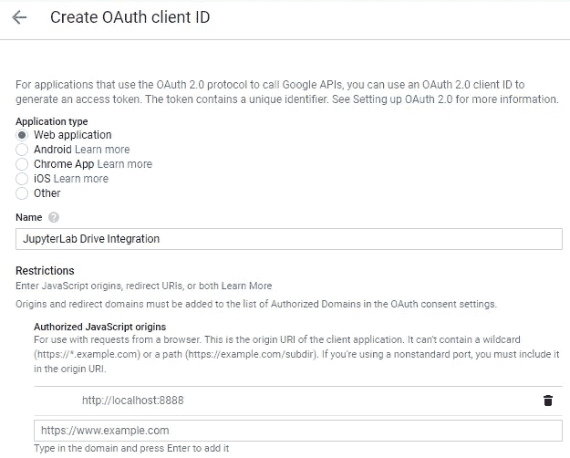

# 将 JupyterLab 与 Google Drive 集成

> 原文：<https://towardsdatascience.com/integrate-jupyterlab-with-google-drive-98d13e340c63?source=collection_archive---------5----------------------->

## 自动将您的笔记本同步到云

我们的工作机器内存有限。不仅如此，它们还可能发生一些事情——磁盘故障或其他灾难性问题，导致无法访问您的数据。

作为一名数据科学家，你的工作、见解和结论至关重要，无论它们是与工作相关，还是只是你一直在兼职做的事情。当然，你可以随身携带一个**闪存盘**，但这也是一个不方便的选择，不用说，闪存盘很容易丢失。

这就是云存储的用武之地。这个想法很简单，把所有对你重要的东西都存储在某个你可以从任何地方访问的“安全”的远程位置。这些文件不会存储在你的电脑上，因此不太可能丢失——前提是你没有忘记密码和电子邮件。

说到云存储选项，有太多可供选择的了——对于普通人来说，有 [Google Drive](https://www.google.com/drive/) 、 [OneDrive](https://onedrive.live.com/about/) 和 [Dropbox](https://www.dropbox.com/) ，如果你想要更安全的东西，还有 [Tresorit](https://www.googleadservices.com/pagead/aclk?sa=L&ai=DChcSEwitgdOc04jnAhXY53cKHflfB90YABAAGgJlZg&ohost=www.google.com&cid=CAESQeD2c5DhbUVK-tOi1k0sp12cr-3K8VT0DEdlzMVBOopZ-c44aAgKj6MQkbtowtpmjJMZCTG21uF0XMz0V3l-pHMJ&sig=AOD64_0oW0RVqfD_lsraWGtarQBGb0x8pQ&q=&ved=2ahUKEwjOm8uc04jnAhXBLVAKHYQcAtYQ0Qx6BAgPEAE&adurl=) 或 [PCloud](https://www.pcloud.com/) 。我不太喜欢这些，主要是因为我想知道我的数据在哪里，而“坐在某个偏远的地方”这个答案并不令人满意。这就是我更喜欢**家庭云**解决方案的原因，比如来自 [WD](https://home.mycloud.com/) 的解决方案。

但是我跑题了。

在结束这篇冗长的介绍性文章之前，我只想说，今天我们将看看如何用 JupyterLab 设置 **Google Drive，这样你就可以一劳永逸地抛弃那个烦人的 flask drive 了。**

我们开始吧。

# 安装延伸部分

第一部分，你已经猜到了，在你的电脑上安装 [Google Drive 扩展](https://github.com/jupyterlab/jupyterlab-google-drive)。我假设您已经运行了 Python 和 JupyterLab。

启动命令提示符或终端，输入以下命令:

`jupyter labextension install @jupyterlab/google-drive`

如果你得到一些错误，确保你已经安装了[节点和](https://nodejs.org/en/)。

大约一分钟后，扩展将被安装，现在您可以启动 JupyterLab 了。侧边栏现在看起来有点不同:

这意味着扩展已经成功安装，可以使用了。嗯，不完全是，但一会儿会更详细。现在，当你打开 Google Drive 时，你只能看到它的标志:

这并不好——因为你没有用你的谷歌账户登录。这个过程可能相当繁琐，但是在下一节中，我会尽量让它变得简单。

# 一点配置

首先，你需要打开[谷歌开发者控制台](https://console.developers.google.com/)，创建一个新的**项目**:

下面是我如何配置我的:

一旦完成，按下**创建**。此外，确保在顶部栏上选择了项目:

现在转到 **OAuth 同意屏幕** —选择**外部**和**创建**。然后给应用命名，滚动到底部，点击**保存**:

现在在**凭证**选项卡下选择**下的 **OAuth 客户端 ID** 创建凭证**:

在下一个屏幕上，在**应用程序类型下选择 **Web 应用程序**，在**授权的 JavaScript 源**下给它一个名称和 URL。默认情况下，URL 应该是 [http://localhost:8888](http://localhost:8888) ，至少我的 JuypterLab 运行在那里。如果您没有进行一些手动配置，情况也是如此:**

现在转到**库**下:

并启用以下 API:

*   Google Drive API
*   谷歌选择器 API
*   谷歌实时应用编程接口

这就是谷歌开发者控制台，现在你可以返回到 JupyterLab。选择**设置** — **高级设置编辑器**:

然后在 Google Drive 下输入分配给您的 **ClientID** :

现在，您将最终看到登录选项:

一旦你这样做了，接受了一切，你就准备好了！

# 让我们测试一下

为了测试一切是否正常，我制作了一个虚拟笔记本，并将其命名为 *TestNotebook* 。几乎立刻就被保存到了谷歌硬盘上:

现在你知道了。你的工作被同步到云端，这使得它的存储更加安全。

整个过程有点乏味，但我希望你已经设法完成了。如有任何问题，请随时联系我。

感谢阅读。

喜欢这篇文章吗？成为 [*中等会员*](https://medium.com/@radecicdario/membership) *继续无限制学习。如果你使用下面的链接，我会收到你的一部分会员费，不需要你额外付费。*

 [## 通过我的推荐链接加入 Medium-Dario rade ci

### 作为一个媒体会员，你的会员费的一部分会给你阅读的作家，你可以完全接触到每一个故事…

medium.com](https://medium.com/@radecicdario/membership)